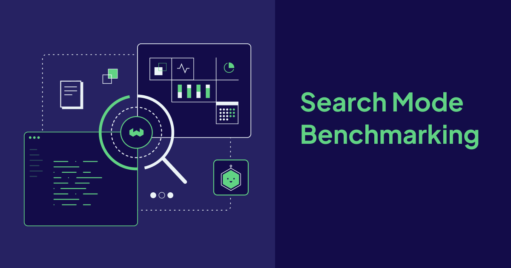
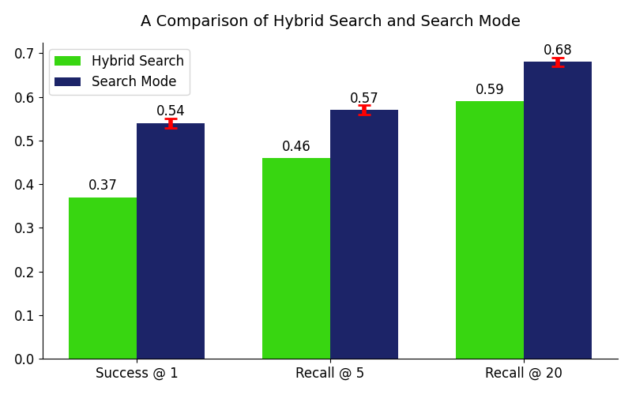
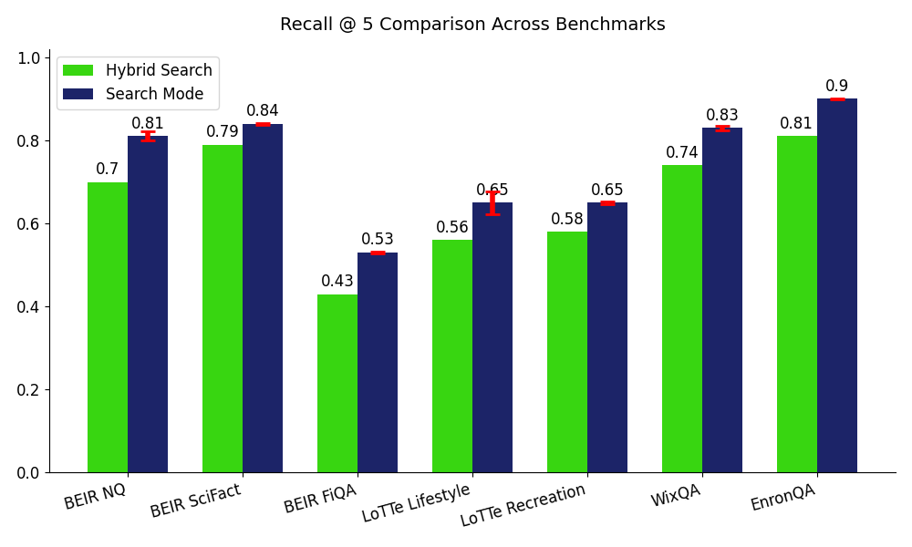
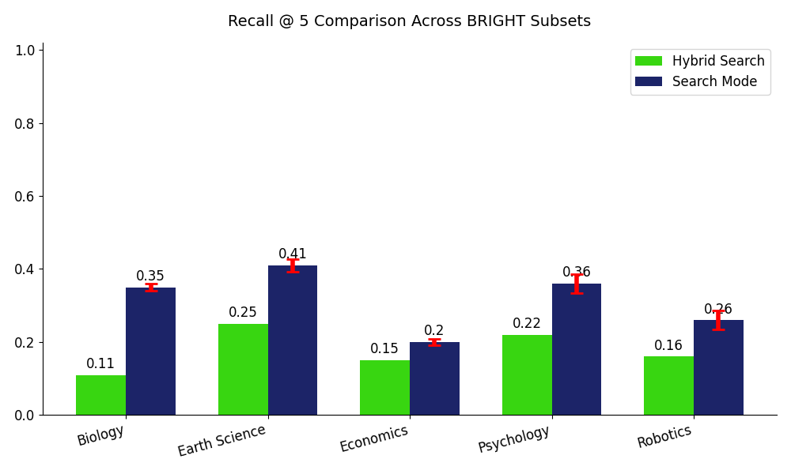
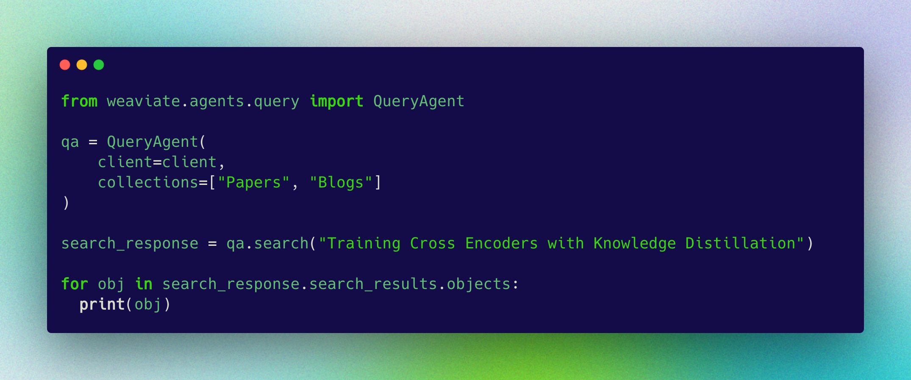

A major highlight of the [GA release of the Query Agent](https://weaviate.io/blog/query-agent-generally-available) is the introduction of **Search Mode**! This feature draws on decades of information retrieval best practices to deliver high quality search results. In this blog post, we compare Search Mode against Hybrid Search across several leading Information Retrieval benchmarks, including BEIR, LoTTe, BRIGHT, EnronQA, and WixQA.

---

## Introduction

Last week, we announced the general availability of Query Agent, bringing a host of new features and improvements to help teams get more from their data. One of the most significant additions is Search Mode—a specialized capability designed for state-of-the-art information retrieval tasks. Search Mode delivers out-of-the-box agentic retrieval, making it easier for developers and data teams to surface relevant information with greater accuracy and less manual effort.
Why did we build Search Mode? With early adopters, we saw a clear need for a retrieval solution that sits between traditional database search and full RAG implementations: one that prioritizes recall, handles complex collection routing, and automatically leverages filters for precision—without the usual overhead. Search Mode is our answer to that gap, and in this post, we’ll dig into how Search Mode fits into real-world workflows, and how it stacks up against hybrid search on industry-standard benchmarks.

## Understanding IR Benchmarks

Search Mode is a Compound Retrieval System built into the Query Agent that is optimized for highly accurate search. To illustrate this, we present a comparison of Search Mode with a standard implementation of Weaviate’s Hybrid Search, combining Vector Search with the Snowflake Arctic 2.0 embeddings and BM25 using Reciprocal Rank Fusion (RRF). We compare these two systems on a curated selection of 12 Information Retrieval (IR) benchmarks from BEIR, LoTTe, and BRIGHT, as well as WixQA and EnronQA. 

BEIR and LoTTe are two of the most popular IR benchmarks. Both focus on capturing diverse domains and information needs, but at different levels of granularity. For example, BEIR includes searching over both scientific papers and Quora question-answer pairs, whereas LoTTe focuses on different topics within StackExchange. BRIGHT is a newly introduced IR benchmark, designed to test reasoning-intensive retrieval. Distinctly from other IR benchmarks, the queries in BRIGHT are longer, with a mean token length of approximately 286. We additionally choose EnronQA and WixQA for their focus on emails and technical documentation, respectively. Throughout our experiments, we use the following metrics:

### Metrics Glossary:
* **Gold Document**: In IR benchmarks, the “gold document” is the labeled relevant document, or documents, for a given query.
* **Success at K**: Measures whether or not the K retrieved documents are gold documents. We typically report Success when setting K = 1 to account for multiple gold documents per query.
* **Recall at K**: Measures how many of the gold documents are in the top k results.
* **nDCG at K**: Short for normalized Discounted Cumulative Gain, nDCG considers not only whether relevant documents are retrieved, but also how they are ordered. Its strength lies in capturing graded relevance rather than binary relevance, and rewarding systems that place the best results higher in the list.

---

For all metrics, higher values indicate better performance. Each metric emphasizes a different aspect of information retrieval, and together they provide a fuller picture.

---

To account for the stochasticity of models used in Search Mode, we run our experiments for 3 trials, finding fairly consistent performance across runs.  The full set of results shown in this blog and the benchmarking code used to produce them can be found on [GitHub](https://github.com/weaviate/query-agent-benchmarking). To begin, the following plot shows the average results comparing Hybrid Search with Search Mode across these seven benchmarks.

In the above plot, each bar reflects the mean across all benchmarks tested, highlighting the consistent gains of Search Mode over Hybrid Search. The most significant gains appear in Success @ 1 (+17%) and Recall @ 5 (+11%), demonstrating Search Mode’s ability to surface the most relevant document first.

Shown above, these plots illustrate the consistent improvement we are seeing with Search Mode compared to Hybrid Search across benchmarks.The minimum improvement found is +5% on BEIR SciFact and BRIGHT Economics, and the largest gain found is +24% on BRIGHT Biology.

## Results by Benchmark

## [BEIR](https://arxiv.org/abs/2104.08663)

Drilling further into the results we found on the particular benchmarks, we begin with one of the most commonly studied benchmarks in information retrieval, BEIR. Published by Thakur et al. in 2021, BEIR was designed to evaluate the out-of-distribution generalization capabilities of retrieval systems. We focused on 3 subsets: Natural Questions (3,452 queries), SciFact (300 queries), and FiQA (648 queries). Natural Questions presents a large-scale retrieval challenge with 2.7 million documents, whereas SciFact and FiQA are smaller scale corpora focused on particular domains such as scientific papers and financial questions, respectively.

### Natural Questions

| Metric       | Hybrid Search | Search Mode       |
|--------------|---------------|-------------------|
| Success @ 1  | 0.43          | 0.52 ± 0.004      |
| Recall @ 5   | 0.70          | 0.81 ± 0.011      |
| Recall @ 20  | 0.87          | 0.91 ± 0.004      |
| nDCG @ 10    | 0.61          | 0.70 ± 0.006      |

### SciFact

| Metric       | Hybrid Search | Search Mode       |
|--------------|---------------|-------------------|
| Success @ 1  | 0.58          | 0.69 ± 0.002      |
| Recall @ 5   | 0.79          | 0.84 ± 0.008      |
| Recall @ 20  | 0.89          | 0.91 ± 0.002      |
| nDCG @ 10    | 0.71          | 0.78 ± 0.003      |

### FiQA

| Metric       | Hybrid Search | Search Mode       |
|--------------|---------------|-------------------|
| Success @ 1  | 0.45          | 0.55 ± 0.001      |
| Recall @ 5   | 0.43          | 0.53 ± 0.002      |
| Recall @ 20  | 0.60          | 0.66 ± 0.012      |
| nDCG @ 10    | 0.45          | 0.54 ± 0.003      |

## [LoTTe](https://arxiv.org/abs/2112.01488)

The next benchmark we tested with is LoTTe, short for, Long-Tailed Topic-stratified Evaluation. Similarly to BEIR, LoTTe was developed to test how well search systems can generalize to particular domains. LoTTe interestingly uses natural search queries from Google, via GooAQ) mapped to StackExchange answers. Each benchmark in LoTTe contains two query sets, “search” and “forum”: "search" queries are derived from Google autocomplete, and "forum" queries are derived from StackExchange post titles. There are 2002 and 661 “forum” and “search” queries in LoTTe Lifestyle, respectively. There are 2002 and 924 “forum” and “search” queries in LoTTe Recreation, respectively.

### Lifestyle

| Metric       | Hybrid Search (Forum) | Search Mode (Forum)   | Hybrid Search (Search) | Search Mode (Search)   |
|--------------|------------------------|-----------------------|-------------------------|------------------------|
| Success @ 1  | 0.65                   | 0.80 ± 0.003          | 0.63                    | 0.73 ± 0.006           |
| Recall @ 5   | 0.47                   | 0.58 ± 0.058          | 0.64                    | 0.71 ± 0.003           |
| Recall @ 20  | 0.68                   | 0.74 ± 0.004          | 0.80                    | 0.83 ± 0.002           |
| Success @ 5  | 0.86                   | 0.91 ± 0.005          | 0.89                    | 0.93 ± 0.002           |

### Recreation

| Metric       | Hybrid Search (Forum) | Search Mode (Forum)   | Hybrid Search (Search) | Search Mode (Search)   |
|--------------|------------------------|-----------------------|-------------------------|------------------------|
| Success @ 1  | 0.56                   | 0.72 ± 0.006          | 0.56                    | 0.66 ± 0.006           |
| Recall @ 5   | 0.50                   | 0.59 ± 0.001          | 0.65                    | 0.71 ± 0.006           |
| Recall @ 20  | 0.67                   | 0.72 ± 0.003          | 0.80                    | 0.80 ± 0.002           |
| Success @ 5  | 0.80                   | 0.86 ± 0.006          | 0.83                    | 0.83 ± 0.006           |

The original paper introducing the LoTTe benchmark finds the highest Succes @ 5 scores using ColBERTv2 with 0.85 and 0.77 on the Lifestyle search and forum test sets, respectively, as well as 0.72 and 0.77 on the Recreation search and forum test sets, respectively. Unlike Recall @ 5, Success @ 5 measures if at least 1 of the relevant documents were returned in the top 5 results, rather than all of them. Search Mode outperforms these results by absolute gains of +0.09,  +0.17, +0.13, and +0.09.

## [BRIGHT](https://arxiv.org/abs/2407.12883)

The next benchmark we include is BRIGHT, introduced by Su et al. as a testbed for level 3 retrieval. While level 1 is keyword search and level 2 is semantic search, level 3 represents the frontier: reasoning-intensive retrieval. Unlike the other benchmarks we included, BRIGHT’s queries are long and descriptive. Sampled from user posts on StackExchange, each query is paired with gold documents sourced from external web pages cited in accepted or highly upvoted answers. There are 103, 116, 103, 101, and 101 queries in the respective Biology, Earth Science, Economics, Psychology, and Robotics subsets we test with. They further contain average query lengths of 115, 109, 182, 150, and 819 tokens, respectively. These query lengths highlight how BRIGHT forces retrieval systems to go beyond surface matching and utilize complex reasoning to find relevant search results.

### Biology

| Metric       | Hybrid Search | Search Mode       |
|--------------|---------------|-------------------|
| Success @ 1  | 0.13          | 0.44 ± 0.022      |
| Recall @ 5   | 0.11          | 0.35 ± 0.009      |
| Recall @ 20  | 0.21          | 0.51 ± 0.019      |
| nDCG @ 10    | 0.13          | 0.40 ± 0.011      |

### Earth Science

| Metric       | Hybrid Search | Search Mode       |
|--------------|---------------|-------------------|
| Success @ 1  | 0.24          | 0.54 ± 0.024      |
| Recall @ 5   | 0.25          | 0.41 ± 0.018      |
| Recall @ 20  | 0.35          | 0.53 ± 0.021      |
| nDCG @ 10    | 0.26          | 0.44 ± 0.020      |

### Economics

| Metric       | Hybrid Search | Search Mode       |
|--------------|---------------|-------------------|
| Success @ 1  | 0.12          | 0.22 ± 0.029      |
| Recall @ 5   | 0.15          | 0.20 ± 0.008      |
| Recall @ 20  | 0.25          | 0.30 ± 0.013      |
| nDCG @ 10    | 0.17          | 0.25 ± 0.010      |

### Psychology

| Metric       | Hybrid Search | Search Mode       |
|--------------|---------------|-------------------|
| Success @ 1  | 0.16          | 0.39 ± 0.011      |
| Recall @ 5   | 0.22          | 0.36 ± 0.025      |
| Recall @ 20  | 0.33          | 0.50 ± 0.026      |
| nDCG @ 10    | 0.22          | 0.40 ± 0.006      |

### Robotics

| Metric       | Hybrid Search | Search Mode       |
|--------------|---------------|-------------------|
| Success @ 1  | 0.17          | 0.26 ± 0.015      |
| Recall @ 5   | 0.16          | 0.26 ± 0.026      |
| Recall @ 20  | 0.28          | 0.39 ± 0.004      |
| nDCG @ 10    | 0.19          | 0.27 ± 0.017      |

The original paper introducing BRIGHT presents the results of several different dense embedding models, categorized by open-source models less than 1B parameters, open-source models greater than 1B parameters, and proprietary models, as well as BM25. The highest performing methods across the Biology, Earth Science, Economics, Psychology, and Robotics achieve nDCG @ 10 scores of 30.6, 36.4, 22.4, 27.8, and 18.2. Search Mode outperforms these methods by absolute gains of 13.4, 9.6, 2.6, 12.2, and 8.8.

## [EnronQA](https://arxiv.org/abs/2505.00263)

The next benchmark we experiment with is EnronQA. EnronQA uniquely addresses the challenge of retrieval over private corpora – 103,638 emails across 150 distinct user inboxes from the Enron corpus. We run our tests with a sample of 500 queries from the largest user inbox, dasovich-j. EnronQA uses synthetic queries derived from these emails. This is an interesting emerging technique for benchmarking information retrieval without having to manually annotate queries and their gold documents. For those interested, we have a recipe [here](https://github.com/weaviate/recipes/blob/main/weaviate-services/agents/transformation-agent-retrieval-benchmark.ipynb) showing how you can achieve this with the Weaviate Transformation Agent.

| Metric       | Hybrid Search | Search Mode       |
|--------------|---------------|-------------------|
| Success @ 1  | 0.56          | 0.74 ± 0.005      |
| Recall @ 5   | 0.81          | 0.90 ± 0.001      |
| Recall @ 20  | 0.92          | 0.94 ± 0.002      |

## [WixQA](https://arxiv.org/abs/2505.08643)

The last benchmark we experiment with is WixQA. Wix.com is a website building and hosting platform serving millions of users who encounter technical challenges ranging from domain configuration, payment processing, or design customization, to give a few examples. We use the Expert Written queries, containing 200 customer queries submitted through Wix support channels. Each of these questions are paired with comprehensive answers and gold documents manually authored by Wix support specialists.

| Metric       | Hybrid Search | Search Mode       |
|--------------|---------------|-------------------|
| Success @ 1  | 0.42          | 0.66 ± 0.010      |
| Recall @ 5   | 0.74          | 0.83 ± 0.006      |
| Recall @ 20  | 0.90          | 0.93 ± 0.008      |

## Conclusion

Our benchmarks show that Search Mode significantly improves search accuracy by applying best-practice IR techniques such as query expansion, query decomposition, schema introspection, and reranking. These additional model inferences trade off some latency for higher quality. If your use case requires highly accurate search results, you should check out Search Mode! If you are latency-sensitive, Weaviate’s Hybrid Search may be a better fit.

To learn more about how we ran these experiments, visit our [benchmarking repo](https://github.com/weaviate/query-agent-benchmarking). It includes scripts to load the benchmarks into Weaviate, and uses the async Query Agent client for fast evaluation. Contributions are welcome - feel free to open a PR with new benchmarks or improvements! Thank you for reading!

import WhatsNext from '/_includes/what-next.mdx'

<WhatsNext />