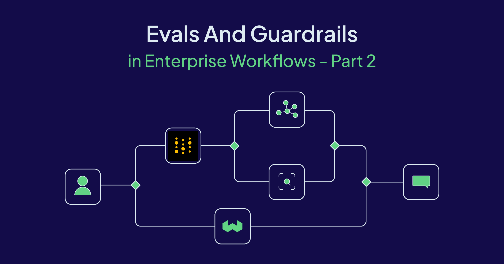
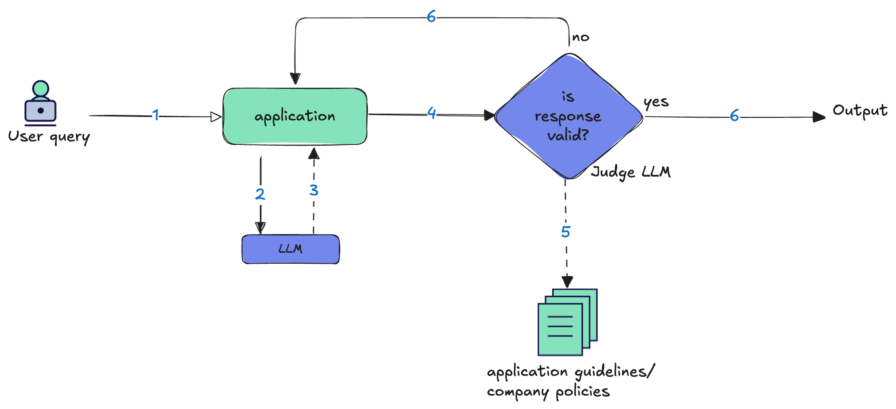
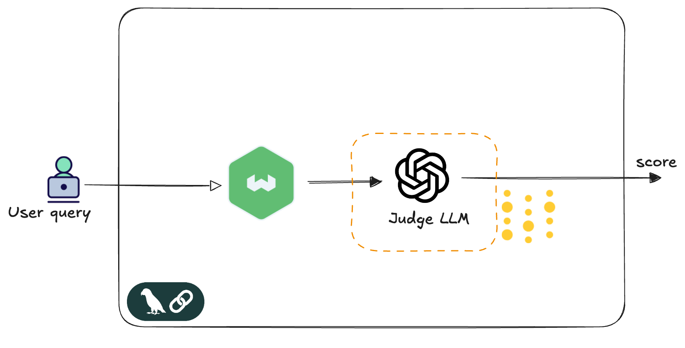

In Part 1, we drew the blueprint, establishing why evals and guardrails are essential for enterprise AI. We looked at how 
enterprises that do not adapt to AI and use them in their workflows would lose out. We discussed concrete examples like trading, 
logistics, and fraud detection to show how AI agents can be implemented. Then we examined how to make these AI flows safe by 
incorporating guardrails (pre- and post-model), evals, and traces. We mapped out the risks of unpredictable behavior and the 
necessity of trust. Now, we move from theory to implementation. This post is for the builders. 

Guardrails are the real-time gatekeepers; they block, redact, and constrain inputs and outputs to prevent harm. Evals are the scorecard; they don't block a bad response, but provide the essential logging and performance data to understand system behavior, detect drift, and refine the guardrails. It's crucial to distinguish their roles in order to create a robust system. Guardrails are enforcement — pre model input filters and post model output constraints. Evals are measurement —s tructured scoring, assertions, and traces that tell us how the system behaves under real workloads. Evals don’t stop bad outputs; they make failures visible and comparable, so we can tighten policies with evidence instead of guesswork.

The most effective enterprise AI systems combine both capabilities to continuously improve their real-time 
protection mechanisms. Evaluation signals can feed into company policies/guidelines that applications can use to redact, block or escalate to a human. This is where architectural patterns become essential. They transform static rules into adaptive systems that learn from their mistakes and evolve with changing requirements. In this post, we shall explore the LLM-as-Judge pattern, powerful design for automated, real-time quality assessment. 

## LLM-as-Judge: The Quality Controller

LLM-as-Judge is the most versatile evaluation pattern, enabling real-time quality assessment and outcome correction. A separate model scores each model output against explicit criteria—for example, application guideline, company policies and regulations compliancy. The LLM judge can detect and trigger corrective actions and can hence, act as both an eval system and a dynamic guardrail.


[](./img/judge-2.png)

Let's circle back to those enterprise scenarios I covered in Part 1 — trading apps that evaluate multiple signals and make buy-sell decisions, supply chain logistics routing shipments, fraud detection flagging suspicious transactions. In each case, LLM-as-Judge can serve as the quality controller: Does this trading recommendation align with our risk parameters? Is this route optimization realistic given current traffic conditions? Does this fraud alert make sense based on the user's transaction pattern? The LLM judge doesn't replace domain-specific validation, but it adds a layer of reasoning that catches edge cases rule-based systems might miss. You're not replacing your existing validation—your risk models, route optimizers, and fraud rules still do the heavy lifting. But the judge adds a sanity check that thinks more like a human: "Is this trading order right, given the current volatility" or "This route looks fine on paper, but does it make sense with today's weather?"

The LLM judge's evaluation criteria are entirely defined by what you encode in the prompt context. You can define what "good" looks like based on your business rules, brand guidelines, or customer experience standards. For trading systems, you might focus on risk parameters and market volatility thresholds. For fraud detection, transaction pattern analysis against known signatures. You can shape its evaluation logic through examples, scoring rubrics, and domain-specific guidelines.

Let's now move to an actual implementation with code examples for LLM-as-Judge. I'll walk through a retail search application where customers query for clothing using natural language—"something nice for a summer wedding guest" or "professional blazer for meetings." Weaviate handles the vector search, retrieving semantically similar products from the catalog. The LLM judge evaluates whether these search results align with the customer's intent and requirements.

```
┌─────────────────┐    ┌─────────────────┐    ┌─────────────────┐    ┌─────────────────┐
│   User query    │ →  │    Weaviate     │ →  │   Judge LLM     │ →  │ score, reason   │
│ "summer wedding │    │ vector search   │    │   evaluates     │    │  pass │ fail    |
│     guest"      │    │                 │    │   relevance     │    │                 │
└─────────────────┘    └─────────────────┘    └─────────────────┘    └─────────────────┘
```
For this implementation, I use LangChain as the orchestration framework and Weights & Biases for evaluation tracking and observability. LangChain provides the composable chains that wire together the prompt template, judge model, and output parsing into a clean, testable pipeline. W&B captures evaluation metrics over time and provides execution traces for comprehensive system monitoring. This combination gives me both the architectural flexibility to iterate on evaluation logic and the operational visibility to monitor judge performance in production. 

[](./img/scoring2.png)


<!-- The evaluation flow: `User query → Weaviate vector search → Retrieved products → Judge prompt (query + products) → Judge LLM → Structured judgment (score, reason, passed)` -->


---

### Prerequisites 

Install the required libraries for LangChain, Weaviate, Weights & Biases, and OpenAI. Set up your environment variables for API keys and endpoints. You will need api keys for W&B, Weaviate and for the model you choose for your LLM judge. Create a collection in Weaviate and initiate the weaviate client. For instructions, refer to ___

<!-- ```bash
npm install @langchain/weaviate @langchain/core weaviate-client weave @langchain/openai 
```

### Environment Variables

Set up your environment variables for API keys and endpoints. You will need api keys for W&B, Weaviate and for the model you choose for your LLM judge

```bash
export OPENAI_API_KEY=your_openai_api_key
export WEAVIATE_URL=your_weaviate_cluster_url
export WEAVIATE_API_KEY=your_weaviate_api_key
export WANDB_API_KEY=your_wandb_api_key
``` -->

### Weights & Biases 
Weave within Weights & Biases (W&B) provides automatic experiment tracking and function tracing. The initialization creates a project namespace where all evaluation runs, model calls, and performance metrics are logged. This enables reproducible experiments visible on a dashboard and comprehensive observability across your evaluation iterations.
```typescript
weave.init('Retail-Search-Evaluation');
```

### Build the LLM Judge Chain

We create a reusable evaluation pipeline that takes a prompt and a model(judge) and parses the model output. 

The Judge flow: `Prompt → LLM → String Parser → JSON Validator`

```typescript
const buildJudgeChain = (promptTemplate: ChatPromptTemplate, modelName: string) => {
  const llm = new ChatOpenAI({ model: modelName, temperature: 0 });
  return promptTemplate.pipe(llm).pipe(new StringOutputParser()).pipe(parseJudgment);
};
```
In our example, we have instructed the judge LLM to provide a very simple score and the reason for scoring it that way.  
```typescript
const parseJudgment = (text: string) => {
    const parsed = JSON.parse(text);
    return {
        score: Math.max(1, Math.min(5, parsed.score || 1)),
        reason: parsed.reason || "No reason provided",
    };
};
```

### Set Up the Scoring Function

Define a simple scoring function that extracts the score and pass/fail status from the judge LLM 's output, which contains judgement results and scoring. This function is used to aggregate and report evaluation results. It keeps the scoring logic separate from model execution, enabling easy A/B testing of different evaluation criteria. `weave.op` wrapper enables automatic logging, tracing, and performance monitoring

```typescript
const simpleScorer = weave.op(
  ({ modelOutput }) => 
    ({ 
        score: modelOutput.score, 
        passed: modelOutput.passed 
    }),
  { name: 'simpleScore' }
);
```

### Define the Evaluation Model

Create an evaluation model that, for each dataset row, performs a vector search, invokes the judge chain, and returns a structured evaluation result. This encapsulates the full evaluation workflow:

```typescript
const evaluationModel = weave.op(
    async ({ datasetRow }) => {
        const question = datasetRow.question;
        const retrievedDocs = await vectorStore.hybridSearch(question, {limit: 1});
        
        const judgment = await judgeChain.invoke({
            question,
            answer: retrievedDocs.map(doc => doc.pageContent).join('\n')
        });

        return {
            question,
            retrievedText: retrievedDocs.map(doc => doc.pageContent).join('\n'),
            retrievedCount: retrievedDocs.length,
            score: judgment.score,
            reason: judgment.reason,
            passed: judgment.score >= passThreshold
        };
    }, 
    { name: 'LLM-as-Judge' });
```

### Define the LLM Judge Prompt

Craft a detailed prompt that instructs the LLM how to evaluate search results for relevance, including a scoring rubric and examples. This ensures the LLM's judgments are consistent and aligned with your business criteria. 
In this example, we emphasize the retail search relevance and the intent of search over exact keyword matching. We also provide scoring examples of related items to guide the llm judge. For much more targeted use cases, the evaluation prompt should incorporate domain knowledge directly into the evaluation criteria provided in the judge prompt 

```typescript
const LLM_AS_JUDGE_PROMPT = ChatPromptTemplate.fromMessages([
  ["system", `You are evaluating a retail product search system. Customers search for clothing items using natural language, and you need to determine if the retrieved products are relevant to their search intent.

IMPORTANT: Focus on search relevance, not perfect matches. A customer searching for "dress for party" should find cocktail dresses, evening dresses, etc. Consider synonyms, related items, and search intent.

Scoring Scale (1-5):
- 5: Excellent - The retrieved product perfectly matches or highly relates to the customer's search intent.
- 4: Good - The retrieved product is relevant with minor differences (e.g., slightly different style/color than ideal).
- 3: Fair - The retrieved product is somewhat relevant but may not fully meet the search intent.
- 2: Poor - The retrieved product has minimal relevance to the search query.
- 1: Unacceptable - The retrieved product is completely irrelevant to the customer's search.

Examples:
- Search: "black dress for evening" → Retrieved: "Elegant Black Cocktail Dress" → Score: 5 (Perfect match)
- Search: "warm sweater" → Retrieved: "Cozy Winter Wool Sweater" → Score: 5 (Excellent relevance)
- Search: "business attire" → Retrieved: "Professional Business Blazer" → Score: 5 (Highly relevant)
- Search: "casual shoes" → Retrieved: "Leather Ankle Boots" → Score: 3 (Somewhat relevant but more formal)

Return JSON with this exact structure:
{{
  "score": <score_1_to_5>,
  "reason": "<detailed_explanation>"
}}`],
  ["human", `Customer Search: {question}

Retrieved Product: {answer}

Evaluate if this product is relevant to what the customer is searching for. Consider search intent and natural language variations.`]
]);
```

### Run the Evaluation

Set up and execute the evaluation using your dataset and scoring function. This step runs the evaluation model across your questions and collects the results:

```typescript
const evaluation = new weave.Evaluation({
  dataset,
  scorers: [simpleScorer],
});

await evaluation.evaluate({ model: evaluationModel });  
```

### Example Retail Questions

Here’s a sample set of customer queries you can use to test your evaluation pipeline.

```typescript
const retailQuestions = [
  "I need a black dress for a dinner party",
  "Looking for comfortable shoes for running",
  "Warm sweater for winter",
  "Professional outfit for work meetings",
  "Casual jeans for everyday wear",
  "Something nice for a summer wedding",
  "Comfortable t-shirt for the gym",
  "Boots that go with everything",
  "Business casual blazer",
  "Winter ski jacket" // Edge case: Not in inventory
];

const results = await evaluateWithJudge(
    retailQuestions,
    3,
    "gpt-4o-mini",
    LLM_AS_JUDGE_PROMPT
);
```

---

import WhatsNext from '/_includes/what-next.mdx'

<WhatsNext />


