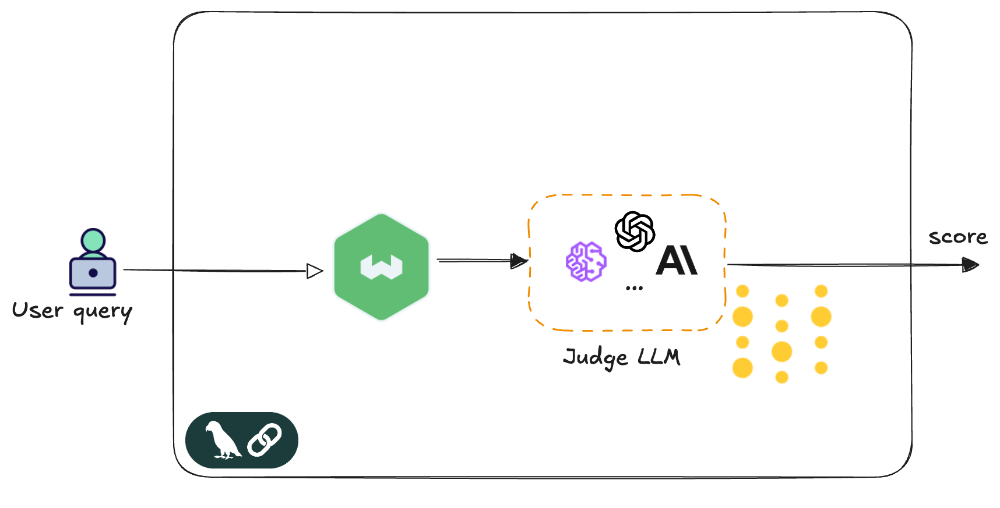
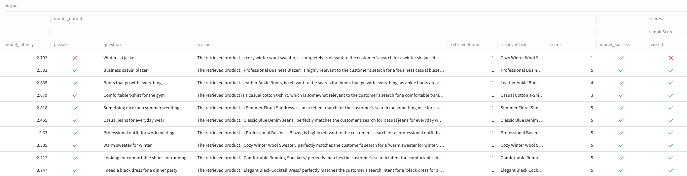

In [Part 1](https://weaviate.io/blog/evals-guardrails-enterprise-workflows-1), we covered the fundamentals: why evals and guardrails matter for enterprise AI systems. We explored how companies that ignore AI integration will fall behind their competitors. We walked through real-world examples—trading algorithms, logistics optimization, and fraud detection—to show how AI agents work in practice. We also discussed the safety measures needed to make these AI systems reliable: guardrails that filter inputs and outputs, evaluations that measure performance, and traces that track what happens behind the scenes. We identified the main risk—AI can behave unpredictably—and why building trust is crucial. Now it's time to get practical. This post shows you how to actually build these systems.  

Guardrails are the real-time gatekeepers; they block, redact, and constrain inputs and outputs to prevent harm. Evals are the scorecard; they don't block a bad response, but provide the essential logging and performance data to understand system behavior, detect drift, and refine the guardrails. It's crucial to distinguish their roles in order to create a robust system. Guardrails are enforcement — pre model input filters and post model output constraints. Evals are measurement — structured scoring, assertions, and traces that tell us how the system behaves under real workloads. Evals don’t stop bad outputs; they make failures visible and comparable, so we can tighten policies with evidence instead of guesswork.

The most effective enterprise AI systems combine both capabilities to continuously improve their real-time 
protection mechanisms. Evaluation signals can feed into company policies/guidelines that applications can use to redact, block or escalate to a human. This is where architectural patterns become essential. They transform static rules into adaptive systems that learn from their mistakes and evolve with changing requirements. In this post, we shall explore the LLM-as-Judge pattern, powerful design for automated, real-time quality assessment. 

## LLM-as-Judge: The Quality Controller

LLM-as-Judge is the most versatile evaluation pattern, enabling real-time quality assessment and outcome correction. A separate model scores each model output against explicit criteria—for example, application guideline, company policies and regulations compliancy. The LLM judge can detect and trigger corrective actions and can hence, act as both an eval system and a dynamic guardrail.


[](./img/judge-2.png)

Let's circle back to those enterprise scenarios we covered in Part 1 — trading apps that evaluate multiple signals and make buy-sell decisions, supply chain logistics routing shipments, fraud detection flagging suspicious transactions. In each case, LLM-as-Judge can serve as the quality controller: Does this trading recommendation align with our risk parameters? Is this route optimization realistic given current traffic conditions? Does this fraud alert make sense based on the user's transaction pattern? The LLM judge doesn't replace domain-specific validation, but it adds a layer of reasoning that catches edge cases rule-based systems might miss. You're not replacing your existing validation—your risk models, route optimizers, and fraud rules still do the heavy lifting. But the judge adds a sanity check that thinks more like a human: "Is this trading order right, given the current volatility" or "This route looks fine on paper, but does it make sense with today's weather?"

The LLM judge's evaluation criteria are entirely defined by what you encode in the prompt context. You can define what "good" looks like based on your business rules, brand guidelines, or customer experience standards. For trading systems, you might focus on risk parameters and market volatility thresholds. For fraud detection, transaction pattern analysis against known signatures. You can shape its evaluation logic through examples, scoring rubrics, and domain-specific guidelines.

## Implementation example 

Let's now move to an actual implementation with code examples for LLM-as-Judge. This example demonstrates a retail search application where customers query for clothing using natural language—"something nice for a summer wedding guest" or "professional blazer for meetings." Weaviate handles the [vector search](https://weaviate.io/blog/vector-search-explained), retrieving semantically similar products from the catalog. The LLM judge evaluates whether these search results align with the customer's intent and requirements.

Weaviate is an [ISO27001](https://weaviate.io/blog/weaviate-iso-compliant) certified open source vector database with built-in hybrid search, advanced filtering, and out-of-the-box [RAG](https://weaviate.io/blog/introduction-to-rag) capabilities. Features include flexible plug-and-play modules, zero-downtime backups, multi-tenancy, vector compression, and tenant isolation for secure, scalable ML applications.

```
┌─────────────────┐    ┌─────────────────┐    ┌─────────────────┐    ┌─────────────────┐
│   User query    │ →  │    Weaviate     │ →  │   Judge LLM     │ →  │ score, reason   │
│ "summer wedding │    │ vector search   │    │   evaluates     │    │  pass │ fail    |
│     guest"      │    │                 │    │   relevance     │    │                 │
└─────────────────┘    └─────────────────┘    └─────────────────┘    └─────────────────┘
```
For this implementation, the system uses two main tools: [LangChain](https://www.langchain.com/) and [Weights & Biases](https://wandb.ai/site/) (W&B).
**LangChain** provides the composable chains that wire together the prompt template, judge model, and output parsing into a clean, testable pipeline. Think of it as an assembly line that ensures everything flows smoothly from input to output.
**Weights & Biases** handles [evaluation tracking](https://wandb.ai/onlineinference/genai-research/reports/LLM-evaluation-Metrics-frameworks-and-best-practices--VmlldzoxMTMxNjQ4NA) and [observability](https://wandb.ai/onlineinference/genai-research/reports/What-is-LLM-observability---VmlldzoxMzI1Njk4MA). It records every evaluation, measures how well the judge performs over time, and provides detailed logs of what happened during each decision. Together, these tools provide the flexibility to experiment with different evaluation approaches while maintaining close visibility into how well everything performs in production. 

[](./img/scoring.png)

---

### Prerequisites 

The example uses TypeScript and assumes familiarity with prompt engineering and evaluation frameworks. If you're new to any of these tools, we recommend reviewing the [LangChain documentation](https://docs.langchain.com/oss/javascript/langchain/overview), [Weaviate quickstart](https://weaviate.io/developers/weaviate/quickstart), and [W&B integration](https://weave-docs.wandb.ai/reference/generated_typescript_docs/intro-notebook/) first. 
Before getting started, ensure you have the following configured:

**API Keys**: Set up authentication for your chosen LLM provider (OpenAI, Anthropic, etc.) and configure API keys in your environment

**Weaviate Setup**: Follow the [Weaviate quickstart guide](https://docs.weaviate.io/weaviate/quickstart) to set up a Weaviate instance. Use the sample dataset provided in the [github repo](https://github.com/dee-at-weaviate/evals-and-guardrails/blob/main/llm-judge-wnb/src/retail-data.ts) to create a collection of products - that includes item descriptions, categories, and metadata.

**Weights & Biases Account**: Check out the [guide here](https://weave-docs.wandb.ai/quickstart/?utm_source=wandb_site&utm_medium=weave_home) to create an account to begin tracking and evaluations. 

### Weights & Biases 
[Weave](https://weave-docs.wandb.ai/) within Weights & Biases (W&B) provides automatic experiment tracking and function tracing. The initialization creates a project namespace where all evaluation runs, model calls, and performance metrics are logged. This enables reproducible experiments visible on a dashboard and comprehensive observability across your evaluation iterations.

```typescript
weave.init('Retail-Search-Evaluation');
```

### Build the LLM Judge Chain

This function creates a judge chain using LangChain's composable pipeline. We pass in a prompt template and model name, then chain them together; the prompt template encodes business rules and evaluation criteria that guide the judge's decision-making. 

```typescript
const buildJudgeChain = (promptTemplate: ChatPromptTemplate, modelName: string) => {

    const llm = new ChatOpenAI({ model: modelName, temperature: 0 });
    return promptTemplate.pipe(llm).pipe(new StringOutputParser()).pipe(parseJudgment);

};
```
`parseJudement` receives the LLM's raw output and ensures we have a structured response using the JSON validator. In our example, we have instructed the judge LLM to provide a very simple score and the reason for scoring it that way.  
```typescript
const parseJudgment = (text: string) => {
    const parsed = JSON.parse(text);
    return {
        score: Math.max(1, Math.min(5, parsed.score || 1)),
        reason: parsed.reason || "No reason provided",
    };
};
```
### Weave Eval 

`evaluationModel` function ties the flow together. For each user query, it runs a Weaviate search, passes the search results to the judge chain, and returns structured evaluation data that is logged into weave. The `weave.op` wrapper enables automatic logging, tracing, and performance monitoring. We shall look at this data in W&B's console later in this post.

```typescript
const evaluationModel = weave.op(
    async ({ datasetRow }) => {
        const question = datasetRow.question;
        const retrievedDocs = await vectorStore.hybridSearch(question, {limit: 1});
        
        const judgment = await judgeChain.invoke({
            question,
            answer: retrievedDocs.map(doc => doc.pageContent).join('\n')
        });

        return {
            question,
            retrievedText: retrievedDocs.map(doc => doc.pageContent).join('\n'),
            retrievedCount: retrievedDocs.length,
            score: judgment.score,
            reason: judgment.reason,
            passed: judgment.score >= passThreshold
        };
    }, 
    { name: 'LLM-as-Judge' });
``` 

The following step runs the above evaluation model across a list of test questions and collects the results:

```typescript
const evaluation = new weave.Evaluation({
  dataset,
  scorers: [simpleScorer],
});

await evaluation.evaluate({ model: evaluationModel });  
```
The scoring function extracts key metrics from the judge's output for aggregation and reporting. 

```typescript
const simpleScorer = weave.op(
  ({ modelOutput }) => 
    ({ 
        score: modelOutput.score, 
        passed: modelOutput.passed 
    }),
  { name: 'simpleScore' }
);
```

### Define the LLM Judge Prompt

The prompt template defines the evaluation logic and criteria that guide the judge's decision-making process. This prompt serves as the configuration layer where we encode business rules, scoring rubrics, and domain-specific examples that ensure consistent evaluation across different queries. 

For this retail search implementation, the prompt prioritizes semantic relevance and customer intent over exact keyword matching. We include scoring examples and contextual guidelines that help the judge understand what constitutes a good product match. The prompt architecture allows us to modify evaluation criteria without changing the underlying code—making it possible to adapt the judge's behavior for different product categories, seasonal requirements, or business policies. 

```typescript
const LLM_AS_JUDGE_PROMPT = ChatPromptTemplate.fromMessages([
  ["system", `You are evaluating a retail product search system. Customers search for clothing items using natural language, and you need to determine if the retrieved products are relevant to their search intent.

IMPORTANT: Focus on search relevance, not perfect matches. A customer searching for "dress for party" should find cocktail dresses, evening dresses, etc. Consider synonyms, related items, and search intent.

Scoring Scale (1-5):
- 5: Excellent - The retrieved product perfectly matches or highly relates to the customer's search intent.
- 4: Good - The retrieved product is relevant with minor differences (e.g., slightly different style/color than ideal).
- 3: Fair - The retrieved product is somewhat relevant but may not fully meet the search intent.
- 2: Poor - The retrieved product has minimal relevance to the search query.
- 1: Unacceptable - The retrieved product is completely irrelevant to the customer's search.

Examples:
- Search: "black dress for evening" → Retrieved: "Elegant Black Cocktail Dress" → Score: 5 (Perfect match)
- Search: "warm sweater" → Retrieved: "Cozy Winter Wool Sweater" → Score: 5 (Excellent relevance)
- Search: "business attire" → Retrieved: "Professional Business Blazer" → Score: 5 (Highly relevant)
- Search: "casual shoes" → Retrieved: "Leather Ankle Boots" → Score: 3 (Somewhat relevant but more formal)

Return JSON with this exact structure:
{{
  "score": <score_1_to_5>,
  "reason": "<detailed_explanation>"
}}`],
  ["human", `Customer Search: {question}

Retrieved Product: {answer}

Evaluate if this product is relevant to what the customer is searching for. Consider search intent and natural language variations.`]
]);
```

### Test Retail Questions

A sample set of customer queries you can use to test your evaluation pipeline.

```typescript
const retailTestQuestions = [
  "I need a black dress for a dinner party",
  "Looking for comfortable shoes for running",
  "Warm sweater for winter",
  "Professional outfit for work meetings",
  "Casual jeans for everyday wear",
  "Something nice for a summer wedding",
  "Comfortable t-shirt for the gym",
  "Boots that go with everything",
  "Business casual blazer",
  "Winter ski jacket" // Edge case: Not in inventory
];

```

With the evaluation pipeline running, W&B automatically captures detailed metrics and traces for every judge decision. The console provides comprehensive visibility into how the judge performs across different query types, scoring patterns, and potential failure modes.

The screenshot below shows the LLM judge evaluating each search result against our retail search criteria. With a threshold score of 3, any evaluation below this mark registers as a failure. Notice the edge case where the inventory lacks a ski jacket and returns a wool sweater instead—the judge correctly identifies this mismatch and fails the test. Each evaluation includes the judge's reasoning, demonstrating how the prompt configuration drives consistent decision-making across different scenarios. 

[](./img/wnbscoring.png)

The complete working code and sample dataset used above is available in this [GitHub repository](https://github.com/dee-at-weaviate/evals-and-guardrails/tree/main/llm-judge-wnb).

## Summary
LLM-as-Judge transforms evaluation from static rules to adaptive reasoning. The modular architecture—prompt configuration, execution chains, and comprehensive observability—provides the foundation for production-ready AI safety. 

In Part 3, we'll explore a different pattern: behavior shaping. We'll show how to detect hallucinations and use an observability platform to improve retrieval-augmented generation (RAG) systems. This addresses a critical problem in enterprise AI—ensuring that systems not only work correctly, but learn from their mistakes and get better over time.

---

import WhatsNext from '/_includes/what-next.mdx'

<WhatsNext />


