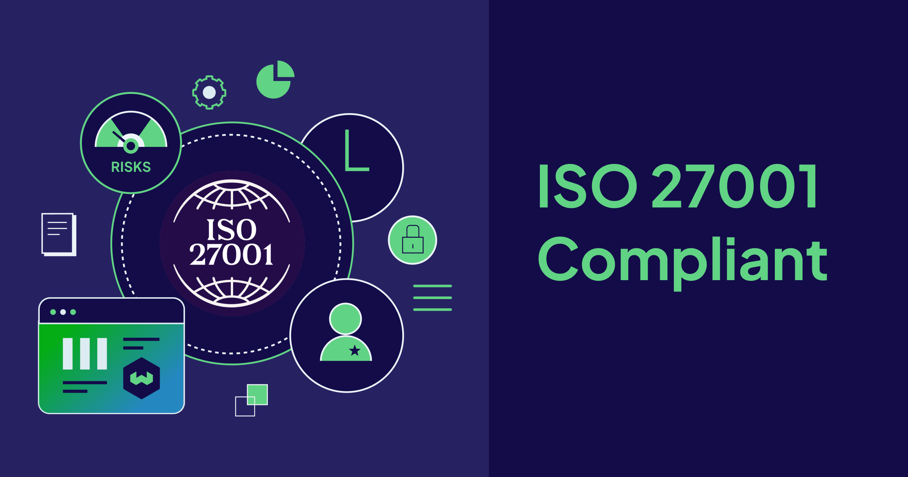

import SecurityFAQ from '@site/src/components/Security/FAQ'
import WhatsNext from '/_includes/what-next.mdx'

## Weaviate is ISO 27001 compliant! 🎉
But what does that actually mean for you?

ISO 27001:2022 is the international standard for information security management systems. It requires organizations to systematically manage information security risks through continuous monitoring, regular risk assessments, and appropriate security controls.
The certification involves independent third-party audits that evaluate our security policies, procedures, and technical controls to ensure they meet the highest international standards.

### Why should you care?

✓ 𝗘𝗻𝘁𝗲𝗿𝗽𝗿𝗶𝘀𝗲-𝗴𝗿𝗮𝗱𝗲 𝘀𝗲𝗰𝘂𝗿𝗶𝘁𝘆: This demonstrates our commitment to protecting your data with enterprise-grade security measures
✓ 𝗥𝗲𝗴𝘂𝗹𝗮𝘁𝗼𝗿𝘆 𝗰𝗼𝗺𝗽𝗹𝗶𝗮𝗻𝗰𝗲: Particularly valuable for customers in regulated industries who need documented evidence of robust security controls
✓ 𝗜𝗻𝗱𝗲𝗽𝗲𝗻𝗱𝗲𝗻𝘁 𝘃𝗲𝗿𝗶𝗳𝗶𝗰𝗮𝘁𝗶𝗼𝗻: Provides independent verification that our security practices meet global standards and regulatory requirements

### Building on our security foundation

Weaviate already holds SOC II Type II certification, and we offer HIPAA-compliant services through our Dedicated cloud offering.

Combined with ISO 27001, this creates a comprehensive security framework that addresses diverse compliance requirements across industries and use cases.

At Weaviate, we take the protection of your data seriously. Our information security measures continuously evolve and adapt to threats we see out there in the wilds of the internet.

All of our audit reports, test results, and certificates can be accessed from our trust portal at https://trust.weaviate.io

**Ready to see it in action?**

* [**Schedule a personalized demo**](mailto:sales@weaviate.io) with our team today to explore how vector search with enterprise security can transform your workflows.
---

<SecurityFAQ faqType="HIPAA" />

---

<WhatsNext />
