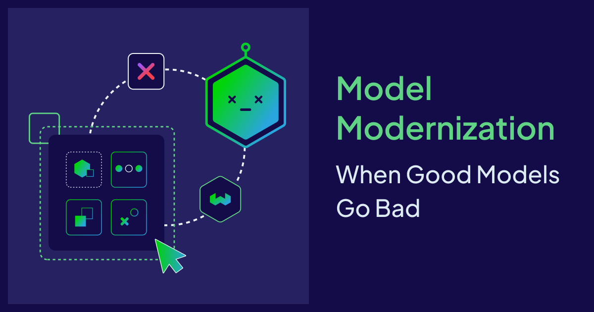
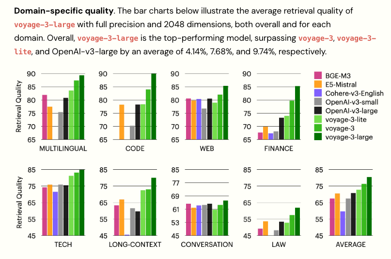
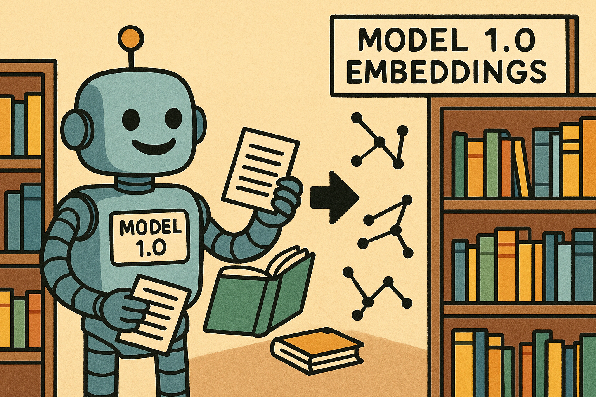
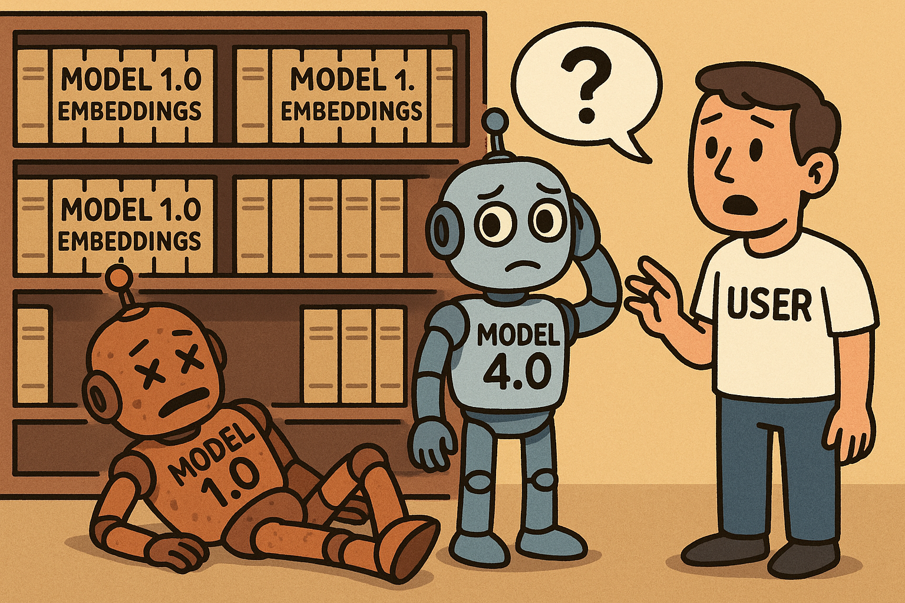

Billions of [vector embeddings](https://weaviate.io/blog/vector-embeddings-explained) sit behind the search results you see in ChatGPT, the recommendations in your favorite apps, and document retrieval in enterprise RAG. Modern embedding models turn text, images, and audio into dense numerical representations. These embeddings are the quiet foundation of today’s AI: each dimension captures a different semantic signal, enabling [semantic search](https://weaviate.io/blog/vector-search-explained), clustering, and classification. Unlike keyword searches that match exact terms, search via embeddings finds related data by using mathematical measures - like Euclidean distance or cosine similarity - to determine how close the vectors are to each other. 

As language models have evolved, so have the vector embeddings generated by them. The evolution of embeddings has progressed from static models like Word2Vec and GloVe, which assign fixed vector representations to words, to dynamic models such as BERT and ELMo that generate context-aware embeddings. Early adopters leaned on encoder-only models like BERT to power everything from web search and recommendation engines to customer service chatbots. Then came large language models with broader world knowledge, stronger text understanding and reasoning, that further improved the quality of embeddings. Embedding models keep improving, like most cutting-edge AI. New releases promise better accuracy and richer context. Seen below are the new benchmarks set by the voyage-3-large model in Jan 2025. 

Does that mean we upgrade our favourite embedding model when a better one comes along? For an existing AI application, it may not be an easy task. Different embedding models can produce unique vector spaces due to various factors, including their architectures, training methods, and the datasets used for training. These differences significantly impact how data is represented and compared. 

The distinction in embedding models leads to variations in how similar words or phrases are clustered in the vector space. If we changed the embedding model in an existing search application, for example, the vector generated from a new user query wouldn’t map cleanly to a vector space created by an older embedding model. In comparing vectors from two models, a simple cosine similarity might yield misleading results if the embeddings signify different contextual or conceptual meanings. Because retrieval depends on tight semantic alignment between stored and query embeddings, the system might return irrelevant results instead of semantically relevant matches.  

Strategies like normalization and alignment techniques might help map one embedding space to another, but the chances of losing context or variance in performance is high. The incompatibility in understanding semantic relationships could mean that applications like search, recommendations, and RAG can break. 

Re-embedding the entire dataset can be an effective solution to ensure that AI applications remain performant and aligned with user needs and current data. For smaller datasets, re-embedding might be a minor inconvenience. At a multi-million-document scale, a sudden model turndown can be costly. 

## The Costs of Embedding Model Modernization

AI enterprises do not just use embeddings; they build ecosystems around them. Upgrade costs can create strategic tension in any company. Organizations must weigh the potential impacts and plan strategically when dealing with embedding models at scale. This may involve evaluating solutions based on total lifecycle cost - not just the initial build. Factor in migration, operational overhead, and business risk. Consider the following:

- Re-embedding cycle: The resources required to re-embed your entire archive can be substantial, leading to increased operational costs.
- Downtime and opportunity cost: Stopping workflows to re-embed can lead to cascading delays in ongoing projects. 
- Parallel infrastructure costs: To avoid downtime, teams may run old and new embedding model pipelines side by side.
- Change Management: At a large scale, managing the transition to new embeddings also requires communication and deliverables adjustments between multiple projects.
- Downstream application testing: An embedding model that performs better on benchmarks doesn't automatically guarantee improved performance in your downstream applications. Extensive end-to-end testing and evaluation of your workflows is necessary to validate that the upgrade delivers real value, and this process itself can be time-consuming and expensive. 
- New model costs: Computational and storage demands can increase with higher-dimensional vectors and larger inference costs. That said, upgrading your embedding model doesn't always necessitate higher dimensions; it could involve adopting a model with smaller dimensions that provides superior embedding quality. 

So why upgrade your embedding models at all? How does one know if an upgrade is worth it? 
## Why upgrade your embeddings?

Do you chase cutting-edge performance with frequent updates, or favor stability with aging models? Embedding model performances isn’t static - what works today might seem slow tomorrow as newer models emerge. To navigate the vast landscape of ever improving models, platforms like Hugging Face have introduced the Massive Text Embedding Benchmark (MTEB) Leaderboard, which ranks models based on their performance across a wide range of tasks and metrics. However, while these benchmarks give you a relative comparison of embedding performance with the help of metrics, there might be a mismatch between the datasets used for benchmarking and your application data. Companies require a decision framework that integrates benchmarking, A/B testing, and practical evaluation. Additionally, domain-specific models may outperform general models even with lower MTEB scores on general benchmarks. The optimal decision will then vary based on your industry, use case, and risk tolerance.

### Industry considerations
Different industries have unique requirements and would prioritize different features in embedding models. For example, the most important metrics in healthcare would be retrieval(finding relevant medical literature), recall over precision(missing a relevant diagnosis is worse than false positives), classification(diagnosis categorization), STS(matching symptoms and treatment comparison) and clustering(disease pattern recognition). 

On the other hand, for ecommerce, clustering, classification and recall wouldn’t matter as much. Precision over recall is preferred as it’s better to show 10 perfect search results over 100 mixed ones. Retrieval and reranking would also be key. 

For a financial  trading app, clustering(grouping similar stocks, sector analysis, portfolio similarity) and classification(auto tagging news sentiment, categorizing events) are again critical. 

| Metric                | Ecommerce | Finance (Compliance) | Healthcare |
|-----------------------|-----------|----------------------|------------|
| Retrieval             | Critical  | High                 | Critical   |
| Classification        | Low       | Critical             | Critical   |
| STS (Semantic Similarity) | Ignore    | High                 | Critical   |
| Clustering            | Medium    | Medium               | High       |
| Reranking             | Low       | Medium               | High       |
| Multilingual          | Variable  | High                 | Critical   |

### Use case
The choice of MTEB metrics may also vary depending on the use case. For instance, customer support chatbots and academic research tools require high retrieval and reranking scores, as these directly influence the system's ability to locate relevant knowledge base articles or research papers.

Legal contract analysis, conversely, demands high clustering and summarization scores to effectively group contracts by type or risk profile and condense lengthy legal documents. Fraud detection systems should prioritize classification metrics, updating only when accuracy improvements reduce false negatives on fraud-specific benchmarks. Content curation platforms can also track summarization metrics, given their reliance on accurately capturing document essence for search and recommendations. Finally, code search and developer tools require a high semantic textual similarity (STS) score to identify similar code, with multilingual scores being important for applications serving global users.
### Risk tolerance
Risk tolerance shapes both which metrics matter most and your upgrade frequency. High-risk applications - healthcare diagnostics, legal compliance, financial fraud detection - cannot afford retrieval failures. A false positive (retrieving extra documents) is acceptable; a false negative (missing critical information) is not. Low-risk applications like e-commerce search or content recommendations tolerate more flexibility. These systems can wait for larger performance gains before justifying re-embedding costs.

Since embedding quality depends heavily on the training dataset, newer models trained on more diverse, recent, and carefully curated data may exhibit lower bias and might better handle edge cases. A healthcare model trained on outdated medical literature or a legal model with demographic biases in its training data can perpetuate harmful patterns - even with strong MTEB scores. In these domains, upgrading to models with improved training datasets may be necessary to maintain ethical and regulatory compliance, regardless of benchmark improvements. For low risk apps, smaller models can be a pragmatic alternative, offering faster inference and reduced operational costs, even with minor trade-offs in accuracy.

Risk tolerance also determines your evaluation pipelines. High-risk systems require extensive A/B testing on production data, shadow or parallel deployments and gradual rollouts with monitoring. Low-risk applications can move faster with lighter validation.
### Costs and Engineering Capacity
The infrastructure readiness to upgrade an embedding model is equally critical when considering the reasons for an upgrade. Essential capabilities include an A/B testing framework for safely validating new embeddings, benchmarking systems and an experienced team to handle complex scenarios. The costs could also add up - a comprehensive cost analysis should include re-embedding expenses for your entire database, the infrastructure for running parallel systems during the transition, potential service disruptions, and the engineering time dedicated to implementation, testing, and monitoring.

## Benchmarking and A/B testing 
As mentioned earlier, MTEB benchmarks might have little resemblance to your actual use case. While the leaderboard offers valuable signals, the benchmarks are trained and evaluated on general datasets that may not reflect your specific domain, user behavior, or query patterns. A model topping the leaderboard on general retrieval tasks might underperform on your specialized legal documents, e-commerce catalog, or medical knowledge base. 

Once you've identified the key metrics for your application, it's crucial to test with a sample of your own data. Create evaluation datasets using your actual queries and documents, comparing retrieval accuracy, speed, and latency, and measuring any downstream business metrics like user engagement or task completion rates. Your framework should also consider the operational costs discussed earlier in this blog.
1. List the most important metrics for your app. MTEB metrics (retrieval, classification, STS, clustering, etc.) are your starting point, but also include operational metrics like inference latency, throughput, and precision/recall at specific cutoffs. 
2. Sample representative queries and documents from your production system. The composition will vary by application: e-commerce needs product searches, healthcare needs clinical queries, legal needs contract language. Ensure your test set covers edge cases, common queries, and failure modes.
3. Document your current model's performance on both MTEB benchmarks and your domain-specific test set. This will serve as your baseline for all future evaluations.
4. Define the minimum improvement that justifies migration costs. Factor in both technical performance and business ROI.
5. Periodically check for new models, filtering by your priority metrics. When a promising candidate emerges, move to A/B testing.
6. Embed a sample of your corpus with the candidate model. Run your test queries against both old and new embeddings. Measure performance on your defined metrics.
7. Run an A/B test with a small percentage of live traffic.

If the candidate model consistently outperforms on key metrics and performs well in limited live traffic, it's time to estimate the migration effort for the entire dataset and factor in the operational costs previously discussed. Once all risks and implications of the migration are consolidated, you can then decide if it's the right time to transition to a new model.

## When to upgrade
Only upgrade your model when the improvements outweigh the costs and operational constraints (such as limited engineering resources, upcoming product launches, or infrastructure limitations) are favorable.
- Significant Performance Gains: The new model demonstrates substantial improvements (exceeding your defined baseline) on your specific dataset, not just general benchmarks.
For high-risk applications (e.g., healthcare, legal), a 5-8% improvement on critical metrics may justify migration.
For standard applications (e.g., customer support, e-commerce), 10-15% gains might be typically needed to warrant re-embedding costs.
- Positive Business ROI: Projected business metrics show a positive return on investment after accounting for migration expenses.
- Competitive Advantage: There's competitive pressure to enhance search or recommendation capabilities, provided the gains justify the switch.
- Large Benchmark Gaps: Newer models exhibit over 15% improvement on domain-relevant benchmarks.

### Upgrade with minimal disruption
Some vector databases like Weaviate offer features that significantly reduce the risks associated with embedding model upgrades. These features help you avoid risks like application downtime and high parallel infrastructure costs.

You can add multiple embedding versions of the same data within a single collection, allowing your old and new model embeddings to coexist. This capability allows you to test the new model's performance with live queries and compare results side-by-side with the old model’s embeddings. 

Another feature is the collection alias, which functions as a pointer. When connecting to the database, your application can reference an alias name instead of a specific collection directly. Once you are ready to switch to a new model, you simply update the alias to point to the new collection. This transition is instantaneous, and in case of issues, you can roll back by simply changing the alias pointer again. 

## Alternate approaches
Not every company has the infrastructure, budget, or engineering capacity to re-embed their datasets. Given the substantial costs, operational complexity, and risks associated with embedding model upgrades, several strategic approaches can help you maintain competitive performance. The following solutions don't eliminate the need for eventual upgrades, but they provide more flexibility in how and when you evolve your embedding infrastructure.
### Dynamic model selection
Instead of relying on a single embedding model for your entire application, consider employing multiple models, each specifically optimized for different types of tasks. For instance, a customer support app might use a lightweight model for FAQs, while the same company could implement a domain-specific technical model for complex product troubleshooting, and a general-purpose model for all other needs. So when a better model arrives, you avoid re-embedding your entire database. This strategy facilitates gradual adoption, mitigating the massive cost and disruption associated with a total migration.
### Strategic model self-hosting
When utilizing API-based embedding services from providers like OpenAI or Cohere, you are subject to their deprecation schedules. By running embedding models on your own infrastructure, you control your upgrade timelines. Open-source models such as Arctic Embed and Ollama further enhance accessibility as you're not locked into proprietary vendors. You can tailor the model to your needs and avoid per-token API costs at scale. The trade-off is the need for technical expertise in deployment, monitoring, and infrastructure maintenance. 
### Contractual guarantees
While providers don't publicly advertise these options, enterprise sales teams are often authorized to create custom agreements for high-value customers. If you have a large, business-critical application, you could try negotiating custom terms for embedding models. This might include extended support beyond standard deprecation timelines, migration assistance when models are retired, or guaranteed access for a specific number of years.

## The Future of Embeddings: A Growing Consideration

Organizations often mistakenly view embedding model selection as a one-time decision. However, models evolve, providers deprecate versions, better options emerge, and data grows. Ignoring this creates technical debt, making future migrations more complex and costly.
As deployments scale and providers enforce model deprecation schedules, this hidden cost will shape AI strategy and budgets. Integrate flexibility into your architecture, monitor the landscape, and treat model selection with the strategic importance it deserves.

import WhatsNext from '/_includes/what-next.mdx'

<WhatsNext />
