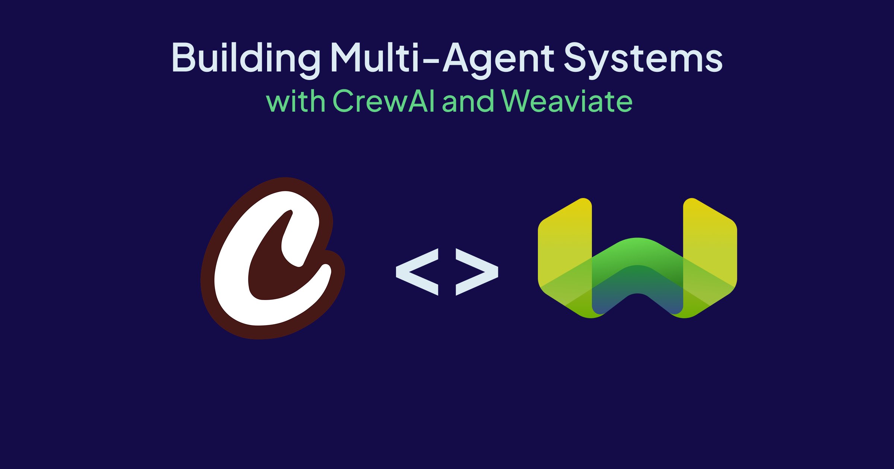

import WhatsNext from '/_includes/what-next.mdx'



Most AI systems today are designed as single agents: one model acting alone to understand a user’s request, reason through it, call different tools, and generate a response. This works well for simple queries, however, as tasks grow in complexity, the limits of single-agent systems become clear. 

Complex challenges often require more than one perspective, diverse skill sets, and different types of reasoning. That’s where multi-agent systems shine. Instead of relying on a single agent, a multi-agent system creates a team of specialized agents, each with its own tools, memory, and focus. By assigning clear roles, these agents can collaborate, debate, and refine one another’s outputs to solve problems that would overwhelm a single agent.

## Using CrewAI to Build Multi-Agent Systems

CrewAI is a Python framework purpose-built for orchestrating collaborative, role-based autonomous agents. It’s a pragmatic toolset for developers building composable, LLM-powered automation with explicit control over tasks, workflows, and agent capabilities.  
This blog post will begin by reviewing some of the key abstractions for understanding how to build multi-agent systems with CrewAI and then present a demo walkthrough. 

### Agents

An `Agent` is essentially a language-model-powered process, encapsulated with a role, a set of goals, and a backstory for prompt engineering and persona consistency. Each agent can perform tasks, call external tools, query memory/context, make decisions, and collaborate or delegate tasks to other agents. They handle and store short-term and long-term memory by default, supporting multi-turn, stateful execution and cross-agent knowledge sharing.

### Tasks

A `Task` defines a granular unit of work to be performed by an agent.. It contains a `description`, `expected output`, the responsible agent(s), and a list of external `tools`. Tasks are the routing mechanism for agent workflows, allowing for both sequential and hierarchical logic. Parameters like `output_file` or `max_iterations` are available to customize artifact output and control execution limits.

### Crew

A `Crew` is the orchestration layer that groups `agents` and `tasks` and decides how work is executed and in what order. Crews can run tasks sequentially (think, chained subtasks, each dependent on the last) or in hierarchical variants (a manager agent supervises, delegates, and quality-checks outputs) letting you directly map business processes or user journeys to code.

### Tools

CrewAI `Tools` are a separate but tightly coupled library of external tool integrations that can be connected to your `Agents`. There are a variety of tools like the [`WeaviateVectorSearch` too](https://docs.crewai.com/en/tools/database-data/weaviatevectorsearchtool)l and [Serper API tools](https://docs.crewai.com/en/tools/search-research/serperdevtool). Tools are registered to agents at runtime making it trivial to grant agents deterministic access to proprietary data or services, and to enforce guardrails through explicit tool scopes.

These tools enable your agents to search the web and your vector database, turning retrieved knowledge into context-aware responses.

### Flows

Flows are CrewAI’s solution for advanced orchestration: stateful, event-driven data pipelines that blend crew logic with conditional branching, looping, parallelism, and arbitrary Python code steps in a single control surface. Flows are ideal for automating complex business rules, CI/CD triggers, or long-running async workflows. Each Flow step can invoke an agent, crew, or direct Python function, and they retain global state throughout. 

## Notebook Recipe

Now that we’ve covered the basics, we’ll [review this notebook](https://github.com/weaviate/recipes/blob/main/integrations/llm-agent-frameworks/crewai/simple-getting-started.ipynb) that uses CrewAI to build a multi-agent system in which three domain-specific agents—focused on biomedical, healthcare, and finance—collaborate to produce industry-tailored analyses. Each agent uses two tools: a Weaviate vector search tool for retrieval from an existing collection and the Serper web search tool for fresh context. The agents are assembled into a single `Crew` and given tasks to investigate specific Weaviate features, then synthesize findings for their domain. 

### Requirements

To run this notebook, you will need to install:  
1. [CrewAI](https://pypi.org/project/crewai/)  
2. [CrewAI Tools](https://pypi.org/project/crewai-tools/)  
3. [Weaviate Python Client](https://pypi.org/project/weaviate-client/)

You’ll also need the following keys:  
1. Running Weaviate cluster: You can create a free 14-day sandbox on [Weaviate Cloud](https://console.weaviate.cloud/).  
2. Serper API key: You can get 2,500 of free credits [here](https://serper.dev/).  
3. OpenAI API key

### Connect to Weaviate and Existing Collection

As mentioned previously, you will need a running Weaviate cluster to run this notebook. It’s also important that you have an existing Weaviate collection. If you don’t have one already, you can follow this import notebook [here](https://github.com/weaviate/recipes/blob/b2011d86cb04ca6e900ba503af185f53a1af3413/integrations/Weaviate-Import-Example.ipynb)!

```py
# connect to your Weaviate cluster

client = weaviate.connect_to_weaviate_cloud(
    cluster_url=WCD_CLUSTER_URL,
    auth_credentials=Auth.api_key(WCD_CLUSTER_KEY),
    headers={"X-OpenAI-Api-Key": os.getenv("OPENAI_API_KEY")}
)

print(client.is_ready())


# connect to your existing collection
weaviate_collection = client.collections.get("WeaviateBlogChunk")
```

### Initialize the Tools

We’ll want to equip our agent with the right tools, so we’ll initialize the `WeaviateSearchTool` and the `SerperDevTool`.

**Weaviate Vector Search Tool**  
The agent will access your Weaviate collection and run a `hybrid search` to find the relevant objects.

```py
weaviate_tool = WeaviateVectorSearchTool(
    collection_name='WeaviateBlogChunk', 
    limit=4,
    alpha=0.75,
    weaviate_cluster_url=WCD_CLUSTER_URL,
    weaviate_api_key=WCD_CLUSTER_KEY,
)
```

**Google Serper Search**  
The agent can access the web using the Serper API. 

```py
search_tool = SerperDevTool()
```

### Create the Agents

We’ll now build our specialized `Agents` and give them access to the `WeaviateVectorSearchTool` and `SerperDevTool`.

**BioMed Marketing Agent**

```py
BiomedicalMarketingAgent = Agent(
    role='Industry researcher focused on biomedical trends and their applications in AI',
    goal='Continuously track the latest biomedical advancements and identify how Weaviate’s features can support AI applications in biomedical research, diagnostics, and personalized medicine.',
    backstory='As a former biomedical product marketer turned AI    strategist, you understand the complex language and regulatory landscape of biomedical innovation. With a keen eye on genomics, clinical research, and medical devices, it now leverages LLMs and vector search to explore how Weaviate’s capabilities can streamline scientific discovery and patient-centric campaigns.',
    llm="gpt-4o-mini",
    tools=[search_tool, weaviate_tool],
    verbose=True)
```

**Healthcare Marketing Agent**

```py
HealthcareMarketingAgent = Agent(
    role='AI-savvy marketer specializing in healthcare systems, digital health, and patient engagement.',
    goal='Stay updated on healthcare policy shifts, digital health trends, and explore how Weaviate’s features can optimize workflows in hospital systems, EHR integration, and health communication.',
    backstory='Rooted in public health communications, this agent has evolved into a digital health consultant. You focus on how retrieval-augmented generation (RAG), semantic search, and hybrid models can be applied to solve healthcare-specific challenges—from patient triage to clinical support systems.',
    llm="gpt-4o-mini",
    tools=[search_tool, weaviate_tool],
    verbose=True)

```

**Financial Marketing Agent**

```py
FinancialMarketingAgent = Agent(
    role="Insight analyst exploring innovations in finance, wealth tech, and regulatory tech",
    goal="Monitor financial sector trends including AI in trading, compliance automation, and client advisory, and assess how Weaviate’s tools can enable cutting-edge financial applications.",
    backstory="With experience at a fintech startup and a background in capital markets, this agent specializes in using structured + unstructured data to surface insights for analysts and advisors. Now, it’s looking into how vector databases and LLMs can automate tasks like fraud detection, investor personalization, and market research.",
    llm="gpt-4o-mini",
    tools=[search_tool, weaviate_tool],
    verbose=True)
```

### Define the Agents Tasks

We’ll need to assign the agents a `Task` so they know their responsibilities. 

**BioMed Agent Task**

```py
biomed_agent_task = Task(
    description = """
        Conduct a thorough research about {weaviate_feature}
        Make sure you find any interesting and relevant information using the web and Weaviate blogs.
    """,
    expected_output = """
        Write an industry specific analysis of why this Weaviate feature would be useful for your industry of expertise.
    """,
    agent = BiomedicalMarketingAgent)

```

**Healthcare Agent Task**

```py
healthcare_agent_task = Task(
    description = """
        Conduct a thorough research about {weaviate_feature}
        Make sure you find any interesting and relevant information using the web and Weaviate blogs.
    """,
    expected_output = """
        Write an industry specific analysis of why this Weaviate feature would be useful for your industry of expertise.
    """,
    agent = HealthcareMarketingAgent)

```

**Financial Agent Task**

```py
financial_agent_task = Task(
    description = """
        Conduct a thorough research about {weaviate_feature}
        Make sure you find any interesting and relevant information using the web and Weaviate blogs.
    """,
    expected_output = """
        Write an industry specific analysis of why this Weaviate feature would be useful for your industry of expertise.
    """,
    agent = FinancialMarketingAgent)
```

We’ll list out the Weaviate features that we want the agents to research:

```py
weaviate_features = [
  {"weaviate_feature": "MUVERA"},
  {"weaviate_feature": "Multi-tenancy"},
  {"weaviate_feature": "Compliance"},
  {"weaviate_feature": "Hybrid Search"}
]
```

### Assemble the Crew

Now that we have our agents and assigned tasks, we can assemble our crew. The crew will run the agents simultaneously and each agent will access the web and Weaviate database.

```py
blog_crew = Crew(
    agents=[BiomedicalMarketingAgent, HealthcareMarketingAgent, FinancialMarketingAgent],
    tasks=[biomed_agent_task, healthcare_agent_task, financial_agent_task],
    # verbose=True, # uncomment if you'd like to see the full execution from the kickoff
    # planning=True
)
```

### Query Time

Time for the fun part – you can run your crew with:

```py
result = blog_crew.kickoff_for_each(inputs=weaviate_features)

print(result)
```

The output will display helpful information like the tool input and output, agent tool execution, and the final answer. 

## Summary

This blog post shows how CrewAI simplifies multi-agent systems using four building blocks: Agents, Tasks, Tools, and Crews. We walk through a recipe featuring a crew of three domain-specific agents (biomedical, healthcare, and finance), each equipped with a Weaviate vector search tool and Google search via the Serper API. 

Together, retrieval, role specialization, and orchestration produce deeper, higher-quality outputs than a single agent working alone. The same pattern scales with hierarchical crews, guardrails and structured outputs, and Flows for event-driven branching and stateful automation.


---


<WhatsNext />
