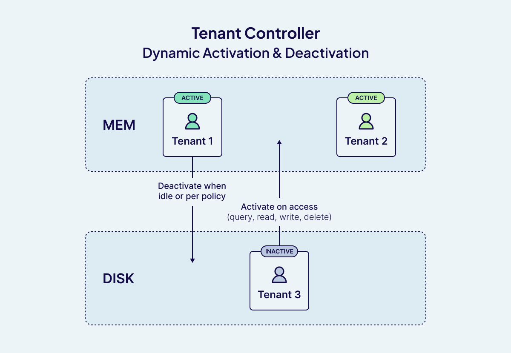
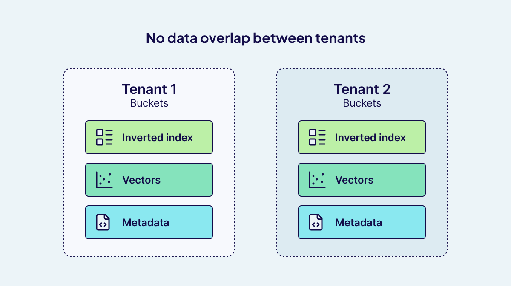
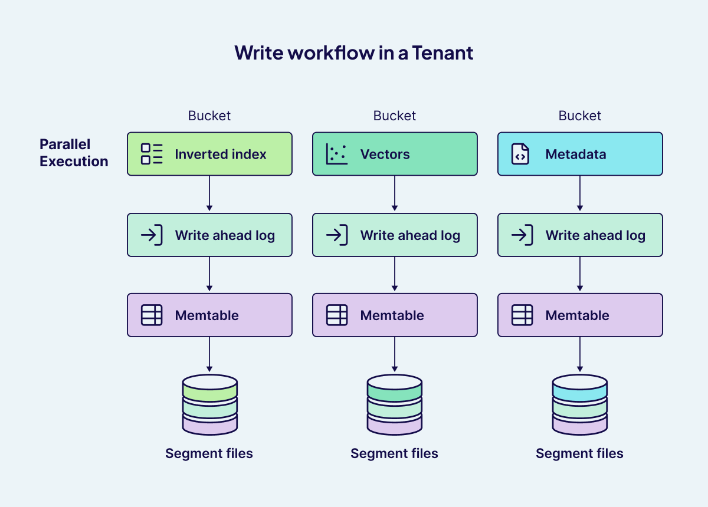
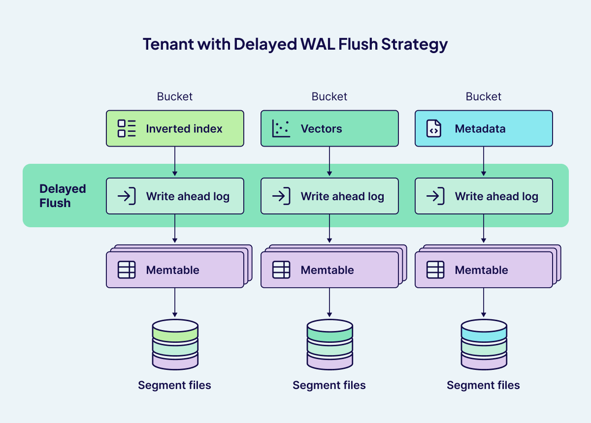
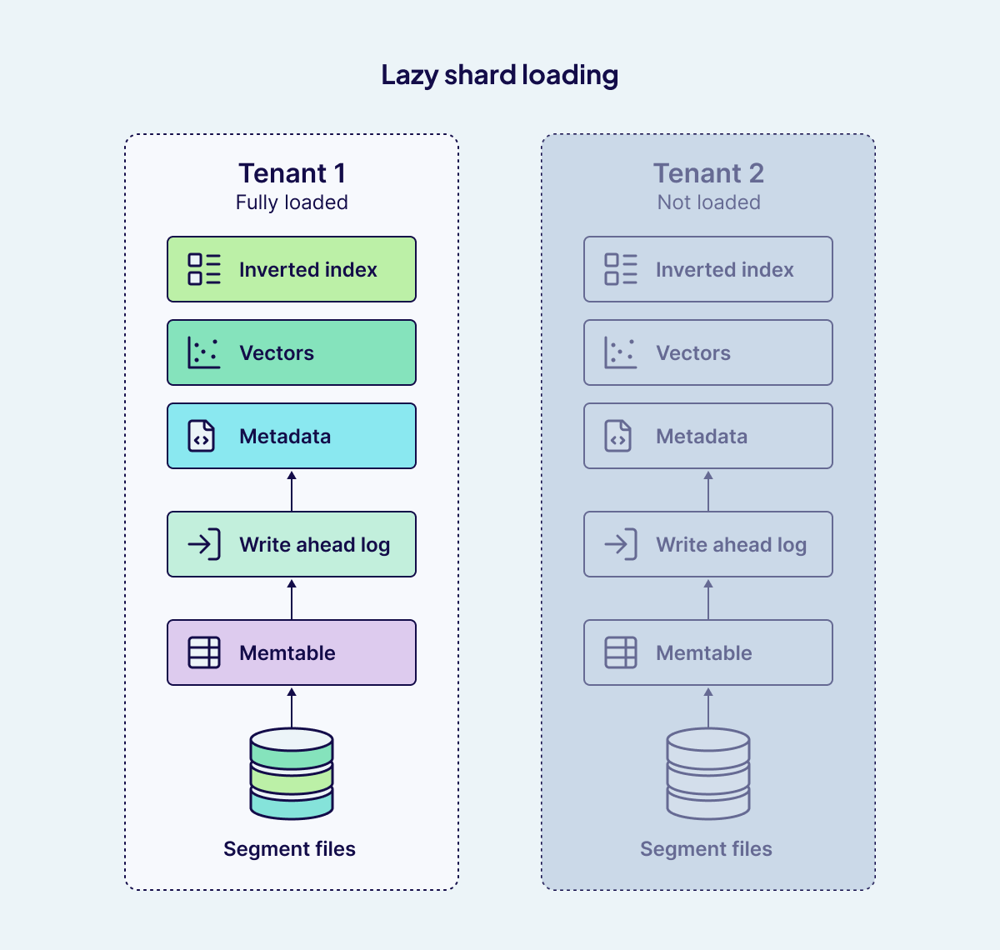
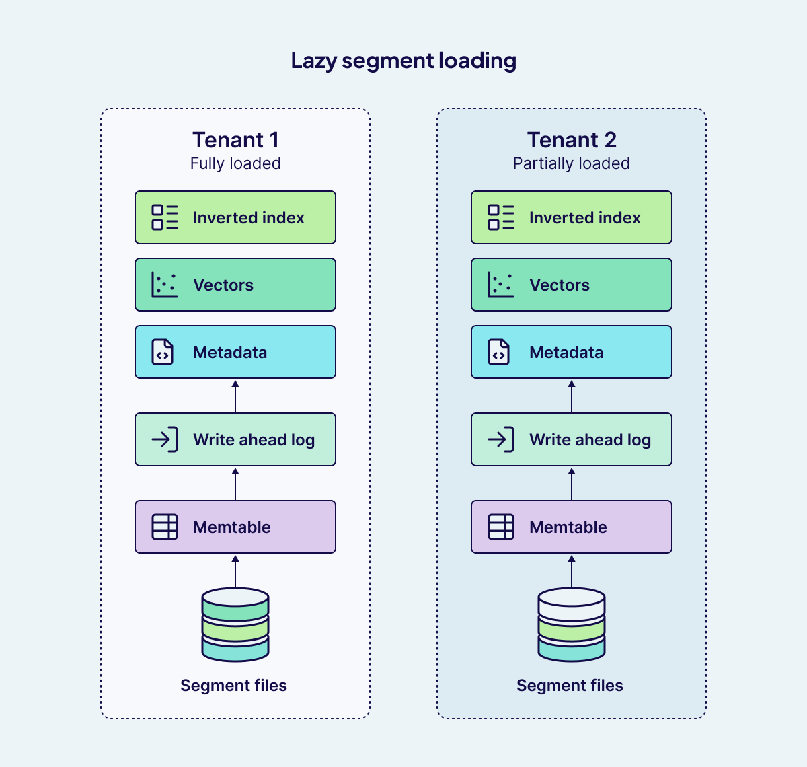

As more organizations build AI powered applications that rely on [vector search](/blog/vector-search-explained), the [multi-tenancy](/blog/multi-tenancy-vector-search) capability has become a must-have. This is especially true for SaaS platforms that need to serve many clients while keeping their data and workloads separate. The problem is that most [vector databases](/blog/what-is-a-vector-database) treat multi-tenancy as an afterthought. They use workarounds like namespace conventions or partitioning, which often lead to data leakage, performance bottlenecks, and messy maintenance. As the number of tenants grows, it becomes harder and harder to manage resource allocation and data privacy.

Weaviate takes a fundamentally different approach. Multi-tenancy is built directly into its core architecture. That means you get a scalable, cost-efficient, and high-performance solution designed for your multi-tenant applications. Whether you are building internal tools or customer-facing products, Weaviate makes sure each tenant's data is isolated, performance is more predictable, and overhead stays low. Best of all, you can achieve this without spinning up separate infrastructure for every tenant.

At the foundation of this design are two key components:

**One Shard per Tenant**

Weaviate achieves physical and logical separation by partitioning data into what it calls a shard. Each shard is a self-contained storage and query unit that holds part of a collection's data. In multi-tenancy, every tenant's data is kept isolated in its own shard. This architecture not only provides strong data isolation but also minimizes cross-tenant contention and supports precise, tenant-specific performance optimization at scale.

- **Logical Isolation**: Since each tenant's data resides in its own shard, operations (such as queries, inserts, or deletes) on one tenant do not impact integrity of data belonging to other tenants. This strong isolation reduces the risk of accidental data leakage or interference between tenants.

- **Contention Minimization:** With one shard per tenant, each tenant's data and indexes are isolated, which reduces cross-tenant interference at the storage and indexing level. Even though tenants still share node resources (CPU, memory, I/O, network), a heavy workload can impact overall node capacity, you can use Tenant Controller to deactivate tenants and replication/HA to manage load and maintain performance under spikes.

- **Performance Control:** This architecture allows for fine-grained performance management. You can monitor, scale, or even offload individual tenants based on their activity and resource needs, without affecting the rest of the system. For example, inactive tenants can be moved to cold storage to save resources, while active tenants remain in hot storage for optimal performance.

**The Tenant Controller**: Smarter Resource Allocation 

Weaviate's multi-tenancy introduces a dynamic way of managing resources with a _Tenant Controller_. Each tenant, essentially its own logical dataset, can move between three states: **ACTIVE**, **INACTIVE**, or **OFFLOADED**.

Instead of keeping every tenant in memory all the time, the Tenant Controller intelligently decides which ones stay active based on workload demand. Active tenants use memory and compute. Inactive ones free up those resources while remaining quickly accessible. Offloaded tenants are pushed to lower-cost storage until needed again.

This design prevents unused tenants from consuming valuable system resources, while still allowing fast reactivation when required. The result is a balance of **performance, efficiency, and cost control** at scale.

- **Dynamic Activation and Deactivation:** Weaviate can automatically activate a tenant when a search, read, update, or delete operation is performed on it. This means that tenants which are not in use can be set to INACTIVE or even OFFLOADED (moved to cold storage such as AWS S3), significantly reducing the memory and compute resources required. When a tenant is accessed, it is reactivated, ensuring that only the necessary data is loaded into memory at any given time. This dynamic management is especially valuable for applications with many tenants, where only a subset is active at any moment, such as SaaS platforms or large-scale user-facing services.

- **Resource Optimization:** By intelligently controlling tenant states, Weaviate ensures that memory and compute resources are allocated to active workloads, while inactive or rarely accessed tenants are moved to less expensive storage tiers. This not only optimizes performance for active users but also helps control infrastructure costs.

- **Operational Efficiency:** The tenant controller's ability to deactivate and reactivate tenants on demand means organizations can scale to millions of tenants without over provisioning resources. This mechanism is particularly effective in scenarios where user activity is sporadic or follows predictable patterns, such as business hours or seasonal usage spikes.  

Weaviate's multi-tenancy design delivers the core benefits customers need: strong isolation, efficient resource utilization, and the flexibility to manage tenants dynamically at scale. Unlike approaches that treat multi-tenancy as an add-on, Weaviate builds it in as a first-class design principle that is capable of supporting over a million tenants per cluster without noisy neighbor issues or prohibitive costs.

## Under the Hood: How Weaviate Powers Native Multi-Tenancy

Weaviate's multi-tenancy model is built on **physically isolated components** that guarantee each tenant has its own operational domain, while still leveraging shared infrastructure for cost-efficiency.

### Per-Tenant Bucketed Architecture in Weaviate

Weaviate's multi-tenancy model is built on a robust per-tenant bucketed architecture. In this design, each tenant is assigned a dedicated shard within a collection, ensuring strong logical and physical isolation of data. But the architecture goes further: within each shard, data is organized into specialized "buckets" that serve as atomic units for storage and indexing. Each bucket is functionally independent.

- **Inverted Index Buckets**:  
   For every property that is filterable or searchable, Weaviate creates a dedicated inverted index bucket. This allows for efficient property-based filtering and searching, as each property's index is managed independently within the tenant's shard. The use of [LSM-Tree](https://en.wikipedia.org/wiki/Log-structured_merge-tree) segmentation for object and inverted index storage further optimizes read and write performance, ensuring that queries remain fast even as data grows..
- **Vector Buckets**:  
   For each named vector, Weaviate maintains its own [vector index](https://docs.weaviate.io/academy/py/vector_index/overview). Depending on configuration, this can be either an [HNSW (Hierarchical Navigable Small World)](https://docs.weaviate.io/academy/py/vector_index/hnsw) graph or a flat index. In the case of a flat index, vectors are stored in dedicated buckets, and if compression is enabled, additional buckets are created for the compressed vectors. For HNSW, the graph itself is held in memory, with commit logs and snapshots used to restore the structure after a restart. These vector indexes are maintained independently from the object and inverted indexes, ensuring that vector operations remain efficient and isolated from other data.

- **Metadata Buckets**:  
    Metadata, including object payloads, UUIDs, ID filters, and other auxiliary information, is stored in separate buckets. This ensures that metadata operations are isolated and efficient, supporting fast lookups and management of object identities.

### Abstraction and User Experience

The structural complexity of this bucketed architecture is fully abstracted away from the user. Developers interact with a simple, unified API, while Weaviate handles the underlying storage and indexing mechanics. This abstraction allows users to benefit from advanced performance and scalability features without needing to manage the complexity themselves.

### Supporting Multi-Tenancy at Scale

By channeling each tenant's data through isolated pipelines, down to the level of individual properties and data types, Weaviate's architecture ensures that multi-tenancy is both secure and efficient. Each tenant's workload is handled independently, supporting millions of tenants with predictable performance and robust data isolation.

   
This per-tenant bucketed approach is a cornerstone of Weaviate's ability to deliver scalable, high-performance, and secure multi-tenant vector search.

**Per-Bucket Write Pipeline: Durable, Concurrent, and Optimized**

Weaviate's write pipeline is engineered for durability, high throughput, and strict tenant isolation. Each write operation flows through a robust, multi-stage process:

- **Durable Write-Ahead Logging (WAL)**:  
    Every write is first appended to a bucket-specific Write-Ahead Log (WAL), a sequential, append-only file on disk. This ensures that all operations are durably persisted before any further processing. In the event of a crash, Weaviate can replay the WAL to recover any in-flight data, guaranteeing no acknowledged write is lost.
- **In-Memory Memtable Update**:  
    Once the WAL entry is secured, the data is inserted into a memtable, a fast, in-memory structure that enables rapid ingestion and minimizes write latency.
- **Flushing**:  
    When the memtable reaches a size or time threshold, its contents are flushed to immutable segment files on disk. These segment files are periodically compacted to optimize long-term storage and query efficiency. After a successful flush, the corresponding WAL can be safely deleted or recycled, and a new memtable is initialized to continue accepting writes.

The pipeline executes independently for every bucket, encompassing inverted indexes, vector data, and metadata within each tenant's shard. The outcome is a write workflow that is durable, efficient, and inherently multi-tenant and scalable.

Global locks are not required, as each bucket manages its own write lifecycle.The pipeline operates independently for each bucket within every tenant's dedicated shard, whether inverted indexes, vector data, or metadata. With Weaviate's fine-grained concurrency controls, these processes run in parallel, ensuring high throughput and eliminating contention across tenants. The result is a write workflow that is not only durable and efficient, but also inherently multi-tenant and scalable.

**Delayed WAL Flush for Optimizing Write Performance**

In high-throughput multi-tenancy Weaviate deployments,, the Tenant Controller frequently activates and deactivates tenants to optimize resource usage. Each time a tenant is deactivated, Weaviate must persist the tenant's in-memory data to disk, writing out all relevant buckets (such as vector, inverted index, and metadata buckets) to segment files. This process, if executed immediately for every deactivation, can place significant demand on system I/O resources, particularly when dealing with a large number of buckets per tenant.

To address this, Weaviate employs a **delayed Write-Ahead Log (WAL) flush** strategy. Instead of flushing data to segment files instantly upon every tenant deactivation or memory mapping / file descriptor reaching limit event, Weaviate temporarily holds the data in the WAL on disk. The WAL acts as a durable, append-only log that ensures all operations are safely persisted before any further processing. Flushing to segment files only occurs when the WAL reaches a certain size threshold, rather than on every single event. This batching approach means that writes are less frequent but larger, reducing the number of I/O operations and improving overall throughput.

By delaying WAL flushes, Weaviate can efficiently manage the I/O load during periods of frequent tenant state changes, ensuring that the system remains responsive and scalable even under heavy write workloads. This design is particularly beneficial in multi-tenant environments, where the number of active and inactive tenants can fluctuate rapidly, and efficient resource management is critical.

### Smart Reads and Lazy Loading

The other challenge in multi-tenant systems is managing **read performance** without excessive memory usage. Two such optimizations are **lazy shard loading** and **lazy segment loading**. While they sound similar, they solve different problems at different levels of the storage hierarchy.

**Lazy shard loading** operates at the tenant level. Since each tenant is represented by its own shard, a deployment with hundreds of thousands or even millions of tenants might have an equally large number of shards. Loading every shard into memory at startup would be wasteful, especially if only a fraction of tenants are active at any given time. With lazy shard loading, Weaviate only loads a shard into memory the first time it is accessed, for example when a query is run or new data is added. Until then, inactive tenants consume no memory resources. This dramatically improves efficiency and makes multi-tenancy at scale more practical. It also ensures that inactive tenants sitting on disk don't impose any burden on the "hot" tenants actively being queried.

**Lazy segment loading**, on the other hand, works inside an individual shard. Shards persist data on disk using immutable segments, which accumulate over time as new data is flushed. Without optimization, all of these segments would be mapped into memory as soon as a shard is loaded. For large datasets, this could create significant overhead, even if most of the segments aren't immediately needed. Lazy segment loading addresses this by only pulling necessary segments into memory.

When a read query arrives, say, a UUID lookup or a filtered search, Weaviate first checks the memtable to capture the most recent writes, and then scans segment files from newest to oldest. Instead of pulling every segment into memory, it loads only the specific relevant segment files required. Similarly, when a tenant becomes active, the Write-Ahead Log (WAL) is replayed to reconstruct in-memory tables, but segment files remain untouched unless a query needs them.

This fine-grained, on-demand design brings several advantages. It avoids the need to load hundreds of segment files for inactive tenants, especially those with long histories or large amounts of data, keeping RAM usage low. The result is faster startup times, lower memory consumption, and a system that scales gracefully even when workloads are unevenly distributed across tenants.

Together, these two mechanisms complement each other: lazy shard loading reduces the memory cost of managing many tenants, while lazy segment loading ensures that even large shards remain lightweight until their data is actually queried.

## Conclusion: A Blueprint for Future-Proof Vector Multi-Tenancy with Weaviate

In today's AI native landscape, multi-tenancy is a foundational requirement for scalable, secure, and efficient applications. Weaviate addresses this challenge with a deeply integrated, high-performance architecture that is both memory and I/O efficient, designed to scale seamlessly as your needs grow.

Weaviate's approach is built on several foundational pillars:

- **One Shard per Tenant**:  
    Each tenant is assigned its own dedicated shard within a collection, ensuring strong logical and physical isolation at the storage layer. This design enables robust data separation, fast deletes, and independent scaling for each tenant, supporting millions of tenants across a cluster.
- **Tenant Controller**:  
    The Tenant Controller dynamically manages tenant states, activating or deactivating tenants based on usage. This ensures that only active tenants consume memory and compute resources, while inactive or offloaded tenants are efficiently managed to optimize infrastructure costs and performance.
- **Bucketed Design for Fine-Grained Resource Separation**:  
    Within each tenant's shard, data is organized into specialized buckets for vectors, inverted indexes, and metadata. This architecture provides strong isolation at both the tenant and property level, enabling predictable resource allocation and efficient scaling.
- **Delayed WAL (Write-Ahead Logs) Flush**:  
    Writes are first persisted in a durable, bucket-specific Write-Ahead Log (WAL) and then ingested into fast, in-memory memtables. To further optimize write performance, Weaviate implements delayed WAL flushes by batching writes and persisting them together only when thresholds are reached. This reduces I/O overhead and boosts throughput, especially in high-churn, multi-tenant environments.
- **Lazy Shard and Segment Loading**:  
    Weaviate supports lazy loading of shards and segments, meaning data is only loaded into memory when needed. This approach minimizes memory usage and allows the system to scale to millions of tenants without over-provisioning resources.

With these innovations, Weaviate delivers a robust platform suitable for SaaS products, machine learning workflows, internal tools, and customer-facing applications. Multi-tenancy isn't an afterthought or a bolt-on feature, it's woven into the very fabric of Weaviate's architecture, ensuring you're ready for scale, security, and speed from day one.

Ready to experience future-proof multi-tenancy? Sign up for a free trial on [Weaviate Cloud](https://docs.weaviate.io/cloud) and start building scalable, AI-native solutions today!

import WhatsNext from '/_includes/what-next.mdx'

<WhatsNext />
