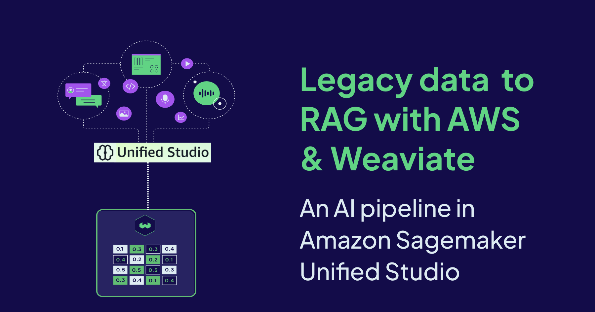

[](./img/hero.png)


Weaviate is an AI-native open source vector database that combines powerful search capabilities with enterprise reliability. It offers built-in [hybrid](https://weaviate.io/blog/hybrid-search-explained) (semantic + keyword) search, advanced filtering, out-of-the-box RAG capabilities, and all with sub-second query responses across hundreds of millions of vectors. It's flexible [plug-and-play modules](https://docs.weaviate.io/weaviate/concepts/modules) provide automatic embedding generation using state-of-the-art models. Available as a hosted service, self managed instance or as a fully managed [Weaviate Cloud](https://docs.weaviate.io/cloud) service, it also features multi-tenancy, vector compression, role-based access control, API key management and zero-downtime backups.

[Amazon Sagemaker Unified Studio](https://aws.amazon.com/sagemaker/unified-studio/) complements Weaviate's strengths by simplifying how teams access and prepare legacy data. Organizations are building data-driven AI applications to drive business decisions, innovation, and improve efficiencies. However, leveraging distributed data effectively for modern AI applications can be challenging. SageMaker Unified Studio addresses this challenge by helping you find, access, and query data along with AI assets across your organization. Teams can easily collaborate on projects to securely build and share analytics and AI artifacts using [Amazon SageMaker Catalog](https://aws.amazon.com/sagemaker/catalog/), including data, models, and generative AI applications. Built on an open lakehouse architecture that's fully compatible with Apache Iceberg, SageMaker unifies access to data across Amazon S3 data lakes, S3 Tables, and Amazon Redshift data warehouses, enabling organizations to build powerful analytics and AI applications on a single copy of data.

Weaviate and SageMaker Unified Studio together empower teams to build real-time generative AI applications powered by vector search and RAG. Whether you're a data scientist experimenting with embeddings, an ML engineer optimizing pipelines, or a developer building customer-facing applications, the integration lets you deploy your embedding models (custom or LLM-based) through SageMaker and seamlessly vectorize data in Weaviate.


The benefits of combining Weaviate and Sagemaker Unified Studio
- Flexibility with models - Use any custom or open source embedding model deployed to a SageMaker endpoint or within Bedrock. This includes AWS models like Titan and Nova, as well as proprietary models from OpenAI and Cohere.
- Scalable infrastructure - Both Sagemaker Unified Studio and Weaviate are designed to run and scale on AWS, allowing you to build and deploy production ready AI applications that can handle billions of vectors.
- End-to-end, integrated workflows.
- Rapid prototyping to production - Experiment in notebooks, validate with small datasets, then scale to production volumes without rewriting code or changing infrastructure.
- Multiple roles - Data analysts, scientists and ML engineers can collaborate easily through shared projects.
- Native access to data sources, ETL flows and jupyter notebooks for Spark jobs, along with other AI tools.
- Built-in governance and cataloging.
- Reduced operational friction as permissions and integrations are handled by the platform.


### Unlocking Insights From Customer Feedback 

Customer facing organizations across the aviation, retail, and hospitality sectors that engage with customers receive a lot of feedback from various channels - including surveys, social media, call logs, and review platforms. Legacy systems often struggle to efficiently process and interpret this vast amount of information, leading to significant challenges.

- Losing customer intent - Keyword searches fail to grasp the semantic meaning behind customer feedback. A customer complaining about "uncomfortable seating" might use phrases like "cramped legroom," "tight space," or "hard seats". Traditional keyword based analysis would struggle to group these related terms and lead to missed insights.
- Structured and unstructured data - Analysing reviews alongside flight schedules, passenger and operational data requires joining multiple SQL tables with text embeddings. Legacy systems struggle to handle this combination of data types efficiently.
- Context aware responses - Simple keyword matching retrieves documents with matching words, but it lacks context. RAG with vector search retrieves data based on semantic relevance, providing better context for generating responses.
- Complex searches - Answering a query like “find negative reviews on all transatlantic flights in the last quarter” often forces data analysts to write intricate SQL joins in conventional systems. Weaviate’s vector search combines semantic search with [metadata filtering and temporal search](https://docs.weaviate.io/weaviate/search/filters), turning complex analysis into simple API calls. 
- Rigid models - Switching between embedding approaches requires system reconfiguration and complete data reprocessing in traditional setups. Weaviate lets you reconfigure with easier strategies. 

For this demo, we shall work with an airline company that stores customer reviews in Lakehouse as it is simple, scalable and cost effective. This approach addresses critical customer service challenges prevalent across the aviation, retail and hospitality sectors, where organizations must analyze vast amounts of customer feedback to improve service quality and satisfaction. Customer reviews are invaluable for these industries, making them ideal use cases for semantic search and RAG upgrades. For sample data, we use airlines review data from the [Hugging Face dataset](https://huggingface.co/datasets/Alisairlines/Airline_Reviews). 

## Solution Architecture
Our solution architecture leverages three powerful technologies that directly address the above challenges. 

- **[SageMaker Lakehouse](https://aws.amazon.com/sagemaker/lakehouse/)**: uses an open lakehouse architecture with Apache Iceberg compatibility. It unifies data across Amazon S3 data lakes and Amazon Redshift warehouses, enabling analytics and AI/ML. This will serve as our data storage. 
- **[Amazon Bedrock](https://aws.amazon.com/bedrock/)**: Bedrock is a comprehensive, secure, and flexible platform for building generative AI applications and agents. We will utilize Bedrock’s embedding models to convert data into vector embeddings, which capture true semantic intent.
- **Weaviate**: Vector database for hybrid search and context aware [out-of-the-box RAG](https://docs.weaviate.io/weaviate/starter-guides/generative). With native support for text, images and structured data, Weaviate can capture the full spectrum of customer interactions.

We shall demonstrate an enterprise data pipeline within SageMaker Unified Studio, designed to seamlessly transition from traditional data storage to AI-powered applications. We shall import customer data stored in Lakehouse into a vector database, facilitating advanced semantic and RAG queries. Organizations choose S3 in Lakehouse because they can store massive amounts of data flexibly, scale effortlessly, and pay only for what they use. 

The notebook can be used to identify emerging customer satisfaction trends and review patterns through Weaviate's semantic (hybrid) searches. Additionally, Weaviate's RAG API can be used to retrieve relevant historical interactions and generate contextually appropriate customer responses.

The data flow is straightforward. Raw reviews stored in Lakehouse are processed in SageMaker Unified Studio and stored in Apache Iceberg tables in the Lakehouse. We are doing this step for efficient querying but not needed if your data already exists in Iceberg format. These reviews are then vectorized using embedding models hosted within Bedrock and indexed in Weaviate for semantic search and RAG queries. 

```
┌─────────────────┐    ┌─────────────────┐    ┌─────────────────┐    ┌─────────────────┐
│    Lakehouse    | →  |  Iceberg Tables | →  |    Weaviate     | →  | Semantic search |
|  (raw reviews)  │    │                 │    │                 │    │    + RAG        │
└─────────────────┘    └─────────────────┘    └─────────────────┘    └─────────────────┘
```
### Prerequisites   

- Amazon SageMaker Unified Studio environment
- Weaviate Cloud account
- AWS Bedrock access (for embeddings and generation)
- Airline Reviews dataset from Hugging Face

### SageMaker Lakehouse

For the purposes of this demo, we assume that the reviews have already been saved in [Lakehouse](https://aws.amazon.com/sagemaker/lakehouse/), under the root folder of our project `{project.s3.root}/reviews`. 

```python
from sagemaker_studio import Project

project = Project()

catalog = project.connection().catalog()
project_database = catalog.databases[0].name

tbl_name  = "product_reviews_v1"
data_path = f"{project.s3.root}/reviews"

```
Define table schema in Iceberg for efficient querying 

```python
spark.sql(f"""USE {project_database}""")
spark.sql(f"""DROP TABLE IF EXISTS {tbl_name}""")

spark.sql(f"""
    CREATE TABLE IF NOT EXISTS airline_reviews (
        review_id string, 
        airline string,
        product_id string,
        customer_id string,
        rating string,
        luggage int,
        staff int,
        cabin int,
        review_text string
    )
    USING iceberg
    LOCATION '{project.s3.root}/reviews'
""")
```
Seamlessly transfer data from Lakehouse to Iceberg
```python
raw_df = spark.read.option('delimiter',',').csv(data_path, header=True, inferSchema=True)
raw_df.write.format("iceberg").mode("append").saveAsTable(f"{project_database}.{tbl_name}")

df = spark.read.table(f"""{tbl_name}""")
df.show()
```

### Weaviate Collection

Weaviate offers [multiple deployment options](https://docs.weaviate.io/deploy) to satisfy your specific use case. In the example below, we are establishing a connection to [Weaviate Serverless Cloud](https://weaviate.io/deployment/serverless). Weaviate Cloud [quickstart](https://docs.weaviate.io/cloud/quickstart#11-create-a-cluster) will help you set up a cloud account and get started in minutes. For more deployment options and tutorials on how to connect, please refer to the docs. 

```python
import weaviate
import weaviate.classes as wvc

weaviate_client = weaviate.connect_to_weaviate_cloud(
    cluster_url=[WEAVIATE_CLOUD_URL],
    auth_credentials=weaviate.auth.AuthApiKey([WEAVIATE_API_KEY]),
    headers={
        "X-AWS-Access-Key": [AWS_ACCESS_KEY],
        "X-AWS-Secret-Key": [AWS_SECRET_KEY],
    }
)
```
Next, we create a collection with AWS Bedrock models for vectorization and RAG. For more information on the different properties of a vectorizer and your specific model, please refer to the docs [here](https://docs.weaviate.io/weaviate/manage-collections/vector-config). Likewise, the [generative config](https://docs.weaviate.io/weaviate/manage-collections/generative-reranker-models) docs will provide you more configuration options for your generative model.
```python
weaviate_client.collections.create(
    name='Airline_Reviews',
    vector_config=wvc.config.Configure.Vectors.text2vec_aws(
        service="bedrock",  
        model="amazon.titan-embed-text-v2:0",
        region="us-west-2",
        vectorize_collection_name=False,
    ),
    properties=[
        wvc.config.Property(name="review_id", data_type=wvc.config.DataType.TEXT),
        wvc.config.Property(name="airline", data_type=wvc.config.DataType.TEXT),
        wvc.config.Property(name="product_id", data_type=wvc.config.DataType.TEXT),
        wvc.config.Property(name="customer_id", data_type=wvc.config.DataType.TEXT),
        wvc.config.Property(name="rating", data_type=wvc.config.DataType.INT),
	    wvc.config.Property(name="cabin", data_type=wvc.config.DataType.INT),
	    wvc.config.Property(name="luggage", data_type=wvc.config.DataType.INT),
        wvc.config.Property(name="staff", data_type=wvc.config.DataType.INT),
        wvc.config.Property(name="review_text", data_type=wvc.config.DataType.TEXT)
    ],
    generative_config=wvc.config.Configure.Generative.aws(
        region="us-west-2",
        service="bedrock",
        model="amazon.titan-text-lite-v1"
    )
)
```

### Lakehouse to Weaviate
Transfer data from our Iceberg table to Weaviate using batch operations
```python
def save_reviews_to_weaviate(client, df):
    reviews_collection = client.collections.get('Airline_Reviews')
    
    with reviews_collection.batch.dynamic() as batch:
        for _, row in df.iterrows():
            review_obj = {
                "review_id": row['review_id'],
                "airline": row['airline'],
                "product_id": row['product_id'],
                "customer_id": row['customer_id'],
                "rating": int(row['rating']),
                "cabin": int(row['cabin']),
                "luggage": int(row['luggage']),
                "staff": int(row['staff'], 
                "review_text": row['review_text']
            }
            batch.add_object(review_obj)
reviews_saved = save_reviews_to_weaviate(weaviate_client, df)
```
### Hybrid Search

Hybrid search combines:
- BM25 (keyword matching): Fast, traditional search
 - Vector similarity: Semantic understanding
```python
response = reviews_collection.query.hybrid(
    limit=5,
    alpha=0.5,  # Balance between BM25 and vector search
    query="poor service",
    filters=(
        wvc.query.Filter.by_property("rating").less_than(3)
    ),
    return_metadata=wvc.query.MetadataQuery(score=True),
)

for obj in response.objects:
    print(f"Product: {obj.properties['product_id']}")
    print(f"Review: {obj.properties['review_text']}")
    print(f"Relevance Score: {obj.metadata.score}")
```
An alpha parameter of 0.5 balances traditional and AI-powered search. With the hybrid search shown above:
- a query like "uncomfortable seating" will match exact keyword mentions (BM25) AND semantically similar phrases like "cramped legroom" or "tight space"
- ensure we only retrieve low-rated reviews with the filters

Weaviate lets you configure your hybrid search results by providing additional parameters like [object rankings](https://docs.weaviate.io/weaviate/search/hybrid#explain-the-search-results) and [query weights](https://docs.weaviate.io/weaviate/search/hybrid#set-weights-on-property-values). For a full list of query options, check the docs [here](https://docs.weaviate.io/weaviate/search/hybrid). You can also find end-to-end notebooks on using hybrid search in [Weaviate Recipes](https://github.com/weaviate/recipes/tree/main/weaviate-features)!

### RAG 

Using retrieved reviews to generate informed analysis with the correct context.
```python
instruction = """
Based on the retrieved customer reviews, create a professional summary 
highlighting the main concerns.
"""

response = reviews_collection.generate.hybrid(
    limit=10,
    query='service complaints',
    grouped_task=instruction,  
)

print(response.generative.text)
```
Sample output:
"Based on analysis of recent service complaints, three primary issues emerge: cabin crew responsiveness (mentioned in 45% of negative reviews), meal quality concerns (32%), and boarding process delays (28%)."

## Next steps 
Weaviate can scale horizontally as data volumes grow. In this workshop, while we used batch ingrestion, we could also implement streaming to ingest reviews in real-time. To capture critical feedback immediately, apps could also add notifications with SNS and Cloudwatch alarms
## Conclusion
Once you learn how to harness your data with vector databases, you can use them to improve queries in various parts of your application. For example, identifying patterns and detecting trends in customer feedback can also be used internally by teams to improve product roadmaps. By combining Amazon SageMaker Unified Studio's data management capabilities with Weaviate's semantic search and RAG features, companies can transform customer feedback from a compliance checkbox into a strategic asset. The architecture we've built processes reviews at scale, understands context beyond keywords, and generates actionable insights, all while maintaining production grade reliability.


import WhatsNext from '/_includes/what-next.mdx'

<WhatsNext />
