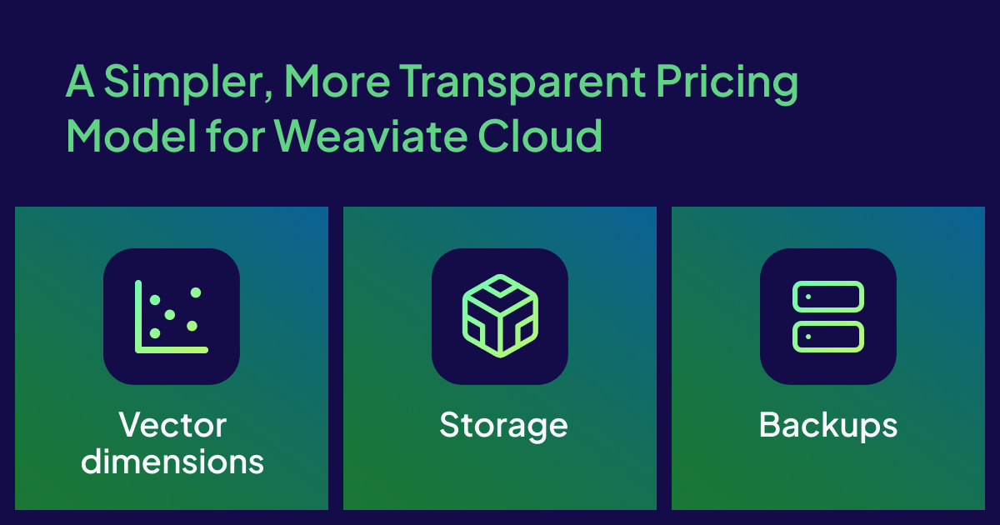

We’re introducing a new pricing model for Weaviate Cloud, built to be easier to understand, more flexible, and better aligned with how you use our platform. Whether you’re experimenting with a new idea or running business-critical workloads, our goal is to give you clear choices, predictable costs, and the freedom to scale. Main changes and improvements at a glance:

* **New names, clearer services**: Serverless Cloud becomes Shared Cloud; Enterprise Cloud becomes Dedicated Cloud  
* **Expanded pricing dimensions**: Beyond vector dimensions, pricing dimensions will now include storage and backups and reflect regional pricing variations  
* **Pricing model consistency across deployments**: Same pricing dimensions apply to both Shared and Dedicated Cloud  
* **Flexible payments**: Pay-as-you-go or annual commitments on Shared Cloud  
* **Three new plans**: Packaged features and services to fit different needs, all with highly available clusters

The new pricing takes effect on **October 27, 2025** for new customers. Existing annual and multi-year contracts will adopt the model at renewal. Existing pay-as-you-go customers will receive details via email about their transition timeline. Existing customers will benefit from the following changes:

* Those on highly available clusters will benefit from the same guaranteed uptime at a lower monthly minimum.  
* Those on clusters that were not highly available will see prices increase as all clusters move to HA by default, gaining better uptime and performance.  
* Configuration choices now play a bigger role in costs: compression methods and regional deployment options are reflected directly in pricing, with new savings available where enabled.

## Why the Change?

Our customers told us they wanted pricing that matches their actual usage and makes it easier to plan ahead. The updated pricing dimensions (vector dimensions, storage, and backups) bring more transparency and flexibility, while also aligning pricing with metrics that the user controls.

In practice, this means costs that scale with the way you use Weaviate, more options for managing spend, whether you prefer the flexibility of on-demand or the predictability of annual commitments, and a simpler, more consistent experience across Shared and Dedicated Cloud.

## Three Pricing Dimensions

We have three pricing dimensions that track directly to your workloads:

1. **Vector dimensions** are calculated by multiplying the number of objects by the vector dimensionality of each index. This value is further multiplied by the replication factor to account for data replicas. Pricing for vector dimensions varies by the index type (HNSW vs Flat) and compression (vector quantization) method.  
2. **Storage** refers to the total disk space used by your clusters to store vector indexes, metadata, object properties, and other database states.  
3. **Backups** capture the volume of stored snapshots and backups retained over time. This usage is determined by the total size of your backed-up collections and the retention period you configure.

List prices for all pricing dimensions vary by Cloud provider and region. 

### How this differs from today:

Storage and backups are new pricing dimensions. 

Vector dimensions, already in use, now reflect collection replication factors and pricing differences by index type, compression, provider, and region. This means customers who use flat indexes, enable compression, or run in lower-cost regions will see those savings directly on their invoices. 

Dedicated Cloud also now uses the same metric-based billing as Shared Cloud, making it easier to compare deployments and switch between them without pricing model changes. 

## Three New plans

Weaviate Cloud now offers three plans that fit different stages of your application lifecycle. OSS installations remain an option if you prefer to self-manage, but Cloud gives you the most flexibility from POC to production, where all paid plans feature highly available clusters with a minimum uptime of 99.5%.

**Flex**  
Our most versatile pay-as-you-go plan. Includes all core database features, built-in RBAC, AI-native services like Embeddings and Agents, automated upgrades, and 99.5% uptime on Shared Cloud. Starts at $45/month. 

**Plus**  
Everything in Flex, plus annual commitment options, enhanced security, stronger SLAs, and the choice of Shared or Dedicated deployments with 99.9% uptime. Starts at $280/month. 

**Premium**  
For teams with the highest requirements around security, compliance, and performance. Dedicated infrastructure with business-critical SLAs and priority response with 99.95% uptime. Monthly minimums vary by configuration.

### How this differs from today:

Previously, not all Shared clusters were highly available; some could experience interruptions. Going forward, all new Shared clusters will be HA, with uptime improved to at least 99.5%. 

Pricing has also shifted: non-HA clusters started at $25/month and HA clusters at $75/month; now every Shared cluster benefits from high availability at a lower entry price of $45/month. 

Annual commitments, once limited to Dedicated clusters, are now offered through the Plus plan for both Shared and Dedicated deployments. Finally, SLAs are no longer unbundled extras, but are instead built into plans, making reliability and response times part of the package.

For more details, see [Weaviate Pricing](https://weaviate.io/pricing).

## More Visibility Into Costs

We’ve also updated the Weaviate Cloud console so you can see **real-time cost estimates** of your running clusters, with insights into different pricing dimensions, regional rates, as well as add-on services.

![Running costs][./img/hero.png]

You can also use our new [**pricing calculator**](https://weaviate.io/pricing#calculator) to forecast spend based on your usage characteristics before you commit to a plan.

![Pricing calculation][./img/hero.png]

## Looking Ahead

This new model lays the foundation for Weaviate Cloud to grow with you. We’re excited to roll it out and hear your feedback. Visit [Weaviate Pricing](https://weaviate.io/pricing) for more details or contact us at [product@weaviate.io](mailto:product@weaviate.io) if you have further questions. 

import WhatsNext from '/_includes/what-next.mdx'

<WhatsNext />
