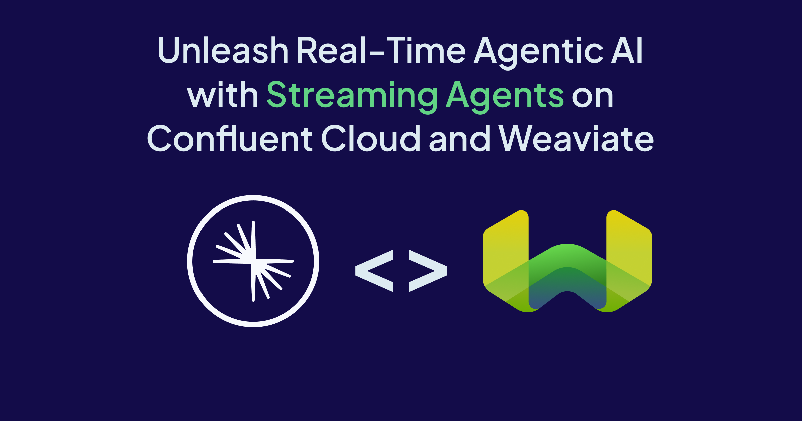

We’re thrilled to be partnered with Confluent today as they announce the new features for [Streaming Agents](https://www.confluent.io/product/streaming-agents/) on Confluent Cloud and a new Real-Time Context Engine. Unifying data processing and agentic AI workflows, Streaming Agents enable developers to build, deploy, and orchestrate event-driven agents using fully managed Apache Flink® and Apache Kafka® on a unified platform. 

Paired with Weaviate’s vector database, this brings together the power of real-time streaming and semantic search — enabling agents to retrieve, reason, and act on both live and historical data. The new [Weaviate Kafka Connector](https://www.confluent.io/hub/Weaviate/kafka-connect-weaviate) further strengthens this integration by seamlessly ingesting data from Confluent topics into Weaviate, turning streams into searchable, context-rich memory in real time.

As a Confluent Partner, we see firsthand why the introduction of Streaming Agents was so critical. At its core, every AI problem is a data problem. When data is stale, incomplete, or inaccessible, even the most sophisticated agents and Large Language Models (LLMs) can't deliver reliable results. 

This is exactly what the market demanded: a solution for building scalable multi-agent systems that are event-driven, replayable, and grounded in fresh, contextualized data. Developers needed a single platform that didn't just provide isolated tools, but one that enabled them to easily source data, reliably move from  prototype to production, and gain the necessary observability to debug, evaluate, and iterate on what's actually happening inside their agents.

## Streaming Agents Power Intelligent, Context-Aware Automation

Embedded in data streams with access to the latest, most complete and accurate view of operational events, Streaming Agents effectively act as the eyes and ears of the business. They’re designed to handle high-volume real-time data and evolving context, making them ideal for enterprise use cases where fresh information, accuracy, and observability are critical. By continuously monitoring data streams and using context from diverse sources, Streaming Agents can make intelligent, informed decisions and automate actions that drive better outcomes. 

High-value use cases include: 
* **Real-time fraud prevention** – Continuously ingest and process transaction data, detect anomalies, and automatically block suspicious activity.   
* **Dynamic customer support** – Pull live context from CRM systems, chat interactions, and knowledge bases to deliver in-the-moment personalized and accurate responses.   
* **Intelligent supply chain optimization** – Track inventory, shipments, and demand signals in real time, automatically reordering stock, rerouting shipments, or adjusting production schedules based on live conditions. 

For these use cases to work, agents need more than just event data, they need context.

Using the Weaviate Kafka Connector, developers can continuously vectorize and store Kafka events as they occur, allowing agents to access a semantic understanding of past and present information. This combination lets businesses automate decisions that are both real-time and contextually grounded.

## What’s New in the Q4’25 Release:

With Streaming Agents, every engineer can use familiar Flink APIs to build secure and trustworthy agents, with native support for Model Inference, Tool Calling with MCP, Embeddings for RAG, Built-in ML Functions, External Tables and Search, and Connections. Confluent is continuing to expand on these capabilities and deliver more streamlined developer experiences.

* **Agent Definition** – Quickly build agents in just a few lines of code and unlock more sophisticated tasks with better outcomes by iteratively evaluating and adapting tool calling.   
* **Observability and Debugging** – Gain visibility into all agent actions, easily diagnose issues to accelerate resolution, and reliably recover from failure.    
* **Real-Time Context Engine** – Using MCP, serve fresh context to Streaming Agents as well as any other AI agent and application to improve decision-making and the quality of outputs. 

## Get Started with Streaming Agents

By bringing data processing and AI workflows together, Streaming Agents make it easier than ever to build intelligent agents that are event-driven, observable, and context-aware. Keep and get more out of your AI stack by seamlessly integrating Streaming Agents with any data system, model and tool using familiar Flink APIs on top of a secure, governed data streaming platform.

Start building real-time, context-aware agents today with Streaming Agents on Confluent Cloud and Weaviate. Use the Weaviate Kafka Connector to stream your data into Weaviate in minutes, and empower your agents to think, act, and learn with both real-time and semantic context.

Learn more about Confluent’s [Streaming Agents](https://www.confluent.io/product/streaming-agents/) and try the [Streaming Agents Quickstart](https://github.com/confluentinc/quickstart-streaming-agents/). 

import WhatsNext from '/_includes/what-next.mdx'

<WhatsNext />
