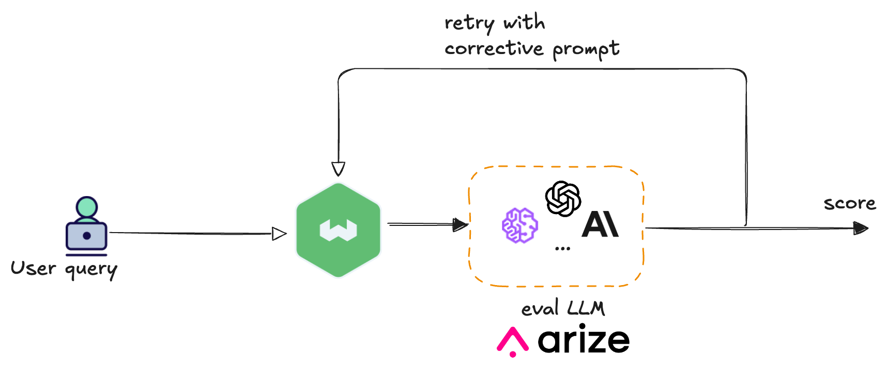

In [Part 1](https://weaviate.io/blog/evals-guardrails-enterprise-workflows-1) of this series, we explored why enterprises must integrate models into their workflows to remain competitive and maximize ROI. We examined examples, from trading to fraud detection, to highlight the potential downfalls of inaction. However, as these autonomous systems scale and new functionalities are introduced, the potential for unforeseen and unintended consequences can grow exponentially. In linear multi-agent systems, errors from one agent can cause irreversible damage if not corrected. Additional security measures would be crucial for new growth. Therefore, we established the fundamental principles of evaluations and guardrails, emphasizing their importance when a model is responsible for subsequent actions or operates within multi-agent systems.

[Part 2](https://weaviate.io/blog/evals-guardrails-enterprise-workflows-2) showcased a hands-on implementation of LLM-as-Judge, a pattern that utilizes one large language model (LLM) to evaluate the output generated by another LLM. The primary objective of this evaluation is to assess the quality, relevance, and overall effectiveness of the generated content, ensuring it meets our standards and operates within defined constraints. This flexible pattern can detect issues such as hallucination or incorrect responses. Once an issue is identified through evaluation, the subsequent step is to determine the appropriate response. In this blog post, we will explore a pattern where the system can dynamically learn from errors and autonomously correct itself in real time.

Evaluation tools help us measure, score, and flag issues for analysis. A common approach is to treat evals as a passive monitoring system: log the scores, send them to a dashboard, and review them offline to inform future model improvements. This is valuable but inherently reactive. A proactive architecture treats an evaluation as a real-time actionable event. It wires the output of the evaluator directly back into the control flow of the application, creating a self-correcting loop that can resolve issues before the user ever sees them. The eval signal could be used to retry the previous step with a safer prompt, use additional retrieval filters, block downstream actions, route to a human, or fall back to a templated response. Such a pattern could be called **behavior shaping** or self correcting - when the model evaluates itself.


## Behavior Shaping: The Adaptive Safety Net

Behavior shaping is a three-step loop: scoring, feedback, and correction. 
- Scoring: First, we evaluate the model's response against application-specific criteria. Depending on the use case, this might check for hallucinations, policy violations, tone mismatches, or incomplete answers. The evaluator produces a score that indicates whether the output is acceptable or needs correction.
- Feedback: Second, based on the evaluation, we generate specific corrective guidance. If the model invented facts, we craft a stricter prompt emphasizing grounding in the context. If it was too verbose, we add constraints and direct it to be concise. If it missed key information, we explicitly direct it to address those gaps. The feedback is targeted with precise instructions on what to fix.
- Correction: Third, we retry the original request with the updated prompt, giving the model a second chance to produce a better output before it reaches the user. 


### Enhancing Evaluation with External Rewards Services

To make the scoring step more powerful, we can also use an external rewards service to guide the evaluation. The service could contain the specific business logic that defines what is high-risk or most desirable (like including source citations) for the application. 

Consider an autonomous customer service chatbot built on RAG: a user asks a question, the system retrieves relevant FAQs from a vector database, and a language model generates a natural language response based on those retrieved documents. Now we need to evaluate whether that generated response is good enough to send to the user. This is where the evaluator and rewards service work together. The evaluator receives three inputs: the user's original question, the retrieved FAQ context, and the chatbot's generated response. Before assigning a final score, the evaluator queries the rewards service, passing along these details. 

[](./img/rewards.png)

For example, the rewards service could use the following business rules:

"Did the chatbot ask a clarifying question when user intent was ambiguous?" → +2 reward

"Did the response attempt to give financial advice outside approved FAQs?" → -5 high-risk penalty

"Did the response include source citations?" → +1 reward


The evaluator incorporates these external signals to produce a final, context-aware score. This architecture cleanly separates the general task of evaluation from the specific, and often changing, business rules that define success. 

### Why This Pattern Matters

Behavior shaping transforms your static guardrails in AI applications into adaptive systems. Instead of blocking every potentially problematic input with rigid rules, we allow the system to attempt tasks, evaluate the results, and adjust its approach based on what actually happened. Over time, by monitoring evaluation scores and success rates, you can identify which corrected prompts consistently produce better outputs. These high-performing prompts can then be promoted to become the new baseline instructions for your application. 

The need for this pattern is especially critical in RAG applications, where models generate answers based on retrieved context. A hallucinating RAG application can be dangerous - especially in high risk industries. Think of a medical assistant inferring a dosage that isn’t present in the notes, or a financial assistant inventing a filing deadline. These problems are not uncommon; they represent typical implementation failures that can damage user trust and create real liabilities.

Behavior shaping is also critical for applications dealing with volatile external states - real world conditions that can change rapidly and unpredictably, like market volatility, weather patterns, API health, or system load. In enterprise applications, models often consume these external signals as inputs when generating responses. A trading bot, for example, receives market data feeds and volatility indicators to inform its buy/sell recommendations. However, even with access to correct signals, the model can misinterpret them, apply flawed reasoning, or generate recommendations that don't properly account for current risk levels. These conditions directly affect whether a model's output is safe and appropriate to execute. 

Consider a trading bot that has access to a market volatility API showing the VIX index at 42 (extreme market stress). The bot might still generate an aggressive leveraged trade recommendation - perhaps it weighted historical patterns too heavily, or misunderstood the severity of the current volatility. The evaluator's job is to independently verify the bot's decision against those same external conditions: "Given that VIX is at 42, does this trade recommendation make sense?" If not, it gets flagged as high-risk, heavily penalized in scoring, or blocked entirely. 

Similarly, a logistics agent might have weather data showing severe storms, yet still recommend a route through that region due to optimization logic that prioritized speed over safety. The evaluator rechecks the weather conditions and catches the mistake before the dangerous route gets executed.

The evaluator isn't introducing new signals—it's providing a sanity check to ensure the model correctly interpreted the external state it was given. The rewards service can encode these verification rules by integrating with the same external monitoring systems:

- Operational constraints: Maximum trade volumes, spending limits, execution timeouts
- API safety: Rate limit compliance, domain whitelisting, request validation
- External state monitoring: Market volatility thresholds, system health checks, dependency availability

### State Management and Rollback Mechanisms

In some cases, catching a bad output before it reaches the user is sufficient. But in enterprise systems, models could perform actions that affect system state eg. writing to databases, calling external APIs, initiating transactions etc. When these actions put the application in an undesirable state, simply preventing future bad outputs isn't enough. You need rollback mechanisms to undo what was already done. 

Beyond scoring and providing feedback for retries, the evaluator can also be architected with the authority to trigger rollback procedures directly. When it detects that a model's actions have violated safety constraints or produced incorrect results, it can actively invoke the rollback mechanisms to restore the system to a safe state. 

For example, if an evaluator detects that a financial transaction was executed with an incorrect amount, it can automatically trigger a compensating transaction to reverse the operation. If it catches a multi-agent workflow propagating bad data, it can halt execution and rollback all state changes made so far. This makes the evaluator not just a measurement tool, but an active safety controller with the power to undo damage in real-time.


### Flexible Reconfiguration

The feedback loop enables mid-course corrections without requiring system redeployment. Behavior shaping isn't about catching every possible failure upfront. It's about building systems that detect problems as they happen, understand what went wrong, and automatically correct course before damage propagates. We have discussed patterns that can steer your AI system towards desired outcomes. Let's see how this works in practice with a concrete implementation.

## Implementation Example

Let's build a RAG system with hallucination detection and automatic correction. This example demonstrates an e-commerce FAQ assistant where customers ask questions about policies, shipping, and returns. Weaviate handles the RAG functionality, retrieving relevant FAQ entries from the knowledge base and using a generative model to create natural language answers based on the retrieved context. [ArizeAI's](https://arize.com/) hallucination evaluator checks whether the generated answer is grounded in the retrieved context or invents information. When hallucination is detected, the system automatically retries with an anti-hallucination prompt.

```
  ┌─────────────────┐    ┌────────────────────┐    ┌────────────────────┐
  │   User query    │ →  │      Weaviate      │ →  │    Arize Phoenix   │
  │ "return policy" │    │   RAG (retrieve    │    │      evaluates     │
  │                 │    │    + generate)     │    │    hallucination   │
  └─────────────────┘    └────────────────────┘    └────────────────────┘
                                ↑                       │
                                │                       ↓
                                │              hallucinated?
                                │                       │
                                └───── retry with ──────┘
                                    enhanced prompt
```

Weaviate is an [ISO27001](https://weaviate.io/blog/weaviate-iso-compliant) certified open source vector database with built-in hybrid search, advanced filtering, and out-of-the-box [RAG](https://weaviate.io/blog/introduction-to-rag) capabilities. Features include flexible plug-and-play modules, zero-downtime backups, multi-tenancy, vector compression, and tenant isolation for secure, scalable ML applications.

Arize AI provides an AI observability and evaluation platform that helps companies monitor, debug, and improve their machine learning and LLM applications. It is used for both traditional ML models and complex LLM-based systems, offering features for model tracking, performance analysis, and LLM-specific evaluations like hallucination and prompt effectiveness. 

Together, these tools create a self-correcting RAG pipeline that catches and fixes hallucinations before they reach users.

[](./img/arizeflow.png)

---

### Prerequisites

The example uses Python and assumes familiarity with [RAG architectures](https://docs.weaviate.io/weaviate/starter-guides/generative) and [evaluation frameworks](https://arize.com/llm-evaluation/). If you're new to these tools, we recommend reviewing the [Weaviate quickstart](https://weaviate.io/developers/weaviate/quickstart) and [Arize AI documentation](https://arize.com/docs/ax/quickstarts) first. We shall use AWS Bedrock Titan for RAG generation within Weaviate and OpenAI for evaluating the RAG responses in ArizeAI. 

Before starting, ensure you have the following:
- API Keys: Set up authentication for your chosen LLM (for embeddings and generation) and configure API keys in your environment
- Weaviate Setup: Follow the [Weaviate quickstart guide](https://docs.weaviate.io/weaviate/quickstart) to set up a Weaviate instance. Weaviate offers [multiple deployment options](https://docs.weaviate.io/deploy) to satisfy your specific use case. In the example below, we are establishing a connection to [Weaviate Serverless Cloud](https://weaviate.io/deployment/serverless).  
- Arize AI account: Get started with an ArizeAI account here(https://arize.com/sign-up/). 

### Installation

Install required dependencies:

```python
%pip install -q arize-phoenix-evals openai weaviate-client datasets huggingface-hub
```

### Weaviate Collection

Weaviate Cloud [quickstart](https://docs.weaviate.io/cloud/quickstart#11-create-a-cluster) will help you set up a cloud account and get started in minutes. For more deployment options and tutorials on how to connect, please refer to the docs. 

```python
import weaviate
import weaviate.classes as wvc

weaviate_client = weaviate.connect_to_weaviate_cloud(
    cluster_url=[WEAVIATE_CLOUD_URL],
    auth_credentials=weaviate.auth.AuthApiKey([WEAVIATE_API_KEY]),
    headers={
        "X-AWS-Access-Key": [AWS_ACCESS_KEY],
        "X-AWS-Secret-Key": [AWS_SECRET_KEY],
        "X-OpenAI-Api-Key": [OPENAI_KEY],
    }
)
```
Next, we create a collection with AWS Bedrock models for vectorization and RAG. For more information on the different properties of a vectorizer and your specific model, please refer to the docs [here](https://docs.weaviate.io/weaviate/manage-collections/vector-config). Likewise, the [generative config](https://docs.weaviate.io/weaviate/manage-collections/generative-reranker-models) docs will provide you more configuration options for your generative model.

```python
from weaviate.classes.config import Configure, Property, DataType

weaviate_client.collections.create(
    name='EcommerceFAQ',
    vector_config=wvc.config.Configure.Vectors.text2vec_aws(
        service="bedrock",  
        model="amazon.titan-embed-text-v2:0",
        region="us-west-2",
        vectorize_collection_name=False,
    ),
    properties=[
        Property(name="question", data_type=DataType.TEXT),
        Property(name="answer", data_type=DataType.TEXT),
        Property(name="category", data_type=DataType.TEXT),
        Property(name="parent_category", data_type=DataType.TEXT),
        Property(name="question_id", data_type=DataType.TEXT),
        Property(name="category_id", data_type=DataType.TEXT),
    ],
    generative_config=wvc.config.Configure.Generative.aws(
        region="us-west-2",
        service="bedrock",
        model="amazon.titan-text-express-v1"
    )
)
```

### Load and Import FAQ Data

Load the [E-Commerce FAQ](https://huggingface.co/datasets/NebulaByte/E-Commerce_FAQs) dataset from HuggingFace and import it into Weaviate:

```python
dataset = load_dataset("NebulaByte/E-Commerce_FAQs")
faq_data = dataset['train'].to_pandas()
print(f"Dataset loaded: {len(faq_data)} FAQ entries")

print("Importing FAQ data...")
with weaviate_client.batch.dynamic() as batch:
    for idx, row in faq_data.iterrows():
        batch.add_object(
            collection=collection_name,
            properties={
                "question": row["question"],
                "answer": row["answer"],
                "category": row["category"],
                "parent_category": row["parent_category"],
                "question_id": str(row["question_id"]),
                "category_id": str(row["category_id"])
            }
        )
```

### Weaviate RAG 

This function handles the core RAG workflow - retrieving relevant documents related to the user query and then asking an LLM to generate the answer after saving the retrieved documents in the context. It returns a dictionary with the answer and context which shall be used by the evaluator in ArizeAI

```python
from weaviate.classes.config import Configure
from weaviate.classes.generate import GenerativeConfig

def weaviate_rag(question: str, generative_prompt: str, limit: int = 3) -> Dict:
    try:
        response = faq_collection.generate.hybrid(
            query=question,
            limit=limit,
            grouped_task=generative_prompt,
            return_metadata=["score"]
        )
        
        context_items = []
        for obj in response.objects:
            context_items.append(
                f"Q: {obj.properties['question']}\n"
                f"A: {obj.properties['answer']}\n"
                f"Category: {obj.properties['category']}"
            )
        
        context = "\n\n---\n\n".join(context_items)
        answer = response.generated if response.generated else ""
        
        return {
            "answer": answer,
            "context": context
        }
        
    except Exception as e:
        return {
            "answer": f"Error occurred: {str(e)}",
            "context": ""
        }
```

### Hallucination Evaluator

Set up Arize evaluation model. 

```python
eval_judge_model = OpenAIModel(
    model="gpt-4o", 
    temperature=0, 
    api_key=openai_key
)
```

Create a hallucination detection template that checks whether generated answers stay grounded in the provided context. The template explicitly defines what constitutes hallucination versus acceptable behavior.

```python
RAG_HALLUCINATION_TEMPLATE = '''
You are evaluating whether an AI assistant's response contains hallucinated information when answering a question based on provided context.

[BEGIN DATA]
************
[Question]: {question}
************
[Context]: {context}
************
[Response]: {answer}
[END DATA]

Evaluate if the response contains information that is NOT supported by the provided context.

Hallucination occurs when:
- The response includes facts, numbers, or details not found in the context
- The response makes claims that contradict the context
- The response invents specific information not mentioned in the context

NOT hallucination when:
- The response says it doesn't have enough information
- The response only uses information from the context
- The response makes reasonable inferences clearly based on the context

Your answer must be a single word: "hallucinated" or "factual".
'''
```

Define the function that shall check if Weaviate's RAG response contained any hallucination. In this funciton, we send the user's question, weaviates RAG answer and the context that Weaviate used to generate the RAG response, to the evaluator model.  The `llm_classify` function uses the evaluation model to classify each response as "hallucinated" or "factual" and provides an explanation of its reasoning.

```python
def evaluate_hallucination_in_RAG_response(question: str, answer: str, context: str) -> Dict:
    user_query_df = pd.DataFrame({
        "question": [question],
        "answer": [answer],
        "context": [context]
    })
    
    # Run hallucination evaluation using llm_classify
    eval_result = llm_classify(
        data=user_query_df,
        template=RAG_HALLUCINATION_TEMPLATE,
        model=eval_judge_model,
        rails=["hallucinated", "factual"],
        provide_explanation=True
    )
    
    result = eval_result.iloc[0].to_dict()
    
    if 'explanation' in result:
        print(f"  Explanation: {result['explanation']}")
    
    return result
```

### Behavior Shaping Loop

This is where we detect hallucination and attempt to fix it by correcting the prompt and retrying. When `eval_result["label"] == "hallucinated"`, instead of returning the failed response, we construct a new prompt. The `retry_prompt` takes the original `base_prompt` and adds a warning that explicitly tells the model its previous response was flagged for hallucination. We then call Weaviate RAG again with this enhanced prompt that includes specific feedback about what went wrong. After the retry, we run the hallucination evaluator again to check if the correction worked. If the new response passes evaluation, we return it. If it still fails after hitting `max_retries`, we return the last attempt with metadata showing it failed. This way, you always know whether the final output passed the hallucination check.

```python
def complete_rag_with_hallucination_check(question: str, max_retries: int = 1) -> Dict:
    attempts = []
    
    base_prompt = """
    You are a helpful e-commerce customer service assistant. Answer the user's question based ONLY on the provided context from the FAQ database.
    
    IMPORTANT RULES:
    - Only use information from the provided FAQ context
    - Be concise and helpful
    - Don't make up information that's not in the context
    """
    
    print(f"Attempt 1:")
    
    # First attempt with base prompt
    weaviate_result = weaviate_rag(question, base_prompt)   
    rag_result = {
        "question": question,
        "answer": weaviate_result["answer"],
        "context": weaviate_result["context"]
    } 
    print(f"Generated answer: {rag_result['answer']}")
    
    print("Evaluating for hallucination...")
    eval_result = evaluate_hallucination_in_RAG_response(
        question=rag_result["question"],
        answer=rag_result["answer"],
        context=rag_result["context"]
    )  
    attempts.append({
        "attempt": 1,
        "rag_result": rag_result,
        "eval_result": eval_result
    }) 
    print(f"Evaluation result: {eval_result['label']}")
    
    retry_count = 0
    while eval_result["label"] == "hallucinated" and retry_count < max_retries:
        retry_count += 1
        print(f"\nHallucination detected! Retrying (Attempt {retry_count + 1})...")
        
        # Anti-hallucination instruction to base prompt
        retry_prompt = base_prompt + """
        
        CRITICAL WARNING:
        Your previous response was flagged as potentially containing hallucinated information.
        Be EXTREMELY careful to only use information explicitly stated in the provided context.
        If you cannot find the answer in the context, clearly state that you don't have enough information.
        Do NOT add any information that is not directly mentioned in the context.
        """
        
        # Retry with enhanced prompt
        weaviate_result = weaviate_rag(question, retry_prompt)       
        rag_result = {
            "question": question,
            "answer": weaviate_result["answer"],
            "context": weaviate_result["context"]
        }      
        print(f"New answer: {rag_result['answer']}")
        
        print("Re-evaluating for hallucination...")
        eval_result = evaluate_hallucination_in_RAG_response(
            question=rag_result["question"],
            answer=rag_result["answer"],
            context=rag_result["context"]
        )
        
        attempts.append({
            "attempt": retry_count + 1,
            "rag_result": rag_result,
            "eval_result": eval_result
        })
        
        print(f"Re-evaluation result: {eval_result['label']}")

    final_result = {
        "question": question,
        "final_answer": rag_result["answer"],
        "final_evaluation": eval_result,
        "total_attempts": len(attempts),
        "hallucination_resolved": not eval_result["label"] == "hallucinated",
        "all_attempts": attempts
    }
    
    if eval_result["label"] == "hallucinated":
        print(f"\nFinal result: Hallucination still detected after {max_retries} retries")
    else:
        print(f"\nFinal result: Answer is factual (resolved in {len(attempts)} attempt{'s' if len(attempts) > 1 else ''})")
    
    return final_result
```

### Test the System

Run the complete workflow with some sample questions. The test suite includes normal questions that should have good FAQ matches, plus an edge case ("space program") that's completely irrelevant to e-commerce. This tests whether the system correctly identifies when it lacks information versus when it hallucinates.

```python
test_questions = [
    "What should I do if I missed my delivery?",
    "Can I use my saved cards on mobile app?",
    "How do I return a product?",
    "What is your refund policy for electronics?",
    "Can you tell me about your space program?"  # Edge case: completely irrelevant
]
print("Testing RAG workflow with sample questions\n")

test_results = []
for i, question in enumerate(test_questions, 1):
    print(f"\n{'='*60}")
    print(f"Question {i}/{len(test_questions)}: {question}")
    print('='*60)
    
    result = complete_rag_with_hallucination_check(question)
    test_results.append(result)
    
    print(f"\nFinal Answer: {result['final_answer']}")
    print(f"Factual: {result['final_evaluation']['label'] == 'factual'}")
    print(f"Total Attempts: {result['total_attempts']}")
    
    time.sleep(1)

print(f"\n\nCompleted {len(test_results)} tests")
```

### Results and Observations

When you run this system, you'll see the behavior shaping in action:

When you run this, you'll see three patterns: For questions that match the FAQ database well, the first attempt usually passes evaluation immediately. The model retrieves relevant context and generates a grounded answer without needing a retry. When the model adds information not in the retrieved context, the evaluator catches it. The retry with the anti-hallucination prompt produces a more conservative response that sticks to what's actually in the context. For completely irrelevant questions (like asking about a space program in an e-commerce FAQ system), the model learns to say "I don't have information about that" instead of fabricating an answer.
The evaluation explanations are useful for debugging. You can see exactly why a response was flagged and how the model's output changed after the corrective prompt.

The following output shows that RAG hallucinated for question 3. When we retried after fixing the promot, the response did not contain any hallucination. 

```python
============================================================
Question 3/5: How do I return a product?
============================================================
Attempt 1:

Question: How can I return or exchange an item?
Generated answer: The model cannot find sufficient information to answer the question.

Evaluating for hallucination...

llm_classify |██████████| 1/1 (100.0%) | ⏳ 00:02<00:00 |  2.65s/it
  Explanation: The response states that the model cannot find sufficient information to answer the question, which is not true. The context provides clear steps on how to return a product, including logging into the account, going to 'My Orders', selecting the item, and filling in the details to request a return. Therefore, the response is incorrect as it ignores the available information in the context.

Evaluation result: hallucinated

Hallucination detected! Retrying (Attempt 2)...

Question: How can I return or exchange an item?
New answer: You can raise a request to return your items with these simple steps: 1. Log into your Flipkart account 2. Go to My Orders 3. Click on 'Return' against the item you wish to return or exchange 4. Fill in the details and raise a return request Once you raise a request, you'll get an email and SMS confirming that your request is being processed. Based on the item, your request may be automatically approved or you may be contacted for more details. If the request is approved, the item will be picked up after which you will get a replacement or refund. You can also

Re-evaluating for hallucination...

llm_classify |██████████| 1/1 (100.0%) | ⏳ 00:02<00:00 |  2.22s/it
  Explanation: The response is directly supported by the context provided. It outlines the steps to return an item, which are consistent with the information given in the context. The response does not introduce any new or contradictory information that is not present in the context.

Re-evaluation result: factual

Final result: Answer is factual (resolved in 2 attempts)
```

The screenshot below shows us the openai evaluator responding to each RAD response. It tells us which of the responses were factual and which were not, along with several other auditing metrics. You can also check what each request cost.

[](./img/arize-console-2.png)

The evaluator also provides an explanation for each of the evaluations.

[](./img/arize-console-1.png)

The complete working code used above is available in this [GitHub repository](https://github.com/dee-at-weaviate/evals-and-guardrails/tree/main/hallucination-arizeai).

The example above focused on hallucination in RAG systems, but the same score-feedback-retry pattern applies across different enterprise use cases. Your industry, use case and business rules would determine how you configure the evaluator and the rewards service, if needed. 

**Customer Service**: Your evaluator checks for tone and brand compliance. If a response sounds too casual or violates brand guidelines, the rewards service returns a low score. The system retries with a prompt that reinforces the correct tone.

**Trading Systems**: The evaluator checks recommendations against risk parameters and current market volatility. If a trade violates position limits or is too aggressive given external conditions, the rewards service flags it. The retry includes explicit risk constraints.

**Content Generation**: The evaluator checks for completeness, bias, or sensitive content. If an answer misses key parts of the question or shows potential bias, the system retries with prompts that emphasize thoroughness and fairness.


## Summary

The core pattern is a simple loop: score an output, generate feedback, and retry with a better prompt. We saw how to make this more powerful by connecting the evaluator to an external rewards service that holds your business logic and by checking against volatile external states to ensure model outputs make sense in the real world.
For many applications, this real-time coaching is enough. But when models perform actions that change system state, the architecture needs to go further. We discussed giving the evaluator authority to trigger rollbacks, using compensating transactions, and building circuit breakers. The goal is always the same: catch and correct errors before they propagate.
By combining these patterns, you can build systems that don't just report failures—they learn from them. The result is more reliable, auditable, and trustworthy AI that continuously improves its alignment with your business goals.


---

import WhatsNext from '/_includes/what-next.mdx'

<WhatsNext />


