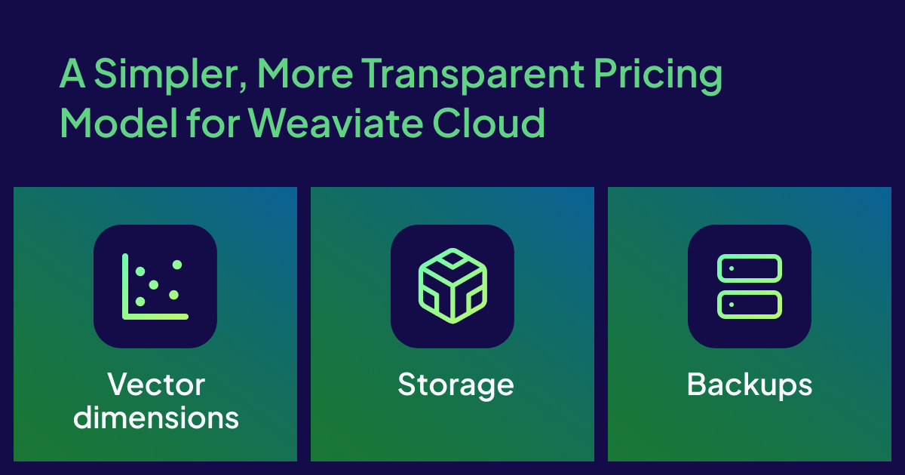

What building AI apps with Weaviate and cooking have in common? Let’s find out! 

Cooking by yourself can be fun, creative, and deeply rewarding. But as your ambitions grow - or your dinner guest list gets longer - the way you cook changes over time to suit the occasion. Building AI-native applications with Weaviate is remarkably similar to mastering the culinary arts. They both require experimentation, careful planning, and the ability to scale to more complex duties. 

To explore this idea, we’ll use the Day 0, Day 1, and Day 2 developer journey - a mindset that we unpacked in [this post.](/blog/building-core-of-ai-native-stack)

Let’s see how your Weaviate journey mirrors the evolution from an amateur cook to a professional chef!

## Day 0: Recipe Discovery

Day 0 with Weaviate is that magical moment when you first discover a recipe that sparks your imagination. You’re in the kitchen, ingredients scattered around the counter ready to create something new, and your creativity soaring with ideas. 

In the Weaviate Cloud Console, this exploration is beautifully streamlined. In *minutes,* you can sign up and spin up a fully-managed database cluster on Weaviate Cloud! There’s no need to set up “kitchen infrastructure.” Weaviate Cloud (e.g. free sandbox) becomes your personal test kitchen where you can learn, prototype, and experiment to your heart’s content. 

Weaviate Cloud provides a host of features to speed up your day 0 journey. In the same way that cookbooks recommend simpler dishes to novice cooks , the Import tool and Query Agent provide a simple recipe that lets you add data and make your first query with minimal friction. 

These built-in tools allow you to create collections, import CSV data and explore/query your data directly in the Cloud Console. They are like having a well-organized spice rack and quality ingredients at your fingertips, allowing you to focus on the creative process of combining flavors (data) rather than hunting for the right tools.

Alternatively, you can build a custom bespoke kitchen by choosing the open source path. With this approach, Day 0 is more like designing your kitchen from scratch with Weaviate's appliances. 

You’ll make some fundamental infrastructure decisions: Do you want a simple Docker setup? Or go full production from the beginning with Kubernetes? You'll set up authentication from scratch, configure SSL certificates, and establish your security perimeter. 

You'll be a kitchen contractor, electrician, and safety inspector all at once. With Kubernetes, you're also the head chef, with a deep understanding of  orchestrating multiple cooking stations to work in harmony.

While the learning curve for open source is steeper, the configuration options are more comprehensive. The hands on approach of using open source Weaviate will give you intimate knowledge of every component of the kitchen. 

## Day 1: When the Guests Arrive

The transition from Day 0 to Day 1 is the moment you decide to host your first dinner party. You’re no longer cooking for yourself; suddenly the stakes are higher and you have *real* guests with real expectations, effectively moving from prototype to production. 

Weaviate’s scalability truly shines during this transition. In Weaviate Cloud  can seamlessly scale your database to meet performance or traffic demands - no manual tuning of infrastructure required.  Regulatory  compliance, full data encryption, cluster RBAC, and multi-zone resilience all work together behind the scenes,

acting as professional kitchen staff and allowing you to focus on perfecting your dishes instead of managing operations. 

If you went go the open source route, you’ll graduate to head chef, kitchen manager, and restaurant owner simultaneously. You’ll be responsible for how your system scales and stays resilient, from designing replication and failover strategies to managing your own networking, load balancing, and monitoring stack. 

 It’s like working in a restaurant where you *personally trained* each cook, designed every workflow and know exactly how each piece of equipment performs under pressure.

The advantage? Complete customization. Every parameter can be tuned for your specific use case. With open source, you’re not following someone else’s recipe - you’re creating your own signature cuisine. 

## Day 2: It’s all about Consistency

Day 2 in Weaviate marks the transition from successful dinner parties to running a full-scale restaurant. Your application is live and it’s serving *real* users so consistency and reliability have become paramount. Anyone can have a perfect night, but you strive for delivering excellence each and every night. 

In a restaurant to accomplish this you’ll need a “front of house” manager, a kitchen manager, and a head chef working in harmony. In Weaviate Cloud, automated maintenance handles the equivalent of supply chain management, equipment maintenance, and staff scheduling. Your updates, backups, and incident responses happen seamlessly, like a world-class restaurant management team working around the clock. 

Weaviate Cloud's dynamic scaling ensures that the Weaviate cluster adapts to demands -  whether you’ve got a quiet Tuesday night crowd or a packed Saturday evening, performance remains consistent. This peace of mind allows your focus to shift from staff and kitchen logistics  to menu development - you’ll be optimizing schemas and application design instead of worrying about infrastructure. 

Open source Weaviate on Day 2 is like owning your own Michelin-starred restaurant where you personally oversee every detail. You’ll be responsible for the entire operation, the quality of ingredients, the training of the staff, to the satisfaction of diners and critics alike. 

You’ll be developing sophisticated operational playbooks from routine maintenance to disaster recovery. Your backup strategies, update procedures, and performance tuning will become battle-tested over time. When incidents occur at 3AM you’ll be getting the call, but you’ll also have complete control over the response. You’ll build custom monitoring dashboards that provide insights that no managed service can provide. Based on your specific data patterns, you can optimize your garbage collection parameters, fine-tune your memory allocation and adjust indexing strategies. In your kitchen this is personally seasoning every dish and knowing *exactly* how each ingredient behaves. 

While the operational burden can be significant, the expertise that you develop will be invaluable. Open source Weaviate in production allows you to be a true expert in vector database operations, capable of diagnosing and fixing issues that would probably stump users of managed services. You’ll be mastering Weaviate at a level that very few achieve. 

## Conclusion: Choosing your Culinary Path

Whether you choose Weaviate Cloud or open-source Weaviate you will be using the same fundamental techniques. Weaviate Cloud is like joining a successful franchise with proven recipes, professional support, and operational expertise, allowing you to focus on serving your customers. Open-source Weaviate is like being an independent restauranteur, having maximum creative and infrastructure control with responsibility for everything from permits to equipment maintenance. 

Weaviate Cloud allows you to focus entirely on your application and users, with the confidence that the infrastructure experts are handling the operational complexity. Whereas, open-source demands more of you and in return you develop deep operational expertise, gain complete control over your environment, and build capabilities that extend beyond Weaviate. 

The underlying vector database technology remains the same powerful foundation in both scenarios. Your journey from kitchen experimenter to restaurant operator does not change the fundamental joy of creating something meaningful. The journey just determines whether you want to spend time perfecting recipes or mastering every aspect of the business.

import WhatsNext from '/_includes/what-next.mdx'

<WhatsNext />
