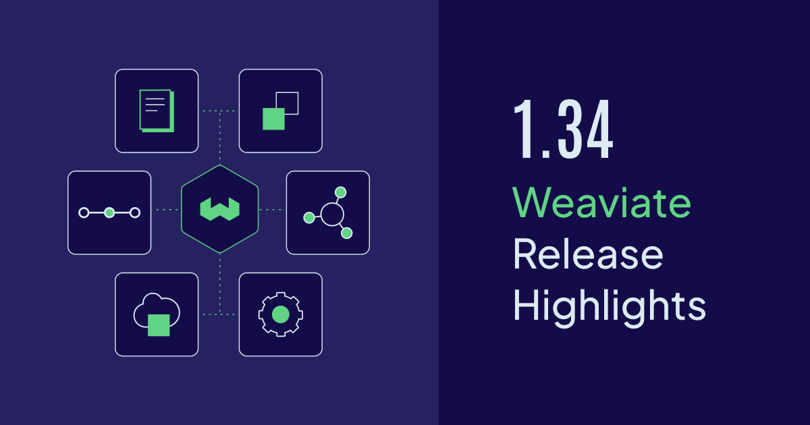

import ThemedImage from '@theme/ThemedImage';

Weaviate `v1.34` is now available open-source and on [Weaviate Cloud](https://console.weaviate.cloud). This release brings **ACORN filter strategy by default** for faster filtered searches, **flat index support with RQ quantization**, **server-side dynamic batching**, **30+ new observability metrics**, and a sneak peek into upcoming **C# and Java v6 client libraries**.

There's also continued refinements across the board, making Weaviate more performant, observable, and easier to operate at scale.

Here are the release ⭐️*highlights*⭐️!



- [Flat index RQ quantization support](#flat-index-rq-quantization-support)
- [Server-side dynamic batching](#server-side-dynamic-batching)
- [Observability improvements](#observability-improvements)
- [Upcoming C# and Java v6 clients](#upcoming-c-and-java-v6-clients)
- [ACORN filter strategy by default](#acorn-filter-strategy-by-default)
- [Community contributions](#community-contributions)

## Flat index RQ quantization support

:::caution Preview Feature

Flat index with RQ quantization was added in `v1.34` as a **preview** feature. This means it's still under development and may change in future releases. We don't recommend using it in production environments at this time.

:::

Weaviate `v1.34` introduces **flat index support with rotational quantization (RQ)**, combining the simplicity of flat indexing with the memory efficiency of RQ compression. This is perfect for smaller collections or use cases where you want exact nearest neighbor search with compressed vectors.

The flat index stores vectors without hierarchical navigation structures like HNSW graphs, making it:

- **Simple and predictable** - No graph building or index tuning required
- **Memory efficient with RQ** - Combine flat indexing with 8-bit or 1-bit RQ for up to 4x-32x compression
- **Ideal for small-to-medium collections** - Great for collections under 100K vectors where flat search is fast enough

**Configuring flat index with RQ:**

```python
from weaviate.classes.config import Configure, VectorIndexType

client.collections.create(
    name="MyCollection",
    vector_config=Configure.Vectors.text2vec_openai(),
    vector_index_config=Configure.VectorIndex.flat(),
    quantizer=Configure.VectorIndex.Quantizer.rq()
)
```

This combination provides a straightforward alternative to HNSW indexing while still benefiting from RQ's compression advantages.

:::info Related resources

- [How-to: Configure RQ compression](https://v1-34-main--docs-weaviate-io.netlify.app/weaviate/configuration/compression/rq-compression)
- [Concepts: Vector quantization](https://docs.weaviate.io/weaviate/concepts/vector-quantization)

:::

## Server-side dynamic batching

:::caution Preview Feature

Server-side dynamic batching was added in `v1.34` as a **preview** feature. This means it's still under development and may change in future releases. We don't recommend using it in production environments at this time.

:::

Building on the server-side batch imports introduced in `v1.33`, Weaviate `v1.34` enhances **server-side dynamic batching** with improved backpressure mechanisms and performance optimizations. The server now more intelligently manages data ingestion rates, adapting in real-time to cluster conditions.

Benefits of server-side batching include:

- **Enhanced backpressure algorithm** - More responsive adjustment to server load
- **Better handling of vectorization latency** - Improved throughput when using external vectorizers
- **Optimized for large-scale imports** - Better performance with millions of objects

Using server-side dynamic batching is quite simple:

```python
with client.batch.experimental() as batch:
    for data_object in data_objects:
        batch.add_object(
            collection="MyCollection",
            properties=data_object,
        )
```

This means you get optimal import performance without manual tuning, whether you're importing thousands or millions of objects.

:::info Related resources

- [How-to: Import with server-side batching](https://v1-34-main--docs-weaviate-io.netlify.app/weaviate/manage-objects/import#server-side-batching)
- [Concepts: Server-side batching](https://docs.weaviate.io/weaviate/concepts/data-import#server-side-batching)

:::

## Observability improvements

Weaviate `v1.34` dramatically improves observability with **30+ new monitoring metrics**, giving you deeper insights into your vector database's performance, resource utilization, and operational health. The new metrics cover areas such as LSM bucket read/write operations, cursor management, bucket lifecycle events (initialization, shutdown, segments), WAL recovery, memtable flushing and async replication processes.

These metrics integrate seamlessly with popular monitoring tools like Prometheus and Grafana, making it easier to:

- **Identify performance bottlenecks** before they impact users
- **Optimize resource allocation** across collections and tenants
- **Debug issues** with detailed operational visibility
- **Plan capacity** based on actual usage patterns

With these enhanced metrics, you can maintain production-grade observability and ensure your Weaviate deployment runs smoothly at scale.

:::info Related resources

- [Configuration: Monitoring](https://v1-34-main--docs-weaviate-io.netlify.app/deploy/configuration/monitoring)

:::

## Upcoming C# and Java v6 clients

:::caution Under development

The new C# client and Java v6 client are still under development. We're still gathering feedback before the general availability release.<br/>
If you have any feedback or comments about the upcoming clients, feel free to open an issue in the their GitHub repositories ([Java](https://github.com/weaviate/java-client/issues) & [C#](https://github.com/weaviate/csharp-client/issues)).

:::

Soon you'll be able to use the new **C# client** and **Java v6 client**, both designed with modern language features and improved developer experience. Here are two sneak peeks into what the new client APIs will look like:

### Java v6 - Example

```java
WeaviateClient client = WeaviateClient.connectToWeaviateCloud(
    weaviateUrl,
    weaviateApiKey
);

client.collections.create(
    "Movie",
    col -> col
        .vectorConfig(VectorConfig.text2VecWeaviate())
        .properties(
            Property.text("title"),
            Property.text("description"),
            Property.text("genre")
        )
);

List<Map<String, Object>> dataObjects = List.of(
    Map.of("title", "The Matrix", "description", "A computer hacker learns about the true nature of reality and his role in the war against its controllers.", "genre", "Science Fiction"),
    Map.of("title", "Spirited Away", "description", "A young girl becomes trapped in a mysterious world of spirits and must find a way to save her parents and return home.", "genre", "Animation"),
    Map.of("title", "The Lord of the Rings: The Fellowship of the Ring", "description", "A meek Hobbit and his companions set out on a perilous journey to destroy a powerful ring and save Middle-earth.", "genre", "Fantasy")
);

CollectionHandle<Map<String, Object>> movies = client.collections.use("Movie");
movies.data.insertMany(dataObjects.toArray(new Map[0]));

var response = movies.query.nearText("sci-fi", q -> q.limit(2));

for (var obj : response.objects()) {
    System.out.println(obj.properties());
}

client.close();
```

### C# - Example

```csharp
var dataObjects = new List<Dictionary<string, string>>
{
    new() { { "title", "The Matrix" }, { "description", "A computer hacker learns about the true nature of reality and his role in the war against its controllers." }, { "genre", "Science Fiction" } },
    new() { { "title", "Spirited Away" }, { "description", "A young girl becomes trapped in a mysterious world of spirits and must find a way to save her parents and return home." }, { "genre", "Animation" } },
    new() { { "title", "The Lord of the Rings: The Fellowship of the Ring" }, { "description", "A meek Hobbit and his companions set out on a perilous journey to destroy a powerful ring and save Middle-earth." }, { "genre", "Fantasy" } },
};

var movies = client.Collections.Use(CollectionName);

var weaviateObjects = dataObjects.Select(obj => new WeaviateObject { Properties = obj.ToDictionary(kvp => kvp.Key, kvp => (object)kvp.Value) }).ToList();
var result = await movies.Data.InsertMany(weaviateObjects);

Assert.False(result.HasErrors, $"Batch insertion failed: {result.Errors.FirstOrDefault()?.Message}");

var response = await movies.Query.NearText(
    query: "sci-fi",
    limit: 2
);

foreach (var obj in response.Objects)
{
    Console.WriteLine(JsonSerializer.Serialize(obj.Properties, new JsonSerializerOptions { WriteIndented = true }));
}
```

:::info Related resources

- [Java v6 client documentation](https://client-libraries-beta--docs-weaviate-io.netlify.app/weaviate/client-libraries/java/java-v6)
- [Java v6 client GitHub Repository](https://github.com/weaviate/java-client/tree/v6)

- [C# client documentation](https://client-libraries-beta--docs-weaviate-io.netlify.app/weaviate/client-libraries/csharp)
- [C# client GitHub Repository](https://github.com/weaviate/csharp-client/)

:::

## ACORN filter strategy by default

Weaviate `v1.34` makes **ACORN (Automatic Constraint Optimization for Retrieval Networks)** the default filter strategy, delivering faster filtered vector searches out of the box. ACORN intelligently optimizes how filters are applied during vector search, automatically choosing the most efficient execution path based on your query patterns.

Here is an example of using filtered queries:

```python
# ACORN automatically optimizes this filtered search
results = collection.query.near_text(
    query="sustainable fashion brands",
    where=Filter.by_property("price").less_than(100) &
          Filter.by_property("inStock").equal(True),
    limit=10
)
```

ACORN works seamlessly with all existing filter operators and vector search methods, providing performance improvements without any code changes. When you create a new collection in Weaviate 1.34 or later, the default filter strategy will be `ACORN` instead of `SWEEPING`.

:::info Related resources

- [Concepts: Filtering - ACORN](https://v1-34-main--docs-weaviate-io.netlify.app/weaviate/concepts/filtering#acorn)
- [How-to: Set vector index parameters](https://v1-34-main--docs-weaviate-io.netlify.app/weaviate/manage-collections/vector-config#set-vector-index-parameters)

:::

## Community contributions

Weaviate is an open-source project, and we're always thrilled to see contributions from our amazing community.

For this release, we want to thank all the contributors who helped make Weaviate `v1.34` better through bug reports, feature requests, documentation improvements, and code contributions. 🎉🎉🎉

If you're interested in contributing to Weaviate, please check out our [contribution guide](https://docs.weaviate.io/contributor-guide/), and browse the open issues on [GitHub](https://github.com/weaviate/weaviate/issues). Look for the `good-first-issue` label to find great starting points!

:::info Related resources

- [Contributor guide](https://docs.weaviate.io/contributor-guide)

:::

## Summary

Weaviate `v1.34` focuses on production readiness and operational excellence. With **flat index RQ quantization**, **ACORN filter strategy** delivering faster filtered searches by default, **enhanced observability** with 30+ new metrics, **server-side batch imports** for faster data ingestion, this release makes Weaviate easier to operate at scale.

**Ready to get started?**

The release is available open-source as always [on GitHub](https://github.com/weaviate/weaviate/releases/tag/v1.34.0), and is already available for new Sandboxes on [Weaviate Cloud](https://console.weaviate.cloud/).

For those upgrading a self-hosted version, please check the [migration guide](https://docs.weaviate.io/deploy/migration#general-upgrade-instructions) for version-specific notes.

It will be available for Serverless clusters on Weaviate Cloud soon as well.

Thanks for reading, and happy vector searching! 👋
