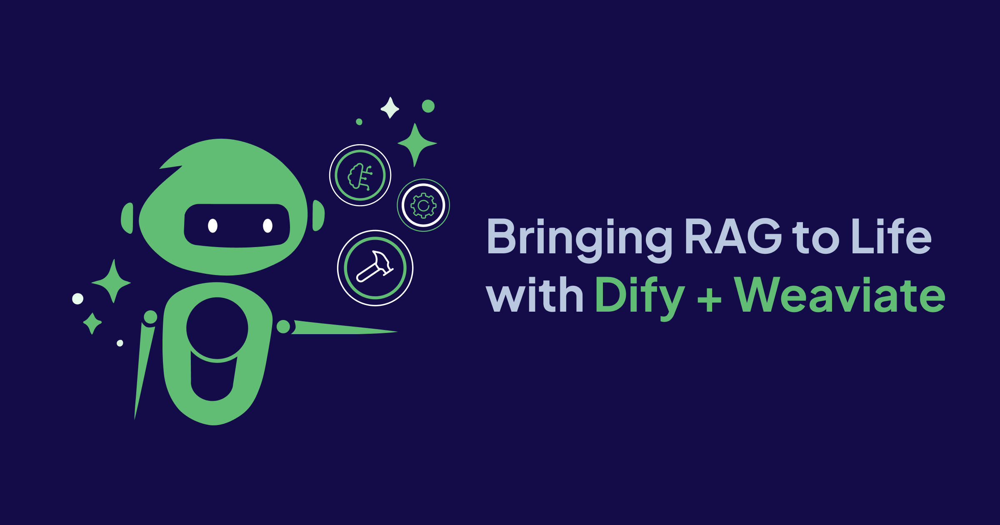
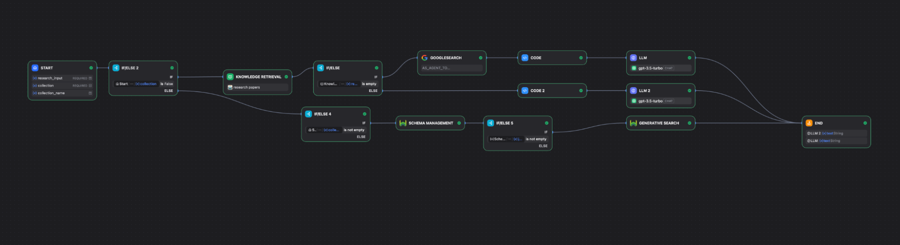

We’re all living in a world overflowing with information, and finding the right answer quickly is harder than it should be. Traditional keyword search still has its place, but it often struggles when users phrase questions differently than the source content. Vector search helps bridge that gap by understanding semantic meaning, and hybrid search brings the two approaches together to deliver both precision and depth. But retrieval is only half the story. The real value emerges when you pair those search results with intelligent generation to produce accurate, context-aware insights.

That’s why Retrieval-Augmented Generation (RAG) has become so important. It blends two things:

* **Retrieval**, to pull in the most relevant documents, and  
* **Generation**, to let an LLM write a grounded, accurate response.

Instead of relying only on what a model was trained on, RAG injects relevant context from your knowledge base into every answer. This makes it perfect for enterprise chatbots, internal knowledge bases, research tools, and any AI system where correctness and context really matter.

## Why Organizations are Building RAG Systems

RAG is quickly becoming the preferred approach for building reliable AI systems because it grounds model outputs in real data, reducing hallucinations and improving accuracy. Instead of relying solely on an LLM’s internal training, RAG retrieves the most relevant documents and injects them directly into the generation process, which makes responses far more trustworthy and aligned with your actual knowledge base.

It also offers strong practical benefits: results are more transparent and explainable, developers can effortlessly plug in their own domain-specific data, and updates happen instantly as your content changes, without any need for retraining a model. In short, RAG provides a safer, smarter, and more flexible way to bring AI into real products.

## Building RAG Systems with Dify and Weaviate 

[Dify and Weaviate](https://marketplace.dify.ai/plugins/weaviate/weaviate) make a great combo for building RAG workflows. Dify handles the orchestration and LLM logic, while Weaviate powers fast, semantic search under the hood. Together, they let you build RAG pipelines without dealing with messy infrastructure.

## Dify and Weaviate Integration

There are two clean ways to integrate Weaviate with Dify:

| Local dev | Plugin |
| :---- | :---- |
| **Self-hosted control:** Run both Dify and Weaviate locally using Docker Compose, giving developers full visibility into backend logs and configuration. | **Easy to enable:** Install the Weaviate plugin directly from Dify’s deployed version or your Docker environment, no manual setup required. |
| **Built-in by default:** Dify’s Knowledge Base automatically uses Weaviate for vector embeddings and semantic search, so RAG features work out of the box. | **Full Weaviate feature access:** Perform schema management, data operations, and advanced searches directly inside Dify’s workflow editor.  |
| **Ideal for experimentation:** Perfect for developers exploring custom pipelines, testing schema structures, or connecting Dify with local datasets. | **Visual workflow ready:** Add Weaviate nodes such as Hybrid Search, Vector Search, and Generative Search to create RAG workflows in minutes. |
| **Developer flexibility:** Modify Docker Compose files, environment variables, or versions of Weaviate and Dify to match specific project needs. | **Zero-code convenience:** Designed for non-developers or teams who prefer drag-and-drop workflows without managing infrastructure. |
| **Custom integration freedom:** Extend functionality by connecting Weaviate with other local tools, APIs, or LLM frameworks for end-to-end RAG experimentation. | **Seamless cloud compatibility:** Works out of the box with Dify’s hosted environment, allowing instant scalability and collaboration. |

### Integration Features

| Feature | Description |
| ----- | ----- |
| **Hybrid Search** | Combines semantic and keyword search. Use the alpha parameter to balance them, alpha=0.5 means equal weighting, alpha=0 is pure keyword search, and alpha=1 is pure vector search. The default is alpha=0.70. |
| **Vector Search** | Retrieves results based purely on embedding similarity, great for semantic understanding. |
| **Keyword Search** | Traditional search mode for exact text matching. |
| **Generative Search** | Retrieves context and passes it to an LLM to generate a natural-language answer. |
| **Query Agent** | Dynamically selects the right search strategy or node based on user intent. |

### Workflow Summary: Hybrid Research Pipeline in Dify

This workflow creates a hybrid research system that intelligently switches between **internal knowledge** and **web search** to generate the best possible answer.

1. **Start & Input Validation**  
   The workflow begins by taking the user’s research query and checking whether the selected knowledge-base collection exists.  
2. **Internal Knowledge Retrieval**  
   If the collection exists, the workflow queries it using vector search.  
   * If relevant documents are found → continue with internal reasoning.  
   * If nothing is found → fallback to Google Search.  
3. **Web Search Fallback Path**  
   When internal data is empty, the system performs a Google Search, processes results using a code step, and summarizes them with an LLM to produce a reliable answer.  
4. **Schema-Aware Knowledge Path**  
   When internal knowledge exists, the workflow extracts structure through **Schema Management**, and if schema data is available, it triggers **Generative Search** for deeper, hybrid semantic retrieval.  
5. **Structured Synthesis**  
   A final code step merges retrieved documents, schema, and generative search outputs, and an LLM produces a polished answer using internal knowledge.  
6. **Final Output**  
   The workflow combines either:  
   * The internal-knowledge-based answer, or  
   * The web-search-based fallback, depending on which was available.

## Summary

RAG becomes far more powerful when combined with Dify’s visual orchestration and Weaviate’s high-performance vector search. Together, they allow developers to build end-to-end semantic retrieval pipelines with hybrid search, schema management, and generative reasoning, all without heavy infrastructure work. This integration makes it easy to connect your data, run advanced searches, and generate grounded, explainable answers directly inside Dify.

You can explore the full implementation in the [GitHub repo](https://github.com/langgenius/dify/tree/6efdc9466165c8d54352bd8525a45d5171ba6eef/api/core/rag/datasource/vdb/weaviate) and learn more in the [Dify documentation](https://marketplace.dify.ai/plugins/weaviate/weaviate).

import WhatNext from '/_includes/what-next.mdx'

<WhatNext />
