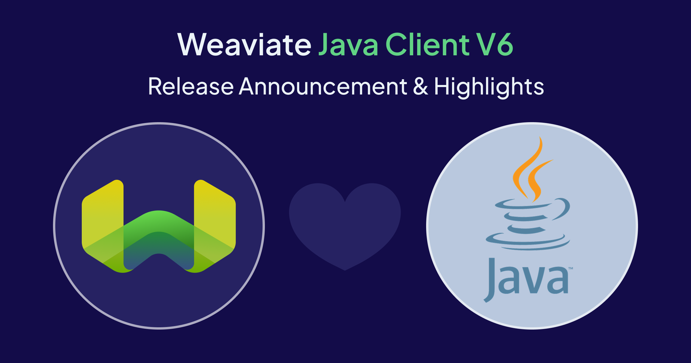

We're thrilled to announce the general availability of **Weaviate Java client v6** – a ground-up redesign that transforms how Java developers interact with Weaviate. After months of beta testing and feedback from our community, we're confident this is the most powerful and developer-friendly Java client we've ever shipped.

## Why we built Java client v6

The previous Java client served us well, but as Weaviate evolved and added features like multiple vectors per collection, multi-tenancy, advanced querying capabilities, and multi-vector (ColBERT) support, the API grew complex. We heard from developers that:

- **Configuration was verbose** – Simple operations required too much boilerplate
- **Type safety was inconsistent** – Working with results required excessive casting
- **Modern Java features were underutilized** – Lambda expressions and generics could make the API more elegant
- **The learning curve was steep** – Common tasks weren't obvious

Java client v6 addresses all of these concerns while maintaining the flexibility and performance you need for production applications.

## What's new?

#### 1. Tucked Builder pattern - The heart of the v6 design

At the core of Java client v6 is the **Tucked Builder pattern** – an elegant solution that drastically reduces boilerplate code while leveraging static typing and IDE autocompletion for better API discovery.

If you've worked with Elasticsearch's Java API Client, you'll recognize this pattern as [Builder lambda expressions](https://www.elastic.co/docs/reference/elasticsearch/clients/java/api-conventions/building-objects#_builder_lambda_expressions). The Tucked Builder pattern replaces repetitive `.builder() [...] .build()` chains with lambda expressions that accept pre-instantiated builder objects.

**Traditional Builder approach:**

```java
import io.weaviate.client6.v1.api.collections.query.Hybrid;
import io.weaviate.client6.v1.api.collections.query.NearText;
import io.weaviate.client6.v1.api.collections.query.NearText.Move;

// Verbose builder chains
Move moveTo = Move.builder()
    .force(.5f)
    .concepts("lullaby")
    .build();

NearText nearText = NearText.builder()
    .concepts("sunshine", "butterflies")
    .distance(.4f)
    .moveTo(moveTo)
    .build();

Hybrid hybridQuery = Hybrid.builder()
    .concepts("rainbow")
    .nearText(nearText)
    .queryProperties("title", "lyrics")
    .returnProperties("album", "author")
    .build();

songs.query.hybrid(hybridQuery);
```

**Tucked Builder approach:**

```java
import io.weaviate.client6.v1.api.collections.query.NearText;

// Clean, nested lambda expressions
songs.query.hybrid(
    "rainbow",
    h -> h
        .nearText(NearText.of(
            List.of("sunshine", "butterflies"),
            nt -> nt
                .distance(.4f)
                .moveTo(.5f, to -> to.concepts("lullaby"))
        ))
        .queryProperties("title", "lyrics")
        .returnProperties("album", "author")
);
```

The beauty of this approach is that **the type of each lambda argument is automatically deduced** from the method signatures. Your IDE's autocomplete guides you through the API without needing to remember builder class names or import statements.

For queries with complex conditional logic, lambda expressions work as full-fledged functions:

```java
songs.query.hybrid("rainbow", h -> {
    if (limitURL != null) {
        h.limit(limitURL);
    }
    return h;
});
```

And when you prefer traditional builders, they're still available as public members:

```java
Hybrid.Builder builder = new Hybrid.Builder("rainbow");
if (limitURL != null) {
    builder.limit(limitURL);
}
songs.query.hybrid(builder.build());
```

Static factory methods are also provided for both required-only and optional configurations:

```java
Hybrid requiredOnly = Hybrid.of("rainbow");
Hybrid withOptional = Hybrid.of("rainbow", opt -> opt.limit(10));
```

#### 2. Collection-centric API

The new client organizes everything around **collections** (the new term for classes/schemas). This mental model aligns better with how you actually use Weaviate.

**Before (v5):**

```java
// Operations were scattered across different namespaces
Result<GraphQLResponse> result = client.graphQL()
    .get()
    .withClassName("Movie")
    .withNearText(NearTextArgument.builder()
        .concepts(new String[]{"sci-fi"})
        .build())
    .withFields(Field.builder().name("title").build())
    .withLimit(2)
    .run();
```

**After (v6):**

```java
// Everything goes through the collection handle
CollectionHandle<Map<String, Object>> movies = client.collections.use("Movie");

var response = movies.query.nearText("sci-fi",
    q -> q.limit(2).returnProperties("title", "description")
);
```

The `CollectionHandle` object is thread-safe and lightweight. Create it once and share it across threads:

```java
// Good: Reuse the same handle
var songs = client.collections.use("Songs");
Thread.run(() -> rapSongs.forEach(song -> songs.data.insert(song)));
Thread.run(() -> popSongs.forEach(song -> songs.data.insert(song)));
```

#### 3. Simplified connection management

Client instantiation is more flexible with helper methods for common deployment scenarios.

```java
// Connect to Weaviate Cloud
WeaviateClient client = WeaviateClient.connectToWeaviateCloud(
    "my-cluster.weaviate.network",
    "my-api-key"
);

// Connect to local instance (defaults to localhost:8080)
WeaviateClient local = WeaviateClient.connectToLocal();

// Connect to local with custom port
WeaviateClient localCustom = WeaviateClient.connectToLocal(
    local -> local.port(9090)
);

// Full custom configuration
WeaviateClient custom = WeaviateClient.connectToCustom(
    conn -> conn
        .scheme("http")
        .httpHost("localhost").httpPort(8080)
        .grpcHost("localhost").grpcPort(50051)
        .setHeader("X-Custom-Header", "Value")
);
```

The client manages connection pools and gRPC channels that must be properly disposed of. Use try-with-resources for automatic cleanup:

```java
try (final var client = WeaviateClient.connectToLocal()) {
    // Your application code
}
// Client automatically closed when exiting the block
```

#### 4. Improved type safety and ORM support

Working with query results is now straightforward, with optional ORM support for even stronger typing.

**Working with Maps (default):**

```java
CollectionHandle<Map<String, Object>> songs = client.collections.use("Songs");

var response = songs.query.bm25("rain", q -> q.queryProperties("lyrics"));

for (var obj : response.objects()) {
    System.out.println(obj.properties().get("title"));
    System.out.println(obj.uuid());
    System.out.println(obj.metadata().score());
}
```

**Working with Java Records (ORM):**

```java
@Collection("Songs", description = "Global media library")
record Song(
    String title,
    String lyrics,
    @Property("artist") String singer,
    int year,
    String[] genres
) {}

// Create collection from record definition
client.collections.create(
    Song.class,
    collection -> collection
        .vectorConfig(VectorConfig.text2vecWeaviate())
);

// Work with typed objects
CollectionHandle<Song> songs = client.collections.use(Song.class);

Song bad = new Song("Bad", "...", "Michael Jackson", 1987, new String[]{"pop"});
songs.data.insert(bad);

var result = songs.query.bm25("bad", opt -> opt.queryProperties("lyrics"));

for (var object : result.objects()) {
    Song song = object.properties();
    System.out.println(song.artist() + " - " + song.title());
}
```

Java records can also represent nested object properties:

```java
record MusicVideo(@Property("link") String url, long runtimeSeconds) {}

songs.data.insert(Map.of(
    "title", "Billie Jean",
    "musicVideo", new MusicVideo("https://youtube.com/billiejean", 294L)
));
```

#### 5. Simplified filtering

Building complex filters is now intuitive with a chainable API.

**Before (v5):**

```java
WhereFilter filter = WhereFilter.builder()
    .operator(Operator.And)
    .operands(new WhereFilter[]{
        WhereFilter.builder()
            .path(new String[]{"round"})
            .operator(Operator.Equal)
            .valueText("Double Jeopardy!")
            .build(),
        WhereFilter.builder()
            .path(new String[]{"points"})
            .operator(Operator.LessThan)
            .valueInt(600)
            .build()
    })
    .build();
```

**After (v6):**

```java
var response = jeopardy.query.fetchObjects(q -> q
    .filters(Filter.and(
        Filter.property("round").eq("Double Jeopardy!"),
        Filter.property("points").lt(600)
    ))
    .limit(3)
);
```

Supported comparison operators include: `.eq`, `.ne`, `.lt`, `.lte`, `.gt`, `.gte`, `.like`, `.containsAll`, `.containsAny`, `.containsNone`, and `.withinGeoRange`. Logical operators (`.and`, `.or`, `.not`) also allow chaining of filter operations.

#### 6. Enhanced multi-target search

Multi-target vector search is critical for advanced use cases, and v6 makes it effortless with the `Target` API.

```java
// Search across multiple named vectors with average strategy
var response = collection.query.nearText(
    Target.average("a wild animal",
        "jeopardy_questions_vector",
        "jeopardy_answers_vector"
    ),
    q -> q.limit(2).returnMetadata(Metadata.DISTANCE)
);

// Manual weights for fine-grained control
var response = collection.query.nearText(
    Target.manualWeights("a wild animal",
        Target.weight("jeopardy_questions_vector", 10f),
        Target.weight("jeopardy_answers_vector", 50f)
    ),
    q -> q.limit(2)
);
```

#### 7. Working with vectors

Weaviate supports both 1-dimensional and multi-dimensional vector embeddings (thanks to ColBERT-family modules). The `Vectors` abstraction handles both types cleanly:

```java
// Insert with custom vectors
songs.data.insert(
    Map.of("title", "Yellow Submarine"),
    obj -> obj
        .uuid("valid-custom-uuid")
        .vectors(Vectors.of("title_vec", new float[]{...}))
);

// Retrieve vectors from results
Vectors vectors = yellowSubmarine.vectors();
float[] v1d = vectors.getDefaultSingle();  // Default 1-d vector
float[] v1dNamed = vectors.getSingle("custom_1d");  // Named 1-d vector
float[][] v2d = vectors.getDefaultMulti();  // Default 2-d vector
float[][] v2dNamed = vectors.getMulti("custom_2d");  // Named 2-d vector
```

Creating multi-vector configurations:

```java
// Multiple named vectors
Vectors.of(
    Vectors.of("title_vec", new float[]{...}),
    Vectors.of("lyrics_vec", new float[]{...})
)
```

#### 8. Integrated RAG (Retrieval-Augmented Generation)

Generate AI-powered responses directly from search results with minimal code.

```java
var response = movies.generate.nearText("sci-fi",
    // Query configuration
    q -> q.limit(1).returnProperties("title", "description"),
    // Generative configuration
    g -> g.groupedTask("Write a tweet with emojis about this movie.",
        c -> c.dynamicProvider(
            DynamicProvider.anthropic(
                o -> o.model("claude-3-5-haiku-latest")
            )
        )
    )
);

// Access the generated content
System.out.println(response.generated().text());
```

#### 9. Easier data insert operations

:::info Batching import - coming soon

[Batch import support](https://docs.weaviate.io/weaviate/concepts/data-import) for the Java client v6 will be added in the near future. This will be the recommended way of importing large amounts of data into Weaviate. Until then, use the `insertMany()` method. 

:::

Inserting multiple objects provides better error handling and performance.

**After (v6):**

```java
InsertManyResponse response = songs.data.insertMany(
    Map.of("title", "High-Speed Dirt", "artist", "Megadeth"),
    Map.of("title", "Rattlehead", "artist", "Megadeth")
);

if (!response.errors().isEmpty()) {
    throw new RuntimeException(String.join(", ", response.errors()));
}

System.out.println(
    "Inserted %d objects, took: %.2fs"
    .formatted(response.responses().size(), response.took())
);
```

Supply custom UUIDs and vectors by wrapping objects in `WeaviateObject.of(...)`:

```java
songs.data.insertMany(
    WeaviateObject.of(map1, obj -> obj.uuid(uuid1).vectors(...)),
    WeaviateObject.of(map2, obj -> obj.uuid(uuid2).vectors(...))
)
```

#### 10. Aggregations

Perform statistical aggregations across your collections with a clean API.

```java
songs.aggregate.overAll(
    agg -> agg
        .metrics(
            Aggregate.integer("year", calc -> calc.min().max().median()),
            Aggregate.text("album", calc -> calc.topOccurrences().topOccurrencesCutoff(5)),
            Aggregate.bool("isSingle", calc -> calc.percentageTrue().totalFalse()),
            Aggregate.number("monthlyListeners", calc -> calc.mode().count())
        )
        .includeTotalCount(true)
);
```

Combine aggregations with semantic search:

```java
songs.aggregate.hybrid(
    "summer of love",
    hybrid -> hybrid
        .queryProperties("title", "lyrics")
        .nearVector(NearVector.of(new float[]{...}, nv -> nv.certainty(.7f)))
        .alpha(.3f),
    aggregate -> aggregate
        .metrics(Aggregate.text("artist", calc -> calc.topOccurrences()))
);
```

## Migration guide

Java client v6 introduces a redesigned API that simplifies common operations and embraces modern Java patterns. While this means learning new syntax, you'll find that most tasks require less code and are more straightforward. The [Weaviate Documentation](https://docs.weaviate.io/) includes comprehensive v6 examples to help you adapt your existing code.

## Getting started

#### Installation

Add Java client v6 to your project:

**Maven:**

```xml
<dependency>
    <groupId>io.weaviate</groupId>
    <artifactId>client6</artifactId>
    <version>6.0.0</version>
</dependency>
```

**Gradle:**

```kotlin
implementation("io.weaviate:client6:6.0.0")
```

#### Quickstart example

```java
import io.weaviate.client6.v1.api.WeaviateClient;
import io.weaviate.client6.v1.api.collections.schema.Property;
import io.weaviate.client6.v1.api.collections.schema.VectorConfig;
import java.util.Map;

public class QuickStart {
    public static void main(String[] args) throws Exception {
        // Connect to Weaviate
        try (var client = WeaviateClient.connectToWeaviateCloud(
            System.getenv("WEAVIATE_URL"),
            System.getenv("WEAVIATE_API_KEY")
        )) {
            // Create a collection
            client.collections.create("Movie",
                col -> col
                    .vectorConfig(VectorConfig.text2vecWeaviate())
                    .properties(
                        Property.text("title"),
                        Property.text("description")
                    )
            );

            // Get collection handle
            var movies = client.collections.use("Movie");

            // Insert data
            movies.data.insertMany(
                Map.of("title", "The Matrix", "description", "A hacker discovers reality is a simulation"),
                Map.of("title", "Inception", "description", "Dreams within dreams")
            );

            // Query with semantic search
            var response = movies.query.nearText("mind-bending movie",
                q -> q.limit(1).returnProperties("title", "description")
            );

            // Print results
            for (var obj : response.objects()) {
                System.out.println(obj.properties().get("title"));
                System.out.println("Distance: " + obj.metadata().distance());
            }
        }
    }
}
```

## Resources

- **Documentation:** [weaviate.io/developers/weaviate/client-libraries/java](https://docs.weaviate.io/weaviate/client-libraries/java/java-v6)
- **GitHub:** [github.com/weaviate/java-client](https://github.com/weaviate/java-client)
- **Demo app**: Check out our [e-commerce demo application](https://github.com/weaviate-tutorials/vector-store) showcasing the new Java client v6 syntax in action with Spring Boot.

## Community feedback

During the beta period, we received invaluable feedback from the community. Special thanks to everyone who tested early versions, reported issues, and suggested improvements. Your input directly shaped this release and made it possible 💛.

We'd love to hear about your experience with Java client v6:

- **Slack:** Join the [Weaviate Slack](https://weaviate.io/slack) community
- **GitHub Issues:** [Report bugs or request features](https://github.com/weaviate/java-client/issues)
- **Forum:** Share use cases on our [community forum](https://forum.weaviate.io)

## Conclusion

Java client v6 represents our commitment to providing world-class developer tools for working with vector databases. The redesigned API removes friction, embraces modern Java idioms, and makes building AI-powered applications more enjoyable.

We can't wait to see what you build with it!

Happy coding! 🚀

import WhatsNext from '/_includes/what-next.mdx';

<WhatsNext />
