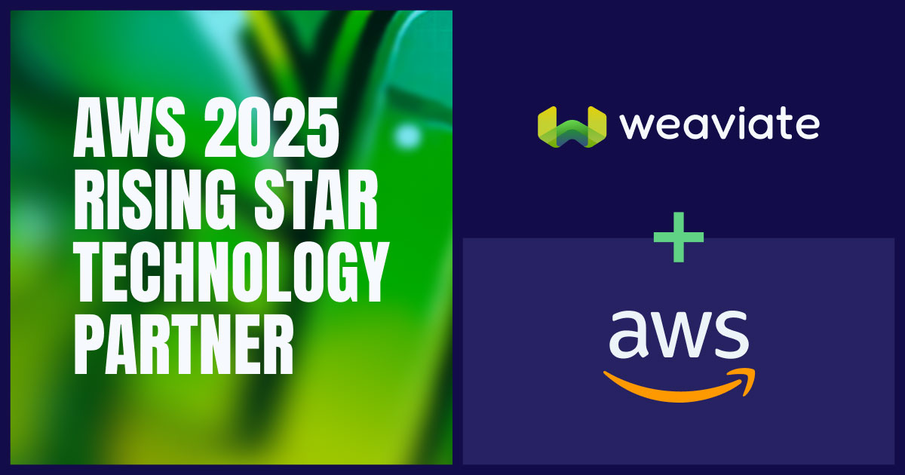

Amsterdam, Netherlands: Dec 3, 2025 – Weaviate an AI-Native database, today announced that it was named a [winner of the 2025 EMEA/Benelux AWS Regional Partner Award](https://aws.amazon.com/blogs/apn/announcing-the-regional-2025-aws-partners-of-the-year-for-europe-middle-east-and-africa/?sc_channel=sm&sc_campaign=AWS_reInvent,APN%20Marketing&sc_publisher=LINKEDIN&sc_country=global&sc_geo=GLOBAL&sc_outcome=awareness&linkId=884485860), an award recognizing partners in the Netherlands that play a key role helping customers drive innovation and build solutions on AWS.

AWS Regional Partner Awards recognize AWS’s Top Partners of the Year and **Rising Star Partners of the Year** in Benelux, whose business models have embraced specialization, innovation, and collaboration over the past year. AWS Partner Awards recognize partners whose business models continue to evolve and thrive on AWS as they work with customers. Winners were selected based on objective criteria with results audited by third-party analyst firm, Canalys.  

Weaviate has been one of the first AWS GenAI Competency partners and recognized by AWS with both the Consumer Good Software Competency and the new **AI Software Competency**. These competencies highlight our proven ability to deliver secure, scalable, and AI-driven solutions. With AWS, Weaviate has a Strategic Collaboration Partnership supported by more than 20 documented joint customer wins like [FactSet](https://youtu.be/55mwdGXOgpg?si=JI5Pduegiysf2Eke) and [Booking.com](https://booking.ai/building-a-genai-agent-for-partner-guest-messaging-f54afb72e6cf).

Weaviate offers two products on AWS Marketplace: [Serverless Cloud](https://aws.amazon.com/marketplace/pp/prodview-ng2dfhb4yjoic?applicationId=AWSMPContessa&ref_=beagle&sr=0-1) and [Enterprise Cloud](https://aws.amazon.com/marketplace/pp/prodview-27nbweprm7hha?applicationId=AWSMPContessa&ref_=beagle&sr=0-2). Both listings give customers and users everything one needs to build and scale AI applications. Over the past year, Weaviate has delivered major innovations across both the database and the services built on top of it. At the database layer, they have introduced improvements that make Weaviate more performant, observable, and easier to operate at scale. The Weaviate ecosystem has grown dramatically with new services for developers, including Weaviate Embeddings and Weaviate Agents.

With seamless integration and scalability, Weaviate deploys easily within customers' AWS environments, ensuring data privacy and regulatory compliance. Native integrations with Amazon SageMaker and Bedrock accelerate the development of production-ready generative AI applications. Our key verticals are in Banking/Financial Services, Retail/CPG, and Healthcare/Life Sciences. 

> "Our collaboration with AWS has been instrumental to Weaviate's growth. Building on AWS has allowed Weaviate to scale to support our customers' needs while also collaborating on our joint go-to-market initiatives." **Jobi George, VP of Business Development & Partnerships at Weaviate**

> Weaviate's team was really great and solved every bottleneck we faced during our migration. Now, I never worry about our vector database, even with 9 billion vectors. They've delivered maintenance and cost advantages, allowing us to focus on scaling our systems without concern.” **Dr. Hirak Chhatbar, Co-founder and CTO, Loti AI**

The AWS Partner Network (APN), is a global partner program, focused on helping partners build successful AWS-based businesses or solutions by providing business, technical, marketing, and go-to-market support. The APN includes independent software vendors (ISVs) and systems integrators (SIs) around the world, with AWS Partner participation growing significantly during the past 12 months. 

To learn more about Weaviate and our partnership with AWS [visit our website](https://weaviate.io/). Start building today with our [AWS module](https://docs.weaviate.io/weaviate/model-providers/aws) for access to embedding and generative models hosted on SageMaker and Bedrock. 

import WhatsNext from '/_includes/what-next.mdx';

<WhatsNext />
