import elysia from './img/elysia-demo.mp4';

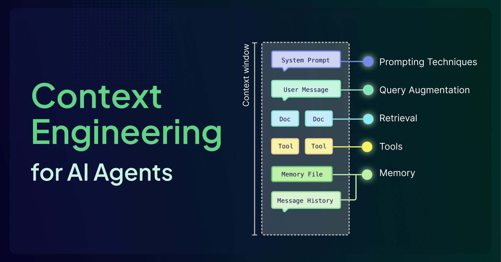

Most LLM demos start out feeling magical. They can draft emails, rewrite code, or even book a vacation, and for a few minutes, it seems as though the model truly "understands" everything thrown at it. But the illusion shatters the moment the task becomes messy and real, like when it depends on yesterday's incident report, your team's internal documentation, or a long troubleshooting thread from Slack. Suddenly, the model stumbles. It can't remember what was said ten messages ago, has no access to your private data, and starts guessing instead of reasoning.

The difference between a flashy demo and a dependable production system isn't about switching to a "smarter" model. It's about how information is selected, structured, and delivered to the model at each step of a task. In other words, the difference is **context**.

All LLMs are constrained by finite **context windows** that force hard trade‑offs about what the model can "see" at once. Context engineering is all about treating that window as a scarce resource and designing everything around it (retrieval, memory systems, tool integrations, prompts, etc.) so that the model spends its limited attention budget only on high‑signal tokens.

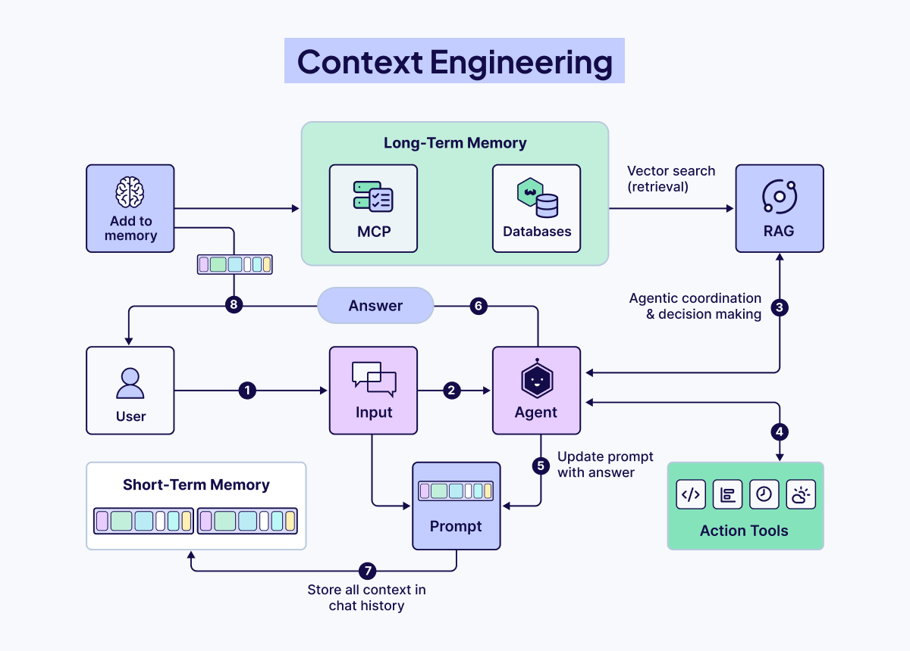

## But What Is a Context Window?

The context window is the model's active workspace, where it holds instructions and information for a current task. Every word, number, and piece of punctuation consumes space in this window. Just like a whiteboard, once it's full, older information gets erased to make room for new instructions, and important details can be lost. In serious terms, a context window refers to the maximum amount of text data a language model can consider at one time when generating responses, measured in [tokens](https://help.openai.com/en/articles/4936856-what-are-tokens-and-how-to-count-them). This window includes all your inputs, model's outputs, tool calls, and retrieved documents, acting as the short-term memory. Every token placed in the context window directly influences what the model can "see" and how it responds.

## Context Engineering vs. Prompt Engineering

Prompt engineering focuses on how you phrase and structure instructions for the LLM to generate the best results, such as writing clear/clever prompts, adding examples, or asking the model to "think step-by-step.” While important, prompt engineering alone cannot fix the fundamental limitation of a disconnected model. 

Context engineering, on the other hand, is the discipline of designing the architecture that feeds an LLM the right information at the right time. It's about building the bridges that connect a disconnected model to the outside world, retrieving external data, using tools, and giving it a memory to ground its responses in facts, not just training data.

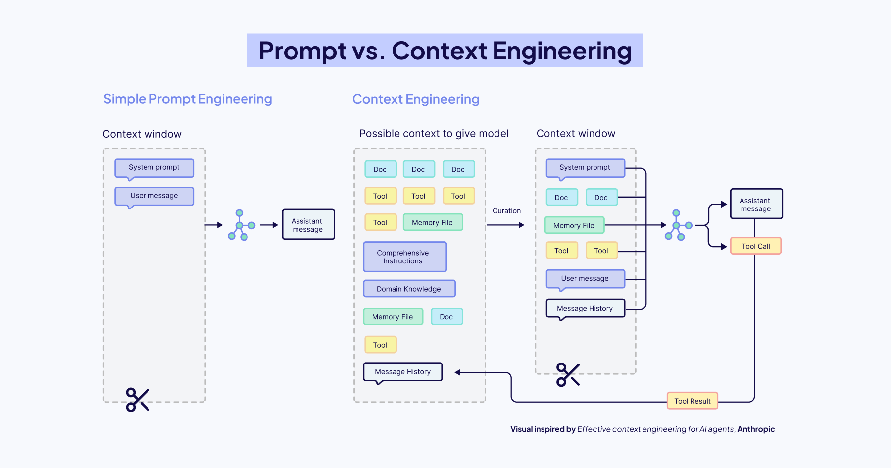

In simple words, prompt engineering is how you ask the question, while context engineering is making sure the model has access to the right textbook, calculator, and even notes/memories from your previous conversation before it starts thinking. The quality and effectiveness of LLMs are heavily influenced by the prompts they receive, but the way you phrase a prompt can only go so far without a well-engineered context. Prompting techniques like Chain-of-Thought, Few-shot learning, and ReAct are most effective when combined with retrieved documents, user history, or domain-specific data.

## The Context Window Challenge

The LLM context window can only hold so much information at once. This fundamental constraint shapes what agents and agentic systems are currently capable of. Every time an agent processes information, it must decide what remains active, what can be summarized/ compressed/deleted, what should be stored externally, and how much space to reserve for reasoning. It's tempting to assume that shoving everything into bigger context windows solves this problem, but this is generally not the case. 

Here are the critical failure modes that emerge as context grows:

- **Context Poisoning**: Incorrect or hallucinated information enters the context. Because agents reuse and build upon that context, these errors continue and compound.
- **Context Distraction**: The agent becomes burdened by too much past information; history, tool outputs, summaries, and over-relies on repeating past behavior rather than reasoning fresh.
- **Context Confusion**: Irrelevant tools or documents crowd the context, distracting the model and causing it to use the wrong tool or instructions.
- **Context Clash**: Contradictory information within the context misleads the agent, leaving it stuck between conflicting assumptions.

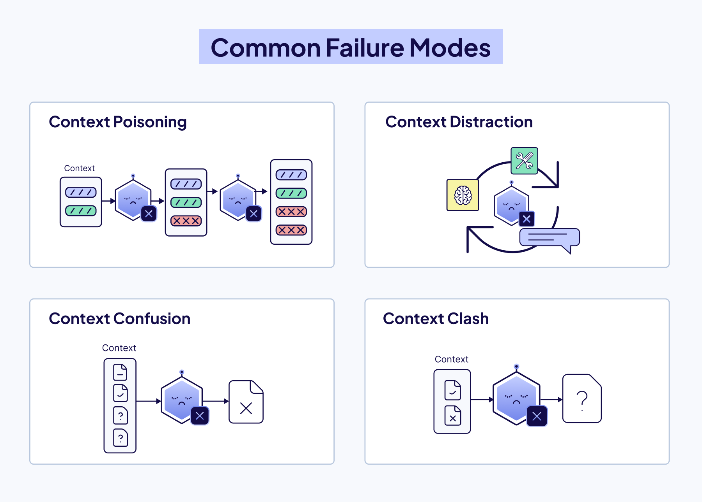

These aren't just technical limitations, these are core design challenges of any modern AI app. You can't fix this fundamental limitation by simply writing better prompts or increasing the maximum size of the context window. You have to build a system around the model. 

That is what Context Engineering is all about!

## The Six Pillars of Context Engineering

Context engineering is a system built from six interdependent components that control what information reaches the model and when. **Agents** orchestrate decisions, **Query Augmentation** refines user input, **Retrieval** connects to external knowledge, **Prompting** guides reasoning, **Memory** preserves history, and **Tools** enable real-world action.

### Agents

Agents are quickly becoming the foundation for building AI applications. They are both the architects of their context and the users of those contexts, dynamically defining knowledge bases, tool use, and information flow within an entire system. 

**What Defines an Agent**

An [**AI agent**](/blog/ai-agents) is a system that uses a large language model (LLM) as its “brain” to do decision-making and solve complex tasks. The user supplies a goal, and the agent figures out the steps to achieve it, using available tools in its environment. 

These four components often make up an agent:

- **LLM (Large Language Model):** Responsible for reasoning, planning, and orchestrating the overall task.
- **Tools:** External functionalities the agent can call upon: e.g., search engines, databases, APIs
- **Memory:** Stores context, prior interactions, or data collected during task execution
- **Observation & Reasoning:** The ability to break down tasks, plan steps, decide when/which tools to use, and how to deal with failure.

**Where Agents Fit in Context Engineering**

Agents sit at the center of a context-engineering system. They’re both the **users** of context, drawing from retrieved data, history, and external knowledge, and the **architects** of it, deciding what information to surface, retain, or discard.

In a **single-agent system**, one agent handles the full pipeline, deciding when to search, summarize, or generate. In **multi-agent systems**, multiple agents each take on specialized roles that play into the larger goal. In both cases, how context is built and shared determines how well the system performs.

Agents can have many different tasks and functions, from defining different retrieval or querying strategies to validating the quality or completeness of a response to dynamically selecting tools from available options. Agents provide the orchestration between all the different parts of the system to make dynamic, context-appropriate decisions about information management.


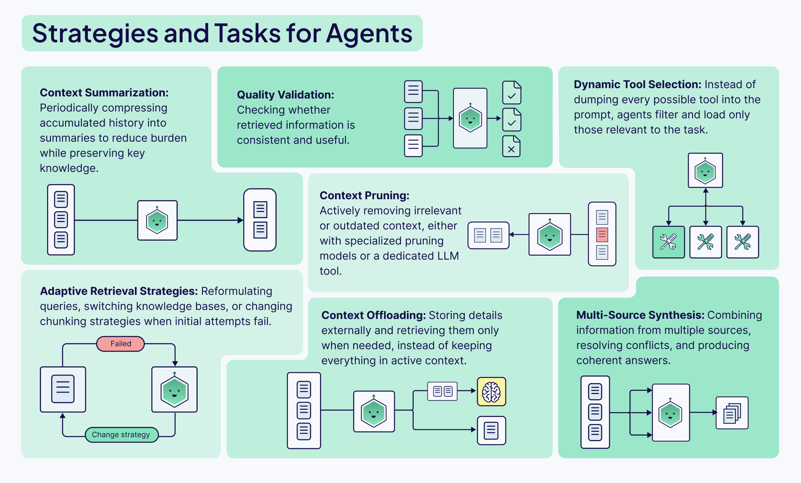

### Query Augmentation

Query augmentation is the process of refining the users initial input for downstream tasks, like querying a database or presenting it to an agent. This is unfortunately a lot harder than it sounds, but extremely important. No amount of sophisticated algorithms, reranking models, or clever prompting can truly make up for misunderstood user intent. 

There are two main things to think about:

1. **Users don’t usually interact with chatbots or input boxes in the ideal way**. Most demos will assume the users input their complete requests in the form of perfectly formatted sentences, but in production apps, the actual usage tends to be messy, unclear, and incomplete. 
2. **Different parts of your AI system need to understand and use the user’s query in different ways.** The format that’s best for an LLM is probably not the same one that you would use to query a vector database, and so we need a way to augment the query to suit different tools and steps within our workflow. 

The [Weaviate Query Agent](https://docs.weaviate.io/agents/query) is a great example of how query augmentation can easily be built into any AI app. It works by taking a user’s prompt in natural language and deciding the best way to structure the query for the database based on it’s knowledge of the cluster’s data structure and Weaviate itself. 

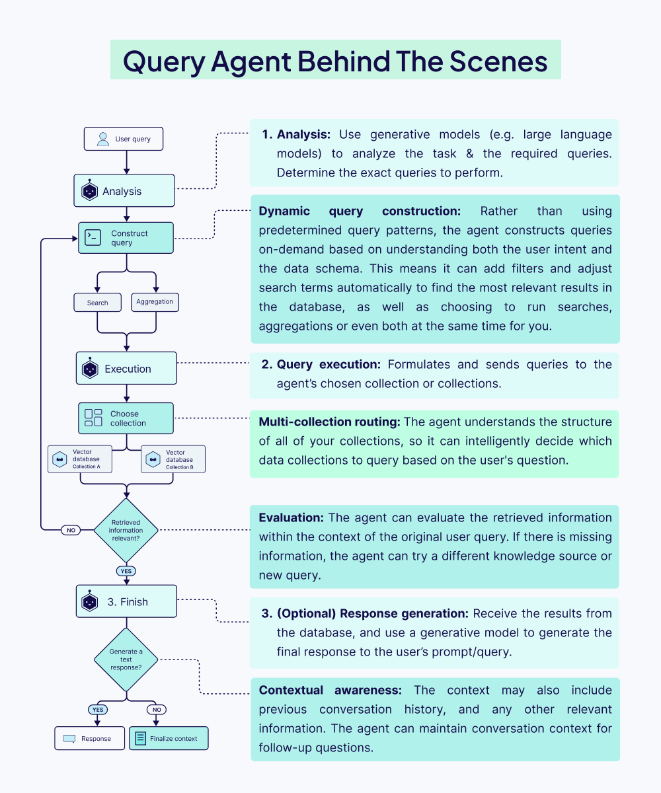

### Retrieval

A common saying when building with AI: **garbage in, garbage out**. Your Retrieval Augmented Generation (RAG) system is only as good as the information it retrieves. A well-written prompt and a robust model are useless if they're working with irrelevant context. This is why the first, and most important step, is optimizing your **retrieval**.

The most important decision you'll make here is your **chunking strategy**. It’s a classic engineering trade-off:

- **Small chunks** are great for **precision**. Their embeddings are focused, making it easy to find an exact match. The downside? They often lack the surrounding context for the LLM to generate a meaningful answer.
- **Large chunks** are rich in **context**, which is great for the LLM's final output. But their embeddings can become "noisy" and averaged out, making it much harder to pinpoint the most relevant information. Also**,** they take up more space in the LLM's context window, which can potentially displace other relevant information.

Finding that sweet spot between precision and context is the key to high-performance RAG. Get it wrong, and your system will fail to find the right facts, forcing the model to fall back on hallucination, the very thing you're trying to prevent.

To help you find the best chunking strategy for your use case, we’ve created a cheat sheet that maps out the landscape of the most common chunking strategies from simple to advanced:

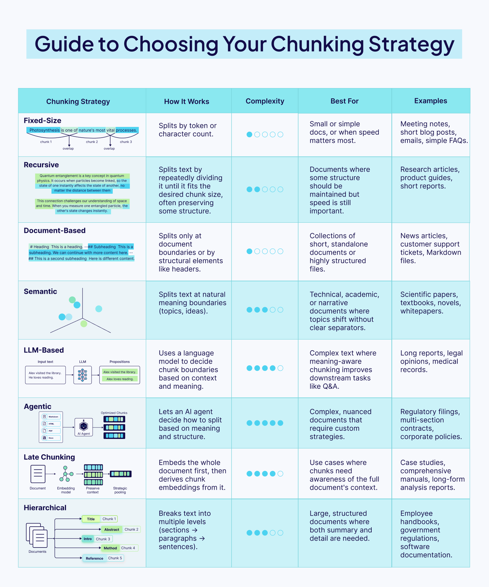

The cheat sheet is a great starting point. But if you move from a basic PoC to a production-ready system, the questions usually get harder. Should you pre-chunk everything upfront, or do you need a more dynamic post-chunking architecture? How do you find your optimal chunk size?

:::info
We cover these questions, complete with code examples, in this deep-dive blog post: [Chunking Strategies to Improve Your RAG Performance](/blog/chunking-strategies-for-rag#pre-chunking-vs-post-chunking)
:::

### Prompting Techniques

So once you’ve perfected your retrieval. Your system pulls the most relevant chunks of information in milliseconds. Your job is done, right? 

Not quite. You can't just stuff them into the **context window** and hope for the best. You need to tell the model *how* to use this newfound information. This technique is called **prompt engineering**.

In a retrieval system, your prompt is the control layer. It's the set of instructions that tells the LLM *how* to behave. Your prompt needs to clearly define the task. Are you asking the model to:

- **Synthesize** an answer from multiple, sometimes conflicting, sources?
- **Extract** specific entities and format them as a JSON object?
- **Answer** a question based *only* on the provided context to prevent hallucinations?

Without clear instructions, the model will ignore your beautifully retrieved context and hallucinate an answer. Your prompt is the final safeguard that makes the model respect the facts you've given it.

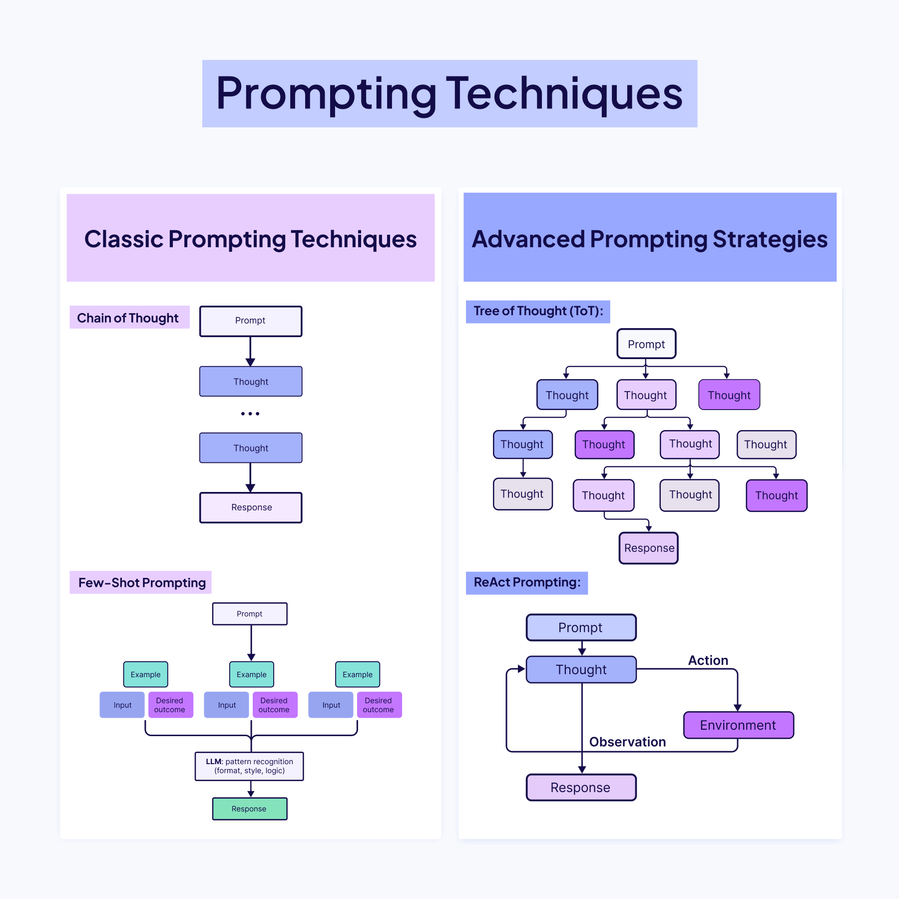

There's a whole toolkit of prompting techniques you can choose from. But to go from theory to production, you need to know not just *what* these frameworks are, but *how* and *when* to implement them. In our [Context Engineering eBook](https://weaviate.io/ebooks/the-context-engineering-guide), you’ll learn how to implement simple techniques like Chain-of-Thought (CoT) and more advanced ones like the ReAct framework to build systems that can tackle complex, multi-step tasks with reliability.

### Memory

A stateless LLM can answer a single question well, but it has no idea what happened five minutes ago or why that matters for the next decision. Memory transforms the model into something that feels more dynamic and, dare we say, more ‘human’, that’s capable of holding onto context, learning from the past, and adapting on the fly. For context engineering, the core challenge is not “how much can we store?” but “what deserves a spot in front of the model right now, and what can safely live elsewhere?

**The Architecture of Agent Memory**

Memory in an AI agent is all about retaining information to navigate changing tasks, remember what worked (or didn't), and think ahead. To build robust agents, we need to think in layers, often blending different types of memory for the best results.

**Short‑term memory** is the live context window: recent turns/reasoning, tool outputs, and retrieved documents that the model needs to reason about the current step. This space is brutally finite, so it should stay lean, just enough conversation history to keep the thread coherent and decisions grounded. 

Long-term memory, by contrast, lives outside the model, usually in vector databases for quick retrieval ([RAG](/blog/introduction-to-rag)). These stores keep information permanently, and can hold:

- Episodic Data: past events, user interactions, preferences
- Semantic Data: general and domain knowledge
- Procedural Data: routines, workflows, decision steps

Because it’s external, this memory can grow, update, and persist beyond the model’s context window. 

Most modern systems usually implement a hybrid memory setup, i.e., blending short-term memory with long-term for depth. Some architectures also add a *working memory*: a temporary space for information needed during a multi-step task. For example, while booking a trip, an agent might keep the destination, dates, and budget in working memory until the task is done, without storing it permanently.


**Designing Memory That Doesn’t Pollute Context**

The worst memory system is the one that faithfully stores everything. Old, low‑quality, or noisy entries eventually come back through retrieval and start to contaminate the context with stale assumptions or irrelevant details. Effective agents are selective: they filter which interactions get promoted into long‑term storage, often by letting the model “reflect” on an event and assign an importance or usefulness score before saving it.

Once in storage, memories need maintenance. Periodic pruning, merging duplicates, deleting outdated facts, and replacing long transcripts with compact summaries keep retrieval sharp and prevent the context window from being filled with historical clutter. Criteria like recency and retrieval frequency are simple but powerful signals for what to keep and what to retire.

Our eBook’s memory section goes deeper into more of these memory management strategies, including mastering the art of retrieval, being selective about what you store, and pruning and refining memories. It also highlights the key principle: always tailor the memory architecture to the task because there’s no one-size-fits-all solution (at least not yet).

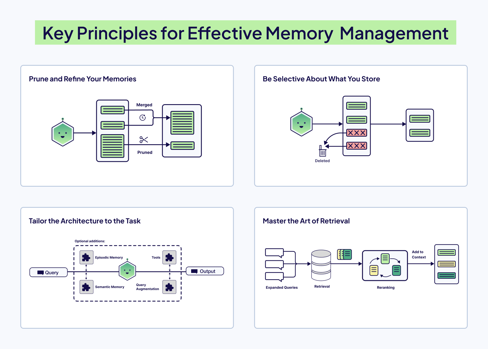

### Tools

If memory lets an agent remember its past, tool use gives it the ability to act in the present. Without tools, even the most sophisticated LLM is locked inside a text bubble, i.e., it can reason, draft, and summarize brilliantly, but it cannot check live stock prices, send an email, query a database, or book a flight. Tools are the bridge between thought and action, the medium that lets an agent step outside its training data and interact with the real world.

Context engineering for tools isn't just giving an agent a list of APIs and instructions. It's about creating a cohesive workflow where the agent can understand what tools are available, decide correctly which one to use for a specific task, and interpret the results to move forward.

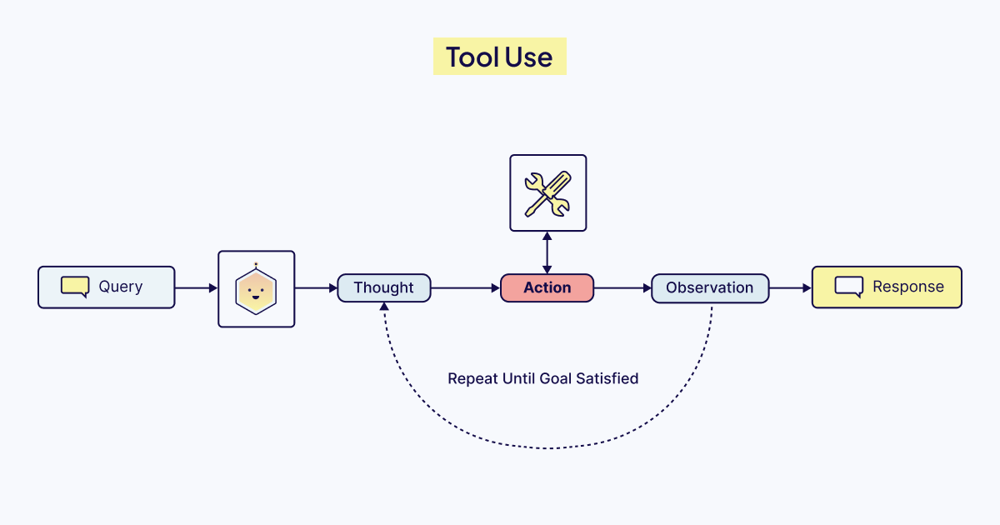

**The Orchestration Challenge**

Handing an agent a list of available tools is straightforward. Getting it to use those tools correctly, safely, and efficiently is where context engineering work begins. This orchestration involves several moving parts, all happening inside the limited context window:

- **Tool Discovery:** The agent must know what all tools it has access to. This is done by giving it a clear tool list and high-quality descriptions in the system prompt. These descriptions guide the agent in understanding how each tool works, when to use it, and when to avoid it.
- **Tool Selection and Planning:** When a user makes a request, the agent must decide whether a tool is needed and, if so, which one. For complex tasks, it may plan a sequence of tools to use (for example: “Search the weather, then email the summary”).
- **Argument Formulation:** After choosing a tool, the agent must determine the correct arguments to pass. For example, if the tool is `get_weather(city, date)`, it must infer details, such as “San Francisco” and “2025-11-25” from the user’s query and format them properly for the call.
- **Reflection:** After a tool is executed, the output is returned to the agent. The agent reviews it to decide what to do next: whether the tool worked correctly, whether more iterations are needed, or whether an error means it should try a different approach entirely.

As you can see, orchestration happens through this powerful feedback loop, often called the Thought-Action-Observation cycle. The agent constantly observes the outcome of its action and uses that new information to fuel its next "thought". This Thought-Action-Observation cycle forms the fundamental reasoning loop in modern agentic frameworks like our own [Elysia](/blog/elysia-agentic-rag). 

**The Shift Toward Standardization with MCP**

The evolution of tool use is moving more and more towards standardization. While function/tool calling works well, it creates a fragmented ecosystem where each AI application needs custom integrations with every external system. The [Model Context Protocol (MCP)](https://www.anthropic.com/news/model-context-protocol), introduced by Anthropic in late 2024, addresses this by providing a universal standard for connecting AI applications to external data sources and tools. They call it ["USB-C for AI"](https://modelcontextprotocol.io/docs/getting-started/intro) - a single protocol that any MCP-compatible AI application can use to connect to any MCP server.
So, instead of building custom integrations for each tool, developers can just create individual MCP servers that expose their systems through this standardized interface. Any AI application that supports MCP can then easily connect to these servers using the JSON-RPC based protocol for client-server communication. This transforms the MxN integration problem (where M applications each need custom code for N tools) into a much simpler M + N problem.

As tool use integration standardizes, the real work becomes designing systems that think together, not wiring them together.

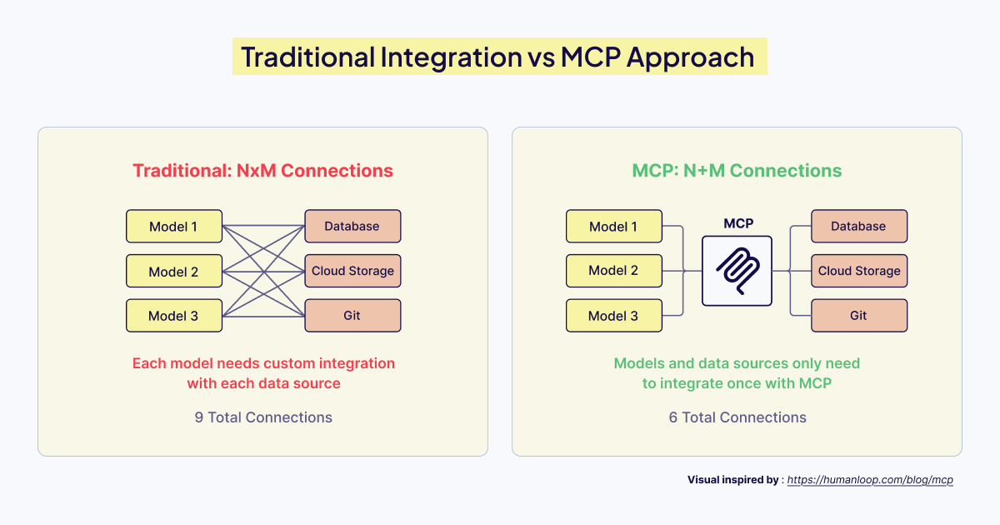

## Example: Building a Real-World Agent with Elysia

Everything covered in this blog, from agents orchestrating decisions, query augmentation shaping retrieval, memory preserving state, to tools enabling action, comes together when you build real systems.

[Elysia](https://github.com/weaviate/elysia) is our open-source agentic RAG framework that embodies these context engineering principles in a decision-tree architecture.

Unlike simple retrieve-then-generate pipelines, Elysia's decision agent evaluates the environment, available tools, past actions, and future options before choosing what to do next. Each node in the tree has global context awareness. When a query fails or returns irrelevant results, the agent can recognize this and adjust its strategy rather than blindly proceeding.

In this example, we'll build an agent that searches live news, fetches article content, and queries your existing Weaviate collections, all through intelligent decision making and orchestration of the Elysia framework. You can get started with Elysia by installing it as a Python package:

```bash
pip install elysia-ai

```

### Built-in Tools for Context-Aware Retrieval

Elysia includes five powerful built-in tools: `query` , `aggregate` , `text_response`, `cited_summarize`, and `visualize`.

- `query` tool retrieves specific data entries using different search strategies, such as hybrid search or a simple fetch objects, with automatic collection selection and filter generation via an LLM agent.
- `aggregate` tool performs calculations like counting, averaging, and summing with grouping and filtering capabilities, also with an LLM agent.
- `text_response` and `cited_summarize` respond directly to the user, either with regular text or with text that includes citations from the retrieved context in the environment, respectively.
- `visualize` tool helps visualize data that is in the environment using dynamic displays like product cards, GitHub issues, graphs, etc.

Before interacting with your collections, you'll need to run Elysia's **`preprocess()`** function on your collections so Elysia can analyze schema patterns and infer relationships.

```python
from elysia import configure, preprocess

# Connect to Weaviate
configure(
    wcd_url = "...", # replace with your Weaviate REST endpoint URL
    wcd_api_key = "..." # replace with your Weaviate cluster API key,
    base_model="gemini-2.5-flash",
    base_provider="gemini",
    complex_model="gemini-3-pro-preview",
    complex_provider="gemini",
		gemini_api_key = "..." # replace with your GEMINI_API_KEY
)

# Preprocess your collections (one-time setup)
preprocess(["NewsArchive", "ResearchPapers"])

```

:::note
This example assumes you already have `NewsArchive` and `ResearchPapers` collections set up in your Weaviate cluster with some data ingested. If you're starting fresh, check out the Weaviate documentation on [creating collections](https://docs.weaviate.io/weaviate/manage-collections/collection-operations#create-a-collection) and [importing objects](https://docs.weaviate.io/weaviate/manage-objects/import) to get your data ready for Elysia.
:::

### Custom Tools to Extend Agent's Capabilities

Elysia can also use completely custom tools, along with the built-in ones. This lets you extend the agent's reach beyond your local collections to live data, external APIs, or any other data source.

Here's how you can build a simple agent that searches live news with [Serper API](https://serper.dev/), fetches article content, and queries your existing multiple collections easily with Elysia:

```python
from elysia import Tree, tool, Error, Result

tree = Tree()

@tool(tree=tree)
async def search_live_news(topic: str):
    """Search for live news headlines using Google via Serper."""
    import httpx
    async with httpx.AsyncClient() as client:
        response = await client.post(
            "<https://google.serper.dev/news>",
            headers={
                "X-API-KEY": SERPER_API_KEY, # Replace with an actual key: https://serper.dev/api-keys
                "Content-Type": "application/json"
            },
            json={"q": topic, "num": 5}
        )
        results = response.json().get("news", [])
        yield Result(objects=[
            {"title": item["title"], "url": item["link"], "snippet": item.get("snippet", "")}
            for item in results
        ]

@tool(tree=tree)
async def fetch_article_content(url: str):
    """Extract full article text in markdown format."""
    from trafilatura import fetch_url, extract

    downloaded = fetch_url(url)
    text = extract(downloaded)
    if text is None:
        yield Error(f"Cannot parse URL: {url}. Please try a different one")

    yield Result(objects=[{"url": url, "content": text}])

response, objects = tree(
    "Search for AI regulation news, fetch the top article, and find related pieces in my archive and research papers",
    collection_names=["NewsArchive", "ResearchPapers"]
)
print(response)

```

When you run Elysia with this setup, the decision tree chains these actions intelligently:

- **`search_live_news`** tool finds breaking stories and adds them to the environment,
- **`fetch_article_content`** tool retrieves full text from the promising URL, then
- Elysia's built-in query tool searches across both collections by routing to **`NewsArchive`** for past articles and **`ResearchPapers`** for academic sources.
- When you follow up with "What academic papers by XYZ author discuss this topic?", the agent recognizes the intent and prioritizes the **`ResearchPapers`** collection without you specifying it explicitly.

This is context engineering in practice: the decision agent orchestrates information flow, augments queries on the fly, retrieves from multiple sources, maintains state across turns, and uses tools to act on the world - all while maximizing the limited context window with only the relevant tokens to drive reasoning.

:::info
The complete Elysia documentation is available at: [https://weaviate.github.io/elysia/](https://weaviate.github.io/elysia/)
:::


<video width="100%" autoplay loop controls>
  <source src={elysia} type="video/mp4" />
Your browser does not support the video tag.
</video>

## Conclusion

So, where does this leave us?

It all comes back to that gap between a flashy demo and a dependable production system. The bridge across that gap isn't a single technique; it's a discipline of the 6 pillars of context engineering that work together. 

A powerful Agent is useless without clean data from Retrieval. Great Retrieval is wasted if a poor Prompt misguides the model. And even the best Prompt can't function without the history provided by Memory or the real-world access given by Tools.

Context engineering is about shifting our role from being prompters who talk *at* a model to architects who build the world the model lives *in*.

As builders, we know that larger models do not necessarily create the best AI systems, but rather better engineering does. 

Now, let's get back to building. We’re looking forward to seeing what you’re working on! 💚

import WhatsNext from '/_includes/what-next.mdx';

<WhatsNext />
