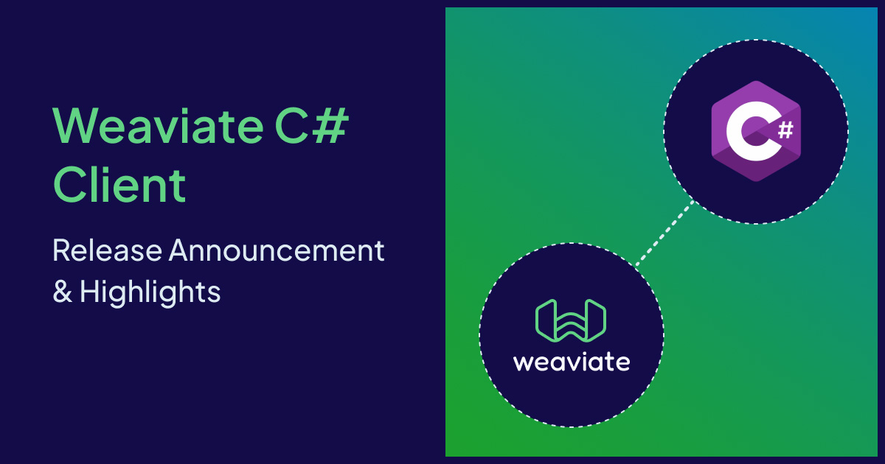

We are thrilled to announce our new **Weaviate C# client** – an official client library maintained by our Weaviate team that brings the full power of Weaviate to the .NET ecosystem. After extensive development and feedback, we're releasing a client that is not only powerful and performant but hopefully also easy and enjoyable to use for any C# developer.

## Why we built the C# client

As Weaviate's feature set grew, we recognized the need for a C# client that was more than just an API wrapper, like our previous community-maintained -NET clients. We wanted to provide an experience that felt native to C# developers, addressing common pain points.

The new C# client tackles these challenges head-on, providing a fluent, intuitive, and strongly-typed API for all Weaviate operations.

## Highlights of the new API

The new C# client is built around a few core principles: discoverability, type safety, and a streamlined developer workflow.

#### 1. Collection-centric API

Operations are now logically grouped and centered around collection handles. This aligns with how you think about your data and makes the API incredibly intuitive.

Once you have a `WeaviateClient` instance, you get a handle to a specific collection and perform all data, query, and configuration operations through it.

```csharp
// Get a handle to your collection
var movies = client.Collections.Use("Movie");

// Insert data
await movies.Data.Insert(new { Title = "The Matrix" });

// Run a query
var response = await movies.Query.NearText("sci-fi", limit: 5);
```

This collection-centric model provides a clean, organized, and thread-safe way to interact with your Weaviate database.

#### 2. Connection management

Getting connected to Weaviate is now easier than ever with static helper methods for common scenarios.

```csharp
// Connect to a local Weaviate instance
WeaviateClient localClient = await Connect.Local();

// Connect to Weaviate Cloud (WCD)
WeaviateClient cloudClient = await Connect.Cloud(
    "my-cluster.weaviate.network",
    "YOUR_WCD_API_KEY"
);

// For advanced scenarios, use the custom builder
WeaviateClient customClient = await WeaviateClientBuilder.Custom(
        restEndpoint: "my-weaviate-host.com",
        restPort: "443",
        grpcEndpoint: "my-weaviate-host.com",
        grpcPort: "443",
        useSsl: true
    )
    .WithHeaders(new Dictionary<string, string>
    {
        { "X-My-Custom-Header", "value" }
    })
    .BuildAsync();
```

The client handles connection pooling and resource management automatically, and we recommend using a single client instance throughout your application's lifecycle.

#### 3. Strongly-typed collection management

Defining and managing collection schemas is now a strongly-typed, discoverable process. The `Configure` and `Property` classes guide you with IDE autocompletion, preventing common schema definition errors.

**Creating a new collection:**

```csharp
var questions = await client.Collections.Create(new CollectionCreateParams
{
    Name = "Question",
    // highlight-start
    Properties =
    [
        Property.Text("question"),
        Property.Text("answer"),
        Property.Text("category")
    ],
    VectorConfig = Configure.Vector("default", v => v.Text2VecWeaviate()),
    GenerativeConfig = Configure.Generative.OpenAI()
    // highlight-end
});
```

You can even generate properties directly from your C# classes, reducing boilerplate and ensuring consistency between your application models and your database schema.

```csharp
public class Article
{
    public string Title { get; set; }
    public string Body { get; set; }
}

await client.Collections.Create(new CollectionCreateParams
{
    Name = "Article",
    Properties = [.. Property.FromClass<Article>()],
});
```

#### 4. Chainable filtering

Building complex filters is very intuitive. The static `Filter` class provides a fluent, chainable API that feels a lot like writing a LINQ query.

```csharp
var jeopardy = client.Collections.Use("JeopardyQuestion");
var response = await jeopardy.Query.FetchObjects(
    filters: Filter.AllOf(
        Filter.Property("round").IsEqual("Double Jeopardy!"),
        Filter.Property("points").IsLessThan(600)
    ),
    limit: 3
);
```

The API supports a wide range of operators (`IsEqual`, `IsGreaterThan`, `IsLike`, `ContainsAny`, etc.) and logical combinations (`AllOf`, `AnyOf`, `Not`), making it very simple to construct even the most complex queries.

#### 5. Integrated vector search and generative AI (RAG)

Performing vector searches and building Retrieval-Augmented Generation (RAG) pipelines is seamless.

A simple semantic search:

```csharp
var questions = client.Collections.Use("Question");

var response = await questions.Query.NearText(
    "biology",
    limit: 2
);
```

And enhancing it with a generative model for a RAG query is just as easy:

```csharp
var ragResponse = await questions.Generate.NearText(
    "biology",
    limit: 2,
    groupedTask: new GroupedTask(
        "Write a tweet with emojis about these facts."
    ),
    provider: new Providers.OpenAI() { }
);

Console.WriteLine(ragResponse.Generative?.Values.First());
```

#### 6. Simplified data management

The client provides straightforward methods for data insertion, updates, and deletion. Importing multiple objects is simple with `InsertMany`.

```csharp
var questionsToInsert = new List<object>
{
    new { answer = "...", question = "...", category = "..." },
    new { answer = "...", question = "...", category = "..." }
};

var insertResponse = await questions.Data.InsertMany(questionsToInsert.ToArray());

if (insertResponse.HasErrors)
{
    Console.WriteLine($"First failed object error: {insertResponse.Errors.First()}");
}
```

## Getting Started

### Installation

Add the Weaviate C# client to your project using the NuGet package manager:

```bash
dotnet add package Weaviate.Client
```

### Quickstart Example

This example connects to Weaviate, creates a `Movie` collection, imports data, and performs a generative search.

```csharp
using Weaviate.Client;
using Weaviate.Client.Models;
using Weaviate.Client.Models.Generative;
using System;
using System.Collections.Generic;
using System.Text.Json;

// Best practice: store your credentials in environment variables
string weaviateUrl = Environment.GetEnvironmentVariable("WEAVIATE_URL");
string weaviateApiKey = Environment.GetEnvironmentVariable("WEAVIATE_API_KEY");

// 1. Connect to Weaviate Cloud
var client = await Connect.Cloud(weaviateUrl, weaviateApiKey);

// 2. Prepare data
var dataObjects = new List<object>
{
    new {title = "The Matrix", description = "A computer hacker learns about the true nature of reality and his role in the war against its controllers.", genre = "Science Fiction"},
    new {title = "Spirited Away", description = "A young girl becomes trapped in a mysterious world of spirits and must find a way to save her parents and return home.", genre = "Animation"},
    new {title = "The Lord of the Rings: The Fellowship of the Ring", description = "A meek Hobbit and his companions set out on a perilous journey to destroy a powerful ring and save Middle-earth.", genre = "Fantasy"}
};

var CollectionName = "Movie";

await client.Collections.Delete(CollectionName);
// 3. Create the collection
var movies = await client.Collections.Create(new CollectionCreateParams
{
    Name = CollectionName,
    VectorConfig = Configure.Vector("default", v => v.Text2VecWeaviate()),
});

// 4. Import the data
var result = await movies.Data.InsertMany(dataObjects);

// 5. Run the query
var response = await movies.Query.NearText(
    "sci-fi",
    limit: 2
);

// 6. Inspect the results
foreach (var obj in response.Objects)
{
    Console.WriteLine(JsonSerializer.Serialize(obj.Properties));
}
```

## Resources

- **Documentation:** [docs.weaviate.io/weaviate/client-libraries/csharp](https://docs.weaviate.io/weaviate/client-libraries/csharp)
- **GitHub Repository:** [github.com/weaviate/csharp-client](https://github.com/weaviate/csharp-client)

## We want your feedback!

This release is a huge step forward for .NET developers using Weaviate, and it's just the beginning. We'd love to hear about your experience and any additional features and resources you might need.

- **Slack:** Join the [Weaviate Slack](https://weaviate.io/slack) community.
- **GitHub Issues:** [Report bugs or request features](https://github.com/weaviate/csharp-client/issues).
- **Forum:** Share your projects on our [community forum](https://forum.weaviate.io).

## Conclusion

The new Weaviate C# client is designed to provide a first-class developer experience for building next-generation AI applications on the .NET platform. Its modern, intuitive, and type-safe design removes friction and lets you focus on creating AI-powered applications.

We can't wait to see what you build with it!

Happy coding! 🚀

import WhatsNext from '/_includes/what-next.mdx';

<WhatsNext />
