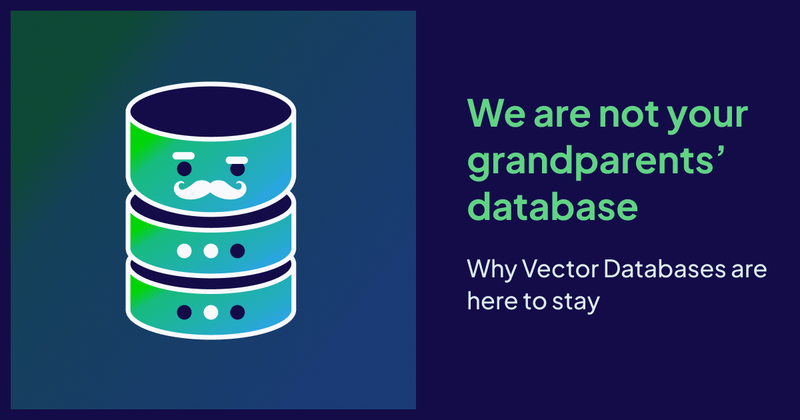

Now hear me out. Relational and NoSQL databases are great – I know, I’ve had a hand in building many of [them](https://www.linkedin.com/in/alvinrichards/). They’re battle-proven at scale and solve real problems developers care deeply about. They give us atomicity, consistency, reliability, and many other fundamental properties that let us bank, receive healthcare, and binge on entertainment without thinking too hard about how those feats are pulled off under the hood.

So why, oh why, would you need a *vector* database? 

To answer that, we need to tell a story of how data storage and retrieval evolved and why. 

## Relational databases gave us a way to model the world

Let’s wind the clock back to the early 2000s. Relational databases were king, and for that matter, they still are if you look at IDC, Gartner and other analysts research. For decades, they gave us a powerful way to model the world in data with clearly defined entities and explicit relationships. You could encode a business’ structure and rules and trust the database to keep them consistent. By that point, it may have felt like the problem of data storage and retrieval had been solved.

But not so fast. 

New challenges were emerging: ERP and CRM systems held large but relatively bounded datasets and transaction volumes; however, social media, user-generated content, and Web 2.0 applications, and Observability didn’t just read data, but **read *and* wrote** constantly at massive scale. People like to blog and upload cat videos for reals.

With systems like Oracle and PostgreSQL, [scaling](#vertical-scaling) first meant going vertical. I remember HP having to use their largest Superdome machine just to close ERP books each quarter. You can only make a single box so big until eventually physics intervenes with a huge cost hammer. The next step, then, was horizontal scaling, but this gets tricky with relational databases because you have to spread tables and their relationships across servers. In the worst case, every query requires access to every single node. Latency explodes and adding more nodes only makes things slower. Inherit on top of this, the need for distributed transactions and two-phase commit… Strategies like archiving and tiering can alleviate some of the problem but were ultimately just Band-Aids.


<a name="vertical-scaling"></a>
<br/>

> **Just five computers?**  
> IBM famously believed in the 1940s that there might be “a world market for maybe five computers”. Software architecture followed that mantra for decades: build one big box, and if you run out of capacity, get a bigger box. Vertical scaling worked remarkably well through to the 1990s until it just got too complex, expensive, and impractical. What was the alternative to a single big box? Lots and lots of smaller and cheaper boxes. Horizontal scaling, or distributing systems across many smaller machines, worked beautifully for web servers. Databases, however, had a harder time with this, as querying across many nodes was inefficient and slow. The database industry has spent the next years solving the scaling problem in entirely new ways that the original relational databases were not originally architected for.

## Different data paradigms beg different architectures

Sure, you can mitigate some of the pains of horizontal scaling by implementing custom sharding and partitioning strategies fitted to specific problem domains and data. Many teams built their own or used a third party library or fully distributed relational systems (PlanetScale, CockroachDB, Yugabyte, etc.). 

But another shift was happening in parallel – around the late 2000s, JSON became the most popular data exchange format between the front-end and back-end systems. Back-end systems needed to store JSON data in relational tables with rows and columns, despite the fact that JSON is by nature polymorphic, with no set schema. As Craigslist once noted, business initiatives were being blocked by the fixed schema nature of relational databases and how long it took to modify and change the schema.

So why not just store JSON? That was the gem of an idea behind the likes of MongoDB and Couchbase. Instead of pickling and unpickling (ha ha, is that a real thing?) data between formats, they stored JSON “as is”. No rigid schemas and migrations between schema versions; store what you receive and query what you store. Even better, JSON objects can encapsulate both data and relationships. A document becomes its own transactional boundary and reduces the need for [distributed coordination](#distributed-coordination). 


<a name="distributed-coordination"></a>
<br/>

> **The Two Phase Commit (2PC)**  
>Imagine that you are inviting three friends out to birthday drinks, classily via registered mail. You want to make sure that all three have received the invitations before making a reservation, and therefore wait for the signature upon receipt for each registered letter. But what happens if you only get two signatures back? How long do you wait for the third before making dinner reservations? What if the third signature never comes?  This type of uncertainty is what two-phase commit protocols manage: determining how long you will wait for a signature (timeouts) and how many signatures you need before moving ahead (quorums). Organizing a birthday party may have low stakes, but a lot more is riding on a distributed databases with non deterministic transactions.

## Relationship status: it’s complicated

Wait, why does managing documents need coordination? 

Let’s consider a simple example: an invoice with a header and some line items.

In a relational model, these live in separate tables and are updated together in a single transaction to ensure consistency. You wouldn’t want to save some line items but not the others, or update the header without its lines. That means the relationship between headers and line items must be explicitly modelled and coordinated. 

In a NoSQL model, both the header and line items can be stored together in a single JSON object. There’s no need to coordinate updates across different entities/tables. 

<br/>

```
InvoiceHeader
-------------
invoice_num
customer_id

InvoiceLine
-----------
invoice_num 
line_num
```
*[Figure 1: Relational Tables]*  

```json
{ 
  invoice_num: "ORD-1234",
  customer_id: "ABC",
  invoice_lines: [ 
     { line_num: 1, ... }, 
     {...} 
  ]
}
```
*[Figure 2: JSON Object]*  
<br/>

Both approaches work well here because the relationships are known ahead of time. You decide what’s related, how it’s structured, and how it should be stored. Many real world applications need this kind of well-defined data modelling, which then allows for high levels of complexity in data and usage of the data.

But relationships aren’t always tidy. 

What if invoices come from different vendors, each with their own structures? What if you’re not just storing invoices but also contracts, emails, support tickets, and attachments, all loosely related and changing over time? This is where schemaless storage shines, letting developers model messy real-world data without constantly reshaping the database itself. 

Relationships are complicated, and relational and NoSQL databases solve the problem in different ways. That’s why NoSQL became a viable category in its own right and not as a replacement for relational systems. This new type of relationship modelling enabled a new set of developers to build and solve for a new class of problems. 

And this idea, that different kinds of relationships demand different architectures, is exactly what leads us to vector databases.

## More than just “an array of numbers”

AI is being applied to solve a new class of problems that businesses need to solve right now: customer service agents, contract analysis, recommendation systems, invoice-to-cash optimization and more. At the center of all this is the ability to reason about semantic relationships. 

Why do vectors need specialized databases? Aren’t they just arrays of numbers? 

Sure, at the storage level. But that framing misses the point.

Relational schemas and JSON structures encode relationships explicitly. Semantic data is different – it uses models and math to *discover* relationships that were never codified. This is a profound shift and arguably the biggest change in how we *use* data in the last 50 years. 

Supporting semantic search requires databases built from the ground up for similarity, not exactness. Enter vector databases as a distinct category.

## Not the search for Spock, but the search for meaning

Imagine that you’re searching for: “Classic 1950s button-down shirt under $150”. 

A relational or NoSQL database handles the price constraint of $150 easily. Everything else is far more problematic. You would need pre-defined attributes or a tagging system for "classic", "1950s", and "button-down", populated consistently across every searchable product. Tokens-based systems like Elasticsearch help by indexing and stemming words, but they still depend on specific words or their roots being present. Synonyms and other lexical tricks can improve results, but they're brittle and require constant refinement and pruning.

Next imagine shirts described as "Rat Pack inspired" or "East End mobster chic". There are no mentions of "classic" or "1950s", yet any human salesperson would immediately understand the connection. 

Vector databases can make that same leap.

By using embedding models to map product descriptions into high-dimensional space, where meaning is represented by proximity rather than exact matches, in this space “classic 1950s” and “Rat Pack inspired” end up close enough across thousands of dimensions for algorithms to treat them as neighbors.

Under the hood, algorithms such as Hierarchical Navigable Small World (HNSW) graphs make this kind of similarity search fast and efficient at scale by navigating those neighborhoods without scanning everything. This isn’t an optimization of traditional search. It’s a different way of asking and answering questions, and it’s not something relational or document databases were ever designed to do.

## Why not just add vectors to what you already have?

The hard part isn’t storing vectors, but operating on them. 

Algorithms like HNSW solve a fundamentally different problem than ACID transactions, row storage, and document retrieval. Once you account for indexing, filtering, updating, and searching vectors efficiently at scale, you’re dealing with an entirely different set of architectural trade-offs. That means different storage layouts, memory models, and ultimately different performance and cost tradeoffs. Sure, those features can be added on, but those engines will always have been architected and optimized for something very different.

These differences don’t stop at the database layer, but surface directly in the Developer Experience (DX). 

Building AI applications is inherently exploratory. Developers aren’t executing known queries over well-defined schemas, but iterating on prompts, testing assumptions, evaluating models, and refining results as they go. 

A DX designed for this world minimizes friction: guidance on model choice, natural language exploration, built-in model integrations, and smart defaults that work immediately, all without making experimentation prohibitively expensive.

That combination of architectural requirements and workflow expectations is hard to retrofit onto systems designed for a different era. 

## But here’s my vector, so call me maybe

If you’ve already bet on relational or NoSQL systems, vector extensions can make sense. It’s a pragmatic step for developers looking to extend the life of existing toolchains and investments in expertise. For many teams, that’s the right place to start.   
   
Native vector databases – Weaviate, Pinecone, TurboPuffer, and others – are making a different bet. We’re betting that AI-driven workloads aren’t exceptions, but the new rule. That similarity search, model integration, and developer ergonomics aren’t features to be bolted on but the foundation of the system. And this bet is drawing in a new wave of developers.

We’ve seen this pattern before. 

A generation of developers chose not to store JSON in PostgreSQL, even once it became technically possible, but instead used MongoDB or Couchbase – not because relational databases were broken but because schemaless systems better aligned with what they were building. And we’re at the same inflection point with vectors. 

AI builders of today want to:

* Choose the right embedding model for their data and searches without guesswork (ex. Weaviate Embedding Evaluation Tool)  
* Explore data using natural language (ex. via the [Weaviate Query Agent](https://docs.weaviate.io/agents/query))  
* Evaluate and update models without re-architecting pipelines (ex. Weaviate Embedding Evaluation Tool)  
* Rely on smart defaults that produce good results quickly (ex. [dynamic index](https://docs.weaviate.io/weaviate/config-refs/indexing/vector-index#dynamic-index) types and [compression](https://docs.weaviate.io/weaviate/configuration/compression) in Weaviate)  
* Iterate safely with clear cost and performance boundaries (ex. [Weaviate new pricing](/blog/weaviate-cloud-pricing-update))

These expectations align directly with how AI applications are being built today, and they are why vector databases are a category in their own right, just as NoSQL came before them. There is no failure of previous systems here, simply a new class of problem and generation of developers.

Interesting time indeed. Vector databases aren’t your parents’, or even your grandparents' databases. Vector databases are here to innovate, they’re here to stay. (*Baby*).

import WhatsNext from '/_includes/what-next.mdx';

<WhatsNext />
