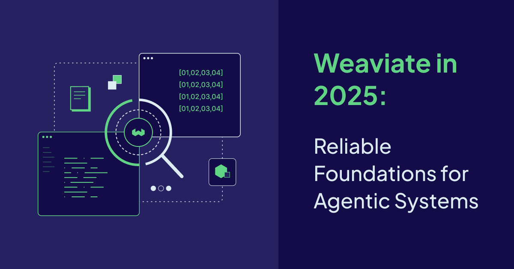

2025 was a defining year for us at Weaviate. Instead of chasing shiny features, we focused on an overarching goal - upgrading our infrastructure and technology in order to better support AI systems. In order to achieve this goal, we strengthened layers of our vector database, reduced friction for developers, and introduced purpose specific agents with which we studied adopter use cases and evolved. 

## The Big Picture

Here’s how the year came together, with three guiding principles that shaped everything we shipped:

1. **Dependability before abstraction.** Agentic systems only work when the foundation is solid \- when retrieval is predictable. We invested heavily in search quality, indexing efficiency, and operational ability so systems behave consistently as data scales, models evolve, and use cases change.   
2. **Shortening the path from idea to production.** We focused on reducing the distance between trying ideas out and shipping them with confidence, with better defaults, fewer sharp edges, and tooling that makes experimentation feel magical rather than tedious.  
3. **Agents as a first-class way to work with data.** 2025 was the year our agents moved from concept to practice. Rather than treating them as thin wrappers around queries, we began shaping them as primarily interaction tools that sit on top of reliable retrieval and mature infrastructure. 

## Weaviate Cloud: Removing Friction Without Removing Control

Over the course of 2025, Weaviate Cloud evolved into more than just managed infrastructure, but instead a guided environment for building with vectors and agents.

We introduced:

* A cloud-native [Embedding Service](https://weaviate.io/product/embeddings) that makes it easier to adopt and change models without bespoke pipelines  
* A [Data Import Tool](https://docs.weaviate.io/cloud/tools/import-tool) that reduces time-to-first-query  
* [Query Agent access](https://docs.weaviate.io/cloud/tools/query-agent) directly in the Console that enables natural-language exploration without application code  
* Versionless clusters on Shared Cloud that simplifies upgrades and improves stability  
* Features such as social login and [HIPAA compliance](/blog/weaviate-hipaa-compliant) to balance ease of use with security and regulatory needs 

Taken together, these changes make it easier to explore ideas early and safer to commit to them later.

## Weaviate Database: Core Improvements with Outsized Impact

Some of the most important work in 2025 happened deep within the database. These changes are what make production systems easier to scale, operate, and evolve.

Key advances included:

* Stronger search primitives, with [BlockMax WAND](/blog/blockmax-wand) reaching GA, BM25 improvements, [multiple-target vectors](https://docs.weaviate.io/weaviate/search/multi-vector), [multi-vector search](https://docs.weaviate.io/weaviate/tutorials/multi-vector-embeddings), and [MUVERA](/blog/muvera) encoding  
* Better efficiency through default [rotational quantization](/blog/8-bit-rotational-quantization) (RQ)  
* Dynamic scalability under real workloads with [replica movement](https://docs.weaviate.io/deploy/configuration/replica-movement) GA and [async replication](https://docs.weaviate.io/deploy/configuration/async-rep) GA
* Improved lifecycle management via [collection aliases](https://docs.weaviate.io/weaviate/manage-collections/collection-aliases) and [TTL](https://docs.weaviate.io/weaviate/manage-collections/time-to-live) support  
* Expanded security and access controls, including [cluster RBAC](https://docs.weaviate.io/weaviate/configuration/rbac), OIDC [group management](/blog/weaviate-1-33-release#oidc-group-management) and [runtime configurable certificates](/blog/weaviate-1-35-release#runtime-configurable-oidc-certificates)  
* Continued investment in developer experience, with updated and preview clients plus richer observability  
* More flexible generative and RAG workflows through runtime model configuration and new integrations

These improvements ensure that Weaviate can keep pace with fast-moving model ecosystems without forcing disruptive rewrites.

## Weaviate Agents: From Capability to Interface

In 2025, agents stopped being an idea and started being something you can actually use in Weaviate. The [Query Agent](/blog/query-agent-generally-available) reached general availability, giving users a new way to express intent and let the system plan effective retrieval strategies, whether accessed through client SDKs or directly in the Cloud Console.

Alongside this, we introduced early previews of:

* A [Transformation Agent](https://weaviate.io/product/transformation-agent), designed for mutating and enriching data  
* A [Personalization Agent](https://docs.weaviate.io/agents/personalization), aimed at adaptive, context-aware retrieval

Rather than shipping a grab bag of agents, the focus was on establishing a coherent interaction layer - one that builds on dependable retrieval and observable behavior.

## Looking Ahead to 2026

By the end of 2025, the foundation has firmly been set in place with faster, more efficient retrieval, a smoother and more secure Cloud experience, and intentional ways to interact with data with purpose-driven agents. This sets the stage for what we want to achieve in 2026: to deepen the agentic capabilities of our ecosystem.

To support mature agentic behavior at this next stage, we believe that agents must evolve. They need to reliably retrieve context, independently reason over it, operate across expanded data types, and be optimized with the most appropriate embedding models for the data they work with. Critically, they must also be able to learn and improve over time rather than resetting with each iteration. This progression isn’t driven by a single feature but by a deliberate maturation of the system as a whole. 

Many of these capabilities are already taking shape. We’re extending agentic retrieval into richer reasoning workflows, expanding [multimodal support](https://docs.weaviate.io/cloud/embeddings/models#multimodal-embedding-models) to give agents deeper context, introducing tools to measure and compare [model performance](https://weaviate.io/product-previews#preview-model-eval), and building [shared memory](https://weaviate.io/product-previews#preview-engram) to enable agents that evolve as they are used. 

2025 wasn’t about a single breakthrough feature, but about making everything to come, possible. 

import WhatsNext from '/_includes/what-next.mdx';

<WhatsNext />
