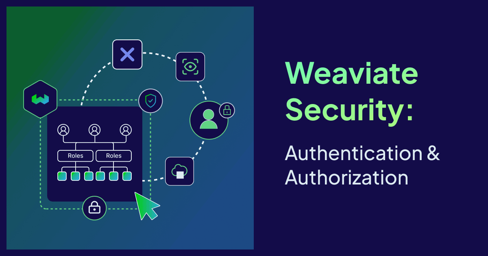
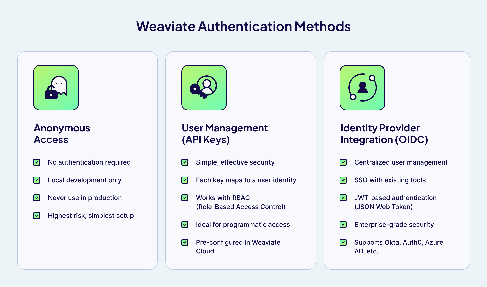
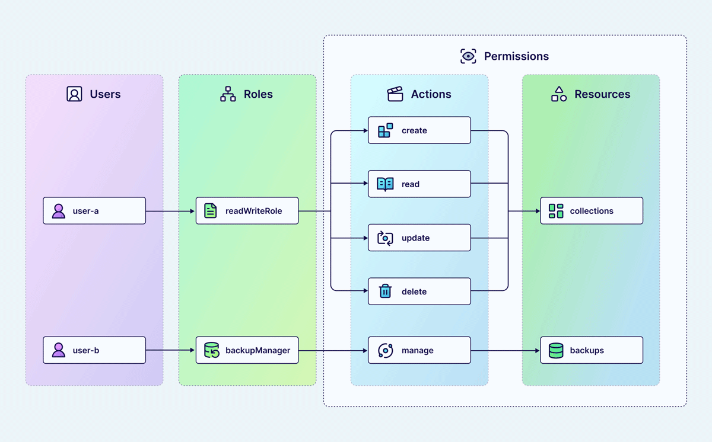

We've all heard the database horror stories. An intern accidentally exposes a customer's personally identifying information (PII) through a search API. An agentic application deletes an entire database in production. What starts as a simple oversight can quickly become a security incident, a compliance violation, or worse—a headline.

Much of this can be prevented by having the right security setup. This means knowing who is accessing the database (**authentication**), and only giving appropriate, predefined access to that user (**authorization**).

As vector databases move from prototype to production, often containing embeddings of sensitive customer data, proprietary documents, or regulated information, getting security right isn't optional. Whether you're a solo developer building your first AI application or a growing team preparing for production, understanding Weaviate's authentication and authorization options is essential.

In this guide, we'll explore what authentication and authorization mean in practice, what options Weaviate provides, and how to implement them for your use case.

## Why Access Control Matters

Just like traditional databases, access control is a critical part of the guardrails that protect a vector database. A collection containing product information should be treated differently from one containing customer service conversations, and anything containing PII must meet security and compliance requirements.

This is where the **_principle of least privilege_** becomes essential. This principle means users and applications should only have the exact access level required for them to do their job. A search API should be able to read product information (but not write), and a data scientist may access development data (but not production).

Two complementary mechanisms are essential to meet this goal:

- **Authentication** verifies the user's identity
- **Authorization** specifies what that user can do, based on their identity

### Authentication vs. Authorization

Put simply: authentication answers *"who are you?"* while authorization answers *"what are you allowed to do?"*. You need both—authentication without authorization means everyone who logs in gets full access, and authorization without authentication means you can't reliably enforce any rules. The rest of this guide covers how Weaviate implements each.

## Authentication in Weaviate

Weaviate offers several authentication options for different security requirements. Let's explore each one and when you might use them.



### Anonymous Access

Weaviate supports anonymous access, where no authentication is required to access the database.

:::caution ⚠️ Use with extreme caution

Anonymous access should only be used in local development environments. Never use anonymous access in production or with any data that requires protection.

:::

### User Management - API Keys

**API key authentication** provides a straightforward way to verify that requests come from legitimate sources. Each **API key** is associated with a **user** in Weaviate, allowing you to track who's making requests and apply appropriate permissions.

With Weaviate's [**user management**](https://docs.weaviate.io/weaviate/configuration/rbac/manage-users) (v1.30+), you can create, delete, and manage users at runtime — no restart required. Here's an example using the Python client:

```python
# Create a new user (returns an API key)
user_api_key = client.users.db.create(user_id="search-service")

# Assign a role to the user
client.users.db.assign_roles(
    user_id="search-service",
    role_names=["SearchApplication"]
)

# Rotate an API key if compromised
new_api_key = client.users.db.rotate_key(user_id="search-service")
```

:::info Static API keys

You can also define API keys as environment variables (e.g. `AUTHENTICATION_APIKEY_ALLOWED_KEYS`) for simple setups, but programmatic user management is recommended for production as it doesn't require restarting Weaviate. See the [authentication configuration docs](https://docs.weaviate.io/deploy/configuration/authentication) for details.

:::

**When to use it:**

- You're getting started with Weaviate and need simple, effective security
- You're building applications that need programmatic access
- You want to create service accounts for different applications or services
- You're using Weaviate Cloud (where API key auth is pre-configured)

API keys work well for many production scenarios, especially when combined with [role-based access control](#role-based-access-control-rbac).

### OIDC - Identity Provider (IdP) Integration

For teams with existing identity infrastructure, Weaviate integrates with third-party identity providers through [OpenID Connect (OIDC)](https://docs.weaviate.io/deploy/configuration/authentication#oidc-authentication). This includes popular providers like Okta, Auth0, Azure AD, and Google Workspace, as well as self-hosted solutions like Keycloak or Authentik.

IdP integration offers several advantages:

**For administrators:**

- Centralized user management in one tool
- Leverage specialized, highly secure identity platforms
- Reduced attack surface—fewer systems to secure
- Existing access policies and multi-factor authentication carry over
- Manage RBAC permissions through your IdP by using OIDC groups — assign roles to groups in Weaviate and manage group membership in your IdP

**For users:**

- One fewer set of credentials to manage
- Familiar login experience
- Single sign-on (SSO) across your organization's tools

A key feature of IdP integration is that user credentials are never sent to Weaviate. Instead, the user authenticates against the IdP, which generates a JSON Web Token (JWT) for use with Weaviate. This token has far more limited scope than the original credentials, reducing risk for everyone involved.

OIDC also works with [RBAC](#role-based-access-control-rbac), and supports **OIDC groups** — allowing you to manage role assignments at the group level in your identity provider rather than per-user in Weaviate. We'll explore OIDC groups in detail in an upcoming blog post.

**When to use it:**

- Your organization already uses an identity provider (Okta, Auth0, Azure AD, etc.)
- You need single sign-on (SSO) across your tooling
- You're operating in a regulated environment that requires centralized identity management
- You want multi-factor authentication (MFA) without building it yourself
- You want to manage Weaviate RBAC permissions centrally through your IdP using OIDC groups

:::tip

For enterprise-scale IdP integration, OIDC groups, and advanced SSO features, check out the [Weaviate OIDC authentication documentation](https://docs.weaviate.io/deploy/configuration/authentication#oidc-authentication).

:::

## Authorization in Weaviate: RBAC

Once a user is authenticated, authorization determines what they can do. RBAC (Role-Based Access Control) lets you define precisely what each user or application can do. It works by assigning roles to users, where each role defines specific permissions for specific resources.

**When to use it:**

- You need more than just "admin" and "read-only" access levels
- Different users or services need access to different collections
- You want to enforce the principle of least privilege
- You're preparing for production or operating in a regulated environment

**How RBAC Works:**

- **Users** are assigned one or more roles
- **Roles** are containers for permissions (e.g., `admin`, `DataScientist`, `SearchApplication`)
- **Permissions** define what resources (collections, tenants, roles, etc.) a role can access and how

Additionally: 
- **OIDC groups** can also be assigned roles, so that all users in a group automatically inherit the corresponding permissions

When a request comes in, Weaviate checks the user's role(s), evaluates their permissions for the requested operation, and either allows or denies access accordingly. All access decisions are recorded in [audit logs](https://docs.weaviate.io/deploy/configuration/logging), giving you full visibility into who accessed what and when.



*RBAC structure showing how users inherit permissions through roles*

**Built-in Roles:**

Weaviate includes built-in roles to get you started:

- `admin`: Full access to everything—useful for team leads or operators who need complete control
- `viewer`: Read-only access to everything—useful for analysts or auditors

:::note

Weaviate also has a `root` role, which is assigned to the database administrator via environment variables. The `root` user is configured at deployment time and is used for initial setup, such as creating other users and roles.

:::

**Custom Roles:**

For most real-world scenarios, you'll want to create custom roles tailored to your specific needs. Custom roles let you implement the principle of least privilege by granting exactly the permissions each user requires—nothing more, nothing less.

For example, you might create a `SearchApplication` role that can only read from your product catalog, or a `DataEngineer` role that can create and modify collections in development but only read from production.

## Practical Example: E-commerce Product Search

Let's see how authentication and authorization work together in a real-world scenario. Imagine you're running an e-commerce company using Weaviate to power product search, recommendations, and analytics.

You have three Weaviate collections:

- **`Products`**: Product descriptions and metadata
- **`CustomerBehavior`**: Purchase history, browsing patterns, interaction data (includes PII)
- **`InternalAnalytics`**: Business metrics, operational data

You define three custom roles with these permissions:

| Role                  | `Products`  | `CustomerBehavior` | `InternalAnalytics` | Collections for development |
| --------------------- | ----------- | ------------------ | ------------------- | --------------------------- |
| **Administrator**     | Full access | Full access        | Full access         | Full access                 |
| **DataScientist**     | Read only   | Read only          | Read only           | Full access                 |
| **SearchApplication** | Read only   | No access          | No access           | No access                   |

Below are some real-world scenarios that demonstrate how our security setup works:

**1. Product Searches**

When a customer searches for "wireless headphones" on your website, the search service authenticates with its API key as `searchapp`, which has the `SearchApplication` role. This role can query the `Products` collection but has no access to customer behavior or analytics data. The search works perfectly, and sensitive data remains protected.

**2. Data Science Workflow**

Your data scientist needs to build a new recommendation model. They authenticate using their API key (associated with the `DataScientist` role) and can:

- Read production data from all collections to understand patterns
- Create new collections in the development environment to experiment
- Iterate and refine the model with full control in dev

But they cannot accidentally delete or modify production data — there is no need for them to have _write_ access to it.

**3. Protection Against Compromised Credentials**

A malicious actor compromises the search application's API key. They attempt to extract customer data from the `CustomerBehavior` collection. But the `SearchApplication` role has no access to that collection—Weaviate denies the request. The attack is discovered through audit logs, the compromised key is revoked, and a new one is issued. Customer data remained protected throughout.

This example shows how authentication (verifying it's really the search application, the data scientist, or an attacker) combines with authorization (determining what each identity can do) to create robust, layered security.

## Getting Started with Weaviate Security Setup

Ready to implement authentication and authorization in your Weaviate instance? Here's how to get started based on your deployment type.

### Weaviate Open Source

Open source Weaviate users have access to all the same authentication and authorization features, with the flexibility to configure everything exactly as needed.

1. **[Choose your authentication method](https://docs.weaviate.io/deploy/configuration/authentication)**: Configure authentication in your Weaviate configuration file or environment variables. Start with API keys for simplicity, move to IdP integration as you grow
2. **[Define your roles](https://docs.weaviate.io/weaviate/configuration/rbac/manage-roles)**: Think about the different types of access you need (read-only, read-write, admin)
3. **[Set permissions](https://docs.weaviate.io/weaviate/configuration/rbac/manage-roles#create-new-roles-with-permissions)**: For each role, specify exactly which collections and actions are allowed
4. **[Assign roles](https://docs.weaviate.io/weaviate/configuration/rbac/manage-users)**: Give each user or application the least privileged role that lets them do their job
5. **[Test access](https://docs.weaviate.io/weaviate/configuration/rbac/manage-roles#view-role-details)**: Verify that each role can do what it should—and can't do what it shouldn't
6. **[Monitor and refine](https://docs.weaviate.io/deploy/configuration/logging)**: Review access logs and adjust permissions as your needs evolve

### Weaviate Cloud

Weaviate Cloud instances come with API key authentication and customizable RBAC pre-configured. This means you get production-ready security without operational overhead.

**What you can do:**

- Create custom roles with granular permissions
- Define exactly what each role can access
- Manage users and API keys through the console UI
- Assign roles to users programmatically via the API

This is optimal for teams getting started or running production workloads.

For organizations with enterprise security requirements, Weaviate Cloud's **Premium plan** offers dedicated infrastructure with SSO/SAML support, custom identity provider integration, PrivateLink, and compliance certifications (SOC II, HIPAA). This lets your team authenticate to Weaviate through your existing identity provider — check out the [Pricing Plan](https://weaviate.io/pricing) for details or [contact us](https://weaviate.io/contact) for more info.

:::info Weaviate Cloud Security

Check out the Weaviate Cloud [authentication](https://docs.weaviate.io/cloud/manage-clusters/authentication) and [authorization](https://docs.weaviate.io/cloud/manage-clusters/authorization) guides.

:::

## Conclusion

Authentication and authorization might seem like just another checkbox on the path to production, but they're fundamental to building secure, trustworthy applications. By verifying who's accessing your Weaviate instance (authentication) and controlling what they can do (authorization), you can prevent significant problems down the line. 

Start with the security model that fits your current needs:

- **Getting started?** Use [Weaviate Cloud](https://docs.weaviate.io/cloud) with API keys and RBAC
- **Growing team?** Add custom roles with granular permissions and user management
- **Need flexibility?** Deploy open source with OIDC and your preferred configuration
- **Enterprise requirements?** Use Weaviate Cloud's [Premium plan](https://weaviate.io/pricing) for dedicated infrastructure with SSO/SAML, or deploy open source with [OIDC integration](https://docs.weaviate.io/deploy/configuration/authentication#oidc-authentication)

The key is to implement security from the start and scale it as you grow. Weaviate gives you the tools to do exactly that.

## Learn More

- [Weaviate Authentication Documentation](https://docs.weaviate.io/deploy/configuration/authentication)
- [Weaviate Authorization Documentation](https://docs.weaviate.io/deploy/configuration/authorization)
- [Role-Based Access Control Guide](https://docs.weaviate.io/weaviate/configuration/rbac)
- [Weaviate Cloud Authorization](https://docs.weaviate.io/cloud/manage-clusters/authorization)

Get started with Weaviate Cloud's pre-configured security, or follow the open source setup guide to configure authentication and RBAC for your deployment.

import WhatsNext from '/_includes/what-next.mdx';

<WhatsNext />
