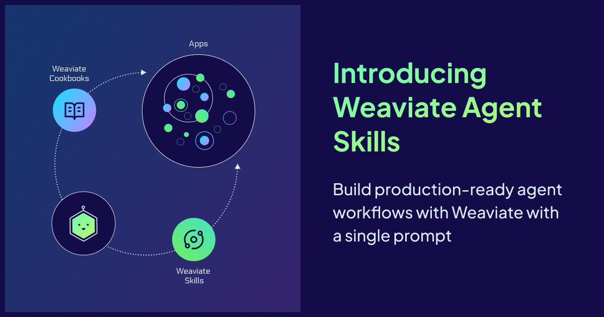
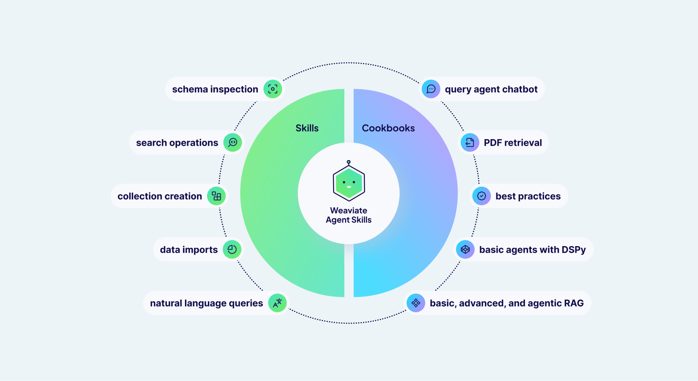

It has never been easier to build software. With tools like Claude Code, Cursor, and GitHub Copilot, we’ve moved into a high-velocity workflow often called ‘vibe coding.’ You describe a feature, an agent blueprints the logic, and the app comes to life.

But this speed usually hits a wall when it meets specialized infrastructure. While agents are great at general boilerplate, they struggle with the nuances of working with specialized tools. They often hallucinate legacy v3 Weaviate syntax, guess at hybrid search alpha parameters, or fail to implement efficient multivector embedding strategies. When you’re trying to manage three parallel agentic workflows, you don't have time to be a full-time debugger for an agent’s hallucinations. You need the implementation to be right on the first try.

To solve this, we are introducing Weaviate Agent Skills. This repository acts as a bridge between the most popular coding agents and Weaviate’s infrastructure.

**Agent Skills** has become one of the most popular tools to help coding agents write better code. [The Agent Skills format](https://agentskills.io/home), developed by Anthropic, works with Claude Code, Cursor, GitHub Copilot, VS Code, Gemini CLI, and many other tools. Our new [agent skills library](https://github.com/weaviate/agent-skills) contains both Weaviate skills and project cookbooks to help developers write better code faster.


:::info 

You can access the GitHub repo at [https://github.com/weaviate/agent-skills](https://github.com/weaviate/agent-skills).

:::


## Overview

The Weaviate Agent Skill repository is organized to support the entire development lifecycle, by moving seamlessly between Weaviate-specific operations and full end-to-end application architecture. With both granular scripts and systemic blueprints, make sure your coding agent has the context it needs, whether it's fixing a single search query or building a whole stack.



The repo is structured into two main tiers:

- **Weaviate Skill (/skills/weaviate):** Contains focused, Weaviate-specific scripts to handle things like schema inspection, data ingestion, and precision search. These are the tools your agent reaches for when it needs to manage and operate on your Weaviate cluster.
- **Cookbooks Skill (/skills/weaviate-cookbooks/):** Provides end-to-end project blueprints that guide agents in building complete applications with Weaviate and modern frameworks like FastAPI and Next.js. Ideal for "vibe coding" fully functioning systems at once.

On a high level, these skills empower your agent to handle the most important parts of the Weaviate ecosystem:

- **Cluster Management:** Automated schema inspection, collection creation, and metadata retrieval.
- **Data Lifecycle:** Streamlined imports for CSV, JSON, and JSONL data, including example data generation.
- **Agentic Search:** Direct integration with the Query Agent for natural language "Ask" and "Search" modes.
- **Advanced Retrieval:** Direct support for hybrid, semantic, and keyword search with fine-tuned parameters.

## Weaviate Skill

The `/skills/weaviate` section has scripts for any Weaviate-related functions, including search operations, natural language queries using [the Query Agent](https://docs.weaviate.io/agents/query), schema inspection, collection creation, and data imports from CSV, JSON, and JSONL files. These are automatically discovered by agents, and you can simply describe in natural language what you want the agent to do:

- "Create a Weaviate collection for my JSON data called ‘Products’"
- "Build a chatbot using the Query Agent”
- "Find products similar to 'Graphic tees' in the Products collection"

import query from './img/query.mp4';

<video width="100%" autoplay loop controls>
  <source src={query} type="video/mp4" />
Your browser does not support the video tag.
</video>

<br/>
<br/>

:::info Pro tip

The `/weaviate:data` command can help you get started with example data, and the `/weaviate:quickstart` command will walk you through the full setup.

:::

## Cookbooks

Cookbooks are end-to-end project examples using various Weaviate functionality. Each cookbook contains information for agents on both backend and frontend development using our best practice guidelines. 

### Query Agent Chatbot

This prompt builds a full-stack Query Agent chatbot using a FastAPI backend and optionally a NextJS frontend. 

```bash
/weaviate-cookbooks build a query agent chatbot with a frontend
```

### PDF Retrieval with Multivector Embeddings

This prompt implements a multimodal retrieval-augmented generation (RAG) system over PDF document collections using Weaviate Embeddings (ModernVBERT/colmodernvbert) and Ollama with Qwen3-VL for generation. It includes instructions for both PDF ingestion, querying, and answer generation.

```bash
/weaviate-cookbooks build a multivector pdf application
```

### Basic, Advanced, and Agentic RAG

Set up various RAG pipelines, from a basic retrieve-generate to using methods like query decomposition, filtering, or reranking, to including agents and agent tools like memory or hierarchical RAG.

```bash
/weaviate-cookbooks build a RAG application
```

### Basic Agents with DSPy

This prompt builds a tool-calling AI agent with structured outputs using DSPy. Optionally add RAG with tools, memory, and framework integrations.

… and more!

## Commands 

We’ve included six different [commands](https://github.com/weaviate/agent-skills/tree/main/commands) that can be used with the Claude Code Plugin. 

- **Ask**: Ask questions and get generated answers with sources using the Query Agent ask mode.
- **Collections**: List all collections in Weaviate or get the schema of an individual collection
- **Explore**: Explore a Weaviate collection's data, including property metrics and sample objects
- **Fetch**: Fetch and filter objects from Weaviate collections
- **Query**: Query Weaviate using natural language using the Query Agent search mode.
- **Search**: Search a Weaviate collection using hybrid, semantic, or keyword search

```bash
# Example usage

# Ask a question and get an AI-generated answer with source citations
/weaviate:ask query "What are the benefits of vector databases?" collections "Documentation"

# List collections or get a collection's schema
/weaviate:collections
/weaviate:collections name "Articles"

# Explore data in a collection
/weaviate:explore "Products" limit 10

# Fetch objects by ID or with filters
/weaviate:fetch collection "Articles" id "UUID"
/weaviate:fetch collection "Articles" filters '{"property": "category", "operator": "equal", "value": "Science"}'

# Search collections and get raw results
/weaviate:query query "machine learning tutorials" collections "Articles,BlogPosts" limit 5

# Search with different search types
/weaviate:search query "product SKU-123" collection "Products" type "keyword"
/weaviate:search query "similar items" collection "Products" type "semantic"
/weaviate:search query "best laptops" collection "Products" type "hybrid" alpha "0.7"
```

## Get Started

You can access [the GitHub repo here](https://github.com/weaviate/agent-skills).

The Weaviate Agent Skill is available to be installed through Cursor, Claude Code, Gemini CLI, Github CoPilot, and several other tools:

```bash
# Using npx skills (Cursor, Claude Code, Gemini CLI, etc.)
npx skills add weaviate/agent-skills

# Using Claude Code Plugin Manager
/plugin marketplace add weaviate/agent-skills
/plugin install weaviate@weaviate-plugins
```

Don’t forget to set your environment variables for the project! You can sign up for a [free sandbox cluster here](https://weaviate.io/go/console). 

```bash
export WEAVIATE_URL="https://your-cluster.weaviate.cloud"
export WEAVIATE_API_KEY="your-api-key"
```

Run the `/weaviate:quickstart` command for full instructions on how to get set up. 

We can’t wait to see what you build. Head over to the [GitHub repo](https://github.com/weaviate/agent-skills/), give it a 💚 star, and let us know which cookbooks you want to see next.


import WhatsNext from '/_includes/what-next.mdx';

<WhatsNext />
