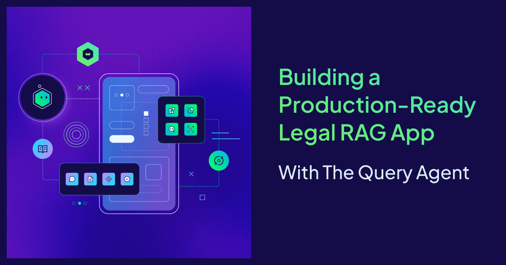
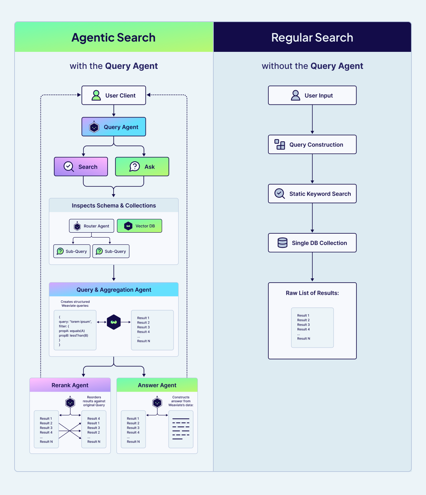
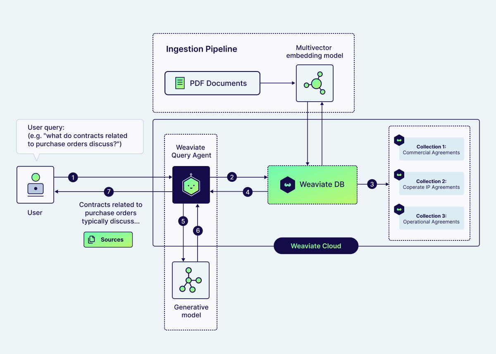

Legal research is difficult by design. Sorting through thousands of complex contracts to find a specific clause requires extreme precision and absolute security. This makes the legal domain a perfect candidate for RAG. Traditionally, building a production-ready legal assistant requires developers to orchestrate retrievers, manage conversation state, and write complex query logic, often resulting in a multi-month development cycle.

We decided to see if we could break that timeline.

When our own finance team at Weaviate asked us to help them navigate internal contracts, we used the [Query Agent](https://docs.weaviate.io/agents/query?utm_source=blogs&utm_campaign=paralegal) to turn these raw documents into a production-ready application in just 36 hours. We’ve replaced our private data with a public dataset in the demo below so you can experience this "one-prompt" legal assistant for yourself. In this post, we are showing you exactly how the architecture works and how to build it yourself.

:::info
Try out the [Legal App demo](https://paralegal.weaviate.io/?utm_source=blogs&utm_campaign=paralegal) that we’ve built, or [get started building here](#get-started).
:::

## Naive Search vs. Agentic Search: Why Legal Data Needs a Reasoning Layer

Traditional, Vanilla, or Naive RAG systems follow a linear path: taking a user’s input, creating a basic query, and performing a static search against a single collection. While this works for simple FAQ bots, it often collapses under the weight of legal documentation. Legal queries are rarely one-dimensional; they require specific filtering by date, jurisdiction, or contract type.

In a regular search setup, if you ask "What are the notice periods in our 2024 service agreements?", the retriever might pull relevant-looking clauses from 2022 simply because the text is semantically similar. Without a reasoning layer, the system lacks the common sense to apply the necessary filters before searching.



**Agentic Search** treats the database as a set of tools rather than just a static data store. The Query Agent introduces an autonomous workflow that mimics a human legal researcher, it can do things like:

- **Schema & Collection Inspection:** Analyzing your collections to determine the best strategy. It might decide to break a complex question into multiple sub-queries to ensure no clause is missed.
- **Structured Query Construction:** Building complex filters and aggregations natively, targeting only the relevant data.
- **Precision Reranking:** The **Rerank Sub-agent** ensure that the results are re-ordered based on their actual relevance to your specific question, not just their mathematical similarity.
- **Answer Synthesis:** The **Answer Sub-agent** uses the refined context to construct a grounded, reliable response.

The ability to reason about the search strategy, rather than just executing a linear keyword match, is what provides the precision that legal and finance teams require. By offloading this orchestration to the Query Agent, we were able to focus on the data itself rather than writing thousands of lines of custom search logic.

## Architecture Overview

First, the legal PDFs are embedded and ingested into Weaviate using a multivector model, ColQwen, together with Muvera compression. Instead of running OCR and chunking text, ColQwen encodes each PDF page directly as visual tokens (image patches), producing a rich multivector representation that preserves layout and tables. Muvera then compresses these multivectors, reducing memory and latency while keeping retrieval quality high.

Rather than placing all contracts in a single collection, we split them into three: **Commercial Agreements**, **Corporate & IP Agreements**, and **Operational Agreements**. This schema gives the system explicit structure. It narrows the search space and allows the Query Agent to then route each question to the most relevant collection (or collections) of documents.



The [Query Agent](https://docs.weaviate.io/agents/query?utm_source=blogs&utm_campaign=paralegal) works as the heavy lifter for the entire application. Instead of performing a simple keyword match, the agent uses agentic search strategies to turn natural-language questions into a structured Weaviate query, deciding on the search terms, filters, and which collections to search through. 

Depending on the user's goal, the agent operates in two ways:

- In **Search Mode**, it focuses on discovery by retrieving and reranking the most relevant contract sections for manual review.
- In **Ask Mode**, it synthesizes the retrieved context to generate a direct, grounded answer to the user's specific legal or financial question.

Results are then streamed back with cited source passages from the underlying contracts. This gives the end-users transparency and constrains the answer generation to the retrieved context, reducing hallucinations.

## Get started

To get started, first install the Weaviate Agent Skills:

```bash
# Using npx skills (Cursor, Claude Code, Gemini CLI, etc.)
npx skills add weaviate/agent-skills

# Using Claude Code Plugin Manager
/plugin marketplace add weaviate/agent-skills
/plugin install weaviate@weaviate-plugins
```

If you don’t already have a Weaviate cluster with data, you can use the quickstart command in Claude Code or Cursor to get set up with Weaviate:

```bash
/weaviate:quickstart
```

The quickstart will walk you through creating a Weaviate cluster and getting the correct API keys. Initialize everything with an empty collection, and then run this prompt:

```
Build a full-stack Legal Contract RAG app using the CUAD dataset and Weaviate.
Use /weaviate:weaviate-cookbooks as your primary reference — specifically the Query Agent Chatbot and Multimodal PDF RAG cookbooks, combined with the Frontend Interface guide.
                                       
Before building, ask the user two questions:

1. Do you have your own data, or should we use the CUAD legal contract dataset?
2. Do you need a frontend chat interface, or just the backend Python API?

---

## If using CUAD

Download: https://zenodo.org/records/4595826/files/CUAD_v1.zip (~106 MB)
The zip contains a `full_contract_pdf/` subfolder with 510 text-based PDFs (no OCR needed) and a CSV with contract metadata including agreement type. 
Use a random subset of 15 files from the full dataset, five from each of the main categories.

Use the CSV metadata and/or the PDF filenames (the agreement type is typically encoded at the end of each filename) to classify contracts into three high-level collections:

  CommercialContracts   — market-facing agreements (license, reseller,
                          distributor, marketing, sponsorship, franchise, etc.)
  CorporateIPContracts  — strategic and IP agreements (strategic alliance,
                          joint venture, affiliate, development, IP, etc.)
  OperationalContracts  — day-to-day agreements (service, maintenance,
                          hosting, outsourcing, supply, consulting, etc.)

Store a `contract_type` tag (the specific agreement type, e.g. "License
Agreement") on each object so users can filter within a collection.

Each object = one PDF page. Ingest with pdf2image (requires poppler:
`brew install poppler`) for the page image and pdfplumber for the text.

Schema for all three collections:

  doc_page      BLOB  base64 JPEG (vectorizer reads this)
  page_text     TEXT  pdfplumber-extracted text (Query Agent reads this)
  contract_type TEXT  skip_vectorization=True
  title         TEXT  skip_vectorization=True
  document_id   TEXT  skip_vectorization=True
  page_number   INT   skip_vectorization=True
  total_pages   INT   skip_vectorization=True

Vectorizer (all three collections):

  wvc.config.Configure.MultiVectors.multi2vec_weaviate(
      name="doc_vector",
      image_field="doc_page",   # must be singular — image_fields raises TypeError
      model="ModernVBERT/colmodernvbert",
      encoding=wvc.config.Configure.VectorIndex.MultiVector.Encoding.muvera(
          ksim=4, dprojections=16, repetitions=20
      ),
  )

---

## Critical Implementation Notes

**Weaviate client:** Use `weaviate.WeaviateAsyncClient` for the async backend.

**Dependency injection:** Import the module, not the variable, or the client will be None at request time:
  from app import lifespan as _lifespan
  def get_client(): return _lifespan.weaviate_client

**Sources endpoint:** Add `GET /sources/{collection}/{object_id}` returning all page properties including `doc_page`. BLOB fields must be requested explicitly via `return_properties` — they are not returned by default.

**If frontend is requested:** The SourcePanel should fetch from the sources endpoint and display the PDF page image (base64 JPEG from `doc_page`) alongside contract type, title, and page number along with the streamed query agent response.

**COLLECTIONS env var:** Comma-separated — split before passing to AsyncQueryAgent.
```

The coding agent will download the dataset and then embed the PDF documents with the multimodal late-interaction model. The multi-vector embeddings are stored in our three Weaviate collections, which the query agent will have access to.

On the frontend interface, you can ask questions about all the documents, and the chat will return the source pages for the answers it generates. 

  

And tada! 🎉 A full, production-ready legal chat app with just a single prompt.

## Final tips for your implementation

You can add the Query Agent to any existing Weaviate collection, or create something new with your own data. 

To take your app further, you might ask your agent to add a search page using the query agent search mode, or to create a data explorer for your PDFs.

For questions, ideas, or to just chat, feel free to join the conversation on our [community forum](https://forum.weaviate.io/). Happy building! 💚


import WhatsNext from '/_includes/what-next.mdx';

<WhatsNext />
