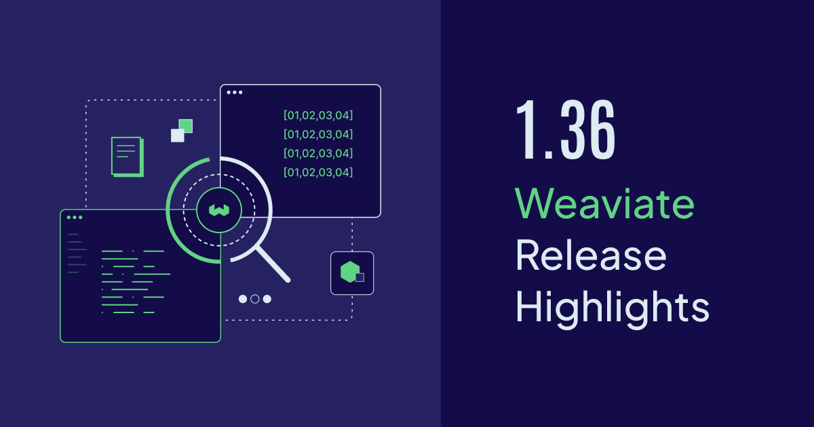

Weaviate `v1.36` is now available open-source and on [Weaviate Cloud](https://console.weaviate.cloud).

This release introduces **HFresh**, a new vector index type now available as a technical preview, alongside five features moving to general availability: **Server-side Batching**, **Object TTL**, **Async Replication Improvements**, **Drop Inverted Indices**, and **Backup Restoration Cancellation**.

These updates bring meaningful improvements to indexing performance, data lifecycle management, and operational reliability at scale.

Here are the release highlights!



- [HFresh (Preview)](#hfresh-preview)
- [Server-side Batching - General Availability](#server-side-batching---general-availability)
- [Object TTL - General Availability](#object-ttl---general-availability)
- [Async Replication Improvements - General Availability](#async-replication-improvements---general-availability)
- [Alter Schema: Drop Inverted Indices - General Availability](#alter-schema-drop-inverted-indices---general-availability)
- [Backup Restoration Cancellation - General Availability](#backup-restoration-cancellation---general-availability)
- [Multiple performance improvements and fixes](#multiple-performance-improvements-and-fixes)
- [Community contributions](#community-contributions)

## HFresh (Preview)

HNSW is fast and accurate, but as datasets grow from millions to billions of vectors, it reveals a fundamental constraint: everything needs to stay in memory. Updates become more expensive as the index grows, and deleting nodes requires re-computing neighborhoods. If your application can tolerate response times in the hundreds of milliseconds rather than tens, disk-based indexes open up new options for cost and scale.

Weaviate `v1.36` introduces **HFresh**, a new disk-based vector index inspired by the [SPFresh algorithm](https://arxiv.org/abs/2410.06981) ("SPFresh: Incremental In-Place Update for Billion-Scale Vector Search"). HFresh is now available as a **technical preview**.

Instead of connecting every vector to neighbors in a global graph (like HNSW), HFresh divides vectors into many small regions called **postings** — groups of vectors that are close to each other in vector space, stored on disk in an LSM store. Search works in two stages:

1. **Centroid lookup** — A compact in-memory HNSW index over the centroids identifies which regions of the vector space are relevant to a query
2. **Posting search** — Only the corresponding postings are fetched from disk and searched in detail

This architecture means HFresh only needs the centroid index and metadata in memory — the full vectors live on disk. The result is **significantly lower memory usage** compared to HNSW, with I/O bounded and latency predictable even as the dataset grows into the billions.

### Key Capabilities

- **Freshness without rebuilds** — Most updates only affect a small region of the vector space. Instead of periodic full rebuilds, HFresh maintains index quality through incremental rebalancing — splitting oversized postings, merging undersized ones, and reassigning vectors when boundaries shift.

- **HNSW as centroid index** — HFresh uses an HNSW index over the centroids — orders of magnitude smaller than the full dataset — to quickly identify which postings likely contain the nearest neighbors for a given query.

- **Rotational Quantization (RQ)** — HFresh applies RQ at two levels. **RQ-8** compresses the centroid index (4x savings) while preserving the precision needed for accurate partition selection. **RQ-1** compresses the on-disk postings (32x savings), enabling more vectors per disk read. RQ-1 scores are used only for candidate selection — final ranking rescores against uncompressed vectors for accuracy.

### Tuning Search Quality

HFresh exposes three key parameters for tuning performance and resource usage:

| Parameter              | Description                                                                                                                                                                                                                                                                      |
| ---------------------- | -------------------------------------------------------------------------------------------------------------------------------------------------------------------------------------------------------------------------------------------------------------------------------- |
| **`searchProbe`**      | Number of posting lists to search per query. Higher values improve recall at the cost of latency.                                                                                                                                                                                |
| **`replicas`**         | Number of posting lists each vector is added to. Higher values improve recall by increasing the chances of finding relevant vectors during search.                                                                                                                         |
| **`maxPostingSizeKB`** | Maximum size in KB for a posting list. Weaviate uses this value along with the vector dimensions to calculate the maximum number of vectors per posting. Larger values allow bigger clusters, which can improve recall but increase per-query scan time. |

### Limitations

- Only supports `cosine` and `l2-squared` distance metrics
- Preview feature — the API and behavior may change in future releases

### When to Consider HFresh

HFresh is a strong fit for use cases with:

- **Large datasets with high-dimensional embeddings** — Memory savings become substantial compared to HNSW
- **Cost-sensitive deployments** — Run the same workload on smaller infrastructure
- **Write-heavy workloads** — The cluster-based design avoids the write amplification that HNSW can experience during large imports

For smaller collections where memory is not a concern, HNSW remains the faster option.

:::caution Technical Preview

HFresh is currently a **technical preview** feature. The API and behavior may change in future releases. We recommend testing it in non-production environments before adopting it for critical workloads.

:::

:::info Related resources

- [Concepts: Vector Index - HFresh](https://docs.weaviate.io/weaviate/concepts/vector-index#hfresh-index)
- [SPFresh: Incremental In-Place Update for Billion-Scale Vector Search](https://arxiv.org/abs/2410.06981)

:::

## Server-side Batching - General Availability

**Server-side batching**, introduced as a preview in earlier versions, is now **generally available** in Weaviate `v1.36`.

With client-side batching, you have to manually define batch sizes and concurrency settings without visibility into the server's actual capacity. Server-side batching flips this model: the client opens a **persistent connection** and the server controls the flow. The server places incoming objects into an internal queue that decouples network communication from database ingestion, calculates an **exponential moving average (EMA)** of its workload, and tells the client the ideal number of objects to send in the next chunk. This dynamic backpressure mechanism automatically prevents overload and optimizes throughput without any manual tuning.

### Usage

Use `batch.stream()` to enable server-side batching. The server dynamically controls how fast the client sends data — no batch size configuration needed:

```python
collection = client.collections.get("Articles")

with collection.batch.stream() as batch:
    for item in data:
        batch.add_object(properties=item)
        if batch.number_errors > 10:
            print("Batch import stopped due to excessive errors.")
            break
```

:::info Related resources

- [How-to: Batch Import](https://docs.weaviate.io/weaviate/manage-objects/import#server-side-batching)
- [Concepts: Server-side Batching](https://docs.weaviate.io/weaviate/concepts/data-import#server-side-batching)

:::

## Object TTL - General Availability

**Object Time-to-Live (TTL)**, introduced as a technical preview in `v1.35`, is now **generally available** in Weaviate `v1.36`.

TTL allows you to set an expiration time for objects in a collection. Expired objects are automatically removed through a background deletion process, enabling data lifecycle management without manual cleanup. This is useful for enforcing data retention policies, managing storage costs, and keeping collections free of stale data.

### How It Works

TTL is configured at the collection level with three expiration strategies:

1. **Creation time** — Objects expire after a fixed duration from when they were created
2. **Last update time** — Objects expire relative to their most recent modification
3. **Date property** — Objects expire relative to a specific `DATE` property in the object itself (supports both positive and negative offsets)

Expired objects are deleted by a background process that runs on a cron schedule. You must configure the `OBJECTS_TTL_DELETE_SCHEDULE` environment variable — without it, expired objects will never be deleted.

Optionally, you can enable `filter_expired_objects` to automatically exclude expired (but not yet deleted) objects from query results.

### Configuration Examples

```python
import datetime
from weaviate.classes.config import Configure, Property, DataType

# Strategy 1: Expire 24 hours after creation
client.collections.create(
    name="SessionLogs",
    properties=[
        Property(name="data", data_type=DataType.TEXT),
    ],
    object_ttl_config=Configure.ObjectTTL.delete_by_creation_time(
        time_to_live=datetime.timedelta(hours=24),
        filter_expired_objects=True,
    ),
)

# Strategy 2: Expire 7 days after last update
client.collections.create(
    name="CacheData",
    properties=[
        Property(name="data", data_type=DataType.TEXT),
    ],
    object_ttl_config=Configure.ObjectTTL.delete_by_update_time(
        time_to_live=datetime.timedelta(days=7),
        filter_expired_objects=True,
    ),
)

# Strategy 3: Expire 30 days after a date property
client.collections.create(
    name="Events",
    properties=[
        Property(name="event_date", data_type=DataType.DATE),
        Property(name="title", data_type=DataType.TEXT),
    ],
    object_ttl_config=Configure.ObjectTTL.delete_by_date_property(
        property_name="event_date",
        ttl_offset=datetime.timedelta(days=30),
    ),
)
```

:::info Related resources

- [How-to: Configure Object TTL](https://docs.weaviate.io/weaviate/manage-collections/time-to-live)

:::

## Async Replication Improvements - General Availability

**Async replication** receives several improvements in `v1.36`, bringing it to **general availability** status.

Asynchronous replication allows Weaviate to replicate data across nodes without blocking write operations, providing eventual consistency with higher write throughput compared to synchronous replication. In `v1.36`, async replication gains **collection-level configuration** through a new `asyncConfig` parameter, giving you fine-grained control over how data is compared and propagated between nodes.

### Collection-Level Configuration

Previously, async replication behavior was controlled only through cluster-wide environment variables. Now, you can configure it per collection using `asyncConfig` within `replicationConfig`. Collections without explicit `asyncConfig` values inherit defaults from the environment variables. All parameters are **mutable after collection creation**, so you can tune replication behavior without recreating collections.

The async replication pipeline works in two phases, and the new `asyncConfig` gives you control over both:

- **Comparison** — Nodes periodically compare data using a hash tree to detect differences. You can now configure the hash tree height, comparison frequency, batch sizes for fetching object keys, and timeouts for comparison responses.
- **Propagation** — Once differences are detected, missing or outdated objects are synced between nodes. You can configure the number of concurrent propagation workers, batch sizes, propagation limits per iteration, and the delay before an object becomes eligible for propagation.

You can also set the maximum number of concurrent replication workers per collection and control how frequently node availability is checked. Defaults differ between single-tenant and multi-tenant collections to match their typical workload profiles.

:::info Related resources

- [Configuration: Async Replication](https://docs.weaviate.io/weaviate/config-refs/collections#async-config)
- [Concepts: Replication](https://docs.weaviate.io/weaviate/concepts/replication-architecture)

:::

## Alter Schema: Drop Inverted Indices - General Availability

Weaviate `v1.36` brings **Drop Inverted Indices** to **general availability**, allowing you to remove inverted indices from existing collection properties.

Previously, once an inverted index was created on a property, it could not be removed without recreating the collection. This feature lets you reclaim disk space and reduce write overhead by dropping indices that are no longer needed — for example, if your query patterns have changed and you no longer filter on a particular property.

### Usage

You can drop specific index types individually — `searchable`, `filterable`, or `rangeFilters`:

```python
collection = client.collections.get("Article")

# Drop the searchable inverted index from the "title" property
collection.config.delete_property_index("title", "searchable")

# Drop the filterable inverted index from the "title" property
collection.config.delete_property_index("title", "filterable")

# Drop the range filter index from the "chunk_number" property
collection.config.delete_property_index("chunk_number", "rangeFilters")
```

This operation is destructive — once an index is dropped, the data is removed and you would need to regenerate the index to restore it.

:::info Related resources

- [How-to: Manage collections - Inverted index](https://docs.weaviate.io/weaviate/manage-collections/inverted-index#drop-an-inverted-index)

:::

## Backup Restoration Cancellation - General Availability

Weaviate `v1.36` brings **Backup Restoration Cancellation** to **general availability**, allowing you to cancel in-progress restore operations.

Large backup restores can take significant time, and previously there was no way to abort them once started. Now you can cancel a restore that is taking too long or was started in error, freeing up resources and allowing you to retry with different parameters.

### When Can a Restore Be Cancelled?

A restore operation progresses through several phases, and cancellation is only possible during the early stages:

| Status                                             | Cancellable |
| -------------------------------------------------- | ----------- |
| `STARTED` — Preparing to stage files               | Yes         |
| `TRANSFERRING` — Staging files from object storage | Yes         |
| `TRANSFERRED` — File staging complete on all nodes | Yes         |
| `FINALIZING` — Applying schema changes via Raft    | No          |
| `SUCCESS` — Restore complete                       | N/A         |

Once the restore enters the `FINALIZING` phase, it cannot be cancelled to prevent leaving the cluster in an inconsistent state. A cancelled restore transitions through `CANCELLING` to `CANCELED`.

### Usage

```python
result = client.backup.cancel(
    backup_id="my-very-first-backup",
    backend="filesystem",
    backup_location=BackupLocation.FileSystem(path="/tmp/weaviate-backups"),
    operation="restore",
)
```

:::info Related resources

- [Configuration: Backups](https://docs.weaviate.io/deploy/configuration/backups)

:::

## Multiple Performance Improvements and Fixes

As always, Weaviate `v1.36` includes numerous performance improvements and bugfixes across the codebase. Here are some highlights:

- **HNSW Improvements:** HNSW snapshots are now enabled by default, reducing recovery time after restarts. Additional optimizations reduce memory allocations during distance calculations and disk writes during insert operations.
- **Modules & Integrations:** VoyageAI V4 model support added. Naming corrections for `multi2vec-cohere`.
- **Performance & Optimization:** Non-blocking segment deletions, enhanced tombstone cleanup, and optimized memory allocation during insert operations reduce latency and resource consumption.
- **Authentication:** Improved authentication error responses provide clearer messaging when OIDC or API key validation fails.
- **Bug Fixes:** HNSW out-of-memory prevention, vector length validation in error messages, and data race resolution in replication systems.

We always recommend running the latest version of Weaviate to benefit from these ongoing improvements.

:::info Related resources

- [Weaviate 1.36: GitHub Release Notes](https://github.com/weaviate/weaviate/releases/tag/v1.36.0)

:::

## Community Contributions

Weaviate is an open-source project, and we're always thrilled to see contributions from our amazing community. For this release, we are super excited to shout-out the following contributors for their contributions to Weaviate:

- [@DEVMANISHOFFL](https://github.com/DEVMANISHOFFL) contributed [#10134](https://github.com/weaviate/weaviate/pull/10134)
- [@jackchuka](https://github.com/jackchuka) contributed [#9919](https://github.com/weaviate/weaviate/pull/9919)
- [@Excellencedev](https://github.com/Excellencedev) contributed [#10084](https://github.com/weaviate/weaviate/pull/10084)

If you're interested in contributing to Weaviate, please check out our [contribution guide](https://docs.weaviate.io/contributor-guide/), and browse the open issues on [GitHub](https://github.com/weaviate/weaviate/issues). Look for the `good-first-issue` label to find great starting points!

:::info Related resources

- [Contributor Guide](https://docs.weaviate.io/contributor-guide)

:::

## Summary

Weaviate `v1.36` introduces a new vector index architecture and matures several features from preview to production readiness.

**Key highlights:**

- **HFresh (Preview)** — A new cluster-based vector index designed for high write throughput and memory efficiency
- **Server-side Batching GA** — Production-ready server-managed batching with flow control
- **Object TTL GA** — Automatic object expiration with flexible expiration strategies
- **Async Replication GA** — Improved reliability and customizability
- **Drop Inverted Indices GA** — Reclaim disk space by removing unused indices from existing properties
- **Backup Restoration Cancellation GA** — Cancel in-progress restore operations

**Ready to get started?**

The release is available open-source on [GitHub](https://github.com/weaviate/weaviate/releases/tag/v1.36.0) and is already available for new Sandboxes on [Weaviate Cloud](https://console.weaviate.cloud/).

For those upgrading a self-hosted version, please check the [migration guide](https://docs.weaviate.io/deploy/migration#general-upgrade-instructions) for version-specific notes.

Thanks for reading, and happy vector searching!
