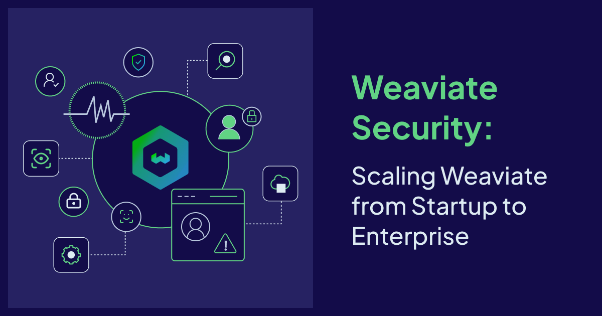

## Why Enterprise Security Is Different

Our [introductory guide to Weaviate security](https://weaviate.io/blog/weaviate-security-authn-authz) covered the fundamentals — API keys, OIDC basics, and role-based access control. Those building blocks get you far, but enterprise environments bring a different set of challenges: hundreds of users across multiple teams, regulatory compliance ([GDPR](https://gdpr.eu), [HIPAA](https://www.hhs.gov/hipaa/index.html), [SOC 2](https://weaviate.io/security), [PCI DSS](https://www.pcisecuritystandards.org), [FedRAMP](https://www.fedramp.gov)), and the expectation that your vector database integrates with the identity infrastructure you've already invested in.

To make this concrete, we'll follow _**MedVector Health**_ — a fictional health-tech company that built an AI-powered clinical search tool on Weaviate. Early on, five engineers shared two API keys. It worked fine. Then they onboarded their first hospital client, hired 40 more people, and got a call from their compliance team: a HIPAA audit was six months out. Their two original API keys had quietly become twelve, spread across Slack messages and `.env` files. When a contractor's engagement ended, nobody was sure which keys they'd had access to.

What follows is how _MedVector_ went from startup security to enterprise-grade — and how each layer they added answered a specific question their security auditors would eventually ask.

## 1. OIDC Integration for Enterprise Authentication {#oidc-integration}

:::note Auditor question:
"How do your users authenticate, and what happens to credentials if your database is compromised?"
:::

_MedVector's_ first move was to connect Weaviate to their existing Microsoft Entra ID instance. No more shared API keys passed around in Slack. When their auditors eventually asked about credential storage, the answer was simple: **"We don't store credentials. Authentication is delegated to our IdP."**

[OpenID Connect (OIDC)](https://openid.net/developers/how-connect-works/) is the foundation of enterprise authentication in Weaviate. By adopting OIDC, Weaviate eliminates the need to create isolated credential stores and instead integrates with your existing Identity Provider (IdP).


The security workflow with OIDC:

1. **Delegated Authentication:** Users authenticate with your IdP, not Weaviate.
2. **Token-Based Access:** The IdP generates a short-lived, cryptographically signed [JSON Web Token (JWT)](https://jwt.io/introduction).
3. **Zero-Knowledge:** Weaviate validates the token but never sees or stores user credentials.

This architecture drastically reduces your attack surface. Even in the unlikely event of a database compromise, there are no passwords to steal—only expired or short-lived tokens that are useless on their own.

Weaviate supports any OIDC-compliant identity provider, including [Okta](https://www.okta.com), [Microsoft Entra ID](https://www.microsoft.com/en-us/security/business/identity-access/microsoft-entra-id) (Azure AD), [Auth0](https://auth0.com), [Google Workspace](https://workspace.google.com), [Keycloak](https://www.keycloak.org), and more.

:::tip More info

Read more about OIDC integration in the [official Weaviate documentation](https://docs.weaviate.io/deploy/configuration/authentication#oidc-authentication).

:::

<details>
<summary>Setting Up OIDC: A Practical Walkthrough</summary>

Let's walk through connecting Weaviate to Microsoft Entra ID (Azure AD). The same principles apply to Okta, Auth0, Keycloak, or any OIDC-compliant provider.

**Step 1: Create an App Registration in Entra ID**

In the [Azure Portal](https://portal.azure.com), navigate to **Entra ID → App Registrations → New Registration**. Set the redirect URI to your application's callback URL and note the **Application (client) ID** and **Directory (tenant) ID**.

**Step 2: Configure Weaviate**

In your Weaviate configuration (Docker Compose, [Helm values](https://docs.weaviate.io/deploy/installation-guides/k8s-installation), or environment variables), set the OIDC parameters to point to your IdP:

```yaml
# docker-compose.yml (excerpt)
services:
  weaviate:
    environment:
      AUTHENTICATION_OIDC_ENABLED: 'true'
      AUTHENTICATION_OIDC_ISSUER: 'https://login.microsoftonline.com/<TENANT_ID>/v2.0'
      AUTHENTICATION_OIDC_CLIENT_ID: '<APPLICATION_CLIENT_ID>'
      AUTHENTICATION_OIDC_USERNAME_CLAIM: 'email'
      AUTHENTICATION_OIDC_GROUPS_CLAIM: 'groups'
```

The `OIDC_ISSUER` URL tells Weaviate where to find the IdP's discovery document (the `.well-known/openid-configuration` endpoint). Weaviate uses this to fetch the public keys it needs to validate JWTs. The `USERNAME_CLAIM` specifies which JWT claim identifies the user, and `GROUPS_CLAIM` enables [group-based role management](#oidc-groups-scaling-role-management), which we'll cover shortly.

**Step 3: Authenticate and Connect**

With OIDC configured, users authenticate against Entra ID and receive a JWT. Client libraries handle this flow:

```python
import weaviate

client = weaviate.connect_to_local(
    auth_credentials=weaviate.auth.AuthBearerToken(
        access_token="<JWT_FROM_ENTRA_ID>",
        refresh_token="<REFRESH_TOKEN>",  # optional, enables automatic token refresh
        expires_in=300,
    )
)
```

For Okta or Auth0, the only differences are the issuer URL and tenant configuration on the IdP side. The Weaviate configuration pattern remains the same.

</details>

:::info Weaviate Assurance for self-hosted deployments

If you're running a local open-source installation and need help setting up IdP integration, Weaviate offers [Assurance](https://weaviate.io/contact) — a paid support package that includes hands-on guidance for configuring OIDC, SSO, and other enterprise security features in self-hosted environments.

:::

## 2. OIDC Groups: Scaling Role Management {#oidc-groups-scaling-role-management}

:::note Auditor question:
"When employees change roles inside the company, how quickly are their access rights updated?"
:::

At 80 employees, _MedVector_ had been manually assigning Weaviate roles — and it was falling behind. When Dr. Chen moved from the clinical team to research, her old permissions lingered for two weeks before anyone noticed. They needed access that stayed in sync with reality.

**OIDC Groups** solve this by mapping your existing organizational structure directly to Weaviate roles. Your identity provider already knows who belongs to which teams. You can configure Weaviate to trust these group claims. When a user's group membership changes in your IdP (maybe they get promoted or switch teams), Weaviate automatically reflects this permission change on their next login.

After _MedVector_ mapped their Entra ID groups to Weaviate roles, the Dr. Chen problem disappeared. Moving her from `Clinical-Staff` to `Research-Team` in Entra ID automatically updated her Weaviate permissions on next login — zero manual intervention. Here's what their mapping looks like:

| Microsoft Entra ID Group | Weaviate Role         | Access Level                             |
| ------------------------ | --------------------- | ---------------------------------------- |
| `Clinical-Staff`         | `Clinician`           | Read articles, read & update patient records |
| `Research-Team`          | `Researcher`          | Read articles, full dev access           |
| `IT-Admins`              | `Administrator`       | Full access across all collections       |
| `External-Contractors`   | `DevOnly`             | Dev access only                          |

This setup gave _MedVector_ zero-touch onboarding (a new clinician is added to the `Clinical-Staff` group and immediately gains the correct Weaviate access), instant revocation (removing a user from the group instantly revokes their specific privileges), and audit simplicity (auditors only need to check the IdP group membership).

### Assigning Roles to OIDC Groups

Once Weaviate is configured with a `GROUPS_CLAIM` (as shown in the [OIDC setup](#oidc-integration) above), you can assign roles to groups programmatically:

```python
# Create a custom role
client.roles.create(
    role_name="Clinician",
    permissions=[
        weaviate.classes.rbac.permissions.Collections.read(collection="MedicalArticles"),
        weaviate.classes.rbac.permissions.Collections.read(collection="PatientRecords"),
        weaviate.classes.rbac.permissions.Collections.update(collection="PatientRecords"),
    ],
)

# Assign the role to an OIDC group (not individual users)
client.users.oidc.assign_roles(
    user_or_group="Clinical-Staff",
    role_names=["Clinician"],
)
```

Now every member of the `Clinical-Staff` group in Entra ID automatically inherits the `Clinician` role in Weaviate—no per-user provisioning required.

:::tip More info

Read more about OIDC group management in the [official Weaviate documentation](https://docs.weaviate.io/weaviate/configuration/rbac/manage-groups).

:::

## 3. Enterprise RBAC at Scale

:::note Auditor question:
"Who can access patient records, and can you prove least privilege?"
:::

_MedVector's_ first hospital client required that their patient-facing search app could query medical literature but never touch PHI (Protected Health Information). This forced _MedVector_ to move beyond simple role assignment and define a strict access matrix.

Beyond basic role assignment, enterprises need authorization policies that handle real-world complexity: multiple teams sharing infrastructure, strict data isolation requirements, and the principle of least privilege applied consistently.

_MedVector_ manages three collections with very different sensitivity levels:

1. **`MedicalArticles`** — Publicly available medical literature
2. **`PatientRecords`** — PHI, subject to HIPAA
3. **dev** collections — Environments for development and experimentation, isolated from production data


Their strict least-privilege model looks like this:

| Role                  | `MedicalArticles` | `PatientRecords` | Dev Collections |
| --------------------- | ----------------- | ---------------- | --------------- |
| **Administrator**     | Full CRUD         | Full CRUD        | Full CRUD       |
| **Clinician**         | Read only         | Read & Update    | No Access       |
| **Researcher**        | Read only         | No Access        | Full CRUD       |
| **ClinicalSearchApp** | Read only         | **No Access**    | **No Access**   |

In this setup, the patient-facing search application (`ClinicalSearchApp`) can only query medical articles—it has zero access to patient records. A researcher can read published literature for their models, but cannot touch patient records. Even if credentials are compromised, the blast radius is contained to the permissions of that specific role.

For _MedVector_, this meant their auditors could see directly in the configuration that the `ClinicalSearchApp` role had zero access to `PatientRecords`. No ambiguity, no "we think it's locked down" — the policy itself was the proof.

## 4. Multi-Tenant Security {#multi-tenant-security}

:::note Auditor question:
"Can Hospital A's staff access Hospital B's records?"
:::

Then _MedVector_ signed their second hospital client. Now they needed to guarantee that Hospital A's patient data was invisible to Hospital B — without spinning up a separate Weaviate cluster for each customer.

Many enterprise deployments use Weaviate's [multi-tenancy](https://docs.weaviate.io/weaviate/concepts/data#multi-tenancy) to isolate data for different customers, departments, or business units within a shared collection. RBAC integrates with multi-tenancy to provide tenant-level access control.

_MedVector_ uses this to ensure that Hospital A's patient data is completely isolated from Hospital B's, even though both reside in the same Weaviate collection:

```python
# Create a role scoped to a specific tenant
client.roles.create(
    role_name="HospitalA_Clinician",
    permissions=[
        weaviate.classes.rbac.permissions.Collections.read(
            collection="PatientRecords",
            tenant="hospital_a",
        ),
    ],
)
```

Requests from a user with this role that attempt to access `hospital_b` tenant data are denied. This provides data isolation without requiring separate Weaviate clusters for each customer.

:::tip More info

Read more about managing RBAC permissions in the [official Weaviate documentation](https://docs.weaviate.io/weaviate/configuration/rbac).

:::

## 5. Audit Logging and Compliance {#audit-logging}

:::note Auditor question:
"Show us every instance of PHI (Protected Health Information) access in the last 90 days."
:::

Six months after they started, the auditors arrived. _MedVector_ exported their audit logs, filtered by `collection: PatientRecords`, and handed over a complete trail — every access, every user, every decision. Audit passed.

In regulated industries, if it wasn't logged, it didn't happen. **[GDPR](https://gdpr.eu)** requires records of processing activities, **[HIPAA](https://www.hhs.gov/hipaa/index.html)** requires audit trails for all PHI access, and **[SOC 2](https://weaviate.io/security)** demands evidence of sensitive data access monitoring.

Weaviate provides comprehensive audit logging that tracks authentication events (successes and failures), RBAC checks (every permission grant or denial), role modifications (who changed permissions and when), and data access with full context on resources targeted.

Each audit log entry captures the full context of a security decision:

```json
{
  "timestamp": "2026-02-19T14:32:05.123Z",
  "level": "info",
  "action": "authorize",
  "event": "collection.read",
  "user": "dr.chen@hospital.org",
  "source_ip": "10.0.42.15",
  "collection": "PatientRecords",
  "tenant": "hospital_a",
  "result": "allowed",
  "roles": ["Clinician"],
  "request_id": "req-abc123"
}
```

:::tip More info

Read more about audit logging in the [official Weaviate documentation](https://docs.weaviate.io/deploy/configuration/logging).

:::

## 6. Network Security {#network-security}

:::note Auditor question:
"Does patient data ever traverse the public internet?"
:::

With the audit behind them, _MedVector_ turned to their final compliance checkbox: ensuring the answer to that question was a definitive no.

Authentication and authorization protect against unauthorized _logical_ access, but enterprise deployments also need to secure _network-level_ access. Weaviate Cloud Dedicated deployments support **[PrivateLink](https://aws.amazon.com/privatelink/)** (AWS) to ensure that traffic between your applications and Weaviate never traverses the public internet.

For self-hosted deployments, standard network security best practices apply: deploy Weaviate behind a reverse proxy or load balancer with TLS termination, restrict network access using firewall rules or [Kubernetes network policies](https://kubernetes.io/docs/concepts/services-networking/network-policies/), and use [Weaviate's TLS configuration](https://docs.weaviate.io/weaviate/tutorials/tls-ssl) to encrypt traffic in transit.

## Weaviate Cloud: Shared vs. Dedicated {#cloud-comparison}

For teams getting started or running non-regulated workloads, Shared deployments provide strong baseline security with API keys, RBAC, and OIDC. For organizations with enterprise compliance requirements, network isolation needs, or large-scale IdP integration, Dedicated deployments provide the full security stack—including SSO, which lets your team authenticate to the Weaviate Cloud console with their corporate identity, eliminating separate credentials and ensuring access is synchronized with your IdP.

Weaviate Cloud offers two deployment tiers with different security capabilities:

| Feature                   | Shared Deployment                        | Dedicated (Premium) Deployment    |
| ------------------------- | ---------------------------------------- | --------------------------------- |
| API Key Authentication    | ✅                                       | ✅                                |
| Custom RBAC Roles         | ✅                                       | ✅                                |
| User Management           | ✅                                       | ✅                                |
| OIDC Integration          | ✅                                       | ✅                                |
| SSO / SAML for Console    | ❌                                       | ✅                                |
| OIDC Groups               | ❌                                       | ✅                                |
| PrivateLink / VPC Peering | ❌                                       | ✅                                |
| Compliance (HIPAA)        | ❌                                       | ✅                                |
| Network Isolation         | Shared infrastructure                    | Dedicated infrastructure          |
| SLA Availability          | [99.5% - 99.9%](https://weaviate.io/sla) | [99.95%](https://weaviate.io/sla) |

:::tip More info

Read more about the different Weaviate Cloud deployments on our [pricing page](https://weaviate.io/pricing).

:::

:::info Weaviate Assurance for self-hosted deployments

If you're running a self-hosted Weaviate deployment and need help with IdP integration, security hardening, or compliance configuration, Weaviate offers [Assurance](https://weaviate.io/contact) — a paid support package that includes hands-on guidance for configuring OIDC, SSO, and other enterprise security features.

:::

## Implementation Roadmap

_MedVector's_ journey from shared API keys to a passed HIPAA audit followed a predictable lifecycle. Here's the same path, generalized:

**1. Discovery** — Start by mapping your data sensitivity levels. Identify which Weaviate collections contain PII, regulated data, or IP-sensitive information. Catalog your existing IdP groups and determine how they map to logical roles (Administrator, Developer, Viewer, Service Account). This mapping exercise typically reveals gaps in your current access model.

**2. Architecture** — Define your custom roles in Weaviate, following the principle of least privilege. Use the [RBAC documentation](https://docs.weaviate.io/weaviate/configuration/rbac) to create roles with granular, collection-level permissions. If you're using multi-tenancy, include tenant-level scoping. Document the mapping between IdP groups and Weaviate roles.

**3. Integration** — Configure OIDC in your IdP. For Entra ID, this means creating an App Registration and setting the appropriate redirect URIs. For Okta, create a new OIDC application. Update your Weaviate configuration with the issuer URL, client ID, and claims mapping as shown in the [OIDC setup section](#oidc-integration). Test the token flow end-to-end in a staging environment before touching production.

**4. Testing** — Verify that adding a user to an IdP group grants the correct Weaviate permissions and that removing them revokes access. Test edge cases: what happens when a user belongs to multiple groups? When a token expires mid-session? Automate these tests so they run on every configuration change.

**5. Operations** — Configure log shipping to your [SIEM](https://www.ibm.com/topics/siem) and set up alerts for "Access Denied" spikes, administrative role changes, and unusual access patterns (e.g., a service account suddenly querying a new collection). Establish a key rotation schedule and integrate it with your secrets management tooling.

## Conclusion

Enterprise security is about integration, not isolation. Weaviate meets enterprises where they are by integrating with existing identity providers, respecting organizational structures through OIDC groups, and providing compliance-ready audit trails.

The key enterprise security features covered in this guide:

- **OIDC Integration** that delegates authentication to your existing IdP
- **OIDC Groups** that map your org structure to access control with automatic provisioning and revocation
- **Granular RBAC** with collection-level and tenant-level permissions
- **Multi-Tenant Security** for data isolation within shared collections
- **Audit Logging** for compliance (SOC 2, HIPAA, GDPR)
- **Network Security** with PrivateLink, VPC Peering, and TLS encryption
- **Cloud Deployment Options** from shared to dedicated, with SSO for enterprise teams

_MedVector_ didn't rip and replace their database as they grew from five engineers to a multi-hospital platform — they layered on security capabilities as the need arose. You can do the same. Start with basic RBAC, grow into IdP integration, and mature into full audit logging—all on the same platform.

Ready to secure your AI infrastructure? [Schedule a consultation](https://weaviate.io/contact) with Weaviate's enterprise team to discuss your specific IdP integration requirements.

:::info Further Reading:

- [Documentation: OIDC Authentication](https://docs.weaviate.io/deploy/configuration/authentication#oidc-authentication)
- [Documentation: RBAC Authorization](https://docs.weaviate.io/weaviate/configuration/rbac)
- [Documentation: OIDC Group Management](https://docs.weaviate.io/weaviate/configuration/rbac/manage-groups)
- [Weaviate Trust & Security Center](https://weaviate.io/security)

:::

import WhatsNext from '/_includes/what-next.mdx';

<WhatsNext />
