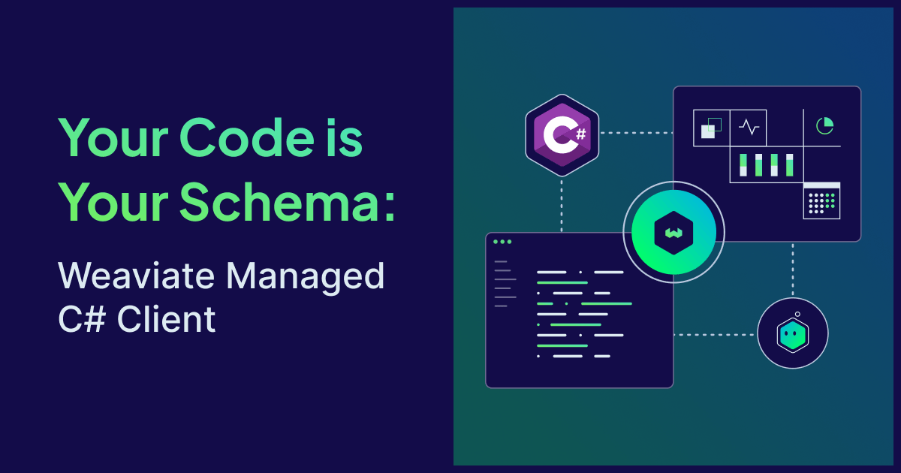

If you've ever built a robust .NET application, you know the pain of maintaining database schemas with magic strings and separate configuration files. Rename a property, forget to update your config, and you've got a runtime error.

Enter the [**Weaviate Managed .NET Client**](https://github.com/weaviate/csharp-client-managed). As a newly released experimental alternative to traditional client libraries, it brings an Entity Framework Core-inspired experience directly to Weaviate. You can now define collections with C# attributes, query with type-safe LINQ expressions, and let the client handle schema creation, migrations, and object mapping—all in idiomatic .NET.

To show what this looks like in practice, we'll build a semantic document search engine. Along the way, you'll see how attributes replace separate schema config objects, how LINQ-style expressions compile into [vector search](https://weaviate.io/blog/what-is-a-vector-database) filters, and how a single codebase can grow from personal tool to multi-tenant platform.

## Your code is your schema

The Weaviate Managed C# Client is inspired by [Entity Framework Core](https://learn.microsoft.com/en-us/ef/core/). Instead of building `CollectionCreateParams` objects with string-based property names, you define your [Weaviate](https://weaviate.io/) collection schema directly on your model class with [attributes](https://github.com/weaviate/csharp-client-managed/blob/main/docs/ATTRIBUTES.md).

Our app stores documents with a title, body content, source tag, and freeform tags. Each document gets two [vector embeddings](https://weaviate.io/blog/what-is-a-vector-database) — one on the title for quick headline matching and one on the full content for deep semantic search — both generated automatically by [Weaviate Embeddings](https://weaviate.io/product/embeddings). Here's how that translates to a single C# class:

```csharp
[WeaviateCollection("Document")]
public class Document
{
    [WeaviateUUID]
    public Guid Id { get; set; }

    [Property]
    [Index(Filterable = true, Searchable = true)]
    public string Title { get; set; } = "";

    [Property]
    [Index(Searchable = true)]
    [Tokenization(PropertyTokenization.Word)]
    public string Content { get; set; } = "";

    [Property]
    [Index(Filterable = true)]
    public string Source { get; set; } = "";

    [Property]
    [Index(Filterable = true)]
    public string[] Tags { get; set; } = [];

    [Property]
    public DateTime SavedAt { get; set; }

    [Vector<Vectorizer.Text2VecWeaviate>(
        Name = "title_vector",
        SourceProperties = [nameof(Title)]
    )]
    public float[]? TitleEmbedding { get; set; }

    [Vector<Vectorizer.Text2VecWeaviate>(
        Name = "content_vector",
        SourceProperties = [nameof(Content)]
    )]
    public float[]? ContentEmbedding { get; set; }
}
```

Two [named vectors](https://github.com/weaviate/csharp-client-managed/blob/main/docs/ADVANCED.md#multiple-named-vectors) — one on the title for precise matches, one on the content for deep [semantic search](https://weaviate.io/blog/what-is-a-vector-database). C# types map to Weaviate data types automatically: `string` → Text, `string[]` → TextArray, `decimal` → Number, `DateTime` → Date. The `[Index]` attribute controls what’s filterable, searchable, or range-queryable.

One call creates the collection:

```csharp
await client.Collections.CreateFromClass<Document>();
```

No separate config file, no builder chains — the model class _is_ the schema.

### Compare this to the core C# client

The core [Weaviate C# Client](https://weaviate.io/blog/weaviate-csharp-client-release) — which the managed client builds on — requires the schema separately:

```csharp
var config = new CollectionCreateParams
{
    Name = "Document",
    Properties =
    [
        Property.Text("title", indexFilterable: true, indexSearchable: true),
        Property.Text("content", indexSearchable: true, tokenization: Tokenization.Word),
        Property.Text("source", indexFilterable: true),
        Property.TextArray("tags", indexFilterable: true),
        Property.Date("savedAt"),
    ],
    VectorConfig = new VectorConfigList(
        Configure.Vector("title_vector", v => v.Text2VecWeaviate()),
        Configure.Vector("content_vector", v => v.Text2VecWeaviate())
    ),
};

await client.Collections.Create(config);
```

Both are valid. But the property names here are strings — rename `"title"` to `"heading"` in the config and forget your model class, and you get a runtime error. With the managed client, a rename is a refactor that your IDE can handle.

If you're already in the [Microsoft.Extensions.VectorData](https://learn.microsoft.com/en-us/dotnet/ai/ai-extensions) ecosystem, Weaviate has a provider for it too. That abstraction is a good fit if you need to stay portable across vector stores. The trade-off is that it exposes only the common API surface — multi-tenancy, aggregations, named vectors, RAG, migrations, and cross-references aren't available through it. The managed client gives you all of Weaviate's capabilities with the same .NET-native ergonomics.

## Wiring it up with a context

Now let’s add a `Note` collection for user annotations on documents, and group everything in a `RecallContext`:

```csharp
[WeaviateCollection("Note")]
public class Note
{
    [WeaviateUUID]
    public Guid Id { get; set; }

    [Property, Index(Searchable = true)]
    public string Content { get; set; } = "";

    [Property]
    public DateTime CreatedAt { get; set; }

    [Reference]
    public Document? Document { get; set; }

    [Vector<Vectorizer.Text2VecWeaviate>(SourceProperties = [nameof(Content)])]
    public float[]? Embedding { get; set; }
}

public class RecallContext : WeaviateContext
{
    public RecallContext(WeaviateClient client) : base(client) { }

    public CollectionSet<Document> Documents { get; set; } = null!;
    public CollectionSet<Note> Notes { get; set; } = null!;
}
```

The [`[Reference]`](https://github.com/weaviate/csharp-client-managed/blob/main/docs/GUIDE.md#references) on `Note.Document` creates a cross-collection reference — the target collection name resolves automatically from `Document`’s `[WeaviateCollection]` attribute. The [`RecallContext`](https://github.com/weaviate/csharp-client-managed/blob/main/docs/GUIDE.md#weaviatecontext-recommended) works like an EF Core `DbContext`: each `CollectionSet<T>` is your gateway to query, insert, and manage that collection.

The managed client’s [`Batch()`](https://github.com/weaviate/csharp-client-managed/blob/main/docs/GUIDE.md#batch-operations) method handles cross-collection inserts with automatic dependency ordering:

```csharp
var context = new RecallContext(client);

var k8sArticle = new Document { Title = "Zero-Downtime Deployments with Kubernetes", Source = "blog", Tags = ["kubernetes", "devops"], SavedAt = DateTime.UtcNow };
var authArticle = new Document { Title = "OAuth 2.0 for Service-to-Service Auth", Source = "internal-wiki", Tags = ["security", "oauth"], SavedAt = DateTime.UtcNow };
var note = new Note { Content = "Compare with mTLS — revisit next sprint", CreatedAt = DateTime.UtcNow, Document = authArticle };

await context.Batch()
    .Insert(k8sArticle, authArticle)
    .Insert(note);
```

One awaitable call, two collections, one cross-reference — the batch figures out insertion order automatically, and IDs are assigned back to your objects.

## Searching by meaning

Here’s where a [vector database](https://weaviate.io/blog/what-is-a-vector-database) earns its keep. Semantic search in C# with Weaviate uses familiar LINQ-style syntax with type-safe expressions — the Weaviate .NET client compiles your lambdas into vector filters at runtime:

```csharp
var results = await context.Documents
    .Query()
    .NearText("zero downtime deployment strategies")
    .Where(d => d.Source == "blog" && d.Tags.ContainsAny(["kubernetes"]))
    .WithMetadata()
    .Limit(5)
    .Execute();

foreach (var result in results)
    Console.WriteLine($"{result.Object.Title} (distance: {result.Metadata?.Distance})");
```

You can target a specific named vector, or use [hybrid search](https://weaviate.io/blog/hybrid-search-explained) to blend semantic and keyword matching:

```csharp
// Target just the title vector
await context.Documents.Query()
    .NearText("deployment strategies", targetVector: "title_vector")
    .Limit(5).Execute();

// Hybrid: alpha 1.0 = pure vector, 0.0 = pure BM25
await context.Documents.Query()
    .Hybrid("kubernetes rolling update", alpha: 0.7f)
    .Limit(10).Execute();
```

## When your schema evolves

A few weeks in, you need a `ReadCount` property and want tags to be searchable. Update the class and the managed client takes care of the rest:

```csharp
[Property]
public int ReadCount { get; set; }  // NEW

[Property]
[Index(Filterable = true, Searchable = true)]  // CHANGED
public string[] Tags { get; set; } = [];
```

Check what changed, then [apply](https://github.com/weaviate/csharp-client-managed/blob/main/docs/MIGRATIONS.md):

```csharp
var plan = await context.Documents.CheckMigrate();
Console.WriteLine(plan.GetSummary());
// Migration plan for 'Document' (2 changes):
//   ✓ AddProperty: Add property 'readCount' (Int)
//   ✓ UpdateInvertedIndex: Enable searchable on 'tags'

await context.Documents.Migrate();
```

Both changes are safe — additive only. Try something breaking, like changing `ReadCount` from `int` to `string`, and the migration system throws an exception rather than silently corrupting data. Use `await context.Migrate()` to migrate all collections at once, and `allowBreakingChanges: true` when you mean it.

## AI-powered summaries with RAG

The managed client supports [Retrieval-Augmented Generation](https://docs.weaviate.io/weaviate/starter-guides/generative) with a single attribute. Add [`[Generative<T>]`](https://github.com/weaviate/csharp-client-managed/blob/main/docs/ATTRIBUTES.md#generativet) to any collection and queries can synthesize answers grounded in retrieved documents:

```csharp
[WeaviateCollection("Document")]
[Generative<GenerativeConfig.OpenAI>(Model = "gpt-4o")]
public class Document { ... }
```

That’s the only schema change. Now [`.Generate()`](https://github.com/weaviate/csharp-client-managed/blob/main/docs/GUIDE.md#generative-ai-rag) is available on any query:

```csharp
var response = await context.Documents
    .Query()
    .NearText("zero downtime deployment strategies")
    .Limit(5)
    .Generate(
        singlePrompt: "Summarize this document in one sentence.",
        groupedTask: "What's the recommended deployment strategy across these documents?"
    );

foreach (var result in response)
    Console.WriteLine($"{result.Object.Title}: {result.Generative?[0]}");

Console.WriteLine($"Recommendation: {response.Generative?[0]}");
```

`singlePrompt` generates a response per document. `groupedTask` sends all results to the LLM and receives a single synthesized answer. Use either or both.

## Projections and analytics

When building a search results page, you often don’t need full document content — just titles, tags, and a relevance score. [Projections](https://github.com/weaviate/csharp-client-managed/blob/main/docs/GUIDE.md#query-projections) let you define a lightweight read model:

```csharp
[QueryProjection<Document>]
public class DocumentSummary
{
    public string Title { get; set; } = "";
    public string[] Tags { get; set; } = [];

    [MetadataProperty]
    public float? Distance { get; set; }
}

var results = await context.Documents.Query<DocumentSummary>()
    .NearText("authentication patterns").Limit(10).Execute();
```

For library-wide analytics, [aggregations](https://github.com/weaviate/csharp-client-managed/blob/main/docs/GUIDE.md#aggregations) answer questions like “which sources contribute the most?” without pulling every object:

```csharp
[QueryAggregate<Document>]
public class DocumentAnalytics
{
    [Metrics(Metric.Text.Count, Metric.Text.TopOccurrences)]
    public Aggregate.Text Source { get; set; }

    // Naming convention: {PropertyName}{MetricName} — no attribute needed
    public long? ReadCountSum { get; set; }
    public double? ReadCountMean { get; set; }
}

var analytics = await context.Aggregate<DocumentAnalytics>();
Console.WriteLine($"Total reads: {analytics.Properties.ReadCountSum}");
Console.WriteLine($"Avg reads per doc: {analytics.Properties.ReadCountMean}");
```

## Multi-tenancy and DI

As your app grows, you may need to isolate data per user or team. Weaviate's [multi-tenancy](https://docs.weaviate.io/weaviate/concepts/data#multi-tenancy) handles this at the database level — enable it on the collection and scope the context per tenant with the same model classes:

```csharp
[WeaviateCollection("Document", MultiTenancyEnabled = true)]
public class Document { ... }

var teamAlpha = context.ForTenant("team-alpha");
var teamBeta  = context.ForTenant("team-beta");

await teamAlpha.Insert(alphaDoc);
```

`ForTenant()` returns an immutable clone — the original stays unscoped. For [ASP.NET](http://ASP.NET) Core, wire it up once via the [DI container](https://github.com/weaviate/csharp-client-managed/blob/main/docs/ADVANCED.md#di-path):

```csharp
builder.Services.AddWeaviateContext<RecallContext>(options =>
{
    options.AutoMigrate = true;
});
```

`AutoMigrate` applies safe migrations on startup, so the schema stays in sync without manual `Migrate()` calls.

> **⚠️ A note on AutoMigrate in production:** > While `options.AutoMigrate = true;` is good for rapid development and local testing, it's generally best avoided in production environments.

## Escape hatches

What if you need to exclude the collection name from vectorization to keep embeddings focused on content? C# attributes have limits — you can’t call methods or pass complex objects. When you need more control, [`ConfigMethod`](https://github.com/weaviate/csharp-client-managed/blob/main/docs/ADVANCED.md#configmethod-patterns) lets you drop into imperative code:

```csharp
[Vector<Vectorizer.Text2VecWeaviate>(ConfigMethod = nameof(ConfigureVector))]
public float[]? ContentEmbedding { get; set; }

public static Vectorizer.Text2VecWeaviate ConfigureVector(string vectorName, Vectorizer.Text2VecWeaviate prebuilt)
{
    prebuilt.VectorizeCollectionName = false;
    return prebuilt;
}
```

The client builds the config from attributes first, then passes it to your method for tweaks. The same pattern works on `[Generative<T>]`, `[Reranker<T>]`, and at the collection level via [`CollectionConfigMethod`](https://github.com/weaviate/csharp-client-managed/blob/main/docs/GUIDE.md#collection-configuration-hooks).

## Summary

The Weaviate Managed C# Client lets you build search and AI features the way .NET developers already think. Your models carry the schema, the context groups everything together, and migrations keep your data safe as requirements evolve. You get all the power of Weaviate—semantic search, RAG, and multi-tenancy—without the boilerplate.

The Managed C# Client is [available on NuGet](https://www.nuget.org/packages/Weaviate.Client.Managed) and [open source on GitHub](https://github.com/weaviate/csharp-client-managed). For a deeper dive, see the [user guide](https://github.com/weaviate/csharp-client-managed/blob/main/docs/GUIDE.md), the [attributes reference](https://github.com/weaviate/csharp-client-managed/blob/main/docs/ATTRIBUTES.md), and the [advanced patterns](https://github.com/weaviate/csharp-client-managed/blob/main/docs/ADVANCED.md) docs.

import WhatsNext from '/_includes/what-next.mdx';

<WhatsNext />
