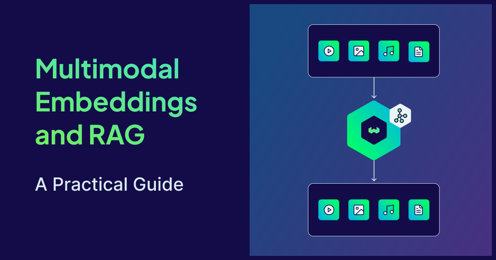
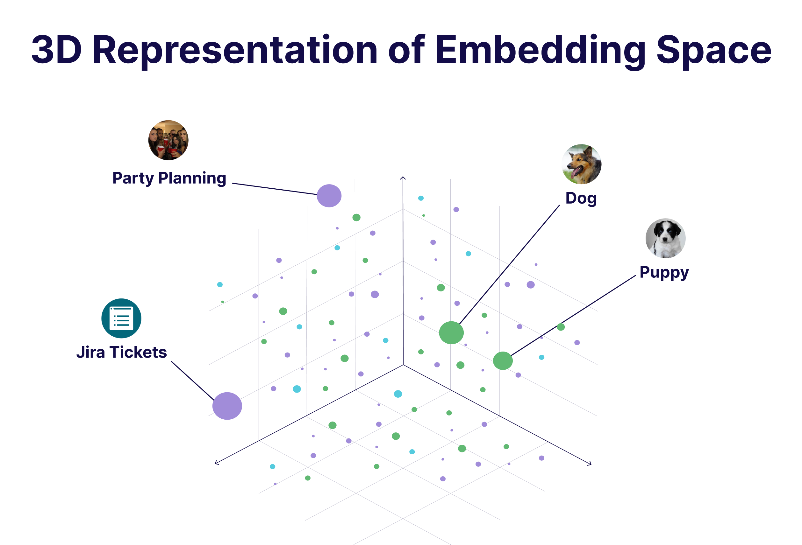
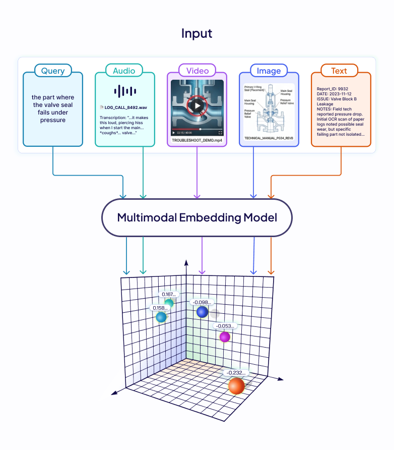
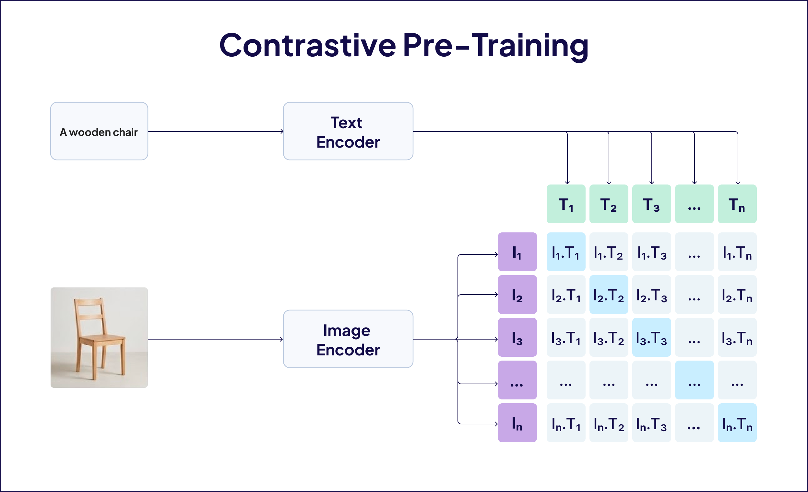
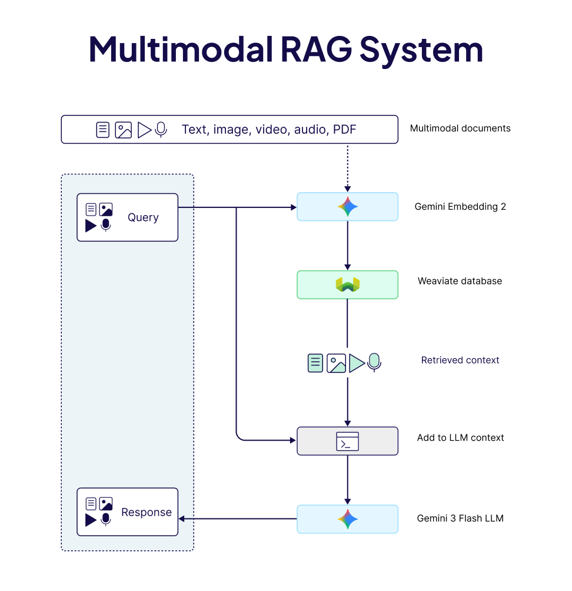

Think about the last time someone tried to describe a piece of music to you in words:

> “*It’s kinda like Billie Eilish, but even softer, with a piano line… okay wait, just listen to it…*”

That moment where words give up and point you to the actual thing (music in this case) isn’t a failure of language. It’s a reminder of what language really is: a compressed representation of experience. And like any form of compression, it throws things away, like tone, texture, spatial layout, or the general vibe of something.

For most of AI’s recent history, we’ve treated this compression as a requirement. Search and retrieval have mostly worked on the principle that if it wasn’t written down in text, it didn’t count.
You have a podcast? Transcribe it.
A scanned PDF report? OCR it.
A photograph of a whiteboard from a strategy meeting? Good luck.
Every conversion came with its own tax - a little distortion, loss, a bit less of the original thing.

But what if, instead of forcing everything into text, we could work with data in its native form and still search, compare, and reason across it?

That’s exactly what multimodal embeddings make possible.

They map text, images, audio, and video into the same embedding space, so a query in one modality can retrieve results from all the others.

In this blog post, we’ll look at how that works, why the latest generation of models makes it even more practical, and walk through three real systems you can build today using multimodal embeddings and language models.

:::info
If you’d rather skip the theory and jump straight into building, head to [this](#building-multimodal-systems-3-examples) section.
:::

## Embeddings, Briefly

Before going full multimodal, it’s worth briefly grounding what an embedding actually is.

An embedding is a **learned representation** of an input (text/image/audio/anything) encoded as a point in a high-dimensional mathematical space. Models like `text-embedding-3-large` or `nomic-embed-text` take a sentence, and return a vector, often of thousands of dimensions. 

The key property of embeddings is that semantically similar inputs end up near each other in the embedding space, e.g. the vectors of "dog" and "puppy" are close, while "jira tickets" and "party planning" are not.



This is essentially what powers modern retrieval systems. Instead of keyword matching, we compare vectors: encode the document corpus, encode the query, and retrieve the nearest neighbours. The end result is semantic search as it understands meaning, not just words.

Text embeddings have been doing this well for many years now. But the limitation is right there in the name… **they only understand text**. If your data is in another format, you either have to convert it to text first or give up entirely. And as we discussed, that conversion comes at a cost.

## The Shared Embedding Space

Imagine a support engineer searching a company's knowledge base that’s comprised of not just text documents, but recordings of customer calls, scanned technical manuals, and product demo videos. They search: *"the part where the valve seal fails under pressure."* The answer exists and it's in a 40-minute troubleshooting video and around the 22-minute mark, the failure is shown on screen.

A text-only embedding pipeline has nowhere to go in this case. Transcribe the audio, and you only capture what was said, not what was shown. OCR the manual and the diagram is gone, captions, if they exist at all, describe the dialogue, not the hand movement, not the equipment. 

The information is there in the knowledge base, but the format makes it unreachable. The fix is conceptually simple: encode every modality into a shared embedding space. The hard part is training a model that actually achieves this, consistently, across modalities.



## How Models Learn to Align Modalities

The technique that makes this possible is contrastive learning, in which we assemble pairs of data - photograph and caption, audio clip and text description, and train two encoders simultaneously. The training signal is simple: paired inputs should land close in the embedding space, unpaired inputs should land far apart. Every training batch scores each image against all the texts in that batch; the correct pairing should rank highest. Wrong pairings get penalised. Run this over hundreds of millions of pairs, and the two encoders converge on a geometry where semantics dominate over format.

**[CLIP](https://openai.com/index/clip/) (OpenAI, 2021)** was the first to prove this at scale for image-text. Trained on 400M pairs, it matched images to captions with zero-shot accuracy competitive with task-specific supervised models.



**[ImageBind](https://ai.meta.com/blog/imagebind-six-modalities-binding-ai/) (Meta, 2023)** extended this to six modalities: images/video, text, audio, depth, thermal, and IMU. It doesn't even need paired data for every combination, because everything is aligned to images, and relationships between other modalities (say, audio ↔ text) emerge transitively.

But there's a persistent problem with this setup, as documented in **["Mind the Gap"](https://arxiv.org/abs/2203.02053) (NeurIPS 2022).** Each encoder's representations naturally cluster in a narrow cone in high-dimensional space, and the two cones don't fully overlap. Contrastive training doesn't close this distance, as contrastive loss only cares about relative distances within pairs and it doesn't account the gap between modality cones, so the model has no incentive to bridge it. The separation unpredictably affects accuracy and encodes bias into downstream tasks.

These findings pointed exactly at what the next generation of models needed to fix: train all modalities jointly from scratch, in a single unified architecture. Modern natively multimodal embedding models do exactly that, and that shift is what makes all the examples we’ll discuss below practical rather than theoretical.

## Decisions that Shape Multimodal Retrieval

Before looking at specific implementations, it's worth naming the design decisions that shape any multimodal retrieval system. The choices you make here have more impact on real-world accuracy than the model you pick.

- **Native vs. bridge-based embedding:** A common technique is to convert everything to text and use a text embedding model you already trust. This works, but carries the full cost of the conversion tax. The alternative is embedding each modality in its native form using a model trained jointly across modalities from the start, like [Gemini Embedding 2](https://blog.google/innovation-and-ai/models-and-research/gemini-models/gemini-embedding-2/) in our case. These are newer and less battle-tested, but they preserve what matters, i.e. tone in audio, layout in PDFs, and visual actions in video.
- **Chunking strategy for non-text data:** Text has natural chunking units - sentences, paragraphs, sections. Audio and video don't. The standard approach is fixed-width time windows with overlap so that meaningful content doesn't get split across a boundary. Too short and you lose context, too long and retrieved chunks become unwieldy to pass to a generation model. For documents, converting pages to images first and indexing at the page level works well, as the layout stays intact.
- **Dimension size and storage:** Multimodal workloads generate vectors fast. If you're indexing a million 15-second video chunks at 3,072 dimensions each, you're looking at large gigabytes of vector index. Models trained with **Matryoshka Representation Learning (MRL)** let you reduce dimensions without breaking the embedding, e.g., the first 768 dimensions of a 3,072 dimension output vector still form a usable representation. So, start small, benchmark against your data, and scale dimensions only if retrieval quality demands it.

:::info
For a better explanation of Matryoshka Representation Learning, check out [this video](https://www.youtube.com/watch?v=ZvnKlUtMOkQ).
:::

- **Retrieval-then-generate, with native media:** The standard RAG loop of embedding corpus, embedding query, retrieving nearest neighbours, and passing the context to LLM works well here too, with one addition: if your generation model can reason over audio, images, or video directly, pass it the raw media rather than a text summary of it. The generation step then benefits from the same thing the embedding step did, i.e. it sees the original, not the compressed version.

## Building Multimodal Systems (3 Examples)

Weaviate recently added support for [Gemini Embedding 2](https://docs.weaviate.io/weaviate/model-providers/google/generative) (Google’s first natively multimodal embedding model**),** directly into the database's ingestion pipeline. You only declare which fields are text, images, audio, or video, import your data, and embeddings are generated and indexed automatically.

<div className="youtube" style={{ display: 'flex', justifyContent: 'center' }}>
    <iframe
        src="//youtube.com/embed/36He5BAKKLI"
        frameBorder="0"
        width="700"
        height="400"
        allowFullScreen>
    </iframe>
</div>

```python
client.collections.create(
    name=COLLECTION_NAME,
    properties=[
        Property(name="text", data_type=DataType.TEXT),
        Property(name="image", data_type=DataType.BLOB),
        Property(name="audio_clip", data_type=DataType.BLOB),
        Property(name="video_clip", data_type=DataType.BLOB),
    ],
    vector_config=[
        Configure.Vectors.multi2vec_google_gemini(
            name="my_vector",
            image_fields=["image"],
            audio_fields=["audio_clip"],
            video_fields=["video_clip"],
            text_fields=["text"],
            model="gemini-embedding-2-preview",
            vector_index_config=Configure.VectorIndex.flat(),
        )
    ],
)
```

The stack we will use for building our multimodal example systems includes 

- Weaviate with its `multi2vec-google` module,
- Gemini Embedding 2, a multimodal embedding model with MRL support, and
- Gemini 3 Flash multimodal LLM for the generation step.

:::info
These patterns generalise to any equivalent model, so you can plug and play models as per your preference.
:::



### 1) Searching Audio Without a Transcript

The problem: You have some long audio files - podcasts, interviews, lectures, and you want to do RAG over them to find specific moments by meaning, not by hoping someone transcribed it accurately.

**The approach:** Split audio into short overlapping chunks and embed them natively. Then simply, query in text or even audio and retrieve matching audio segments. In this example, we used a recording of Robert Frost's poem *Birches*, sourced from the Internet Archive.

```python
# Text → Audio search
results = collection.query.near_text(
    query="bending under the weight of ice and snow",
    limit=3,
    target_vector="audio",
    return_properties=["chunk_index", "start_time", "end_time"],
)

# Audio → Audio search
results = collection.query.near_media(
    media="chunk.mp3",
    limit=3,
    media_type=NearMediaType.AUDIO,
    target_vector="audio",
)
```

The retrieved audio bytes go directly to Gemini 3 Flash for the generation step. The model listens and answers based on what it hears. This is a meaningfully different experience than answering based on a text transcript, because the poem isn't just the words, it's the breath between lines, the weight Frost puts on certain syllables, the silences, etc.

[**Explore the Audio RAG notebook →**](https://github.com/weaviate/recipes/blob/main/weaviate-features/model-providers/google/audio_rag_gemini.ipynb)

### 2) Reading PDFs as Complex Visual Documents

The problem with PDF text extraction isn't just that it's occasionally wrong. It's that entire categories of information like diagrams, annotated charts, complex table layouts, and multi-column formatting have no clean representation in plain text. The information is there, but the medium just can't hold it.

**The approach:** We treat PDFs as a sequence of visual pages, where each page gets converted to an image and then indexed with an `image_fields` configuration. The embedding model receives the page with its layout, typography, diagrams, and tables intact:

```python
collection = client.collections.create(
    name=COLLECTION_NAME,
    properties=[
        Property(name="doc_page", data_type=DataType.BLOB),
        Property(name="document_id", data_type=DataType.TEXT),
        Property(name="page_number", data_type=DataType.INT),
    ],
    vector_config=[
        Configure.Vectors.multi2vec_google_gemini(
            name="doc_vector",
            image_fields=["doc_page"],
            model="gemini-embedding-2-preview",
            vector_index_config=Configure.VectorIndex.flat(),
        )
    ],
    generative_config=Configure.Generative.google_gemini(),
)
```

[Multimodal PDF RAG System](./img/multimodal-pdf-rag.png)

A text query retrieves the most relevant pages by visual similarity. Those pages go to the LLM as images, and it reads them the way any human would. This also makes the preprocessing pipeline a lot simpler. 

[**Explore the Multimodal PDF RAG notebook →**](https://github.com/weaviate/recipes/blob/main/weaviate-features/model-providers/google/multimodal_pdf_rag_gemini.ipynb)

### 3) Finding the Right Moment in a Video

Video is the hardest medium to search, for one specific reason: the most retrievable thing in a video - the dialogue, is often the least important thing happening at any given moment. E.g. a tutorial video where someone configures a settings panel contains the answer visually. The narration might say "and then we do this" while the hands do the actual thing you need to see. Caption-based search finds videos where the right words were spoken. Visual search finds the segment where the right thing happened.

**The approach**: MP4 file gets split into 15-second overlapping segments with ffmpeg, preserving both video and audio streams in each chunk. Each chunk is then indexed as raw video bytes, and a query retrieves the nearest chunks by semantic content. The generation model finally reasons over the raw video content to give us the best answer.

Like other modalities, you can also query with a video clip itself, enabling video-to-video search:

```python
results = collection.query.near_media(
    media="chunk.mp4",
    limit=3,
    media_type=NearMediaType.VIDEO,
    target_vector="video",
)
```

[**Explore the Video RAG notebook →**](https://github.com/weaviate/recipes/blob/main/weaviate-features/model-providers/google/video_rag_gemini.ipynb)

## When to Use Multimodal Embeddings (And When Not To)

The honest answer here is that multimodal embeddings aren't a universal upgrade. 

The big question will always remain whether your data contains a signal that text alone can't carry. Use multimodal embeddings when conversion is the problem:

- If your audio has emotional or tonal content that matters.
- If your PDFs have layout-dependent information like tables, annotations, diagrams that OCR could easily mess up.
- If your video search needs to find visual actions/cues, not just spoken words.
- If your users might search by example: *“show me something that feels like this…”.*

Stick with text embeddings when your data is actually text. Text embedding models are still more than enough and perform well on pure text retrieval tasks. They're also generally cheaper and faster to query.  

So, in short, if your corpus is 10 million articles with no visual or audio component, going multimodal adds cost and complexity without adding accuracy. Also, always watch the storage costs, as this is the constraint that surprises later. Start with smaller vector dimensions (768 should work well for most workloads) and benchmark before scaling up. 

## Summary

The three examples discussed in this blog post share a common structure: work with the data in the form it actually arrived in. No transcription step that loses tone. No OCR that breaks layouts. No caption generation that flattens visual scenes into single sentences. 

That’s what “multimodal” actually means in practice. Not just that you can query across formats, but the representation itself is grounded in the full signal rather than in whatever fits through a text-shaped hole.
The engineering to build this is more accessible than it's ever been. The patterns shared in the linked notebooks above are real starting points. 

Pick the one closest to your data (or even combine a few), and just start building!
For any questions, ideas, or to just chat, feel free to join the conversation on [our community forum](https://forum.weaviate.io/).


import WhatsNext from '/_includes/what-next.mdx';

<WhatsNext />
