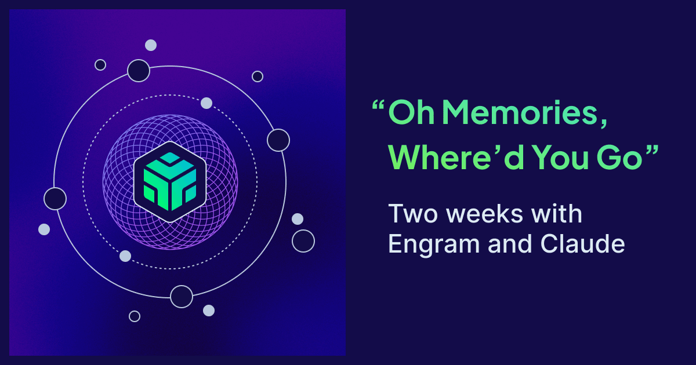
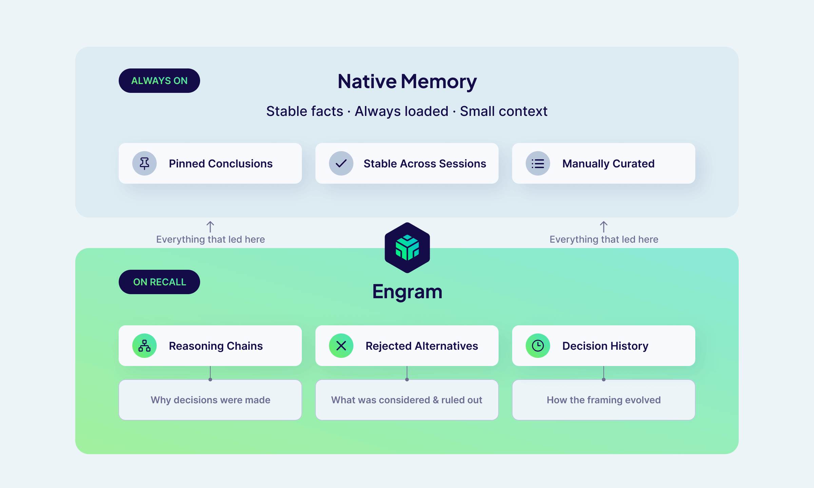
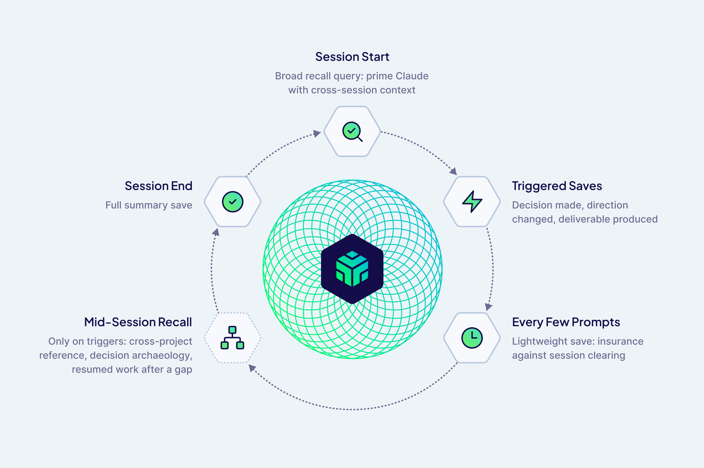

 

When I asked Claude why it wasn't using the memory tools I'd given it, the answer was more honest than I expected.

> "I default to `MEMORY.md` because it's always loaded: zero latency, zero tool calls, guaranteed in context. There's no reason to reach for an external tool when the primary memory store is already present."

That was Engram's first real product review.

---

Claude and I are fast friends. Claude Code is an integral part of my workflow as a product manager: research and analysis, design and prototyping, project and requirement planning. But the longer I use it, the more I notice the quiet friction of sessions starting cold and needing to restate what we decided last week or how we reframed an old problem. This is exactly the memory problem we made the case for in <a href="https://weaviate.io/blog/limit-in-the-loop" target="_blank" rel="noopener noreferrer">The Limit in the Loop</a> that needs first-class infrastructure, and it's why we built **Engram**, our memory product now in private preview, on Weaviate's core vector search technology.

Building a product is one thing, but proving its value is another. So I decided to find out whether Engram can close some gaps in my daily work and win me over as a user.

Early results suggested it could: sessions with grounded memory from Engram felt less like briefing a colleague from scratch and more like picking up a conversation with someone who'd actually been there. But getting there wasn't straightforward.

I built an MCP server that wrapped the Engram SDK, exposed tools for retrieval and saving, and told Claude to use the tools whenever it liked. I had skimmed somewhere that another memory plugin consumed too much CPU by saving every message, and thought I was being clever by letting Claude decide when to use Engram instead.

Claude ignored Engram entirely.

## The problem with "playing it by ear"

Claude Code already has a built-in memory system: a file called `MEMORY.md` that loads automatically into every session. It holds about 200 lines of manually curated context that's always present with zero overhead — enough for stable facts, but not for everything that led to them. Engram requires a deliberate tool call, and without explicit criteria for when it should be used, Claude's default is to keep moving rather than reaching for the tool.

There was no reason to use Engram. My integration needed to give Claude the reason.

## Finding the beat

I needed to answer a more basic question: what is Engram actually for, if `MEMORY.md` already exists?

`MEMORY.md` holds conclusions — facts stable enough to keep permanently that don't change session to session. What it can't hold is everything that led to those conclusions. The reasoning behind a decision, the alternatives that were rejected, the session where the framing shifted, the note about why a document was written the way it was — the list goes on. All that context doesn't fit in 200 lines and doesn't belong there permanently.

All that context is why we need Engram.

*How Engram fits alongside `MEMORY.md`*

Engram structures memory around *topics*: semantic categories that let recall filter to exactly what's relevant rather than searching a flat pile of everything. I went through my typical work and identified four categories that would actually be meaningful for my workflow:

- **`communication-style`**: output format preferences, tone, verbosity, what I hate
- **`domain-context`**: persistent role, company, and product knowledge
- **`tool-preferences`**: languages, frameworks, tools, stack choices
- **`workflow`**: how I prefer to work with Claude

With those categories in place defining *what* to store, the next question emerged naturally: *when*? I then landed on these interaction patterns:

- At session start, recall with a broad project query so Claude gets primed with cross-session context before the first question rather than starting cold
- During the session, trigger saves on significant moments: a decision made, a direction changed, a deliverable produced
- Every few prompts, do a lightweight save as insurance against `/clear` wiping the session mid-work
- At session end, save the full summary

Since every recall costs a round-trip and context window space, I opted to have mid-session recall only fire on specific triggers: cross-project references, decision archaeology, and resumed work after a gap.

*The session lifecycle: when Engram saves and recalls*

One practical constraint shaped the approach: large saves were timing out, which pushed us toward shorter, single-topic saves of 2–4 sentences. It turned out to be better for retrieval anyway — a focused memory is easier to find than a paragraph you have to parse.

> **Interested in trying Engram in your own coding assistant workflow? <a href="https://weaviate.io/product-previews#preview-engram" target="_blank" rel="noopener noreferrer">Sign up for the Engram Preview</a>**

## The live recording

After two weeks of running Engram across my daily Claude Code sessions — spanning product strategy, writing specs, campaign planning, and design — I ran a structured evaluation comparing two Claude sessions performing the same task with identical `MEMORY.md`, `CLAUDE.md`, and task prompts. The only difference was whether Claude had access to Engram. An independent Claude instance judged the transcripts, and evaluation results split almost cleanly down the middle: "this is what Engram is for" and "this is the problem we still need to solve."

| Evaluation Scenario | Without Engram | With Engram |
|---|---|---|
| Decision archaeology | Reconstructed from files: correct framing, right conclusions | Recalled reasoning chains and document intent; 30% faster on the first exchange |
| Incomplete context (early single-session test) | Fabricated a plausible URL to fill the gap, twice | Grounded recall prevented the fabrication both times |
| Campaign planning | Strong plan, worked from the prompt alone | Also ignored Engram entirely; also a strong plan |

### Where it worked

The clearest win was on decision archaeology — picking up a multi-week product vision writeup and asking Claude to walk through where we left off. Without Engram, the session felt like reading thorough meeting notes: accurate, well-organized, but reconstructed. With Engram, it felt like picking up a conversation with someone who'd actually been there. It surfaced the reasoning arc behind a key positioning decision, the story of how we'd repositioned Engram itself mid-project, and a note about the document's intent that wasn't in the document body at all. It was also 30% faster because there was less context to reconstruct.

The difference wasn't in the facts but in the framing quality, and that's exactly the gap reasoning-chain recall is supposed to close.

A consistent finding in an early single-session evaluation: when Claude didn't have enough grounded context, it filled the gap with plausible-sounding details. The Claude without Engram fabricated the same URL in two separate runs, while the Claude with Engram recalled enough context to avoid it both times.

### Where it didn't

A striking result came from a planning session where we wanted to pick up prior campaign work. Engram had relevant memories: design decisions, the prior campaign arc, PLG context, and `CLAUDE.md` explicitly said to retrieve from Engram at session start.

But the Claude with access to Engram didn't. Neither session searched for additional context; both treated the task as forward-looking, and worked entirely from the prompt. Prior context in files and in Engram went unused.

This confirmed something we'd suspected: on planning tasks, Claude interprets "Help me think through" as an invitation to move forward, not to check what already exists. Explicit instructions in `CLAUDE.md` weren't enough to override this bias. The failure was silent — no errors, no indication that relevant context had been skipped.

### Session overhead

Writing to Engram added noticeable overhead to sessions. An early test recorded 19 seconds of startup cost on one run, and sessions with Engram ran about 10% slower overall. This isn't inherent to the approach, but it's a real friction point in daily use: if saving a memory visibly pauses the session, users will notice.

> **Interested in trying Engram in your own coding assistant workflow? <a href="https://weaviate.io/product-previews#preview-engram" target="_blank" rel="noopener noreferrer">Sign up for the Engram Preview</a>**

## Back in the studio

After sharing these findings with the engineering team, a few things became clear.

### Save performance

The session length issue turns out to be a misuse of the integration rather than a fundamental limitation. The integration was blocking on memory processing to complete, but Engram is eventually consistent so there's no reason to wait. Saves should fire and forget, and frequent saves to Engram should not build up resource overhead.

### Memory capture

The "save every five prompts" pattern gets replaced by something more robust: every message flows into a pipeline buffer automatically without requiring tool calls, and no context is lost when a session ends prematurely.

### Retrieval hooks

The more significant change is moving away from the "Claude decides when to retrieve memories" model entirely and creating deterministic, infrastructure-level triggers that fire at specific points in the session lifecycle regardless of what Claude decides to do. A session start hook can inject relevant memories before Claude sees the first message. A hook before each user prompt can do the same on a per-turn basis, paired with relevancy filtering so only memories with a strong match to the current context get injected. Claude never has to decide to recall; the context is already there.

It's worth noting that Anthropic is converging on the same instinct. A <a href="https://claudescorner.substack.com/p/a-hidden-dream-command-and-the-tools" target="_blank" rel="noopener noreferrer">quietly rolling-out Claude Code feature</a> called `/dream` runs a background agent that consolidates session memories by doing a reflective pass over your memory files, synthesizing learnings into organized entries, and enforcing line limits. At the time of writing, the feature is undocumented and behind a feature flag, but the direction is clear. What `/dream` operates on is also telling: Claude's built-in file-based memory. It handles the `MEMORY.md` layer well — stable facts, consolidation, keeping things tidy. What it can't do is capture reasoning chains, rejected alternatives, or the story of how a decision evolved across sessions.

### Collaboration scope

Memory that works well for an individual gets complicated fast in a team context. A personal preference about output style shouldn't surface for a colleague, but a shared product decision probably should. Right now the integration doesn't make that distinction deliberately: which topics live in a personal scope versus a shared team scope is something the Claude Code integration needs to define explicitly, rather than inheriting defaults that weren't designed with collaboration in mind. Getting this wrong in either direction has real consequences — over-sharing erodes trust, under-sharing defeats the point.

### Cold starts

The current pipeline is designed for incremental capture, where memories are extracted as conversations happen. But this leaves gaps where we need to start with a body of existing content rather than building up from scratch. For my integration, that's bootstrapping from existing session history rather than waiting weeks to accumulate a useful memory bank. For another internal support agent use case, that's importing a large corpus of product documentation as the knowledge foundation. The pipeline handles neither cleanly yet, and what we're now building toward.

## So, was it worth it?

I started this expecting to prove that Engram is valuable, and instead found something much more useful: the specific conditions where Engram works well, and the specific mechanics that prevent it from working well. Uncovering them early and iterating quickly gives our preview more leverage as we move toward GA.

You can bet that a real Claude Code integration will be available by GA and should be much better than my shabby homegrown version. And then you can all try it out yourselves and let us know where else it falls down.

import WhatsNext from '/_includes/what-next.mdx';

<WhatsNext />
