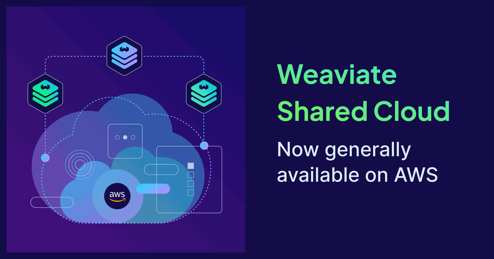

We're happy to announce that <a href="https://weaviate.io/deployment/shared" target="_blank" rel="noopener noreferrer">Weaviate Shared Cloud</a> is now generally available on Amazon Web Services in US East (N. Virginia) and Europe (Frankfurt). Whether your infrastructure lives on GCP or AWS, you can now build on Weaviate's AI-native platform in the provider and region best suited for you.

## Launch your AI application seamlessly on Weaviate Shared Cloud

Weaviate Shared Cloud takes the operational weight off your team so you can focus on building. Clusters are fully managed and upgrades happen automatically. With **granular RBAC**, **immutable backups**, and Weaviate's **SOC 2/ISO 27001** certifications, you're covered on security and compliance from day one.

Beyond managed hosting, Weaviate Cloud comes with the services and tooling that make building AI applications meaningfully faster:

- **Batteries included for AI.** Turn raw data into vectors more quickly with our native embedding service built directly into the platform, and build RAG pipelines and agentic workflows with the Query Agent.
- **A console built for the full lifecycle.** The Weaviate Cloud console supports you from experimentation – creating collections directly from files and exploring your data visually – through to monitoring cluster metrics in production.

  

    <a href="https://docs.weaviate.io/agents/query" target="_blank" rel="noopener noreferrer" style={{color:'#61bd73', fontWeight:600, marginBottom:'8px', fontSize:'0.875rem', textTransform:'uppercase', letterSpacing:'0.05em', textDecoration:'none', display:'block'}}>Query Agent →</a>
    
Build RAG pipelines and agentic workflows on your Weaviate data without writing database queries.

  

  

    <a href="https://docs.weaviate.io/cloud/embeddings" target="_blank" rel="noopener noreferrer" style={{color:'#61bd73', fontWeight:600, marginBottom:'8px', fontSize:'0.875rem', textTransform:'uppercase', letterSpacing:'0.05em', textDecoration:'none', display:'block'}}>Weaviate Embeddings →</a>
    
Native embedding service, with no separate API and no pipelines to maintain.

  

  

    <a href="https://docs.weaviate.io/cloud/tools/collections-tool#create-collections-with-pdf-data" target="_blank" rel="noopener noreferrer" style={{color:'#61bd73', fontWeight:600, marginBottom:'8px', fontSize:'0.875rem', textTransform:'uppercase', letterSpacing:'0.05em', textDecoration:'none', display:'block'}}>Data Import Tool →</a>
    
Upload files, map fields to your schema, and have data flowing into collections in minutes, no code required.

  

  

    <a href="https://docs.weaviate.io/cloud/tools/explorer-tool" target="_blank" rel="noopener noreferrer" style={{color:'#61bd73', fontWeight:600, marginBottom:'8px', fontSize:'0.875rem', textTransform:'uppercase', letterSpacing:'0.05em', textDecoration:'none', display:'block'}}>Data Explorer →</a>
    
Browse collections and inspect objects directly in the console without touching an API.

  

More coming soon, including <a href="https://weaviate.io/product-previews?preview=engram#register-interest" target="_blank" rel="noopener noreferrer">Engram</a> – memory and context management for agents – and <a href="https://weaviate.io/product-previews?preview=model-eval#register-interest" target="_blank" rel="noopener noreferrer">Model Evaluation</a>.

## Try Weaviate Shared Cloud on AWS

Weaviate Shared Cloud on AWS is perfect for teams that:

- Standardize on AWS and want to keep AI infrastructure on the same provider
- Have data residency or compliance requirements that point to AWS-hosted infrastructure
- Want Weaviate Cloud's full platform — Query Agent, Embeddings, Data Explorer, Data Import — without running their own deployment
- Are building on Weaviate open source and want to move to a managed environment with more built-in tooling

  <a href="https://console.weaviate.cloud" target="_blank" rel="noopener noreferrer" style={{display:'inline-flex', alignItems:'center', justifyContent:'center', padding:'12px 24px', borderRadius:'6px', background:'#130c49', color:'#fff', fontWeight:600, fontSize:'1rem', textDecoration:'none'}}>Start a free trial</a>
  <a href="https://docs.weaviate.io/cloud/quickstart" target="_blank" rel="noopener noreferrer" style={{display:'inline-flex', alignItems:'center', justifyContent:'center', padding:'12px 24px', borderRadius:'6px', background:'#fff', color:'#130c49', fontWeight:600, fontSize:'1rem', textDecoration:'none', border:'1px solid #130c49'}}>Read the Quickstart</a>

## What's next

We are working to expand Weaviate Shared Cloud to more regions and providers, and to introduce new features to further enhance performance and usability. Follow us on <a href="https://www.linkedin.com/company/weaviate-io/" target="_blank" rel="noopener noreferrer">LinkedIn</a> or join the <a href="https://weaviate.slack.com" target="_blank" rel="noopener noreferrer">Weaviate community Slack</a> to stay in the loop.

import WhatsNext from '/_includes/what-next.mdx';

<WhatsNext />
