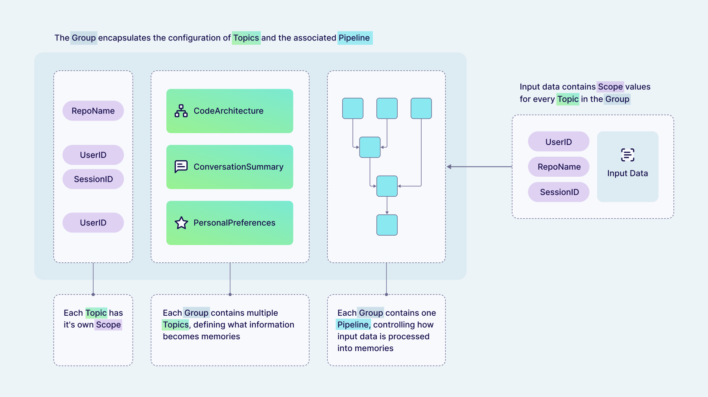
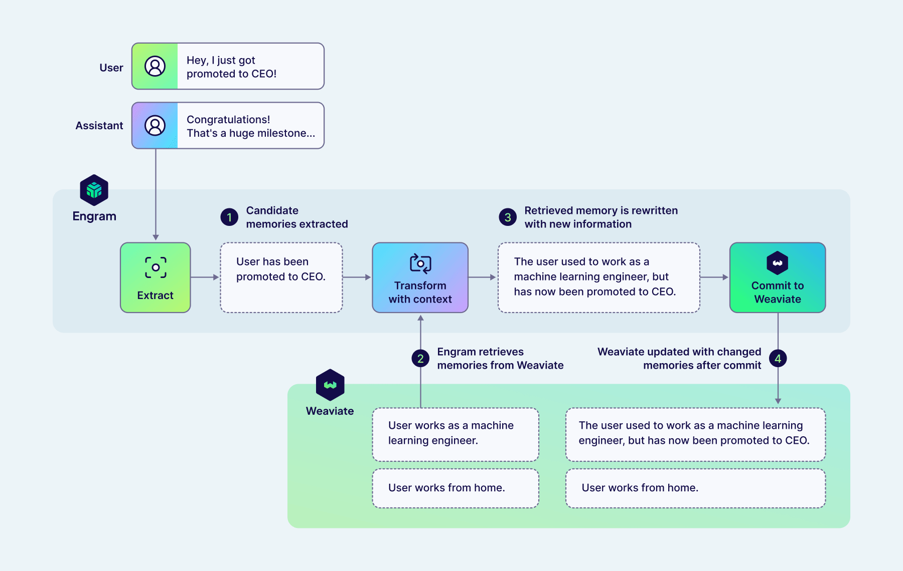
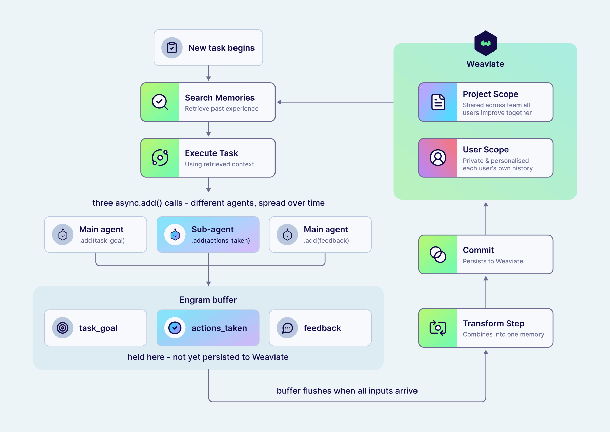

<br/>

> **If you're interested in learning more about Engram, [sign up for a preview today](https://weaviate.io/product-previews#preview-engram).**

<br/>

As agentic applications have gone from experimental features to production use cases, it's become clear that they’re most effective when they’re fully integrated into the rest of your system, are strongly personalised to the user, and can continually learn to get better over time. These agents need memory, designed as robust and predictable infrastructure rather than an ad-hoc afterthought. That's why we built Engram, a managed memory service running on top of Weaviate, which focuses on being easy to get started but flexible enough to adapt to any use case.

## What is memory?

It can be a major annoyance when a chatbot forgets your preferences. However, as we discussed in [The Limit in the Loop](https://weaviate.io/blog/limit-in-the-loop"), the problem is potentially far worse for agents carrying out long-running and complex tasks. Without the continuity of memory, agents are unable to learn from past experience, becoming stuck in a constant cycle of solving the same intermediate problems repeatedly before losing those insights, wasting both time and tokens in the process.

While the long context windows of frontier models might seem like a solution to this problem, cramming them full is rarely the best approach. It is well known that LLMs get [Lost in the Middle](https://arxiv.org/abs/2307.03172) and that effective context lengths are still far below 100% (e.g., [here](https://arxiv.org/abs/2601.02872) and [here](https://arxiv.org/abs/2502.05167)). Not only does overly-long context degrade accuracy, it also increases answer latency and inflates the cost of requests. These costs must be paid for every new message, as the entire conversation history is passed back to the LLM.

Naively storing each message of every conversation for retrieval addresses the latency and cost issues, but has other downsides. Raw conversations with real users are noisy, contradictory, and include facts that change over time. Relying on an LLM to resolve these inconsistencies all at once is harder than doing it incrementally. This not only risks inconsistency over time, it is also work that cannot be reused next time those facts are relevant. Treating all memory as a single conversation also fails to adapt to more advanced use cases such as multi-agent systems, which can spread a single logical request across multiple context windows.

The best solution to these problems is to not treat memories as an ever-growing pile of context, but instead to actively maintain them.

## Engram

Engram is our managed memory service, built on the Weaviate vector database. It is designed around asynchronous pipelines that run when you add raw data, extracting memories, reconciling new and existing information, and persisting to Weaviate ready for querying.


Engram has been designed to be as simple as possible to get started, providing starter templates for common memory use cases. However, underlying this is a highly flexible and configurable system that can adapt to a wide variety of different domains and use cases. Customisations span from simple natural language descriptions of what topics are of interest to your use case, up to full control of the individual steps within the pipeline. As your need for agentic memory evolves, the adaptability of Engram means you won’t get stuck shoehorning a constraining and prescriptive design of memory into your application.

### Getting started with Engram

Once you've created your Engram project API key, you can easily start adding data to Engram for one of your users by using our REST API or Python client:

```py
run = client.memories.add(
    [
        {"role": "user", "content": "I'm very interested in vectors, please tell me more!"},
        {"role": "assistant", "content": "Absolutely! Vectors are a fascinating..."},
    ],
    user_id="user_name"
)
```

As a result of this call, Engram will begin a new pipeline run to extract memories from your data that match your configured topics and integrate them into your existing memories. For example, this call could result in a new memory detailing that user's love of vectors. But, if they'd shared that love in a previous conversation, Engram would disregard this to avoid creating duplicate memories.

Since pipelines run asynchronously in Engram, this request has very low latency. Rather than being forced to wait for the final changes to your memories from this run (or having to manage running this as a background task yourself), you can just fire-and-forget your raw data, and rely on Engram to remember what's needed.

Of course, if you want to follow up the status of this run and understand what changes were made to your memories as a result, you can query Engram with the run ID returned by `client.memories.add`. However, since there's less value in querying memories for the most recent messages which are in context, this asynchronous pattern naturally leads you to integrate Engram into your application in a straightforward and low-latency way.

Later, you can retrieve relevant memories from Engram using semantic search, powered by Weaviate's vector index:

```py
memories = client.memories.search(
    "What technology has the user asked about recently?",
    user_id="user_name"
)
```

While that's all you need to start using Engram to give your agents memory, it has been designed to be flexible, so let's dive into what's happening behind this simple API\!

### Organising memories

When Engram extracts memories from your raw data, it automatically organises them into one of your pre-configured topics. Topics are natural language descriptions of what information the LLM should extract and how to categorise it. Think of them as "magnets for memories", pulling matching information out of the raw data. Memories will only be extracted from your raw data if they match one of your topics, giving you control over what sort of information is relevant for your domain and particular use case. Each of the default templates available in Engram has topics pre-configured, but these are all fully customisable. Adjusting these topics is the most effective way for you to control the content of the memories you will query later.

Each topic has a "scope" that controls which raw data is allowed to influence each memory. Scopes combine optional hard and soft isolation of memories to give several different combinations:

* **Project-wide** memories are shared between all users in your project, letting you share information quickly between a team or have your agent continually learn from all of its experiences.  
* **User-scoped** memories belong to one specific user and can never be influenced by data added for another user. Hard isolation between user data is strictly enforced by Weaviate's multi-tenancy feature.  
* **Property-scoped** memories have additional key-value data attached. These give additional soft isolation, meaning that while Engram always enforces this separation when creating and updating memories from new data, you have the option of querying these memories either filtered by these properties or not. For example, this could be used to attach a `conversation_id` and have memories relating to a single conversation only, while still being able to search over memories across all a user's conversations if needed.

Scopes are enforced by Engram both when adding data and querying memories, meaning you can never forget to pass a `user_id` and accidentally leak data between your users.

All of your Engram configuration is then collected into groups, which combine the topics (which control *what* memories are extracted) and associated pipeline (which controls *how* memories are extracted). Memories belonging to one group are isolated from other groups using multi-tenancy, and should correspond to distinct use cases in your application that you want to keep separate. Each group can contain multiple topics, and each topic can have different scopes.

Topics can also be marked as being `bounded`, which means that Engram will constrain memories in this topic to have at most one object per scope (e.g., once per user, or once per conversation). This can be used to implement features such as user profiles, where you know your agent will always have that memory in their system prompt (and so it must be comprehensive). The provided `personalization` template also includes an optional `ConversationSummary` topic which continually updates with every new chat message, and so is marked as a `bounded` topic to ensure there is at most one summary per conversation.



### Processing raw data into memories

Engram uses pipelines to control exactly how raw data is processed into memories persisted in Weaviate. This unique approach to building memory gives you the maximum possible flexibility, letting you adapt memory to your specific use case rather than the other way around. At the same time, prebuilt templates covering common use cases make it simple to get started without  needing to handle all these details right away.

Pipelines are graphs of steps which run asynchronously, gradually transforming raw data into batches of memories which are persisted in Weaviate. We’ve built these pipelines on top of [Temporal](https://temporal.io/) workflows to provide durable execution. As a result, you can be confident that once data has been successfully added to Engram, the pipeline will run and any resulting changes to objects in Weaviate will be completed. This also lets us enforce strict in-order processing of raw data. You can add many batches of data rapidly (thanks to the low-latency API) and Engram will queue the pipeline runs, grouping by the scope IDs you provide, ensuring that processing is done in the order you added data without you having to manually manage it.

Pipelines give us a way to flexibly control how raw data is processed into stored memories by composing various types of steps, so let’s look at those steps in more detail\!


The first step in a pipeline is often an extract step. This step type uses an LLM to write memories using the content of your data which match the topics you've configured. Engram supports multiple different input types, and each of these have their own dedicated extract steps:

- **Conversation data** contains a list of messages in the standard `role`/`content` format. This is ideal for naturally conversationally shaped data, such as for chatbot applications.  
- **String data** gives you a flexible way to insert data that doesn't fit into a standard conversation shape (e.g., user events like "User viewed page X"), while still letting Engram handle extracting memories for you.  
- **Pre-extracted memories** are an escape hatch for when you want to handle extraction yourself, e.g., by using your own tool-calling agent. In this case, you pass both the content string and the corresponding topic, and Engram passes them immediately onto the next pipeline step without further extraction. This lets you handle the extraction process completely while still taking advantage of the rest of Engram's pipeline steps for integrating with existing memories.

We are also working to add more input data types for specific use cases in the future.

If any memories were extracted by the extract step, Engram passes the resulting batch of memories onto the next steps in the pipeline, typically one or more transform steps. These transform steps use an LLM to decide how these new memories should be integrated into your existing memories, or to apply use-case-specific processing.

For tasks such as deduplication or handling changes to preferences over time, the transform steps can query for existing memories from Weaviate, using the same semantic search tools available to you in the search API. Once Engram has retrieved any related memories, an LLM tool call is used to decide what action should be applied to each memory.

**Example 1: User Conversation**

Let’s look at some specific examples, showing the inputs and LLM tool-call outputs that Engram is orchestrating for you using pipelines. First we have a conversation with a user who has previously told the agent they are a machine learning engineer who works from home. Now, in a new message, they tell us their efforts have been rewarded with a promotion to CEO\!

  

Given this new message, Engram will first extract a memory (matching the `UserKnowledge` topic included as a default in the `personalization` template) describing this promotion.

```json
{
  "new_memory": {
      "topic": "UserKnowledge",
      "content": "User has been promoted to CEO."
  }
}
```

Next, a `TransformWithContext` step runs, and starts by retrieving relevant memories from Weaviate. In this case, these memories all relate to the user's work.

```json
{
    "memory_1": {
      "topic": "UserKnowledge",
      "content": "User works as a machine learning engineer."
    },
    "memory_2": {
      "topic": "UserKnowledge",
      "content": "User works from home."
    }
}
```

Then, Engram uses an LLM tool call to determine what actions to apply to both the new memory, and those retrieved from Weaviate.

```json
{
  "memory_1": {
    "action": "rewrite",
    "content": "The user used to work as a machine learning engineer, but has now been promoted to CEO."
  },
  "memory_2": {
    "action": "keep"
  },
  "new_memory": {
    "action": "delete"
  }
}
```

In this case, Engram has determined that the new memory is an update to the existing memory. As a result, the existing memory is rewritten to reflect this update, maintaining the previous history in the final result. To prevent duplicate memories being stored in Weaviate, the original version of the new fact is dropped. The degree to which Engram will combine memories together rather than leaving them separate (as well as how much history to maintain in rewritten facts) can be controlled by adjusting the topic descriptions and the task-specific instructions configured in the `TransformWithContext` step.

**Example 2: Continual Learning for Agents**

Transform steps can also be applied to the batch of memories from previous pipeline steps, without retrieving additional memories. This can be useful for tidying up after previous steps (e.g., if we've run `TransformWithContext` multiple times concurrently on each input memory separately), but it also gives us a tool to do some more complex use-case-specific processing.

Here's an example from a multi-agent system designed to do agentic RAG, where a main agent handles the conversation with the user, and search tasks are delegated to a subagent which can use specialised tools to write queries and apply filters. The user asks about comedy movies but notices that the search agent searches for "comedy" as a text query, so sends a follow-up message suggesting the agent uses a filter on `genres` in future.

In this case, there is no single context window which contains all the information we'd like the system to be able to learn from, since the actions taken (i.e., which tools called with which arguments) are handled by a separate agent than the initial request or the provided feedback. In this case, Engram must extract each of these pieces of information individually, and then later combine them into a single useful memory to encapsulate our learnings. Importantly, those intermediate pieces of information shouldn't be stored in Weaviate to be retrieved, only the final combined experience.

First, we add new messages from each of our agents in this multi-agent system to Engram, which extracts each of these pieces of information individually:

```json
[
    {"topic": "task_goal", "content": "User asked assistant to query their collection for comedy movies."},
    {"topic": "actions_taken", "content": "Assistant called the search tool to do a near-text query on 'comedy'."}
]
```

Here, this pipeline has been configured with multiple topics, each targeting the different pieces of information we need. This pipeline has also been configured with a `buffer` which collects all of these individual memories into a single batch until we're ready to continue processing. We'll go through all the use cases for buffers in more detail below\!

Finally, the user sends their follow-up message to the main agent, giving feedback that a genre filter should have been used instead. Again, Engram extracts this information into a memory matching the `feedback` topic:

```json
[
    {"topic": "feedback", "content": "Comedy is a genre, and so you should filter on the 'genres' property."}
]
```

Now that we have all the pieces we need, the buffer flushes and Engram continues the pipeline run. A transform step configured to apply to the entire batch of memories combines the three above into a single memory encapsulating all of this information:

```json
[
    {
        "topic": "experience",
        "content": "When asked to find movies or a particular genre (e.g., comedy), you should filter on the genres property, not do a near-text query."
    }
]
```

By splitting up the task in this way, Engram can extract memories that are atomic and information-dense, even when that information was spread over time and context windows in the raw input data. This memory could then pass through a `TransformWithContext` step as described above, integrating it into other experience Engram has stored for this agent, e.g., deduplicating it, or combining multiple memories about when to use filters into a single higher-level memory. You could also configure other transform steps to perform LLM-as-judge evaluation given your described success criteria, so this continual learning could happen without explicit human feedback.

Importantly, changes to memories as a result of these transform steps are only persisted to Weaviate in explicit `commit` steps, meaning that pipelines can incrementally build memories without risking intermediate values being retrieved before they're ready.



By searching for memories when starting a new task, an agent could now continually learn from its experience, and allow you to shape its behaviour with natural language feedback. When using an agent within trusted teams, this experience could be shared between all users by configuring the `experience` topic to have a project-wide scope. This allows the agent to collate feedback from everyone and get better at its tasks for all. In other deployments when we want to preserve user privacy, or to prevent untrusted users from being able to influence agent behaviour for others, this `experience` topic can instead be user-scoped, meaning it's never retrieved for other users. In this way, Engram lets each user have their own personalised agents, which have learned from their specific history and particular use cases.

### Background tasks with buffers

The continual learning example above relied on the pipeline holding onto intermediate memories until we had extracted the information we needed. This is accomplished using buffers. These buffer steps collect inputs from previous pipeline steps, aggregating them over multiple pipeline runs from multiple raw data inputs. Once a trigger condition is passed, the buffer flushes, and all the inputs are processed by the remainder of the pipeline as a single batch. Buffers can be applied to both raw data (at the beginning of pipelines) and memories themselves (in the middle of pipelines).

Buffers let us naturally combine several different use cases, and rely on the fact that Engram has been designed around pipelines being asynchronous. They can flush based on properties of the data (e.g. `number of messages`, `contains memories of a particular topic`) or external timers (e.g. `every 24 hours`, `no data added in last 5 mins`).

Some use cases for buffers include:

- Debouncing sudden spikes of inputs to process them together using an idle timer.  
- Waiting until we have all the information we need before continuing (e.g. the previous continual learning example).  
- Aggregating memories into "daily rollups", e.g., all your interactions yesterday.  
- Storing previous inputs and flushing a sliding window, to give extract steps additional context without having to manage it manually.

## Fitting Engram into your application

Engram is designed to allow you to add any raw data and rely on Engram to extract, process, and store memories as you've configured. In a standard chatbot application, this means you should call `client.memories.add` with every new message in your application. For any data that doesn't fit into this conversation shape (e.g., events in your application), you should use string data. Otherwise, if you want full control over the process of extracting memories matching your topics, you can use the pre-extracted data type, e.g., if you want to allow your agent to be responsible for deciding when to remember specific information using tool calls.

You can also retrieve memories to use in your application in various different ways, depending on your use case. In a typical chatbot use case, where you want that agent to be able to recall personal details and preferences about the user as required, one simple approach is to use the current user message as a search query before every message, including any memory in context which has a sufficiently high similarity score. If you want your agent to have more control over how and what it retrieves, you can also expose Engram's `client.memories.search` method as a tool call. This will allow your agent to search as often as it needs, e.g., during reasoning traces or tool calling loops. You can also get memories from Engram using the `fetch` retrieval mode when you know there's a specific memory you want to retrieve. For example, you could configure a `UserProfile` topic which is user-scoped and bounded (meaning there is at most one memory per user), then fetch this to insert into your agent's system prompt for all interactions.

Engram is designed to be highly flexible but also as simple as possible to get started. We have pre-built templates for personalisation and continual learning use cases which expose some customisation (e.g., topic descriptions) without needing to understand the full details of the pipelines first. We will also have integrations for coding agents such as Claude Code available so you can immediately integrate Engram into your workflows, but you can read more about our first experiences in our [Oh Memories, Where'd You Go](https://weaviate.io/blog/engram-internal-use-case) blog. Finally, we'll release more tutorials around how to integrate these features into your applications as we get to GA\!  

> **If you're interested in learning more about Engram, [sign up for a preview today](https://weaviate.io/product-previews#preview-engram).**

import WhatsNext from '/_includes/what-next.mdx';

<WhatsNext />