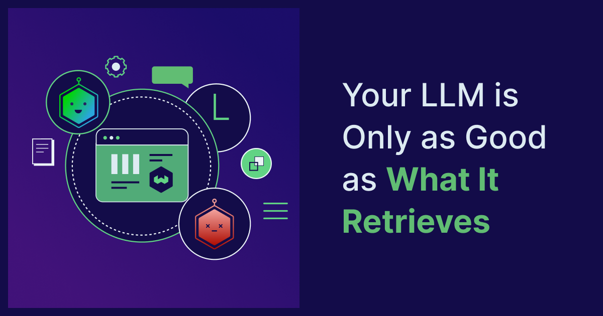
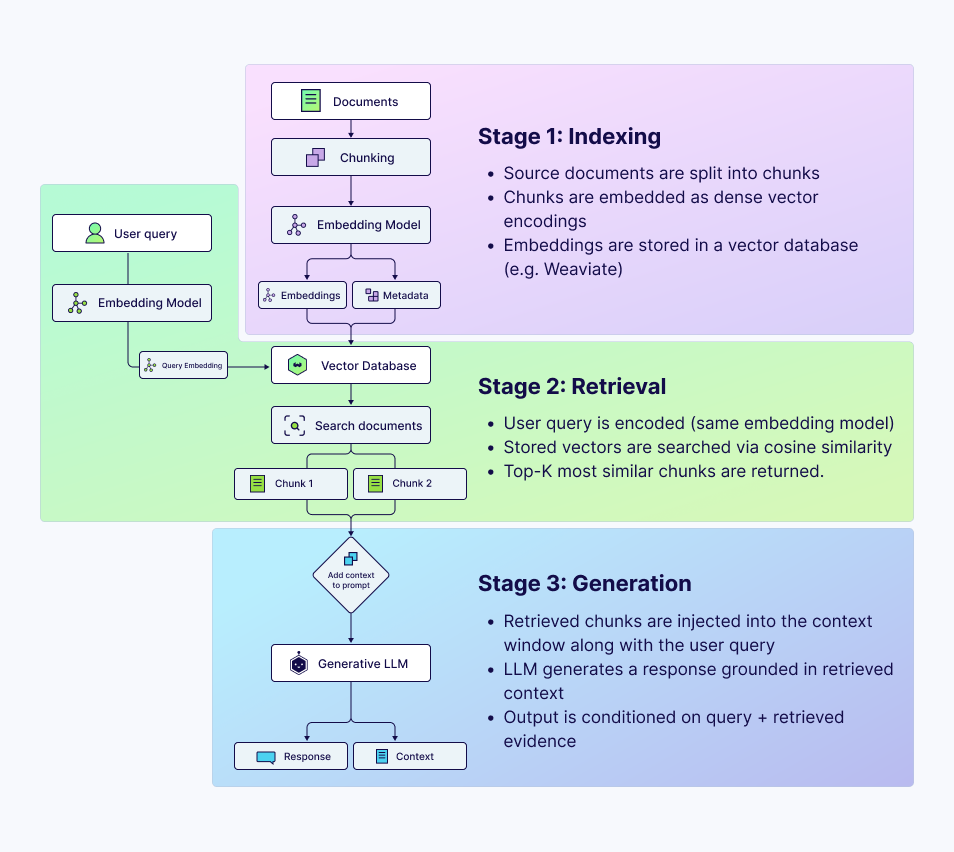
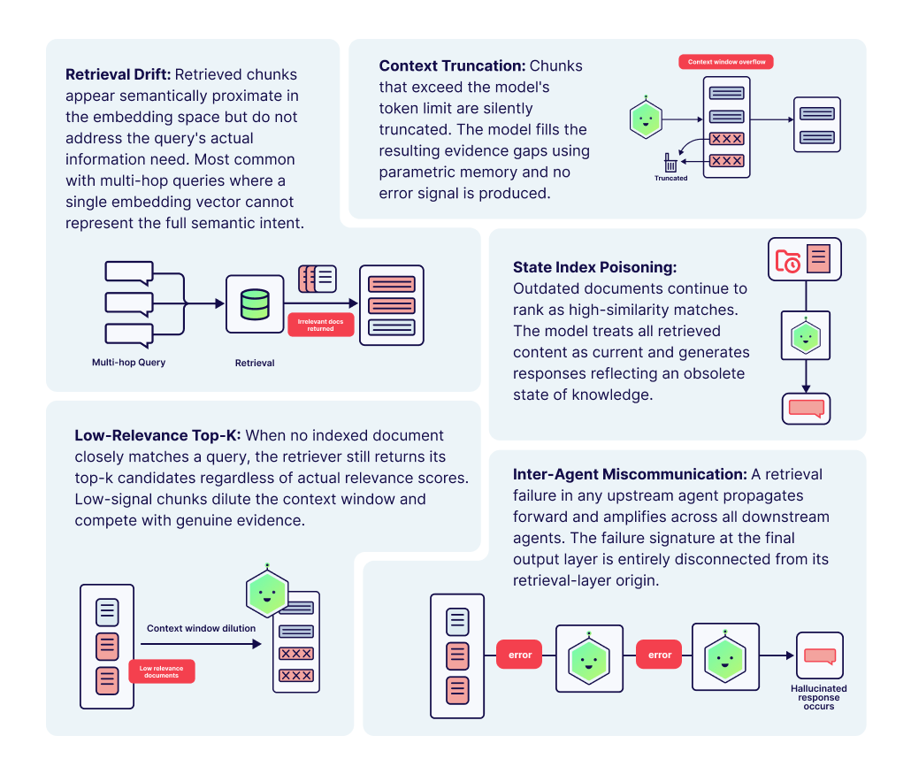
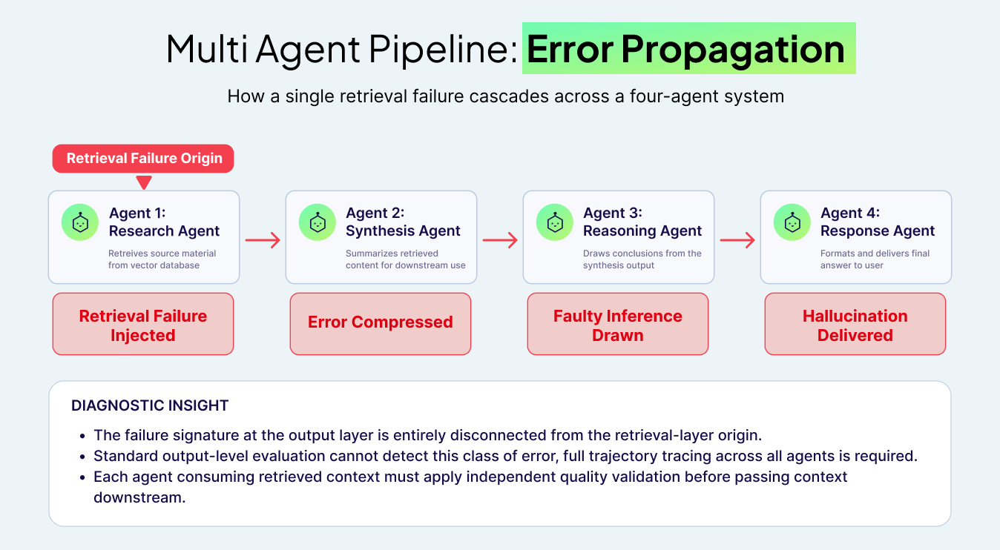

*In my research on hallucination detection in multi-agent LLM systems, the most consistent findings have not been about model size, prompt design, or inference temperature. It has been about retrieval. Poor retrieval quality is the single most reliable predictor of degraded output across every pipeline configuration I have studied.*

The evidence from our experimental pipelines is unambiguous: when retrieval breaks down, the language model does not compensate. It extrapolates. It fills gaps with plausible-sounding content that has no grounding in fact, and it does so with the same fluency and confidence as it applies to correct outputs. The result is a failure mode that is both systematic and exceptionally difficult to detect without a dedicated evaluation infrastructure.

This post draws on that research to offer a structured, practitioner-facing analysis of retrieval quality: what it is, why it matters more than most teams realize, how it fails in practice, and what can be done to improve it. Whether you are building a production RAG pipeline or designing a multi-agent system, the principles here apply directly to the reliability of what your LLM ultimately produces.

## **Understanding the Retrieval Layer in RAG Systems**

Retrieval-Augmented Generation (RAG) addresses one of the fundamental limitations of large language models: their inability to access information beyond their training cutoff or outside their training distribution. In RAG architecture, an external knowledge store, typically a vector database, is queried at inference time to supply the model with relevant context before generation begins.

The pipeline operates in three sequential stages:

* **Indexing:** Source documents are segmented into chunks, encoded as dense vector representations via an embedding model, and stored in a vector database.  
* **Retrieval:** At query time, the user's input is encoded using the same embedding model and compared against indexed vectors using a similarity metric, typically cosine similarity. The top-k most similar chunks are returned.  
* **Generation:** The retrieved chunks are injected into the model's context window as grounding material. The LLM generates a response conditioned on both the query and the retrieved content.

The implicit contract in this architecture is that the retrieved content is accurate, current, and genuinely relevant to the query. When that contract is held, RAG systems perform impressively. When it does not, the architecture creates a specific and dangerous failure mode: the model generates coherent, confident output grounded in incorrect or irrelevant context, with no mechanism to signal that something has gone wrong.

## **How Retrieval Failure Drives LLM Hallucination: Evidence from Research**

My dissertation research investigates hallucination detection and mitigation in multi-agent LLM pipelines. One component of that work involves constructing a taxonomy of failure modes that emerge across agent trajectories and characterizing the conditions under which each failure type occurs. Retrieval-related failures consistently represent a dominant category, both in frequency and in downstream impact on output quality.

Across my experimental evaluations on [HaluEval](https://github.com/RUCAIBox/HaluEval), [TruthfulQA](https://github.com/sylinrl/TruthfulQA), and [FaithDial](https://github.com/McGill-NLP/FaithDial), conducted as part of my dissertation research, I found that retrieval-layer failures consistently accounted for a substantial proportion of hallucinations, even in pipelines with otherwise well-configured generation stages.  This finding aligns with broader literature: Stanford's [HELM](https://github.com/stanford-crfm/helm) benchmark evaluations and McGill University's analysis of the [FaithDial](https://github.com/McGill-NLP/FaithDial) corpus both demonstrate that faithfulness to retrieved context, not model scale, is the dominant predictor of factual accuracy in knowledge-grounded generation tasks.

Five retrieval failure modes emerged most consistently in our experimental work:

1. **Retrieval Drift:** Retrieved chunks are semantically proximate to the query in embedding space but contextually insufficient to answer it. Common with multi-hop queries, where a single embedding cannot represent the full information needed.

2. **Context Truncation:** When retrieved chunks are too large and overflow the model's context window, truncation removes information silently. The model compensates by drawing on parametric memory.

3. **Stale Index Poisoning:** Documents that are outdated continue to surface as top-k matches. The model has no mechanism to distinguish temporally valid from invalid retrieved content.

4. **Low-Relevance Top-K Retrieval:** When no document closely matches a query, the retriever still returns top-k results regardless of relevance. These low-signal chunks dilute the context window, and the model incorporates the noise into generation.

5. **Inter-Agent Miscommunication:** In multi-agent pipelines, retrieval failure in an upstream agent propagates and amplifies across all downstream agents, producing compounding degradation that remains invisible at the output layer.

What makes these failures particularly consequential is their invisibility. Unlike a model that simply says it does not know, a model generated from poorly retrieved context produces well-formed, confident output. Detection requires either ground-truth comparison or a dedicated evaluation layer, neither of which exists by default in most deployed systems.

## **Why Scaling the Model Does Not Solve a Retrieval Problem**

A common and understandable response to poor RAG performance is to attribute it to model capability and address it by scaling up: a larger model, a better fine-tune, or a more advanced foundation. This intuition is reasonable in isolation, but misdiagnoses the problem when retrieval quality is the underlying cause.

Consider the analogy of a highly skilled analyst given a falsified report. The analyst's expertise does not protect against the quality of their source material; it simply makes them more effective at constructing persuasive arguments from whatever they have been given. A more capable LLM, given low-quality retrieved context, produces exactly this outcome: higher-fluency hallucinations. The model's additional capability is applied to rationalizing and elaborating on bad inputs, not to correcting them.

In experimental comparisons between smaller models with high-quality retrieval and larger models with degraded retrieval, the smaller model consistently produced more faithful outputs. The retrieval layer, not the generation layer, sets the effective ceiling on factual accuracy. Investing in retrieval quality improvement yields compounding returns across the entire pipeline, regardless of which model sits at the end.

## **Four Dimensions of Retrieval Quality**

Improving retrieval quality is not a single intervention but a set of compounding decisions made across the indexing and retrieval pipeline. The following four dimensions represent the areas of highest leverage based on both our experimental findings and the broader research literature.

### **1\. Embedding Model Selection**

[An embedding model](https://weaviate.io/blog/vector-embeddings-explained) determines how meaning is encoded in a vector space. General-purpose embedding models perform adequately across many domains but show measurable degradation on specialized corpora, particularly in technical, legal, or biomedical contexts. Benchmarking multiple embedding models against a representative sample of real queries from your target domain, before committing to one, is an investment that pays dividends throughout the system's operational life.

### **2\. Chunking Architecture**

The chunking [strategy](https://weaviate.io/blog/chunking-strategies-for-rag) has an outsized effect on retrieval precision that is frequently underestimated. Fixed-size character chunking routinely breaks semantic units at arbitrary boundaries, producing syntactically incomplete chunks that are poorly represented in the embedding space. More effective approaches include sentence-boundary chunking, recursive splitting that respects paragraph structure, and hierarchical chunking that preserves parent-document context alongside each child chunk.

### **3\. Retrieval Strategy**

Naive top-k vector similarity retrieval is a reasonable starting point, but it is rarely the optimal configuration for production systems. Three enhancements consistently demonstrate measurable improvements in retrieval precision:

6. [**Hybrid search**](https://weaviate.io/blog/hybrid-search-explained)**:** Combining dense vector search with sparse BM25 keyword retrieval captures complementary signals. Dense retrieval handles semantic similarity; sparse retrieval handles exact-match and rare-term queries.

7. **Cross-encoder re-ranking:** A bi-encoder retriever retrieves candidates efficiently at scale. A cross-encoder re-ranker jointly scores each candidate against the full query, which is more computationally intensive but substantially more accurate.

8. **Relevance thresholding:** Enforcing a minimum similarity score before a chunk enters the context window prevents the low-relevance top-k failure mode. If no retrieved chunk meets the threshold, the system should explicitly surface this.

### **4\. Index Maintenance and Freshness**

The temporal dimension of retrieval quality is underserved in most RAG implementations. A vector index reflects the state of its source documents at the time of indexing. Without active maintenance, index quality degrades in proportion to the rate of change in the underlying domain. Production systems require incremental indexing pipelines that detect document additions and modifications promptly. Document metadata, particularly timestamps, can be used to apply recency weighting or filter stale results at query time.

## **Evaluating Retrieval Quality: A Practical Measurement Framework**

Retrieval quality cannot be improved without measurement. The following metrics provide a structured framework for quantifying retrieval performance:

9. **Context Precision:** The fraction of retrieved chunks genuinely relevant to the query. Low precision indicates noisy content entering the context window.

10. **Context Recall:** The fraction of information required to answer the query that is present in the retrieved set. Low recall forces the model to rely on parametric memory.

11. **Faithfulness:** The degree to which the generated response is entailed by the retrieved context. This is the critical end-to-end metric measuring whether retrieval quality translates into grounded generation.

12. **Mean Reciprocal Rank (MRR):** For ranked retrieval results, MRR measures the average position of the first genuinely relevant document.

Frameworks such as [RAGAS](https://weaviate.io/product/integrations/ragas)  operationalize these metrics and can be integrated into evaluation pipelines running alongside CI/CD workflows. The goal is to make retrieval quality a tracked, monitored, and historically comparable quantity, not a one-time audit performed during initial system development.

## **A Compounding Problem: Retrieval Failure in Multi-Agent Systems**

In single-agent RAG systems, retrieval failure has a bounded impact: one query, one generation, one output to evaluate. Multi-agent systems, in which specialized agents operate in sequence and pass context between one another, face a structurally different problem. Retrieval failure at any stage does not stay contained. It propagates.

Consider a representative multi-agent pipeline: a research agent retrieves source material, a synthesis agent summarizes it, a reasoning agent concludes the summary, and a response agent formulates the final output. If the research agent's retrieval is contaminated by a low-relevance chunk or a stale document, the synthesis agent compresses that flawed content into a confident-sounding summary. The reasoning agent then treats that summary as an established fact. The response agent formats and presents the conclusion without indicating that the chain of inference rests on a corrupt foundation.

This pattern falls under our research taxonomy's Inter-Agent Miscommunication, driven by upstream retrieval failure. Its defining characteristic is that the failure signature at the output layer is entirely disconnected from its origin in the retrieval layer. Diagnosing requires tracing the full agent trajectory, not simply inspecting the final response. Standard output-level evaluation methods are largely blind to this class of error.

The architectural implication is significant. Each agent in a pipeline that performs retrieval or consumes context derived from retrieval requires its own quality validation mechanism. Context that does not meet a defined relevance and freshness standard should be flagged, withheld from downstream agents, or escalated for review, not silently passed forward as though it were trustworthy.

## **Practical Recommendations for Production Systems**

The following recommendations reflect the highest-leverage interventions based on experimental findings and practical system design experience. They are ordered by priority for teams addressing retrieval quality for the first time.

* **Begin with a retrieval audit, not a model upgrade.** Before adjusting any generation-layer parameters, manually examine 50 to 100 retrieved results across a representative set of queries. Identify whether the primary issue is chunking quality, model fit for the embedding, index staleness, or threshold configuration.

* **Implement hybrid search as a baseline.** Pure dense retrieval consistently underperforms hybrid configurations on real-world corpora. The BM25 component adds minimal latency relative to the precision gains it delivers, particularly for queries involving technical identifiers or domain-specific terminology.

* **Enforce retrieval thresholds explicitly.** Configure a minimum similarity score below which retrieved chunks are not passed to the generation layer. A system that returns no context and says so is substantially more trustworthy than one that silently generates from irrelevant material.

* **Establish a continuous faithfulness baseline.** Use an automated evaluation framework to measure faithfulness on a held-out query set before and after any pipeline changes. Treat faithfulness as a first-class system metric tracked alongside latency and throughput.

* **In a multi-agent architecture,  gate context at every retrieval point.** Each agent that performs retrieval, or that depends on retrieved context from an upstream agent, should apply an independent relevance validation step before incorporating that context into its reasoning.

## **Summary**

Retrieval quality is not a secondary concern in RAG-based systems. It is the primary determinant of whether a language model produces reliable, grounded outputs or coherent, undetectable hallucinations. My research on hallucination detection in multi-agent LLM pipelines has consistently pointed to the retrieval layer as the highest leverage point of intervention, both in terms of failure frequency and downstream impact on output trustworthiness.

The practical path forward is clear: measuring retrieval quality explicitly, addressing chunking and embedding decisions with the same rigor applied to model selection, enforcing relevance thresholds rather than relying on the model to compensate for poor context, and in multi-agent systems, treating each agent's retrieval interface as an independent risk surface requiring validation.

The generation layer receives the most attention in applied LLM research and engineering. The retrieval layer deserves more of it.

import WhatsNext from '/_includes/what-next.mdx';

<WhatsNext />