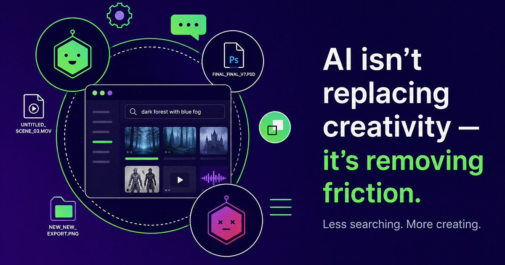
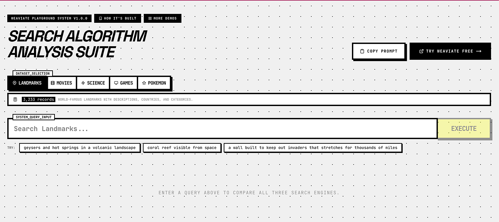
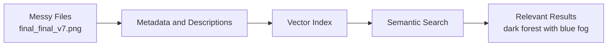

:::info
final_final_v7.png  
USE_THIS_ONE.mov  
new_new_export.psd
:::

If these look familiar, you’re not alone.

Every creative team has a **graveyard of almost-lost work**.

It lives in folders with names like:

- `final_final_v7`
- `untitled_scene_03`
- `export_USE_THIS`
- `new_new_THISONE`

Somewhere in there is exactly what someone needs right now — a reference, a concept, a scene, a design.

But finding it depends on:

- who named it  
- how it was tagged  
- whether anyone remembers where it lives  

And that’s where the real problem begins.

---

## The real problem isn’t creativity

Creative teams don’t struggle to come up with ideas.

They struggle with everything *around* the idea.

- finding the right reference  
- locating old work  
- organising assets  
- sharing across teams  
- reusing previous concepts  

Most of the friction isn’t in creating.

It’s in the **workflow surrounding it**.

---

## Where time actually goes

Ask any designer, artist, editor, or developer where time gets lost.

It’s rarely in the moment of creation.

It’s in things like:

- digging through folders  
- trying different keywords to find a file  
- recreating something that already exists  
- asking teammates *“do you remember where that is?”*  

This is time that often goes unnoticed.

But it adds up quickly.

---

## AI as a workflow layer

The most useful way to think about AI isn’t as a replacement for creativity.

It’s a workflow layer that **reduces friction**.

Instead of asking:

👉 *“Can AI generate this?”*

A better question is:

👉 *“Can AI help me get to the right thing faster?”*

That shift changes everything.

---

## A simple example

> Keyword search matches exact words.  
> Semantic search understands meaning.

> 👉 [Try the semantic search playground](https://playground.weaviate.io/) and see the difference for yourself.

Imagine searching for an image in your project.

You don’t remember the filename.  
You don’t remember the exact folder.

But you remember what it felt like.

👉 *dark forest with blue fog*

Traditional search struggles with that.

Because it expects exact matches.

AI systems can work differently.

They can match based on **meaning** — what something *is*, not just what it’s called.

Under the hood, it looks something like this:

---

## What this unlocks

Once you reduce friction around finding work, things start to change:

- you move faster
- you reuse ideas more effectively
- collaboration becomes easier
- less work gets lost

And most importantly:

👉 you spend more time actually creating

---

## This is just the start

This isn’t about replacing creative thinking.

It’s about removing the friction that surrounds it.

And for teams buried in final_final_v7, that’s not a futuristic promise.

It’s **immediate, practical relief**.

---

## What’s next

In the next post, we’ll break down exactly **where creative workflows fall apart** — and why folders, tags, and traditional search struggle to keep up.

From there, we’ll start building a small, real example of how AI can improve the way creative teams work.

---

## Quick question

What’s hardest for your team to search right now?

- images
- video
- references
- design files
- documents

---

import WhatsNext from '/_includes/what-next.mdx';

<WhatsNext />