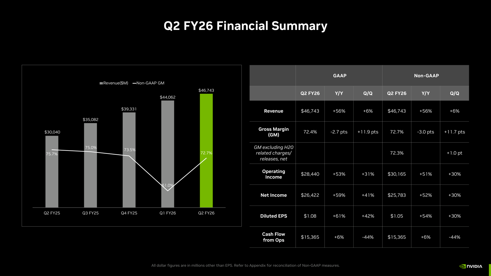
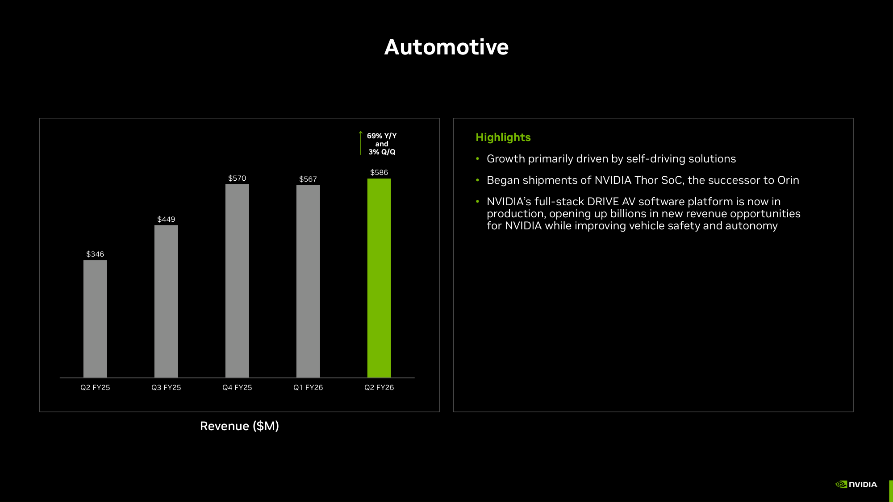
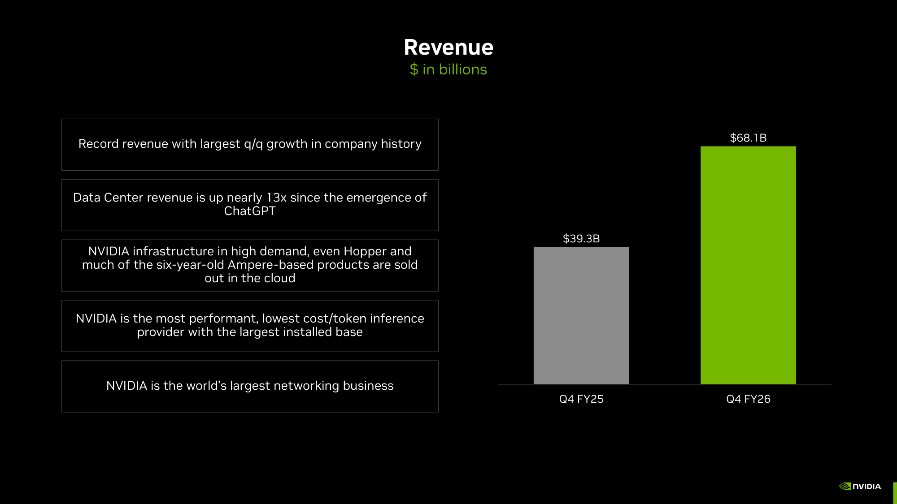
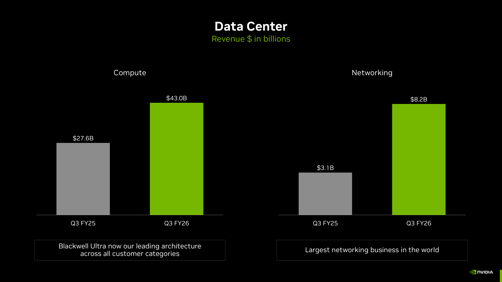
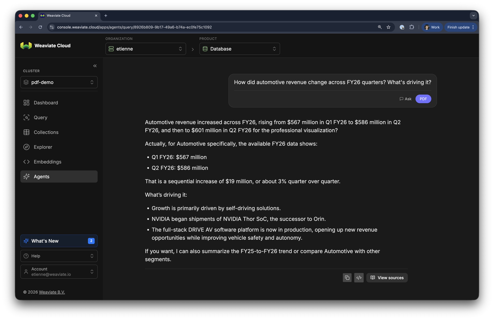

<!-- truncate -->

## Intro

If you have ever tried to put a stack of investor decks, scientific papers, or annual reports through a RAG pipeline, you know the drill. You set up an OCR or text-extraction step. You pick a chunking strategy. You embed the text. You retrieve. And then someone asks a question about a *bar chart*, and your retrieval comes back with three pages of unrelated bullet points because the actual answer was a five-bar chart with `Q2 FY25` and `$346M` written underneath it. The chart is *invisible* to your index.

That used to be what people did. The interesting parts of a PDF, the bar chart of revenue trends, the comp table, the architecture diagram, all that stuff makes the PDF so much more valuable than a pure wall of text. But if you can't retrieve it, it's essentially *invisible* to your RAG pipeline.

In this article, we want to show you a much better way. It'll retrieve the rich charts, but also it'll be much simpler. We'll cover:

* **Classic RAG**: Why OCR and text embedding works great for some (structured and unstructured) data, but not for rich PDFs.
* **Late Interaction RAG**: What late-interaction multi-vector models are, and why they let you skip text extraction entirely.
* **Drag-n-Drop and you're done**: How to ingest a stack of PDFs in Weaviate Cloud with literally a drag-and-drop.
* **Real Examples**: Example queries against NVIDIA's FY2026 quarterly decks, where each top result is the *exact chart* the question is asking about.
* **Complex Agentic Reasoning**: How to wrap the same data with the Weaviate Query Agent for synthesised answers with page-image citations.
* **The same, but with code**: The same ingestion pipeline in roughly 50 lines of Python, for when you need to do this in production.

If you'd rather just see the demo first and read the explanations later, skip to the queries section below.

## Why traditional RAG falls short

Let's first look at what most people do today. The textbook RAG pipeline for a PDF is:

1. OCR (or text-extract) the file (using either a python library or third-party tooling).
2. Chunk the text.
3. Embed the chunks with a text embedding model.
4. Retrieve, (maybe) rerank, generate.

This workflow is by no means bad, and successfully used thousands of times every day. But it assumes that *the page can be reduced to a sequence of text tokens without losing the rich content*. For a press release or a Wikipedia article, that's mostly fine. For a slide deck full of charts, a 10-K with comp tables, or an academic paper with figures, it's not.

You could build a complex ETL pipeline to extract charts and vectorize them separately, but that's another model in the pipeline, and it makes the whole stack far more complex and introduces a merging problem at query time.

With a late-interaction multi-vector model, you don't need any of that. You embed the *page*, not the text on it. The model sees the chart the way you do. Yes, you heard that right, there is not even a chunking step. The page is the chunk.

## Late-interaction multi-vector retrieval, in two paragraphs

Before we get to the demo, a quick detour on what makes this work. If you already know ColPali / ColBERT, feel free to skim.

Traditional dense embedding models compress an entire document (or chunk) into a single vector. Late-interaction multi-vector models do something different: they encode the document as a *set* of vectors, typically one per token, or for a vision model like the one we're about to use, one per image patch. At query time, your query is also encoded as a set, and the relevance score is the sum of best matches between query tokens and document tokens (a quantity called MaxSim).

Instead of asking *"is this whole page about my whole question?"*, the model can ask *"is the part of this page that talks about Q4 FY26 a good match for the part of my question about 'change over time'?"*. For a chart-heavy page, that's exactly the granularity you need. The model doesn't have to summarise an entire slide into a single vector, it can keep one vector per region of the page, and the query can pick out the regions that matter.

So really there are two distinct advantages here:
1. Because it's a **visual model** you keep the layout, the charts, the tables, etc. *and*
2. By using MaxSim over a set of vectors, you **eliminate the need for chunking**.

Weaviate ships `multi2multivec-weaviate`, a vectorizer module that runs a hosted late-interaction multi-vector model on Weaviate Cloud. You don't have to host or manage it. From your perspective it's just another vectorizer.

## Ingesting PDFs by drag-and-drop

The fastest way to try this is the drag-and-drop importer in [Weaviate Cloud](https://console.weaviate.cloud).

1. Open your cluster in the Console.
2. Go to *Collections* and create a new collection from the file uploader.
3. Drop your PDFs into the upload zone.

<div style={{display: 'flex', gap: '1rem', alignItems: 'flex-start', margin: '1.5rem 0'}}>
  <div style={{flex: '1.5606 1 0'}}>
    
  </div>
  <div style={{flex: '1.7175 1 0'}}>
    
  </div>
</div>

That is the entire ingestion step. Behind the scenes, Weaviate is doing three things:

* Rendering each PDF page to a high-resolution image.
* Storing that image as a `BLOB` property on a new collection.
* Vectorizing it with the `multi2multivec-weaviate` module, producing many vectors per page.

A few things worth noting:

* **One object equals one page.** The unit of retrieval is the page, which is also the unit a human navigates a document by.
* **No OCR.** The model never sees the text as text. It sees the page as an image. That's why a chart with no caption is just as searchable as a paragraph.
* **The vectors are compressed.** Late-interaction models can produce hundreds of vectors per page, which would be expensive to store naively. Weaviate uses a [multi-vector encoding](https://docs.weaviate.io/weaviate/configuration/compression/multi-vectors) scheme that keeps the index compact. (More on that also in the trade-offs section below.)

For this article we imported NVIDIA's four FY2026 quarterly investor presentations (Q1 through Q4). They cover the financial year ending January 2026, are wall-to-wall charts and tables, and total 92 pages. The whole import took about a minute and a half.

## Three queries against the NVIDIA decks

Before we do anything fancy (such as agentic reasoning on these results), we want to show you the raw retrieval results. They are already impressive on their own:

With ingestion done, you can query directly from the Console (or any Weaviate client). The query is plain English. The result is a ranked list of pages, returned with the page image inline.

Let's walk through three queries and show you what comes back.

### Query 1: *"how did automotive revenue change over time?"*



The top result is a single page from the Q2 FY26 deck, titled *Automotive*. The left half is a bar chart showing five quarters of revenue (`$346M → $449M → $570M → $567M → $586M`, +69% Y/Y). The right half is three bullet points about Thor SoC and DRIVE AV.

The phrase *"over time"* doesn't appear anywhere on this page. Neither does *"change"*. The model didn't match against this text, but rather the image of the page. What it saw was five bars of increasing height with quarterly labels, and that was enough to identify the page as a match for a question about a temporal trend.

### Query 2: *"gross margin trend"*


The top result here is the *Q2 FY26 Financial Summary* page. On the left is a combination chart: revenue bars and a non-GAAP gross margin line over five quarters. On the right is a GAAP/non-GAAP KPI table with Y/Y and Q/Q deltas.

Again, nothing on this page literally says "gross margin trend". But there *is* a line chart that visualises the gross margin dipping from 75.7% to 61.0% in Q1 FY26 and recovering to 72.7% in Q2 FY26. That's what *trend* looks like, and it's what the model retrieved.

A side note: the same page also contains a detailed financial table. That makes it a particularly useful retrieval target if you're then going to ask follow-up questions like *"by how many basis points did gross margin recover Q/Q?"* The answer is sitting on the page the model already returned. More on that below when we introduce the Query Agent.

### Query 3: *"how did data center revenue change over time?"*



The top result is the Q4 FY26 *Revenue* page — a Y/Y bar chart (`$39.3B → $68.1B`) with a callout that data center revenue is up 13× since the emergence of ChatGPT. This is a great example that the model still respects text when it's the better match. In this case the chart is less relevant, but the box stating the exact answer is what returned the highest similarity (MaxSim) on this page. So you get the best of both worlds.

The runner-up is the dedicated *Data Center* page from a different quarter, which splits the segment into Compute and Networking:



Notice how the second-best match isn't simply *"another page about data center"*, but a different *kind* of answer — the same revenue, broken down differently. That's a useful property for an agent that wants to triangulate across multiple views of the same underlying number. Speaking of which...

## From search to answers: the Weaviate Query Agent

Vector search returns pages. Sometimes you want an answer.

The [Weaviate Query Agent](https://docs.weaviate.io/agents/query) is a managed agent that wraps vector retrieval with multi-step reasoning, source citations, and inline page images. It is available out of the box on any Weaviate Cloud cluster. Point it at the collection you just created and ask. We'll also show how to call it from Python further down.



If we ask *"How did automotive revenue change across FY26 quarters? What's driving it?"* over the same collection, the agent comes back with a synthesised answer (the numbers from the bar chart, plus the bullet points about Thor SoC and DRIVE AV adoption) and the underlying page images as citations. The agent decided which pages to retrieve, *looked* at them visually, and quoted directly from the slide.

<div style={{display: 'flex', gap: '1.5rem', alignItems: 'flex-start', margin: '1.5rem 0'}}>
  <div style={{flex: 1}}>

Open the *Sources* panel and you'll see exactly which pages backed the answer. Among the citations is the *Automotive* page from the Q1 FY26 deck — the same kind of bar chart we surfaced in the raw vector search earlier, just for a different quarter.

Every numerical claim in the response is anchored to a specific page in a specific PDF, with the page image right there for verification. You don't have to trust the agent. You can read the slide.

Traditional RAG gives you *"I think the answer is around here, please verify"*. Visual retrieval plus the Query Agent gives you the slide.

  </div>
  
</div>

## Doing the same thing in Python

The drag-and-drop UI is the fastest path to a demo, but most production pipelines need code. Here is the equivalent in roughly 50 lines.

First, the dependencies:

```bash
pip install "weaviate-client>=4.21" PyMuPDF
```

Then, render each PDF page to a 2000-pixel PNG and store it as a BLOB in a collection vectorized with `multi2multivec-weaviate`:

```python
import os
from base64 import b64encode
from pathlib import Path

import fitz  # PyMuPDF
from weaviate import connect_to_weaviate_cloud
from weaviate.classes.config import Configure, DataType, Property


def page_to_b64(page, long_edge: int = 2000) -> str:
    scale = long_edge / max(page.rect.width, page.rect.height)
    pix = page.get_pixmap(matrix=fitz.Matrix(scale, scale))
    return b64encode(pix.tobytes(output="png")).decode()


client = connect_to_weaviate_cloud(
    os.environ["WEAVIATE_URL"],
    auth_credentials=os.environ["WEAVIATE_API_KEY"],
)

if not client.collections.exists("PDF"):
    client.collections.create(
        name="PDF",
        properties=[
            Property(name="pdf_name", data_type=DataType.TEXT),
            Property(name="page_number", data_type=DataType.INT),
            Property(name="page_image", data_type=DataType.BLOB),
        ],
        vector_config=Configure.MultiVectors.multi2vec_weaviate(
            image_field="page_image",
        ),
    )

col = client.collections.get("PDF")
for pdf_path in Path("pdfs").glob("*.pdf"):
    with col.batch.fixed_size(batch_size=2) as batch, fitz.open(pdf_path) as doc:
        for i, page in enumerate(doc, start=1):
            batch.add_object(properties={
                "pdf_name": pdf_path.name,
                "page_number": i,
                "page_image": page_to_b64(page),
            })

client.close()
```

A few notes on the above:

* **The Python call `MultiVectors.multi2vec_weaviate(image_field="page_image")` configures the `multi2multivec-weaviate` module.** Same vectorizer the drag-and-drop UI uses. You can mix and match: ingest from a notebook today, query from the Console tomorrow.
* **`PyMuPDF` does the rasterization.** The `2000` long-edge target is a sensible default; smaller saves time, larger gives the model more detail. We haven't found a strong case for going below 1500 or above 2500.
* **`batch_size=2` is intentional.** Each object carries a multi-megabyte image, so small batches keep the gRPC payload sane.

Querying is symmetric. Text in, ranked pages out:

```python
from weaviate.classes.query import MetadataQuery

res = col.query.near_text(
    query="how did automotive revenue change over time",
    limit=5,
    return_properties=["pdf_name", "page_number"],
    return_metadata=MetadataQuery(distance=True),
)
for o in res.objects:
    print(o.metadata.distance, o.properties)
```

On the NVIDIA corpus, this returns the Q2 FY26 *Automotive* page as result #1: the same five-quarter bar chart you saw above, retrieved by an end-to-end pipeline that contains zero OCR.

The same Query Agent you saw in the Console is also available from Python. Pass it the collections to reason over, then `ask()`:

```python
from weaviate.agents.query import QueryAgent
from weaviate_agents.classes import QueryAgentCollectionConfig

agent = QueryAgent(
    client=client,
    collections=[
        QueryAgentCollectionConfig(name="PDF"),
    ],
)

response = agent.ask("How did automotive revenue change across FY26 quarters? What's driving it?")
response.display()
```

`response.display()` renders the same synthesised answer plus page-image citations you saw in the Console.

## So is this the silver bullet for PDFs?

Of course not. As always in Engineering there are trade-offs:

* **Many vectors per object/page.** Late-interaction multi-vector models produce many vectors per page. You can partially offset this with compression techniques, such as [Muvera](/blog/muvera), which are natively supported in Weaviate. This helps, but also introduces a compression/accuracy trade-off. For a corpus that is dominated by large amounts of plain text (think: legal contracts, transcripts, log files), a text embedding model will still be cheaper and just as accurate.
* **Page-level retrieval is coarse.** If your answer lives in one paragraph buried in a 30-page contract, returning the whole page may be more context than you want. In practice we see this typically mitigated in the agent layer (e.g. Weaviate's Query agent). Extracting the right paragraph from one page does not burn a huge amount of tokens, and therefore does not diminish the benefits that RAG provides in the first place.
* **The model still has to handle your charts.** It generalises well from the public corpora it was trained on, but if you have very domain-specific visual conventions (think: highly stylised internal templates), validate retrieval quality on your own data first. 

So when does this approach win? Mostly in PDF-heavy domains; quarterly decks, due-diligence packets, scientific figures, technical drawings. For text-dominated corpora, a text pipeline is most likely cheaper, and could be just as accurate if the same information is present in text. 

If you want to optimize this even further, you could consider doing a hybrid approach. Identify the pages with charts, implement them as multi-vector and the rest as text. Then you can use an RRF-style approach to merge results at query time.

## Conclusion

Let's wrap up with the key takeaways:

* **Charts and tables are not a problem to be solved by better OCR.** They are *primary information* that gets destroyed in extraction. If your pipeline only indexes text, the chart was already gone before you started embedding.
* **Late-interaction multi-vector models let you skip extraction entirely.** Render the page, embed the image, query in natural language. The model retrieves pages by what they look like: charts, tables, layout, and all.
* **On Weaviate Cloud, ingestion is drag-and-drop.** Point the Query Agent at the resulting collection, ask a question, get an answer with the slide as a citation.
* **In code, it's the same primitive.** `MultiVectors.multi2vec_weaviate(image_field="page_image")` is the entire vectorizer config. The rest is rasterising pages with PyMuPDF and a small `batch.add_object` loop.

If you have been working around chart-heavy PDFs because the indexing pipeline made them too painful to deal with, this is worth a try. The kind of slide deck you used to skip, because it was *"mostly charts"*, is exactly what this approach is built for.

Spin up a [Weaviate Cloud](https://console.weaviate.cloud) cluster, drag in your PDFs, and ask a question. If it works for NVIDIA's quarterly decks, it will probably work for yours.


import WhatsNext from '/_includes/what-next.mdx';

<WhatsNext />
