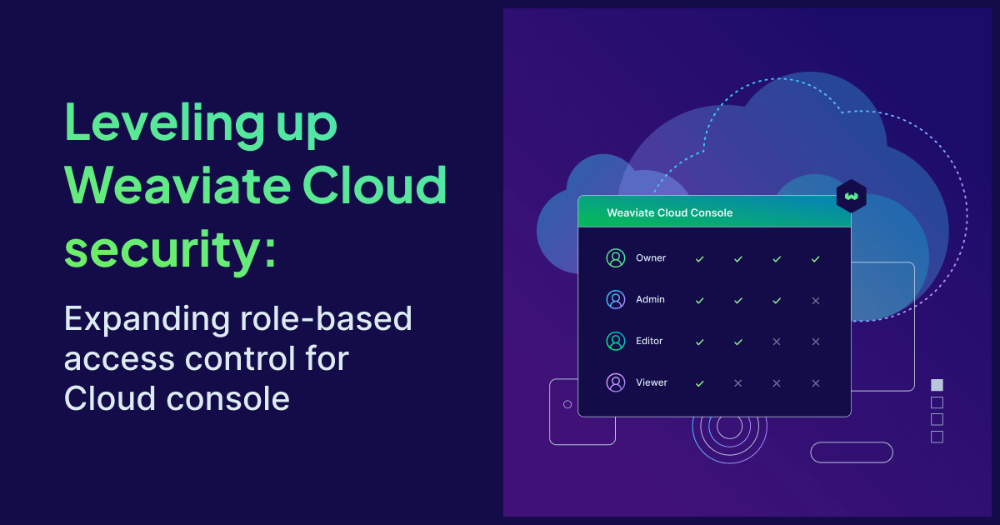

# Leveling up Weaviate Cloud security: Expanding role-based access control for Cloud console

You can now assign more granular roles to users in your Weaviate Cloud organization. We are expanding role-based access control (RBAC) for the Cloud console with two new roles — **Editor** and **Viewer** — that add to the existing **Owner** and **Admin** roles, giving organizations more control over resource access.

Role-based access control is a security best practice and a standard feature in modern cloud platforms. It provides a structured way to grant, organize, and delegate permissions across the people and applications working with your cloud resources. RBAC reduces the risk of accidental changes, limits the blast radius of mistakes, and gives security and platform teams the clarity they need to scale Weaviate Cloud usage across an organization.

By assigning Editor or Viewer roles instead of sharing full access, organizations can apply the principle of least privilege, ensuring team members have only the access they need to do their jobs. This applies whether you're a small team of developers or an enterprise rolling out Weaviate across multiple business units.

## Weaviate Cloud roles and use cases

Within a Weaviate Cloud organization, every user can be assigned one of four roles. Each role grants a specific set of permissions across organization settings, billing, cluster management, and access to cluster data.

| Owner | Admin |
|:--|:--|
| Full access to everything in the organization, including billing, user management, and the ability to invite other users as Owners. The person who creates the organization is automatically assigned this role.    Owners are the only role that can promote other users to Owner. Typically reserved for the small group of people responsible for the organization end-to-end. | Manages clusters, billing, and day-to-day organization activity. Admins can invite new users to the organization (but not as Owners) and have full control over cluster creation, configuration, and deletion.    This is the right role for senior engineers, platform leads, or anyone who needs to operate Weaviate Cloud without the ability to reshape ownership. |
| **Editor** *(New)* | **Viewer** *(New)* |
| Manages clusters without touching billing or user invitations. Editors can create, configure, modify, and delete clusters but cannot change billing information or invite new users to the organization.    This role fits engineers building on Weaviate day-to-day who don't need to manage the organization itself. | Read-only access. Viewers can see clusters, configurations, and organization details, but cannot make any changes.    This is the right role for stakeholders who need visibility — security reviewers, finance partners, or observers from other teams — without the ability to alter anything. |

## How to manage roles in Weaviate Cloud

Managing roles in Weaviate Cloud takes just a few clicks.

1. **Open your organization menu.** At the top of the Weaviate Cloud console, click the *Organization* dropdown.
2. **Select Organization settings.** From the dropdown, choose *Organization settings* to open your organization's management page.
3. **Manage users and roles.** Under the *Users and Access* section, you'll see every member of your organization, their assigned role, and a description of what each role can do. From here you can:
   - Click *+ Add User* to invite a new member and assign their role during invitation
   - Change an existing user's role using the role selector
   - Remove a user from the organization

Changes take effect immediately. Users will see their new permissions on their next action in the console.

:::note
Every organization must have at least one Owner at all times. If you're the only Owner, you'll need to assign Owner permissions to another member before you can leave or delete the organization.
:::

## Learn more

If you're ready to start using granular roles in your own organization, sign in to Weaviate Cloud and head to your organization settings. To dive deeper, check out the <a href="https://docs.weaviate.io/cloud/platform/users-and-organizations#user-roles" target="_blank" rel="noopener noreferrer">product documentation</a>.

Have questions or feedback? Join the conversation in our Community Forums or reach us at support@weaviate.io.
