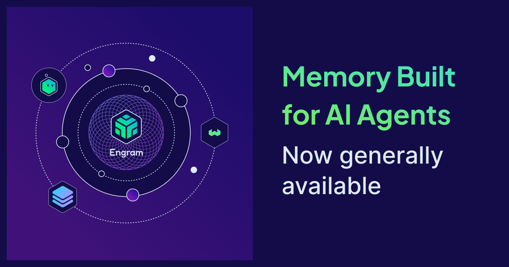

We're thrilled to announce that Engram is now generally available. Engram is our managed memory and context service, purpose-built to help agents orchestrate workflows, learn from experience, and anchor decisions to trusted knowledge. If you've been following our work on memory for agents — from the conceptual framing in [The Limit in the Loop](https://weaviate.io/blog/limit-in-the-loop) to the [architectural deep dive](https://weaviate.io/blog/engram-deep-dive) — today is the day that we open our doors for you to start building with Engram.

## Memory is infrastructure

Agents we build are supposed to compound in value over time. They should build up interactions, accumulate context, and get more useful the longer they run. In practice, however, this value compounding does not happen, and agent usage may even backfire, due to three failure modes:

- **Long-context degradation.** Sending whole conversations back to models on every turn drives up latency and cost. More importantly, this can cause answer quality to drop in the middle of long inputs even with state-of-the-art context windows.
- **Messy raw data.** User interactions are noisy and facts evolve over time. Piling raw events into a data store and asking an LLM to reconcile them at query time pushes the hardest part of the problem to the worst place for solving it.
- **Multi-agent context fragmentation.** The moment a single request crosses agents, built-in memory patterns collapse. Instead shared memory that's persistent and scoped is required to orchestrate workflows beyond single-agent loops.

These problems sit on the critical path to success for any production-grade agent and are deeply structural. The solution is not a patch at the prompt layer, but rather systematic memory and context management. Memory mustn't be a superficial bolt-on but should be treated as a deliberate infrastructure component in the same way that storage, retrieval, and observability are.

## What Engram is

Engram is a managed service that turns raw, noisy agent events into structured, durable, scoped memories, and serves them back through Weaviate's hybrid semantic and keyword retrieval. It is a memory layer you can trust that inherits the maturity of the Weaviate database.

Asynchronous pipelines run in the background to extract relevant information, reconcile it against what's already known while handling deduplication, preference changes, and time-evolving facts, and persist a clean memory state. Use-case templates for personalization, continual learning, and multi-agent state are available on day one. Teams that outgrow them can drop down to direct pipeline control without leaving the platform. For the architecture in detail — pipelines, topics, scopes, and buffers — see the [Engram deep dive](https://weaviate.io/blog/engram-deep-dive).

The road from preview to GA was shaped by real-world use cases; putting Engram into different situations surfaced the changes that define production-ready: more durable pipelines, more efficient extractions and transforms, and deterministic reconciliation that avoids memory drift. This hardening lies beneath everything you get with Engram:

- **Actively maintained memory instead of an ever-growing context blob.** Pipelines extract, deduplicate, and reconcile against what's already known, so the memory state stays clean as interactions accumulate.
- **Fire-and-forget at the application layer.** Memory pipelines run asynchronously and durably in the background; the hot path is never blocked on memory I/O. Backed by Temporal-grade durability so partial failures recover cleanly and commits stay atomic.
- **Templates for the common case, primitives for everything else.** Personalization, continual learning, and multi-agent state ship as ready-to-deploy templates. Teams that need more control drop into the underlying pipeline primitives without changing platforms.
- **Built-in scopes from day one.** Per-project, per-user, and per-property isolation is part of the primitive (not a feature flag bolted on later), so the right memories are visible to the right caller by construction.
- **Unified retrieval on Weaviate.** Memory inherits Weaviate's hybrid search, scaling characteristics, and operational track record. There's no parallel system to deploy, secure, or operate.

## Who should use Engram

Engram is for teams whose agents have outgrown a single turn: assistants that should remember a user across sessions, agents that should get better from feedback instead of repeating mistakes, and multi-agent systems that need to share scoped state. If you're building one of these, you've almost certainly built some version of memory yourself.

It usually starts as one of a few things: sending whole conversations back to the model on every turn, hand-pruning a `MEMORY.md`, storing raw events as memory directly inside a data store, or running a standalone memory provider alongside your retrieval stack. Each works for a window of complexity before breaking due to the reasons above: degrading context with growth, unreconciled raw data, and fragmenting memory across multiple agents.

Engram is what's on the other side of that break: active reconciliation instead of accumulation, durable pipelines instead of synchronous side effects, and one platform for memory and retrieval instead of two.

## Get started with Engram

Engram is now generally available in [Weaviate Cloud](https://console.weaviate.cloud). Start compounding your agents' value today with our free tier.

Spin up your first project in a few clicks:

<figure style={{ margin: "2rem auto" }}>
  
  <figcaption style={{ textAlign: "center", fontSize: "0.9rem", color: "var(--ifm-color-emphasis-600)", marginTop: "0.5rem" }}>Create a new Engram project.</figcaption>
</figure>

<figure style={{ margin: "2rem auto" }}>
  
  <figcaption style={{ textAlign: "center", fontSize: "0.9rem", color: "var(--ifm-color-emphasis-600)", marginTop: "0.5rem" }}>The project dashboard.</figcaption>
</figure>

- Read the [Engram documentation](https://docs.weaviate.io/engram)
- For the full architecture story, see the [Engram deep dive](https://weaviate.io/blog/engram-deep-dive)
- Subscribe to the [Weaviate Agents newsletter](https://events.weaviate.io/weaviate-agents-newsletter) for product updates and best practices

import WhatsNext from '/_includes/what-next.mdx'

<WhatsNext />
