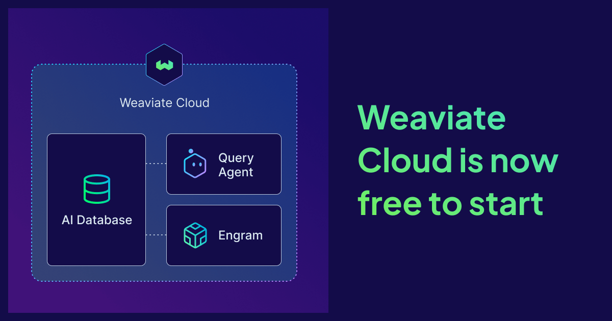

For years, the most common question we got was some version of "Does Weaviate have a free tier?" And for years, my sincere answer was a little awkward: Weaviate has always been free. It's open source, and anyone can run Weaviate on their local machines or own clouds without paying us a cent.

And people do, at an incredible scale. Today, we see many millions of active Weaviate databases running every single month, and our client downloads are rapidly approaching double-digit millions.

So whenever someone asked for a free tier on Weaviate Cloud, part of me wanted to say: “You already have one, go run it yourself.” For a long time, this felt like a complete and principled answer. We didn't want to build a watered-down hosted version just to have a "Free" button on the pricing page when the most powerful free option, the actual open-source database, was already sitting right there.

## What changed

Then we stopped being only a database.

Over the past two years, Weaviate grew into a platform. We built the [Query Agent](https://weaviate.io/product/query-agent) so you can ask questions of your data in natural language without orchestrating retrieval yourself. We built [Engram](https://weaviate.io/product/engram), a managed memory layer so your agents can actually remember and improve over time. These aren't things you spin up from a docker run, but cloud-native services that we operate, scale and maintain. 

So while "Just run the open source version" is sound advice for the database, it doesn't work for Query Agent or Engram because they are cloud services. And we introduced free tiers for these products so that all of our products are free to try. Despite this, the managed Weaviate database on Cloud remained without complete parity in this respect and offered a time-limited sandbox.

This didn’t quite sit right, because if we are going to build and scale a platform, the way in should be free across its entirety.  

## Free tiers across the whole platform

So that's what we're announcing today. Weaviate Cloud is now free to start across the entire product suite. The Database, Query Agent, and Engram are all available as free tiers.

The Weaviate Cloud managed database is now genuinely free, without a credit card or time expiration. It’s the same Weaviate you know and love, with enough room to build a serious prototype, and stays on as long as you’re using it. 

(If you're curious about the exact allowances, they're all on the [pricing page](https://weaviate.io/pricing).) 

This is the parity we've wanted for a while across all of our products and we are ecstatic to share the change with you.

That shift from "free until the clock runs out" to "free as long as it's useful to you" is the right direction. A free tier should be a place you can actually settle into and build and not a sprint against an expiry date.

## When you're ready for more

At some point your project outgrows the free tier, with more data, traffic, and real users. When that happens, you can easily upgrade your free cluster to a pay-as-you-go cluster that can scale up. No migration or re-architecting is required, and you can ship what you’ve prototyped.

## Start building

If you've been waiting for a reason to try Weaviate Cloud in any of our products, this is the moment: Go build something. We can't wait to see what you make.

\- [Sign up for free](https://console.weaviate.cloud/)   
\- [Quickstart guide](https://docs.weaviate.io/cloud/quickstart)  
\- [See what's included](https://weaviate.io/pricing)

import WhatsNext from '/_includes/what-next.mdx'

<WhatsNext />
