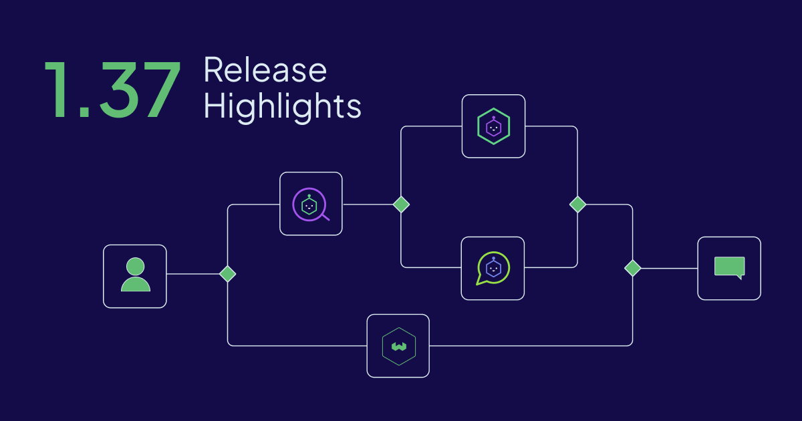

Weaviate `v1.38` is now available open-source and on [Weaviate Cloud](https://console.weaviate.cloud).

This release graduates two of Weaviate's most-requested capabilities to general availability — the **HFresh** disk-based vector index and the built-in **MCP Server** — and rebuilds **async replication** to run cluster-wide from a single centralized scheduler. Alongside them, four new previews land: the **Boost API** for query-time rescoring, **Namespaces** for tenant isolation on a shared cluster, **Nested Object Filtering**, and **Runtime Property Reindexing** that alters inverted-index config on a live collection.

Here are the release highlights!



- [HFresh Vector Index - General Availability](#hfresh-vector-index---general-availability)
- [MCP Server - General Availability](#mcp-server---general-availability)
- [Async Replication, Everywhere](#async-replication-everywhere)
- [Boost API (Preview)](#boost-api-preview)
- [Namespaces (Preview)](#namespaces-preview)
- [Nested Object Filtering (Preview)](#nested-object-filtering-preview)
- [Runtime Property Reindexing (Preview)](#runtime-property-reindexing-preview)
- [Summary](#summary)

## HFresh Vector Index - General Availability

[HFresh](/blog/weaviate-1-36-release#hfresh-preview) — the disk-based vector index inspired by the [SPFresh algorithm](https://arxiv.org/abs/2410.14452) and introduced as a technical preview in `v1.36` — is now **generally available**. Instead of keeping every vector in memory like HNSW, HFresh groups vectors into on-disk regions called postings and uses a compact in-memory HNSW index over their centroids to decide which regions to read. That keeps memory usage low and latency predictable as a collection grows into the billions, and it is purpose-built for **fresh, streaming-update workloads** where data is changing continuously rather than loaded once.

### How it works

HFresh is selected like any other index — per (named) vector, by setting `vectorIndexType` to `hfresh` in the collection schema. There is no preview environment flag to set in `v1.38`: the index is enabled simply by configuring a vector to use it.

```json
{
  "class": "Article",
  "vectorConfig": {
    "default": {
      "vectorIndexType": "hfresh",
      "vectorIndexConfig": {
        "distance": "cosine"
      },
      "vectorizer": {
        "text2vec-contextionary": {}
      }
    }
  }
}
```

HFresh ships with **RQ-1** [quantization](https://docs.weaviate.io/weaviate/concepts/vector-quantization) built in — the on-disk postings are stored compressed, and final ranking rescores against uncompressed vectors for accuracy. It supports the `cosine` and `l2-squared` distance metrics.

Because the index is designed around incremental rebalancing — splitting oversized postings, merging undersized ones, and reassigning vectors as boundaries shift — it absorbs continuous updates without the periodic full rebuilds that other on-disk indexes rely on.

:::info Related resources

- [Concepts: Vector Index - HFresh](https://docs.weaviate.io/weaviate/concepts/vector-index#hfresh-index)
- [SPFresh: Incremental In-Place Update for Billion-Scale Vector Search](https://arxiv.org/abs/2410.14452)

:::

## MCP Server - General Availability

The built-in [Model Context Protocol (MCP)](https://modelcontextprotocol.io/) server, introduced as a preview in [`v1.37`](/blog/weaviate-1-37-release#mcp-server-preview), is now **generally available**. It lets LLMs, IDEs, and AI agents talk to Weaviate natively — inspecting schemas, running hybrid searches, and writing data back — without any glue code. The server is a Streamable HTTP endpoint at `/v1/mcp` on the same port as the REST API, authenticates with a Bearer / API-key token, and respects Weaviate's standard [RBAC](https://docs.weaviate.io/deploy/configuration/authorization) permissions.

### How it works

The headline improvement in `v1.38` is that the MCP enable flags are now **runtime-configurable** — you can turn the server (and its write tools) on or off without restarting Weaviate:

```yaml
# Enable the MCP server
MCP_SERVER_ENABLED: 'true'
# Optional — enable write tools
MCP_SERVER_WRITE_ACCESS_ENABLED: 'true'
```

Because these flags are applied at runtime, you can grant or revoke agent write access in response to operational needs without a rolling restart of the cluster.

:::info Related resources

- [Docs: Weaviate MCP server](https://docs.weaviate.io/weaviate/configuration/mcp-server)
- [Model Context Protocol](https://modelcontextprotocol.io/)

:::

## Async Replication, Everywhere

Async replication is the background repair process that keeps replicas consistent on collections with a replication factor greater than 1. In `v1.38` it has been re-architected to run **cluster-wide from a single centralized scheduler**, instead of being configured and run separately per collection.

### How it works

A single scheduler now coordinates async repair across **all** replicated (RF > 1) collections, drawing from one shared worker pool rather than spinning up an independent pool per collection. This makes repair behavior uniform and far easier to reason about and operate at scale.

As part of the consolidation, the per-collection `maxWorkers` and `Enabled` knobs are removed. Two cluster-level controls replace them:

```yaml
# Size of the shared async-replication worker pool
ASYNC_REPLICATION_SCHEDULER_WORKERS: '<n>'
# Runtime kill-switch — pause all async replication without a restart
ASYNC_REPLICATION_DISABLED: 'false'
```

The worker-pool size is configurable via `ASYNC_REPLICATION_SCHEDULER_WORKERS`, and `ASYNC_REPLICATION_DISABLED` acts as a cluster-wide kill-switch that can be flipped at runtime — no restart required.

:::info Related resources

- [Concepts: Replication architecture - Async replication](https://docs.weaviate.io/weaviate/concepts/replication-architecture)
- [Configuration: Replication](https://docs.weaviate.io/deploy/configuration/replication)

:::

## Boost API (Preview)

Sometimes you want to nudge results without removing anything. A filter is too blunt — it drops everything that doesn't match — when what you actually want is "rank fresh articles a little higher" or "favor in-stock products," while still keeping the full result set. Weaviate `v1.38` introduces the **Boost API**, a preview query-time post-fetch rescorer.

### How it works

Boost runs **after** the primary search and reorders the candidates by blending the primary score with one or more boost conditions — promoting or demoting results **without filtering any of them out**. Conditions can be based on:

- **Filter matches** — promote results that satisfy an arbitrary filter
- **Property values** — boost on a specific property's value
- **Time decay** — favor more recent (or older) objects
- **Numeric decay** — favor objects nearer a target numeric value

Because objects are only re-ranked and never dropped, Boost is a softer tool than filtering: a non-matching result simply ranks lower instead of disappearing. The feature is **gRPC-only** today, so the client surface is limited, and a single query may apply at most **20 boost conditions**.

:::caution Preview
The Boost API is currently a **preview** feature, available over gRPC only with limited client support. The API and behavior may change in future releases.
:::

:::info Related resources

- [How-to: Search - Boost results](https://docs.weaviate.io/weaviate/search/boost)

:::

## Namespaces (Preview)

Running many independent tenants on one cluster usually means either spinning up separate clusters or carefully prefixing every collection name. Weaviate `v1.38` introduces **Namespaces** as a preview — first-class tenant isolation on a shared cluster.

### How it works

Every collection and alias belongs to **exactly one namespace**. Within a namespace, tenants refer to their collections by short, unqualified names, so two tenants can each have a collection called `Article` without colliding. This first release covers **Phase 1: collections and aliases**.

Namespaces are **off by default** and gated behind an environment flag. Enabling them currently has two hard requirements, and they apply only to **newly bootstrapped clusters** — you cannot turn Namespaces on for an existing cluster:

```yaml
NAMESPACES_ENABLED: 'true'
# Required when Namespaces are enabled
DISABLE_GRAPHQL: 'true'
REPLICATION_MAXIMUM_FACTOR: '1'
```

Later phases that extend the namespace model further are **designed but not yet shipped** in `v1.38`.

:::caution Preview
Namespaces are currently a **preview** feature (Phase 1: collections and aliases), off by default, and supported only on newly bootstrapped clusters. The API and behavior may change in future releases.
:::

:::info Related resources

- [Concepts: Multi-tenancy](https://docs.weaviate.io/weaviate/concepts/data#multi-tenancy)

:::

## Nested Object Filtering (Preview)

Weaviate `v1.38` adds a preview for **filtering on nested object properties**. Until now, `object` and `object[]` properties were stored but couldn't be filtered on directly.

### How it works

You filter on a nested field by referencing it with a **dotted path** — for example, `"cars.make"` to filter on the `make` field inside a `cars` object property. The feature is **off by default** and gated behind a preview environment variable:

```yaml
WEAVIATE_PREVIEW_NESTED_FILTERING: 'true'
```

Once enabled, the dotted path is used wherever you'd supply a property name in a filter, so you can constrain queries on data nested inside `object` and `object[]` properties.

:::caution Preview
Nested Object Filtering is currently a **preview** feature, off by default behind `WEAVIATE_PREVIEW_NESTED_FILTERING`. The API and behavior may change in future releases.
:::

:::info Related resources

- [How-to: Filters](https://docs.weaviate.io/weaviate/search/filters)
- [Config references: Data types - object](https://docs.weaviate.io/weaviate/config-refs/datatypes)

:::

## Runtime Property Reindexing (Preview)

Changing the inverted-index configuration of a property has historically meant recreating the collection or reimporting data. Weaviate `v1.38` introduces a preview for **runtime property reindexing** — altering inverted-index config on a **live collection**, with no restart and no lost writes.

### How it works

Three new REST endpoints manage per-property indexes on a running collection:

```bash
# Create or change an inverted-index config on a live property
curl -X PUT \
  http://localhost:8080/v1/schema/Article/indexes/title \
  -H 'Content-Type: application/json' \
  -d '{ ... }'

# List the indexes configured on a collection
curl http://localhost:8080/v1/schema/Article/indexes

# Drop a named index from a property
curl -X DELETE \
  http://localhost:8080/v1/schema/Article/properties/title/index/<indexName>
```

Reindexing happens in the background while the collection continues to serve reads and accept writes — there is no restart, and writes that arrive during the operation are not lost.

:::caution Preview
Runtime Property Reindexing is currently a **preview** feature. The API and behavior may change in future releases.

- **Backups:** Do not start a backup while a property is mid-reindex.

:::

:::info Related resources

- [How-to: Manage collections](https://docs.weaviate.io/weaviate/manage-collections)
- [References: REST - Schema](https://docs.weaviate.io/weaviate/api/rest)

:::

## Summary

Weaviate `v1.38` matures two flagship capabilities and opens four new previews — spanning vector indexing, agent integration, replication, and query-time control.

**Key highlights:**

- **HFresh - GA** — The disk-based, SPFresh-inspired vector index for fresh, streaming-update workloads, selected per named vector with `vectorIndexType: "hfresh"` and built-in RQ-1 quantization
- **MCP Server - GA** — The built-in Model Context Protocol server at `/v1/mcp`, with enable flags now runtime-configurable
- **Async Replication, Everywhere** — Cluster-wide async repair from a single centralized scheduler and shared worker pool, with a runtime kill-switch
- **Boost API (Preview)** — Query-time rescoring that promotes or demotes results without filtering them out
- **Namespaces (Preview)** — Tenant isolation on a shared cluster (Phase 1: collections and aliases)
- **Nested Object Filtering (Preview)** — Filter on `object` / `object[]` properties using a dotted path
- **Runtime Property Reindexing (Preview)** — Alter inverted-index config on a live collection with no restart

**Ready to get started?**

The release is available open-source on [GitHub](https://github.com/weaviate/weaviate/releases/tag/v1.38.0) and is already available for new Sandboxes on [Weaviate Cloud](https://console.weaviate.cloud/).

For those upgrading a self-hosted version, please check the [migration guide](https://docs.weaviate.io/deploy/migration#general-upgrade-instructions) for version-specific notes.

Thanks for reading, and happy vector searching!
