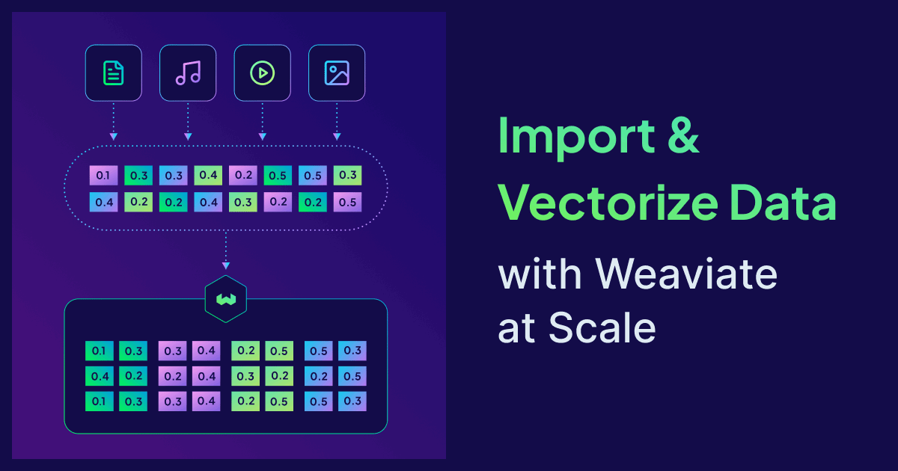
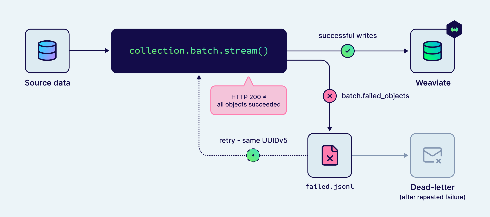

Most vector database pilots fail at ingest, not at search. You build a clever retrieval pipeline, you watch it work on a thousand documents, and then someone hands you fifty million rows. The next two weeks disappear into rate limits, partial failures, and three rewrites of your batch logic.

This post is the guide I wish I had the first time I imported a real dataset into Weaviate. It covers server-side batching, error handling, the data type decisions that cost you the most if you get them wrong, and how to ingest media and PDFs without standing up an OCR pipeline.

:::info Try this as you read
The fastest way to follow along is a [free Weaviate Cloud trial](https://console.weaviate.cloud/) paired with [Weaviate Embeddings](https://docs.weaviate.io/weaviate/model-providers). No infrastructure to manage, no embedding API keys, free vectorization on the trial. Every code snippet below runs against that setup without modification.
:::

## The ingest problem nobody warns you about

A working prototype tells you nothing about what happens at scale. The problems that bite production teams almost never show up in tutorials.

Four bite hardest:

- **Rate limits from your embedding provider:** Most teams hit them within an hour of a real import, then write retry code, then write retry code for the retry code.
- **HTTP 200 lying to you:** A successful batch response does not mean every object made it in. Individual objects can fail silently behind a green status code.
- **Duplicate work on retry:** If you generate fresh IDs each time you re-run, you re-vectorize the same documents and pay for it twice.
- **Memory blowups on media:** Loading a million product photos into a Python list ends your script before your batch logic ever runs.

The rest of this post is what to do about each of them.

## Server-side batching

Server-side batching is a streaming import mode where the Weaviate server tells the client how much data to send next based on its own current workload. Instead of you guessing a batch size and a concurrency level, the server measures its queue depth and applies backpressure across a persistent connection.

This matters because the right batch size is not a constant. It depends on how many properties you have, the size of your text fields, whether you are vectorizing on the fly, what the vectorizer is doing under the hood, and what else the cluster is busy with. Hand-tuning it is brittle. The server has all of that information already.

Here is the pattern in the Python client:

```python
import weaviate
from weaviate.classes.init import Auth

client = weaviate.connect_to_weaviate_cloud(
    cluster_url=WCD_URL,
    auth_credentials=Auth.api_key(WCD_API_KEY),
)

collection = client.collections.get("Products")

with collection.batch.stream() as batch:
    for row in iter_rows():
        batch.add_object(properties=row)
        if batch.number_errors > 10:
            print("Too many errors, stopping.")
            break

if collection.batch.failed_objects:
    print(f"{len(collection.batch.failed_objects)} objects failed.")
```

That is the whole pattern. No `batch_size`, no `concurrent_requests`, no tuning. The `stream()` context manager opens the persistent connection, the server sets the rate, errors stream back asynchronously without interrupting the flow.

## Error handling and retries

The most common bug in production import scripts is treating a 200 response as proof of success. It is not. A 200 means your request reached the server and was accepted. It does not mean every object was written. Vectorizer errors, schema mismatches, and rate-limit responses from upstream embedding APIs all show up as per-object failures inside an otherwise-happy batch response.

The Python client surfaces three things on every batch:

- `batch.failed_objects` — every object that failed, with the error attached
- `batch.failed_references` — every cross-reference that failed
- `batch.number_errors` — running count inside the context manager

Treat `failed_objects` as a queue. Write it to a file, retry it, and if it fails again on the same error, move it to a dead-letter location so the rest of your import does not stall behind one broken row.

Here is a retry-with-checkpoint pattern that holds up in production:

```python
import json
from weaviate.util import generate_uuid5

with collection.batch.stream() as batch:
    for row in iter_rows():
        batch.add_object(
            properties=row,
            uuid=generate_uuid5(row["source_id"]),
        )

with open("failed.jsonl", "a") as f:
    for obj in collection.batch.failed_objects:
        f.write(json.dumps({
            "properties": obj.object_.properties,
            "error": obj.message,
        }) + "\n")
```

Two things make this safe to re-run. First, `generate_uuid5` produces the same UUID for the same `source_id` every time, so a retry overwrites instead of duplicating. Second, errors land in a file you can re-import after fixing the underlying issue. No silent loss, no double-billing on embeddings.



Common failure modes and what to do about them:

| Symptom                         | Likely cause                                       | Fix                                               |
| ------------------------------- | -------------------------------------------------- | ------------------------------------------------- |
| HTTP 200, objects missing       | Vectorizer rate-limited the request                | Inspect `failed_objects`, retry the failed subset |
| Memory blow-up on the client    | Loading the entire dataset before streaming        | Stream from disk or a DB cursor, do not pre-load  |
| Duplicate objects after a retry | Fresh random UUIDs on each run                     | Use `generate_uuid5` from a stable source key     |
| Empty vectors after import      | Vectorizer module not configured on the collection | Check the collection config before re-running     |

## Ingesting through the MCP server

Weaviate ships a built-in [MCP server](https://docs.weaviate.io/weaviate/configuration/mcp-server) (preview, added in v1.37.1) that lets an LLM or IDE assistant — Claude Code, Cursor, VS Code — read and write your instance over the [Model Context Protocol](https://modelcontextprotocol.io/). Enable it with `MCP_SERVER_ENABLED=true`, opt into writes with `MCP_SERVER_WRITE_ACCESS_ENABLED=true`, and the server exposes a `weaviate-objects-upsert` tool that creates or updates objects from inside a conversation. It runs on the same port as the REST API and respects RBAC, so there is nothing extra to deploy.

This is the right tool when an agent needs to write a few records as it works — persisting agent memory, syncing a small collection, or fixing up a handful of objects without leaving your editor.

It is not an ingestion pipeline. Every object is assembled by the model and handed over as a tool call, so you are bound by the context window and per-call latency, with none of the backpressure, streaming, or retry-checkpoint machinery from the sections above. Past a few dozen objects, reach for `collection.batch.stream()` (or your client's batch API) and leave the MCP server for the conversational, small-batch writes it is built for.

## Choosing data types before you import

Schema decisions cost ten times more to fix after the import has run. Get them right the first time.

The ones that matter most at import time:

- **`text` with the right tokenization.** Tokenization decides which BM25 queries match which records. The default is fine for English prose. For product codes, URLs, or anything where the literal string matters, switch to `field` tokenization. The [tokenization tutorial](https://docs.weaviate.io/weaviate/tutorials/tokenization) walks through the trade-offs.
- **`uuid` for foreign keys.** Indexed for fast filtering, validated at insert time, and rendered as a real UUID in your client rather than a string.
- **`int` vs `number`.** Use `int` for counts and IDs. Use `number` for prices and ratios. Mixing them up forces casts in every query.
- **Reference types** for relationships you actually filter on. Do not flatten everything into one big nested object if you query the related fields independently.

The full list is in the [data types reference](https://docs.weaviate.io/weaviate/config-refs/datatypes).

### `blobHash`: store the embedding, skip the bytes

If you are importing media — images, audio, video, PDFs — this is the data type to know.

A regular `blob` stores the full base64 payload on disk. A `blobHash` does not. It sends the raw bytes through the vectorizer at import time so the model sees the actual media, then drops everything but a SHA-256 hash. The vector index keeps the embedding. The blob storage keeps a 32-byte fingerprint.

```json
{
  "properties": [
    {
      "name": "product_image",
      "dataType": ["blobHash"]
    }
  ]
}
```

The practical impact: a 10 TB image corpus shrinks to a few gigabytes of hashes plus the vector index. Similarity search behaves exactly the same way it would with a `blob`. You just do not pay to store the original bytes inside Weaviate. Keep those in object storage where they belong.


There is one more nice property. When you update an object, the new base64 is hashed and compared to the stored hash before anything else happens. If the hash matches, Weaviate skips re-vectorization entirely. That alone pays for itself the first time someone re-runs an import pipeline by mistake.

## PDF vectorization without the OCR pipeline

For most readers, the practical question is "how do I ingest a folder of PDFs without writing an OCR pipeline." The shortest answer is to spin up a Weaviate Cloud trial and use Weaviate Embeddings.

Weaviate Embeddings has a multimodal model designed for image-based document retrieval. You hand it a page image, it produces a vector. No OCR step. No layout detection. No text extraction. Tables, charts, scanned forms, mixed-language documents all go in the same way. This is cloud-only, but it is the lowest-friction path for trying PDF retrieval on a real dataset and works well for collections up to a few hundred thousand pages without any architectural decisions on your part.

The other ready-made option is Google's `gemini-embedding-2`, which accepts PDFs directly at 3072 dimensions and is enabled by default on Weaviate Cloud.

If you are self-hosting at scale and document layout matters, look at the [multi-vector ColPali recipe](https://docs.weaviate.io/weaviate/recipes/multi-vector-colipali-rag). It uses a vision-language model to produce multiple vectors per page and skips chunking entirely. More moving parts, but it is the state of the art for retrieval over visually rich documents.

All three paths live in the same place — the [model providers reference](https://docs.weaviate.io/weaviate/model-providers).

## Multimodal ingestion: text, image, audio, video

Multimodal in Weaviate is not a separate product. It is a vectorizer module on the collection. You declare which model the collection uses, you import objects with media properties (ideally as `blobHash`), and you query across modalities with the same client you already have.

Coverage by provider:

| Provider                | Module               | Text | Image | Audio | Video | PDF             |
| ----------------------- | -------------------- | ---- | ----- | ----- | ----- | --------------- |
| Weaviate Embeddings     | native (WCD)         | ✓    | ✓     |       |       | ✓ (page images) |
| Google                  | `multi2vec-google`   | ✓    | ✓     | ✓     | ✓     | ✓               |
| Voyage AI               | `multi2vec-voyageai` | ✓    | ✓     |       | ✓     |                 |
| Jina AI                 | `multi2vec-jinaai`   | ✓    | ✓     |       |       |                 |
| Cohere                  | `multi2vec-cohere`   | ✓    | ✓     |       |       |                 |
| NVIDIA                  | `multi2vec-nvidia`   | ✓    | ✓     |       |       |                 |
| CLIP (self-hosted)      | `multi2vec-clip`     | ✓    | ✓     |       |       |                 |
| ImageBind (self-hosted) | `multi2vec-bind`     | ✓    | ✓     | ✓     | ✓     |                 |

A concrete scenario. You are building search for an e-commerce catalog. Every product has a name, a description, three photos, and a fifteen-second demo video. You want one query — "compact wireless earbuds with active noise cancellation" — to find the right product whether the relevant signal is in the text, the photo, or the video.

You declare one collection that uses `multi2vec-google` across named vectors: a text vector over the name and description, plus a separate `blobHash` vector for the product image and another for the demo video. Each `blobHash` property needs its own named vector — once Weaviate replaces the raw bytes with a hash, they can no longer be re-vectorized alongside other fields, so the schema keeps them apart. A single multi-target query then ranks across all three vectors at once: one collection, one query, three modalities — and the media bytes are never stored twice inside Weaviate.

Full setup details for every provider are in the [model providers reference](https://docs.weaviate.io/weaviate/model-providers).

## A checklist before you press go

1. Pick data types deliberately. `blobHash` for any media you do not need to retrieve raw. `field` tokenization for any text where the literal string matters.
2. Pick the vectorizer at the collection level, not in your import script. Weaviate Embeddings is the easiest default on Weaviate Cloud.
3. Use deterministic UUIDs (`generate_uuid5` from a stable source key) so retries are idempotent.
4. Use server-side batching via `collection.batch.stream()` if you are on the Python client.
5. Log `failed_objects` to a dead-letter file. Do not just print them.
6. Checkpoint progress for large jobs so a crash does not cost you the whole run.
7. If you are importing media at scale, keep the source bytes in object storage and let Weaviate keep the hash, not the file.

Do these seven things and you will not be the team rewriting their import script for the third time next quarter.

The fastest way to try any of this is a [free Weaviate Cloud trial](https://console.weaviate.cloud/) paired with Weaviate Embeddings. No infrastructure to manage, no embedding API keys, and every snippet in this post runs against it without modification. The [import tutorial](https://docs.weaviate.io/weaviate/tutorials/import) is a good next stop once you have a cluster up.

import WhatsNext from '/_includes/what-next.mdx';

<WhatsNext />
