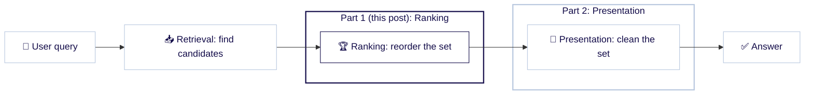
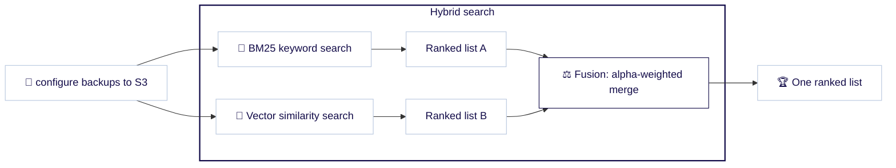
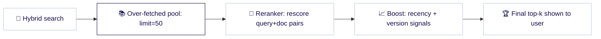

{/* TODO(publish): date is a placeholder — set the real publish date before release. */}
{/* TODO(design): hero image — add ./img/hero.png, then uncomment the `image:` frontmatter line above and the tag below. */}
{/*  */}

You ship a RAG assistant over your product docs. A user asks, "How do I configure backups to S3?" The exact page they need is sitting in your index. But your search returns a generic *Backup and restore overview* chunk at position one, the model grounds its answer on that chunk, and the reply walks the user through steps that never mention S3. Nothing threw an error. Retrieval "worked." The answer is just quietly, confidently wrong. This is a **hybrid search ranking** problem: the right document came back. It just came back in the wrong position.

<!-- truncate -->

Teams pour weeks into retrieval: the embedding model, the chunking strategy, the vector index. Then they take whatever order the results come back in and treat it as fixed. But retrieval and ranking are different jobs. Retrieval decides *which* documents are candidates. Ranking decides *which candidate goes on top*. This post is about that second job, and the specific dials Weaviate gives you to reorder a set you have already retrieved.

## Where hybrid search ranking fits: retrieval, ranking, and presentation

It helps to hold search as three stages:

- **Retrieval** finds a candidate set from millions of objects.
- **Ranking** reorders that set so the best items rise to the top. This post lives here.
- **Presentation** cleans up what is left: removing near-duplicates, adding diversity, explaining scores. That is Part 2.



Our running example is a documentation search over a `DocChunk` collection, the kind you would build for RAG. Each object has `content`, `title`, `url`, `product`, `version`, and `updated_at`. Chunked docs make ranking hard: one page becomes many near-identical chunks, and old versions linger. "Relevant-ish but wrong order" is the everyday symptom. We fix the ordering here. The cleanup (dedupe, diversity, and explainability) is Part 2.

{/* TODO(publish): this is Part 1 of 2; link Part 2 "Clean result sets: dedupe, diversify, and explain" once published. */}

{/* TODO(verify): the local test instance runs on :8090 — execute every snippet with weaviate.connect_to_local(port=8090). Published snippets use the default 8080 so readers can copy-paste against a standard Docker deployment. Assume `DocChunk` already exists and is populated. */}

## How does hybrid search `alpha` balance keyword and vector?

Hybrid search runs two retrievers and fuses their results into one list. One is [BM25](https://docs.weaviate.io/weaviate/search/bm25), a keyword-scoring algorithm that rewards exact term matches. The other is vector search, which compares the *meaning* of your query to the meaning of each document. The two produce separate ranked lists, and a fusion step weaves them into one:



The `alpha` parameter sets how much weight the vector side gets in that merge. `alpha=0` is pure keyword, `alpha=1` is pure vector, and anything between blends the two. If you never set it, Weaviate defaults to **`alpha=0.75`**, deliberately vector-leaning, because semantic recall is usually the stronger default for natural-language questions.

Usually is not always. A query like `configure backups to S3` carries an exact token, `S3`, that pure vector search can blur into "cloud storage" and bury. The fastest way to build intuition is to sweep `alpha` and watch the top results move:

```python
import weaviate

client = weaviate.connect_to_local()
docs = client.collections.use("DocChunk")

for alpha in [0.0, 0.5, 0.75, 1.0]:
    response = docs.query.hybrid(
        query="configure backups to S3",
        alpha=alpha,
        limit=5,
    )
    titles = [o.properties["title"] for o in response.objects]
    print(f"alpha={alpha}: {titles}")

client.close()
```

At `alpha=0` the exact `S3` mentions dominate. At `alpha=1` the conceptually related backup pages surface even when they use different words. Somewhere in between is the order your users actually want. There is no universal best value: sweep it against a handful of real queries and keep what wins. (Auto-tuning `alpha` per query is an open idea the team is tracking in [issue #11627](https://github.com/weaviate/weaviate/issues/11627); for now it is a dial you set by hand.)

:::note[The BM25 side, in one minute]
The keyword half is [BM25](https://docs.weaviate.io/weaviate/search/bm25), with defaults (`k1=1.2`, `b=0.75`) you rarely need to touch. Two levers matter for ranking. You can weight fields with `query_properties=["content^2", "title"]` so a title match counts double, and you can require all query tokens with `bm25_operator=BM25Operator.and_()` instead of the default OR. One sharp edge: under Weaviate's default keyword backend, **`AND` is scoped per property**. Every token must co-occur *within a single searched property*, not spread across fields. A query that matches `backups` in `content` and `S3` in `title` will **not** satisfy `AND`. It surprises people; plan for it, or stay on OR.
:::

## Ranked fusion vs relative-score fusion: which should you use?

Both retrievers hand back a ranked list, and *how* Weaviate merges those two lists changes the final order. There are two algorithms.

**`rankedFusion`** uses **reciprocal rank fusion (RRF)**, a method that combines two lists using only each item's rank position, not its raw score. Each result contributes `weight / (rank + 60)`. That constant `60` is the classic RRF `k`, and in Weaviate it is **hardcoded, not a tunable parameter**. RRF is robust precisely because it ignores score magnitudes: a wildly out-of-scale outlier from one retriever cannot hijack the result.

**`relativeScoreFusion`** keeps the magnitudes. It applies **min-max normalization** to each retriever's scores (rescaling them onto a common 0-to-1 range so the two are comparable) and then blends them by weight. Because it preserves *how much* better one result was than the next, not just that it ranked higher, it responds smoothly to your `alpha` setting. This is the **server default**.

```python
from weaviate.classes.query import HybridFusion

response = docs.query.hybrid(
    query="configure backups to S3",
    alpha=0.6,
    fusion_type=HybridFusion.RELATIVE_SCORE,  # the default; try HybridFusion.RANKED for RRF
    limit=5,
)
```

So when do you switch to RRF? When one retriever's scores are erratic or on a strange scale and you would rather trust rank order than raw numbers. The rest of the time, `relativeScoreFusion` plus a tuned `alpha` is the more expressive pairing. This is also where Weaviate and its peers diverge: most hybrid-search engines ship RRF, but the normalized-score-plus-alpha path is what makes fusion tunable rather than one-size-fits-all. For the full math, see our [deep dive on fusion algorithms](/blog/hybrid-search-fusion-algorithms).

## What is reranking, and when do you need a cross-encoder?

Hybrid fusion is fast, but it never reads a query and a document together. The models behind vector search encode your query and your documents *separately* (this is a **bi-encoder** setup), so they never directly compare the two. A **reranker** closes that gap. It uses a **cross-encoder**: a model that takes a `(query, document)` pair as a single input and scores their relevance directly, catching relevance that separately-encoded vectors miss.

Weaviate ships six reranker modules. Five are API-based and need a provider key (`reranker-cohere`, `reranker-voyageai`, `reranker-jinaai`, `reranker-nvidia`, and `reranker-contextualai`), and one, `reranker-transformers`, runs self-hosted so nothing leaves your infrastructure.

One detail trips almost everyone up: **a reranker only reorders the page you already retrieved.** It does not re-query the corpus. If your hybrid search returned 10 objects, the reranker shuffles those 10. It cannot pull in an 11th that scored just below the cut. So the move is always the same. **Over-fetch first, rerank second.** Over-fetching means retrieving more candidates than you plan to show, so the reranker has a deep enough pool to work with. Raise your `limit`, then let the reranker surface the best of that pool:

```python
from weaviate.classes.query import Rerank, MetadataQuery

response = docs.query.hybrid(
    query="configure backups to S3",
    alpha=0.6,
    limit=50,  # over-fetch: the reranker can only reorder what you retrieved
    rerank=Rerank(prop="content", query="configure backups to S3"),
    return_metadata=MetadataQuery(score=True),
)

for o in response.objects[:5]:
    print(o.properties["title"], o.metadata.rerank_score)
```

Reranking has a cost. Scoring a pool of 50 query-document pairs is far slower than fusing scores, so it is a top-of-funnel refinement, not something to run over thousands of candidates. There is a second honest caveat, about provider support. Weaviate leans on the ecosystem here rather than owning it. Compared with Pinecone, which hosts its own rerank models, and Elastic, which ships a first-party Elastic Rerank model plus Learning-to-Rank (LTR), Weaviate has no first-party hosted reranker and no LTR yet. It relies on the external provider modules above. What you get in exchange is provider choice and a self-hosted option. It is a real trade-off, not a clear win. (For the concepts, see the [reranking docs](https://docs.weaviate.io/weaviate/search/rerank).)

## Boosting search results by recency and business signals

{/* TODO(publish): CONFIRM Boost API is GA and stamp the exact version. As of drafting it is Preview in 1.38. If still Preview at publish, reframe this section with a preview caveat. */}

Relevance to the *query* is not the only thing you care about. A documentation search has opinions the query never states: newer pages should beat older ones, and the current release should beat a version from two years ago. The **Boost API** folds those signals into the ranking at query time.

A boost is a **soft rescorer**. The primary search over-fetches a pool of candidates, the boost rescores them against your conditions, and the pool is re-sorted. Soft is the operative property: **a boost never excludes anything.** Unlike a filter, a non-matching object is not dropped. It just ranks lower. That is what makes it safe to reach for. You are nudging the order, not risking an empty result set. You can stack up to **20 conditions** in a single boost.

For `DocChunk`, two signals cover most of the staleness pain: decay a chunk's score by how old the page is, and lift chunks from the version the user is actually on. `Boost.blend()` combines them, each with its own relative weight:

```python
from weaviate.classes.query import Boost, Filter

response = docs.query.hybrid(
    query="configure backups to S3",
    alpha=0.6,
    limit=50,  # final results returned after re-scoring
    boost=Boost.blend(
        [
            Boost.time_decay("updated_at", scale="180d", weight=1.0),
            Boost.filter(Filter.by_property("version").equal("1.38"), weight=0.5),
        ],
        weight=0.4,  # how strongly the blended boost pulls against the primary score
    ),
)
```

{/* TODO(verify): confirm the Boost client surface (Boost.blend / time_decay / filter, weight/scale kwargs) against the installed weaviate-python-client version — this landed in python-client PR #2030. */}

The recency condition scores a page `1.0` today and decays it as `updated_at` moves into the past; `scale="180d"` sets how fast. The version condition lifts anything tagged `1.38`. The outer `weight=0.4` controls how hard the whole boost pulls against the query-relevance score, so relevance stays the foundation; the boost only nudges the order.

Weaviate's Boost differs from the competition in one specific way: scope. Rivals ship rescoring too. Elastic has `function_score`, Qdrant has `FormulaQuery`, and Milvus has a decay ranker, all of which fold recency or formula-based signals into a score. Those are a separate rescoring mechanism you wire up per retrieval mode. Boost applies the same decay-and-signal logic across vector, keyword, *and* hybrid search in a single call, so the same recency-and-version rules hold whether the underlying search was semantic, lexical, or a blend of both. (The full parameter reference, including curves, offsets, and numeric decay, is in the [Boost docs](https://docs.weaviate.io/weaviate/search/boost).)

## Building the full ranking pipeline

None of these dials are exclusive. A production query often fuses two retrievers, hands the pool to a reranker, and blends in business signals, all in one call. The shape looks like this:



Notice that you over-fetch **once**. The single `limit=50` pool feeds both the reranker and the boost:

```python
from weaviate.classes.query import HybridFusion, Rerank, Boost, Filter, MetadataQuery

response = docs.query.hybrid(
    query="configure backups to S3",
    alpha=0.6,
    fusion_type=HybridFusion.RELATIVE_SCORE,
    limit=50,  # over-fetch once; rerank and boost both work on this pool
    rerank=Rerank(prop="content", query="configure backups to S3"),
    boost=Boost.blend(
        [
            Boost.time_decay("updated_at", scale="180d", weight=1.0),
            Boost.filter(Filter.by_property("version").equal("1.38"), weight=0.5),
        ],
        weight=0.4,
    ),
    return_metadata=MetadataQuery(score=True),
)

for o in response.objects[:5]:
    print(o.properties["title"], o.properties["version"])
```

The mental model is a hand-off. **Hybrid** decides what is relevant and how the two retrievers combine. The **reranker** applies a deeper relevance model to the shortlist. **Boost** layers your domain priorities on top. Introduce them one at a time. Each has a cost, and you want to know which dial moved the needle before you add the next.

## Which ranking dial should you reach for?

When the order looks wrong, this is the field guide:

| Symptom | Reach for |
| --- | --- |
| Exact terms, IDs, or error codes missing | Lower `alpha` (more keyword) |
| Right meaning, but literal-match noise on top | Raise `alpha` (more vector) |
| One retriever's scores drowning out the other | `relativeScoreFusion` (default) + tune `alpha`; `rankedFusion` if you only trust rank order |
| Top-k is relevant but subtly mis-ordered | Add a reranker — over-fetch first |
| Stale or old-version pages outranking current ones | `Boost`: recency decay + version match |

Getting the best result to the top is stage two. Stage three is making the whole *set* clean: collapsing near-duplicate chunks, diversifying so the top five are not five slices of one page, cutting the long tail with `autocut`, and explaining why a result scored the way it did. That is **Part 2 — Clean result sets: dedupe, diversify, and explain.**

import WhatsNext from '/_includes/what-next.mdx';

<WhatsNext />
