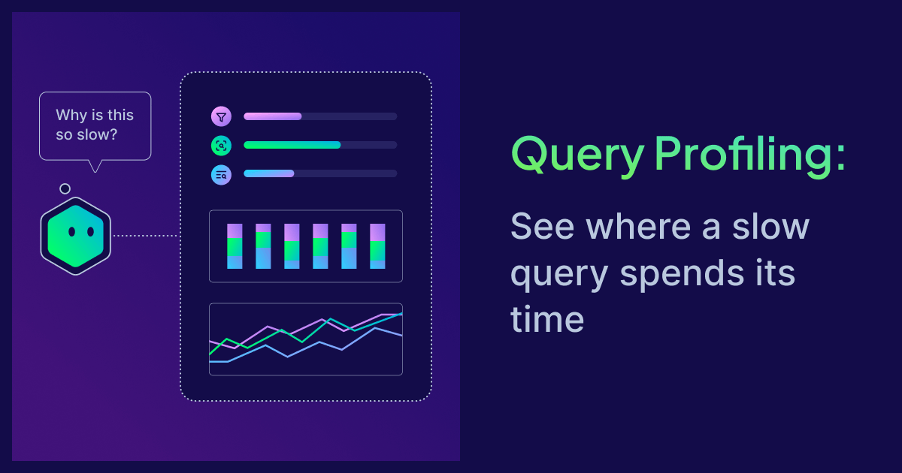
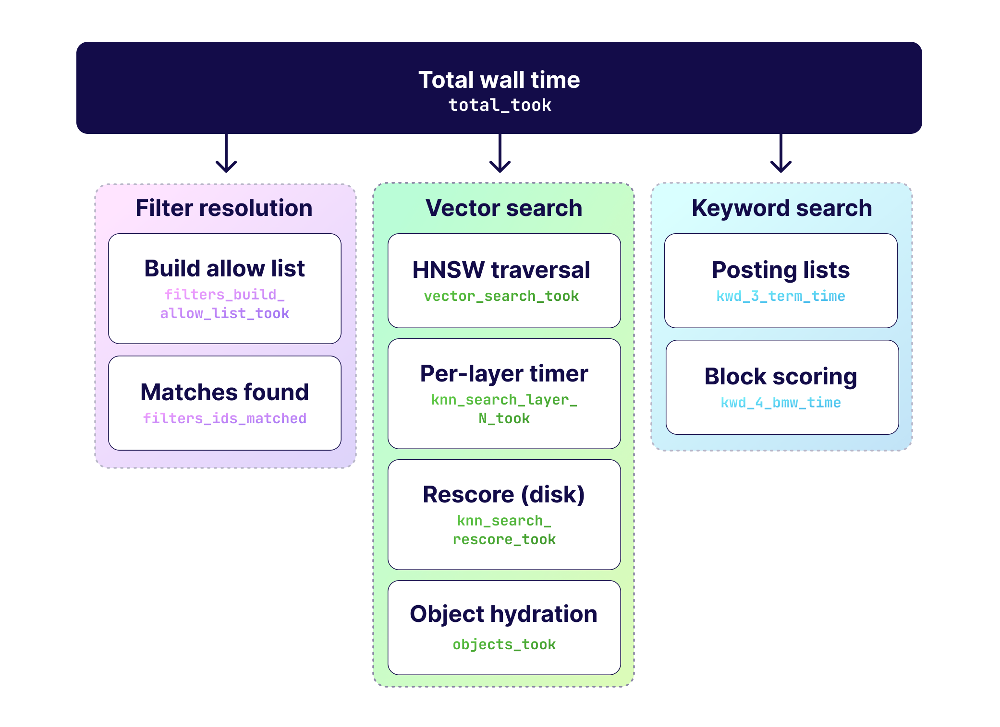

<br />

A query in production is slow. Maybe it was always a little slow and it finally crossed the line where someone noticed, or maybe it regressed after a data load. Either way you now have a single question, and it is the same question every time: where did the time go? Was it the filter, the vector search, the object read from disk, or the keyword scoring? Until you can split that number into its parts, every fix is a guess.

Weaviate has always been able to answer this. The trouble was getting the answer out.

## How we used to find slow queries

The existing tool is the [slow query log](https://docs.weaviate.io/deploy/configuration/logging#slow-query-logging). You turn it on with two environment variables and restart the node:

```bash
QUERY_SLOW_LOG_ENABLED=true
QUERY_SLOW_LOG_THRESHOLD=2s
```

Any query that runs longer than the threshold is logged at WARN with its full timing breakdown attached: the class and shard, the filters, the limit, and every internal timer the engine recorded on the way through. If you have [runtime overrides](https://docs.weaviate.io/deploy/configuration/env-vars) already wired up, you can flip both settings live from the overrides file and skip the restart, because the server rereads them on its load interval.

For catching regressions across a whole fleet over time, this works well. It is a passive net that stays out of the way until something trips it.

## Where the old approach falls short

The slow query log is built for a different job than the one you have when a specific query is slow right now, and four things get in the way.

First, the plain enablement path needs a restart. Restarting a node to debug a latency problem changes the thing you are measuring. A fresh process starts with cold OS page caches, so the first queries after a restart read from disk where a warm node would have hit memory. You end up profiling the restart as much as the query.

Second, the settings you tune live are temporary knobs. If you raised the threshold or toggled the log through runtime overrides to catch a specific query, that change lives in the overrides file, not in the deployment manifests your cluster is actually built from. It is a state you have to remember to undo, and it drifts out of sync with how the deployment is defined.

Third, it is always after the fact. The log only reacts once a query has already crossed the threshold. You cannot point it at the query in front of you and ask for its numbers; you wait for that query, or one like it, to be slow again. On top of that the log samples about one percent of all queries at INFO regardless of speed, so a fast query can show up in the output next to the genuinely slow ones and you have to filter the noise out.

Fourth, it is per node. Each node logs the shard searches that ran on it, and nothing stitches those lines together. On a single query that fans out across a cluster, the timings you want are spread across several nodes' logs, and reassembling one query's picture is manual work.

## What is query profiling?

Query profiling is the direct answer to all four. It is a per-query, opt-in flag. You set it on one search, the server collects the timing breakdown for that search, and it returns the numbers inline on the response. There is no env var, no threshold, no restart, and nothing to reset afterward.

Under the hood it uses the same instrumentation as the slow query log, so the numbers are the same numbers, delivered differently. And it closes the per-node gap directly: the coordinating node gathers the profiles from every shard on every node that took part in the query and returns them together. One request gives you the whole cluster's view of that one query.

You enable it per query. In Python, add it to the return metadata:

```python
from weaviate.classes.query import MetadataQuery

response = collection.query.near_vector(
    near_vector=[0.1, 0.2, 0.3],
    limit=10,
    return_metadata=MetadataQuery(query_profile=True),
)

for shard in response.query_profile.shards:
    print(shard.name, shard.node, shard.searches)
```

Query profiling is available in the official Python, JavaScript/TypeScript, Java (v6), and C# clients, and over gRPC directly by setting `QueryProfile` in the request metadata. The profile rides on the response object at `response.query_profile`, not on any individual result. Profiling covers vector search, keyword scoring, and filter evaluation. It does not measure generative modules, rerankers, or other post-processing.

Query profiling was [introduced in v1.36.9](https://docs.weaviate.io/weaviate/search/query-profile), announced as a preview with the [v1.37 release](https://weaviate.io/blog/weaviate-1-37-release), and is generally available as of v1.38. When the flag is off, the cost is a single boolean check. When it is on, the added cost is microsecond-level timer reads. It is meant for debugging and optimization, not for your production hot paths.

## Reading the numbers

The profile is organized by shard. Each shard entry names the shard and the node that ran it, and holds a `details` map of metric name to value for each search type it performed. A pure vector query shows the vector timers, a [BM25](https://docs.weaviate.io/weaviate/search/bm25) query shows the keyword timers, a [filtered](https://docs.weaviate.io/weaviate/search/filters) query adds the filter timers, and a hybrid query carries both a vector and a keyword section. Only the stages that actually ran show up, so the exact set of fields depends on the query.



`total_took` is the wall time of the whole shard search. Everything else explains where that time went.

On the vector path, `objects_took` is object hydration: reading the final objects out of the on-disk objects store. A high value here means disk-bound hydration, and it usually points at page-cache misses, a large `limit`, or large objects. This is the clearest disk signal in the profile.

`filters_build_allow_list_took` is filter resolution: turning your `where` clause into a set of matching document IDs through the [inverted index](https://docs.weaviate.io/weaviate/concepts/indexing). It is driven by filter cardinality and by whether those index segments are in memory or on disk. The `filters_ids_matched` count sits right next to it and tells you which regime you are in. A large count means a broad filter matching many documents; a small count with a high time points more at disk reads.

`vector_search_took` is the [vector index](https://docs.weaviate.io/weaviate/concepts/vector-index) doing its search, and its main sub-timer is `knn_search_layer_N_took`, one entry per HNSW layer, with layer 0 normally dominating. This is graph traversal: exploring candidates and computing distances. It is worth being precise here, because it is easy to read a high vector time as the node running out of resources. It usually is not. The HNSW graph lives in RAM, so this timer measures compute, not a wait on disk. A high value means the traversal itself is expensive, and the levers are the ones that control traversal cost: `ef`, vector dimensionality, and the filter strategy on filtered searches. Tune those before you reach for more hardware.

The one vector stage that can genuinely touch disk is `knn_search_rescore_took`. It only appears when compression is enabled, and it reads full-precision vectors back to rescore the compressed candidates. A high value there can mean disk latency during rescore, which is a different problem from a slow traversal.

`hnsw_flat_search` is a boolean, not a timer. When it is `true` under a filter, the filter was selective enough that a brute-force scan of the matches was cheaper than walking the graph, and the engine took that path on purpose.

On the keyword path, the `kwd_*` family breaks BM25 down the same way. Two are worth knowing by name. `kwd_3_term_time` is the cost of reading the per-term posting lists out of the inverted segments, so it is sensitive to the number of query terms and to disk reads. `kwd_4_bmw_time` is the BlockMax WAND traversal that scores the posting blocks, so it grows with low query selectivity and long posting lists. A slow keyword query is usually one or the other, and the split tells you which.

## Worked examples

The numbers below are illustrative, but they show the shape of the output and how to read it.

A vector search where hydration dominates:

```json
{
  "shards": [
    {
      "name": "1a2b3c4dshard",
      "node": "weaviate-0",
      "searches": {
        "vector": {
          "details": {
            "total_took": "48.2ms",
            "filters_build_allow_list_took": "2.1ms",
            "filters_ids_matched": "512",
            "vector_search_took": "8.4ms",
            "knn_search_layer_0_took": "7.9ms",
            "knn_search_rescore_took": "0.3ms",
            "hnsw_flat_search": "false",
            "objects_took": "36.8ms"
          }
        }
      }
    }
  ]
}
```

The filter and the vector search are cheap. `objects_took` is most of `total_took`, so the time is going into reading objects off disk. Check the page cache and storage on that node, and consider a smaller `limit` or a lighter payload.

A filter that matches too much:

```json
{
  "shards": [
    {
      "name": "9f8e7d6cshard",
      "node": "weaviate-1",
      "searches": {
        "vector": {
          "details": {
            "total_took": "61.5ms",
            "filters_build_allow_list_took": "41.2ms",
            "filters_ids_matched": "12840000",
            "vector_search_took": "15.6ms",
            "knn_search_layer_0_took": "14.8ms",
            "hnsw_flat_search": "false",
            "objects_took": "3.9ms"
          }
        }
      }
    }
  ]
}
```

Here `filters_build_allow_list_took` is the largest slice, and `filters_ids_matched` is over ten million. The filter is broad, so building the allow-list is the cost. This is a cardinality problem, not a disk one: rethink the filter so it selects less, or apply the wide condition differently rather than as a pre-filter over the whole set.

A compressed index where rescore hits disk:

```json
{
  "shards": [
    {
      "name": "5c4b3a2fshard",
      "node": "weaviate-0",
      "searches": {
        "vector": {
          "details": {
            "total_took": "39.7ms",
            "vector_search_took": "35.1ms",
            "knn_search_layer_0_took": "9.2ms",
            "knn_search_rescore_took": "25.4ms",
            "hnsw_flat_search": "false",
            "objects_took": "3.8ms"
          }
        }
      }
    }
  ]
}
```

The graph traversal at layer 0 is fine. Almost all of `vector_search_took` is `knn_search_rescore_took`, the stage that reads full-precision vectors back for the compressed candidates. That points at disk latency during rescore rather than at the graph, so the investigation moves to storage and to the compression configuration.

## Summary

Query profiling has become one of the first things our solution engineering team reaches for when a customer reports a slow query. Instead of enabling a log, waiting for the query to be slow again, and stitching node logs together, you set one flag, run the query once, and read the breakdown across the whole cluster. The guesswork about where the time went is gone, and what is left is a specific stage to fix.

If you want help reading a profile or working out what to change based on one, reach out. Our solution engineering team looks at these breakdowns with customers on a regular basis, so if you are a customer, your usual Weaviate contact or support channel is the fastest way to get us the details. If you are running the open-source project, ask in the [community forum](https://forum.weaviate.io/) and we will help you work through it there.

To go deeper:

- [Query profiling](https://docs.weaviate.io/weaviate/search/query-profile) in the docs
- [Slow query logging](https://docs.weaviate.io/deploy/configuration/logging#slow-query-logging)
- [The Weaviate 1.37 release post](https://weaviate.io/blog/weaviate-1-37-release)

import WhatsNext from "/_includes/what-next.mdx";

<WhatsNext />
