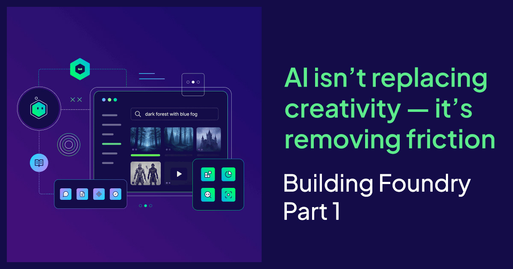
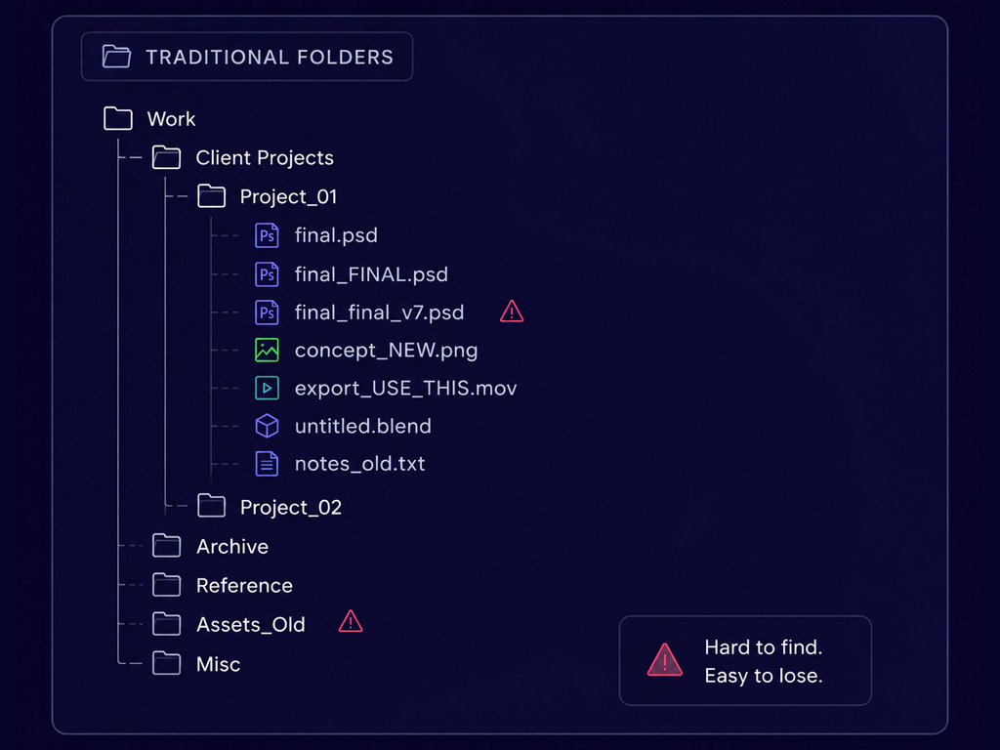
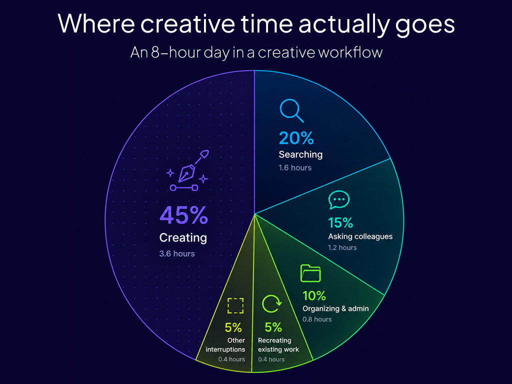
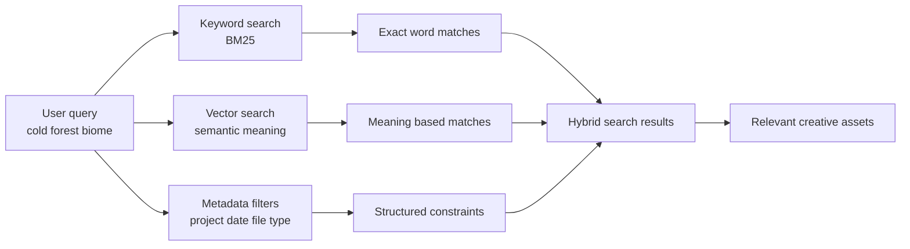

> **Building Foundry**  
> A practical series on creative workflows, semantic search, and Weaviate.

:::info
final_final_v7.png  
USE_THIS_ONE.mov  
new_new_export.psd
:::

File names like these are oddly universal. They appear in game studios, post-production houses, animation pipelines, and design agencies working across every kind of project. The specific conventions vary, but the underlying situation does not: creative work accumulates faster than anyone can organise it, and finding something you made six months ago is often harder than making it again from scratch.

That is not a storage problem or a naming convention problem. It is a retrieval problem, and it is one that most creative tools have never been designed to solve.

---

## The real problem isn’t creativity

There is a persistent assumption in conversations about AI and creative work: that the most consequential question is whether AI can generate something. A painting, a screenplay, a piece of music. The more immediate and practically useful story is considerably less dramatic. It concerns the work that already exists and the difficulty of getting back to it.

Consider how a game production pipeline actually works. A concept artist produces dozens of character sketches before one direction gets approved. The rejected explorations go into a folder named something like “alt_directions_v2”, and within three months nobody can reliably locate the version that sparked the final design. Then, on a sequel or expansion, someone needs that exact colour palette and aesthetic direction. Because searching for “dark armour character concepts 2023” turns up nothing useful, they start from scratch rather than building on what already exists.

The same problem looks different depending on the discipline. A film editor searching for specific B-roll scrolls through bins labelled by card number and shoot date, because nobody had time to write shot descriptions during production. An animator looking for a reference of a particular run cycle digs through folders three levels deep before giving up. A graphic designer trying to find an earlier logo exploration for a returning client reconstructs it from memory. A music producer hunting for a drum texture they used two years ago opens session after session, listening through stems, until they find it or settle for something new.

The creative act itself is rarely where time disappears. It disappears in the work that surrounds it.

---

## Where time actually goes

In most creative workflows, the actual moment of making something occupies a surprisingly small fraction of total project time. Pre-production and post-production dwarf the production itself. Research, reference gathering, asset organisation, version tracking, and the constant process of locating what already exists all compete for hours that would otherwise go toward the work.

Consider a scenario common in animation production: a rigging team needs to check how a particular character’s shoulder topology was handled in a previous project. There is no organised asset library, just a shared drive arranged by project name and date. The rig file is in there somewhere, but finding it requires either knowing exactly where to look or asking someone who does. If the person who built the original rig has since moved to a different studio, that knowledge leaves with them.

This is partly a documentation problem, but at its core it is a retrieval problem. The work exists. The information exists. The inability to retrieve it efficiently is costing the team time, consistency, and sometimes money when they unknowingly reproduce work that already exists.

Traditional search compounds the problem rather than solving it. Keyword search requires you to guess which words were used when something was named or described, often by someone else, often months or years earlier. Searching for “blue environmental concept” returns nothing if the file is called “ENV_ALTSTYLING_DARK_V4”. The file and the query describe the same thing in completely different languages, and there is no bridge between them.

Platforms such as Weaviate are designed around this model of retrieval, storing semantic representations alongside traditional metadata so creative assets can be searched by both meaning and structured filters.

---

## AI as a workflow layer

The most useful framing for AI in creative contexts is not as a generator of new work but as an infrastructure layer that makes existing work more accessible. The question worth asking is not whether AI can produce something, but whether it can help a team find, retrieve, and build on what they have already produced.

This is where a class of technology called semantic search becomes genuinely relevant to creative workflows.

Keyword search works by matching exact strings. Semantic search works by matching meaning. When you describe something in natural language, a semantic search system tries to find content that means the same thing rather than content that uses the same exact words. That shift from literal matching to conceptual matching is, in practice, what transforms search from a guessing game about filenames into something that behaves more like asking a well-organised colleague.

The technology behind this is called embeddings. When a machine learning model processes a piece of content, whether that content is text, an image, or an audio file, it converts that content into a long list of numbers that represents what the content means or depicts. Two things that mean the same thing, even if described very differently, produce number sequences that sit close together in what researchers call a high-dimensional vector space. A query for “dark forest with blue atmospheric haze” and an image of a misty pine forest at dusk will produce embeddings that cluster near each other in this space, even though neither the query nor the image share any matching text.

Vector search is the process of finding items whose embeddings are closest to a given query. That proximity is what enables retrieval by meaning rather than by keyword. The system is not comparing words; it is comparing positions in a conceptual space built from enormous amounts of human-generated content.

---

## A simple example

A game studio building an open-world RPG might accumulate tens of thousands of concept images over a multi-year production. Team composition changes, folder structures evolve, and naming conventions that were carefully maintained in year one have become considerably more creative by year three.

A designer joining the team near launch needs reference for a cold, forested biome that should feel visually distinct from the game’s existing environments. Searching for “cold forest biome” returns nothing useful from a keyword search because those files were named when nobody anticipated that particular query. A semantic search system, given the same natural-language description, can match against visual embeddings of the images themselves, automatically generated descriptions created during indexing, or a combination of both.

That word, indexing, is worth pausing on. Before any of this becomes possible, content needs to be processed and stored in a way that supports semantic retrieval. This is the ingestion step: running files through a pipeline that generates an embedding for each item and stores that embedding alongside the original content and its metadata. Ingestion is what happens before search, and it is the step that makes search useful rather than just fast.

Metadata remains important even in a semantic search system. Knowing that a result is conceptually similar to your query is valuable. Knowing that it also belongs to the correct project, was created within the past two years, and is the right file type is more valuable still. Semantic search narrows results by meaning; metadata filters narrow by verifiable facts. Most real queries benefit from both.

A vector database is what holds all of this together. Unlike a traditional relational database designed for exact lookups, a vector database stores embeddings alongside the original data and metadata, with its internal architecture optimised for fast nearest-neighbour retrieval. When you run a query, the database converts it into an embedding and returns the items whose embeddings are most similar. The result is search that appears to understand what you are looking for, not just what you typed. [Try the semantic search playground](https://playground.weaviate.io/) to see the difference between keyword, vector, and hybrid results on the same query.
Try searching with descriptions instead of exact names and compare how keyword, vector, and hybrid search behave.

  

  

One additional capability worth understanding is hybrid search, which combines keyword matching with vector search in a single query. This matters in creative contexts because the type of search varies with the situation. A music producer looking for a specific named sample pack they remember clearly will get better results from keyword matching. The same producer searching for “that tense, layered percussion sound from the bridge section of last year’s project” will get better results from semantic search. Hybrid search runs both simultaneously and blends the results, which means a single interface works well across both types of intent without requiring users to switch modes or choose an approach upfront.

---

## What this unlocks

When search friction decreases across a creative pipeline, the effects show up in concrete and sometimes unexpected ways.

In film post-production, editorial teams that can locate footage by describing a shot rather than knowing its bin location spend less time hunting and more time making decisions. A search for “wide establishing shot with visible rain and practical lighting” can surface relevant clips from across an entire project’s media, regardless of how they were originally filed during ingest. For productions with hundreds of hours of footage, this difference is substantial.

In animation, a studio that can query its reference library by describing visual qualities rather than file names builds better pre-production materials faster. A search for “loose, gestural crowd movement with overlapping timing” can surface relevant material from previous productions, stock libraries, and internal tests in a single query, giving the team a richer starting point without requiring anyone to maintain a perfectly curated library.

In music production, the ability to describe sonic qualities rather than rely on genre labels or tempo tags changes how producers work with their own material. Sessions and samples that were difficult to locate become accessible again. This reduces the tendency to purchase new material for problems that existing material could solve, and it makes the accumulation of a large sample library genuinely valuable rather than an organisational burden.

There is also a longer-term effect on how teams relate to their own archives. When work becomes consistently retrievable, the instinct to start fresh because searching is too slow gradually shifts toward an instinct to check what already exists. Over time, a studio’s accumulated output becomes a genuine resource rather than an opaque archive that only the most senior staff can navigate.

---

## This is just the start

None of what has been described here is beyond current technology. Semantic search and vector databases are already used in enterprise knowledge management, legal document retrieval, and e-commerce product search for exactly these reasons. Applying the same principles to creative asset management is an incremental step, not a research project.

The meaningful design challenge lies in the ingestion layer: deciding what gets indexed, how descriptions and embeddings are generated for different content types, and how the search interface fits into existing tools and workflows. Those are practical engineering problems with practical solutions. What makes them worth solving is that the underlying search technology already works.

Creative teams have never been short on ideas. They are short on ways to rediscover them. As AI becomes part of everyday creative workflows, one of its most valuable roles may not be generating the next asset, but helping us make better use of everything we’ve already created.

## What’s next

In the next post, we’ll look closely at where creative workflows actually break down, and why conventional folder structures, tagging systems, and keyword search consistently fail to keep pace with how creative teams produce work. After that, we’ll walk through a concrete implementation: a working semantic search system for creative assets built with Weaviate, step by step.

---

## Quick question

What’s hardest for your team to search right now?

- images
- video
- references
- design files
- documents

---

import WhatsNext from "/_includes/what-next.mdx";

<WhatsNext />
