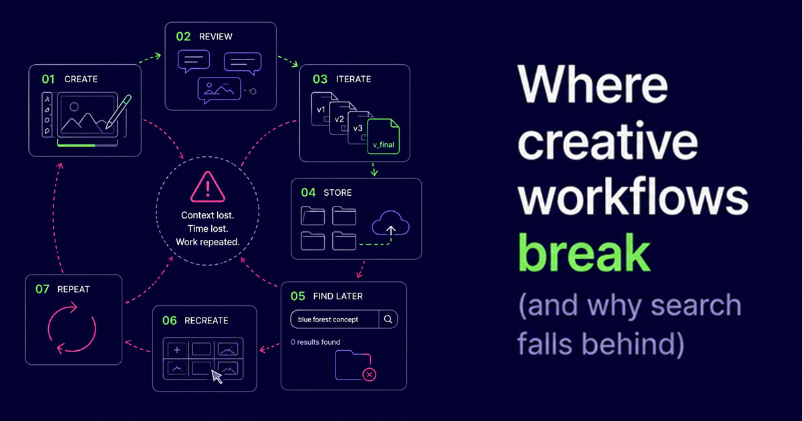
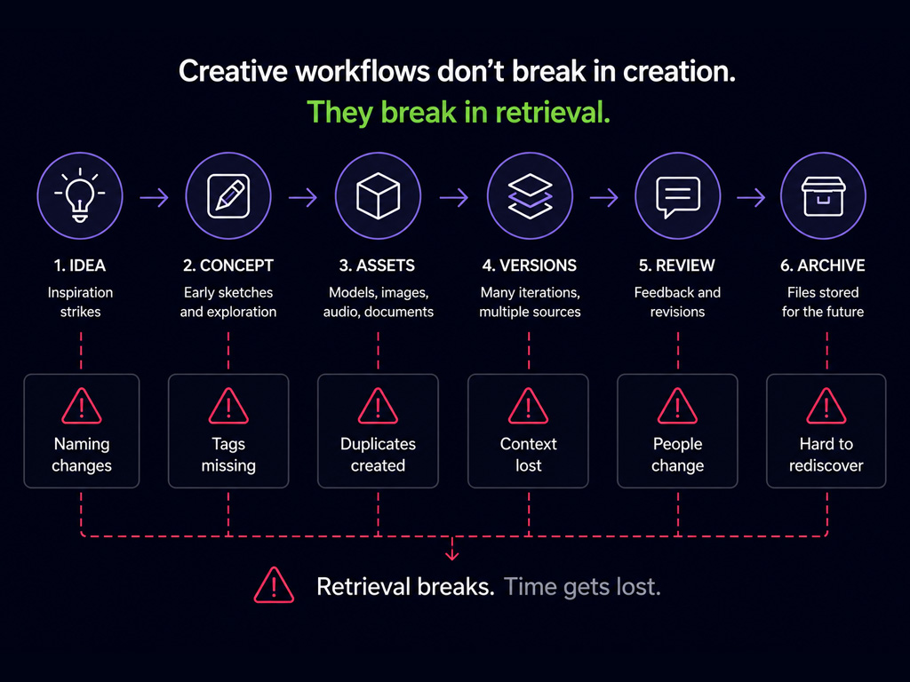
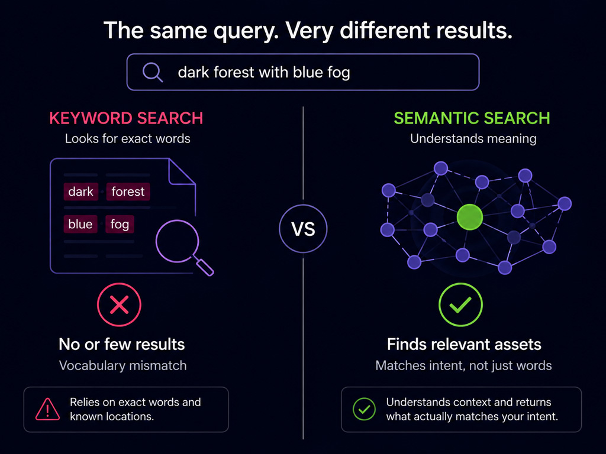
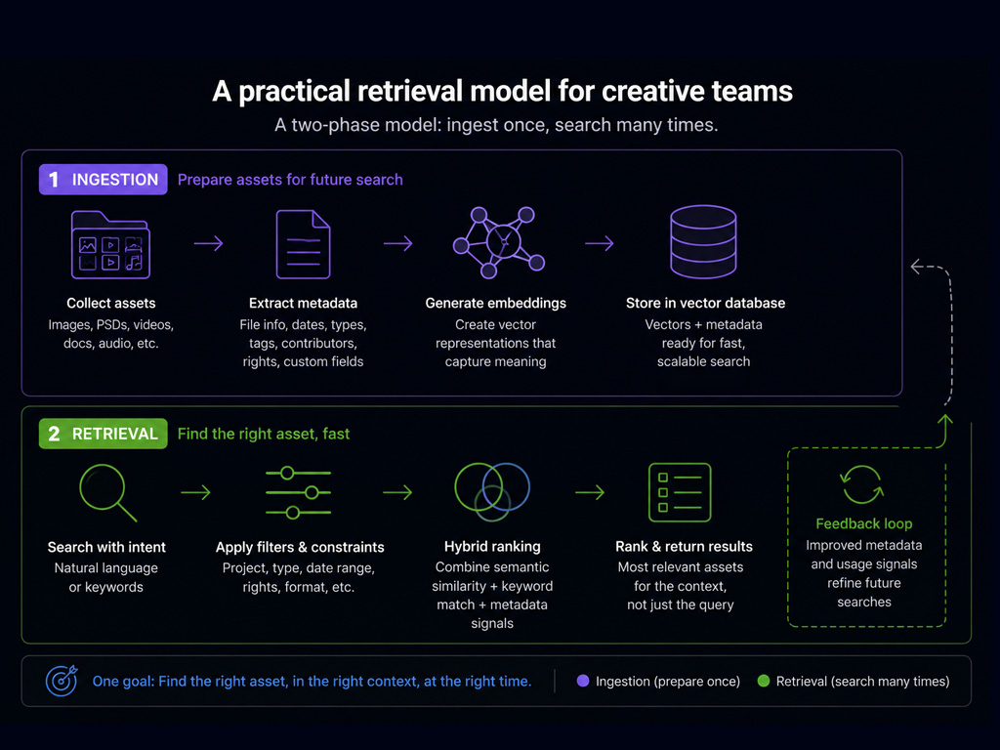

If Part 1 was about the symptom, Part 2 is about the mechanism.

Most creative teams already know they are losing time to search. What is less obvious is where the breakdown actually happens. It usually does not begin with bad tools or careless teams. It begins with production speed. As projects scale, naming conventions drift, metadata quality drops, and the cost of keeping everything perfectly organized becomes higher than the cost of living with a little chaos. For a while, that tradeoff feels reasonable. Then retrieval starts to fail at exactly the moments it matters most.

---

## The first failure: folders become historical, not functional

Folder trees work best when projects are small, ownership is stable, and everyone agrees on the same mental model. Creative production rarely stays in that state for long.

In game development, one environment team might organize assets by biome, another by sprint, and another by engine-ready status. All three structures make sense locally. Across a two-year production, they become incompatible maps of the same work. In film production, footage often starts organized by shoot day, then gets reorganized by sequence in editorial, while VFX and color keep their own derivative structures. In design teams, client work, exploration files, and final exports often live in separate systems with weak links between them.

Folders still matter, but over time they describe where a file landed, not what that file is useful for. The distinction sounds subtle until someone asks for "the moody nighttime alley concept with practical neon references" and the answer is technically somewhere under three different directory branches.

---

## The second failure: tags decay under delivery pressure

Tagging is usually proposed as the cure for messy folders, and in controlled environments it can work well. The challenge is that consistent tagging is a process discipline, and process discipline is fragile under deadline pressure.

Animation teams shipping sequences on tight schedules do not stop to apply perfect descriptive tags to every versioned scene file. Music producers bouncing between sessions do not pause to classify each stem with reusable semantic labels. Designers preparing campaign variants for multiple channels rarely annotate every intermediate exploration with future retrieval in mind.

None of this reflects poor craft. It reflects incentives. Teams optimize for shipping what is needed now, not for a hypothetical retrieval request six months later. As a result, tag quality tends to be uneven: high for formal deliverables, sparse for working files, and inconsistent across individuals. When retrieval depends heavily on tags, search quality mirrors that inconsistency.

---

## The third failure: keyword search depends on shared vocabulary

Keyword search is excellent when the query and the stored text use the same words. It weakens quickly when the language diverges.

Creative work is full of vocabulary mismatch. A film editor might search for "quiet emotional close-up" while a clip is described internally as "CU actor B reaction alt take." A game artist may search "wet brutalist corridor" while files are named around level IDs and sprint numbers. A graphic designer searching for "playful geometric logo options" may be looking for files titled with client shorthand that made sense only to the original project team.

This is why keyword-only retrieval feels unpredictable in creative environments. The file may exist. The query may be clear. The bridge between them is missing.

---

## Why these failures compound over time

Any one of these issues is manageable. Together, they create a compounding effect.

A project starts with a clean structure. Team members rotate. Vendors contribute assets using different conventions. Naming drift increases. Tagging discipline varies by deadline and role. Archive volume grows. Eventually the team has not one system but several partially overlapping systems. At that point, finding material becomes less about search and more about social memory: asking the person who might remember.

That approach does not scale. It also creates uneven access to institutional knowledge. Senior contributors become implicit search engines, and new team members spend longer rebuilding context that already exists in files they cannot easily discover.

---

## What retrieval needs to do differently

If we treat this as a retrieval problem rather than an organization problem, requirements change.

Retrieval has to work when naming is imperfect. It has to work when tags are incomplete. It has to work when the user can describe intent clearly but cannot reproduce the original wording used at creation time. It also has to preserve precision when exact constraints matter, such as project, date range, rights status, delivery format, or asset type.

That is why modern systems combine multiple signals:

- semantic similarity for meaning
- keyword matching for exact terms
- metadata filters for hard constraints

You can think of this as retrieval with layered evidence. Meaning gets you close. Exact words help when they exist. Metadata enforces boundaries that semantics alone cannot infer reliably.

---

## A practical retrieval model for creative teams

A useful mental model is a two-phase path: ingestion first, retrieval second.

Ingestion is where assets are prepared for future search. Files are processed, embeddings are generated, and available metadata is attached. In creative pipelines, this can include project identifiers, file types, timestamps, contributor roles, rights or licensing fields, and any production-specific attributes you already track. The goal is not to create perfect metadata. The goal is to capture enough structure and enough semantic representation that future queries have multiple routes to the right result.

Retrieval is where those routes are combined. A user might search in natural language, then refine with metadata filters, then rely on hybrid ranking that blends semantic and keyword scores. This is the point where a vector database becomes useful. It stores embeddings with metadata and makes nearest-neighbor retrieval practical at scale, so semantic and filtered search can run in one coherent flow.

Using Weaviate as an implementation example, the pattern is straightforward: ingest assets with embeddings and metadata, query with vector and keyword signals, then apply metadata constraints for production-safe results. The result is not magic search. It is search designed for how creative teams actually work.

---

## Where this leaves us

Creative workflows do not break because teams are disorganized. They break because production systems are optimized for shipping, while retrieval systems are often optimized for ideal data hygiene that real projects cannot maintain.

Once you acknowledge that gap, the architecture becomes clearer. Keep folders. Keep metadata. Keep keyword search. Add semantic retrieval so the system can interpret meaning when structure and wording are incomplete. Blend those signals instead of forcing users to pick one mode.

That is the practical direction for teams that want less time lost to searching and less creative work stranded in archives.

---

## What’s next

In the next post, we’ll begin that implementation with the foundation: a read-only discovery pass that scans a messy creative archive and turns it into a trustworthy manifest. From there, we can enrich those records, ingest them into Weaviate, and add hybrid queries and metadata filtering one observable stage at a time.

---

import WhatsNext from "/_includes/what-next.mdx";

<WhatsNext />
