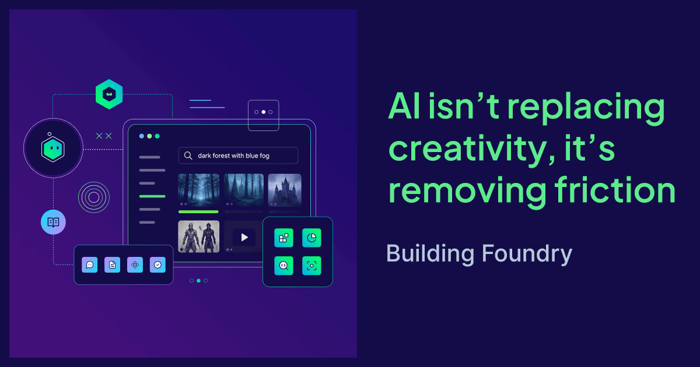
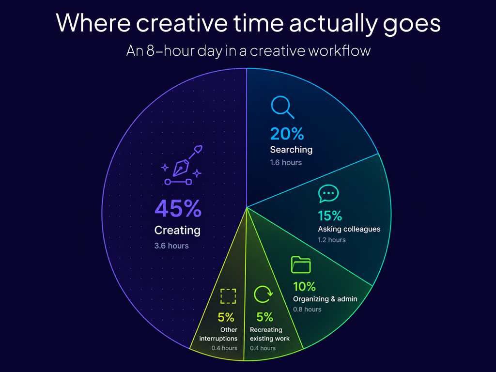
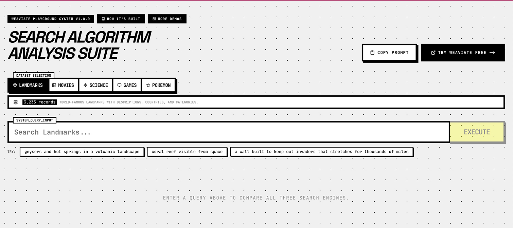
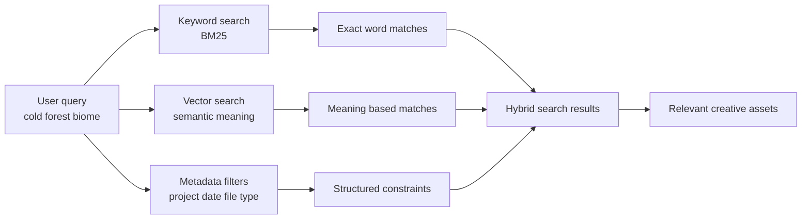

:::info
final_final_v7.png  
USE_THIS_ONE.mov  
new_new_export.psd
:::

File names like these are oddly universal. They appear in game studios, post-production houses, animation pipelines, and design agencies working across every kind of project. The specific conventions vary, but the underlying situation does not: creative work accumulates faster than anyone can organise it, and finding something you made six months ago is often harder than making it again from scratch.

You don’t need better naming conventions or a different design tool to solve this. It’s a retrieval problem, and it’s one that most creative tools have never been designed to solve.

---

## The problem isn’t creativity

The persistent question in conversations about AI and creative work is whether AI can generate something: a painting, a screenplay, or a piece of music. But the more immediate and practical story is far less dramatic.

Consider how a game production pipeline actually works. A concept artist produces dozens of character sketches before one direction gets approved. The rejected explorations go into a folder named something like “alt_directions_v2”, and within three months nobody can reliably locate the version that sparked the final design. Then, on a sequel or expansion, someone needs that exact colour palette and aesthetic direction. Because searching for “dark armour character concepts 2023” turns up nothing useful, they start from scratch rather than building on what already exists.

The same problem looks different depending on the discipline. A film editor searching for specific B-roll scrolls through bins labelled by card number and shoot date, because nobody had time to write shot descriptions during production. An animator looking for a reference of a particular run cycle digs through folders three levels deep before giving up. A graphic designer trying to find an earlier logo exploration for a returning client reconstructs it from memory. A music producer hunting for a drum texture they used two years ago opens session after session, listening through stems, until they find it or settle for something new.

Searching for previous work, redesigning things that have already been done, and trying to stay organized in a sea of ever-growing media all take away from the creative work that actually matters.

---

## Where time actually goes

In most creative workflows, the actual moment of making something occupies a surprisingly small fraction of total project time. Pre-production and post-production dwarf the production itself. Research, reference gathering, asset organisation, version tracking, and the constant process of locating what already exists all compete for hours that would otherwise go toward the work.

Consider a scenario common in animation production: a rigging team needs to check how a particular character’s shoulder topology was handled in a previous project. There is no organised asset library, just a shared drive arranged by project name and date. The rig file is in there somewhere, but finding it requires either knowing exactly where to look or asking someone who does. If the person who built the original rig has since moved to a different studio, that knowledge leaves with them.

This is partly a documentation problem, but the right naming and organization only gets a team so far. The work exists. The information exists. But the inability to retrieve it efficiently is costing the team time, consistency, and sometimes money when they unknowingly reproduce work that already exists.

Traditional search compounds the problem rather than solving it. Keyword search requires you to guess which words were used when something was named or described, often by someone else, often months or years earlier. Searching for “blue environmental concept” returns nothing if the file is called `ENV_ALTSTYLING_DARK_V4`.

Weaviate is designed to handle this type of retrieval, storing semantic representations alongside traditional metadata so creative assets can be searched by both meaning and structured filters.

---

## AI as a workflow layer

The most useful aspect of AI for creative fields isn’t as a generator of new work, but as the infrastructure layer that makes existing work more accessible.

This is where a class of technology called [semantic search](/blog/vector-search-explained) becomes genuinely relevant to creative workflows. To build this infrastructure layer, we can use semantic search to organize and retrieve documents based on meaning, not just by matching exact terms or phrases.

This works by using machine learning to change the original media into vector embeddings. A machine learning model processes a piece of content, whether that content is text, an image, or an audio file, and converts it into a long list of numbers that represents what the content means or depicts. Two things that mean a similar thing, even if described very differently, produce number sequences that sit close together in the resulting high-dimensional vector space. For example, a query for “dark forest with blue atmospheric haze” and an image of a misty pine forest at dusk will produce embeddings that cluster near each other in this space, even though neither the query nor the image share any matching text.

Vector search is the process of finding items whose embeddings are closest to a given query. That proximity is what enables retrieval by meaning rather than by keyword.

---

## A simple example

A game studio building an open-world RPG might accumulate tens of thousands of concept images over a multi-year production. Team composition changes, folder structures evolve, and naming conventions that were carefully maintained in year one have become considerably more creative by year three.

A designer joining the team near launch needs reference for a cold, forested biome that should feel visually distinct from the game’s existing environments. Searching for “cold forest biome” returns nothing useful from a keyword search because those files were named when nobody anticipated that particular query. A semantic search system, given the same natural-language description, can match against visual embeddings of the images themselves, automatically generated descriptions created during indexing, or a combination of both.

Before search becomes possible, content needs to be processed and stored in a way that supports semantic retrieval. This is the ingestion step: running files through a pipeline that generates an embedding for each item and stores that embedding alongside the original content and its metadata.

Metadata remains important even in a semantic search system. We still need to keep that information to know that our result belongs to the correct project, was created within the past two years, and is the right file type. So, in addition to our original media and our generated vector embeddings, it’s important that we store the file’s metadata as well.

A vector database holds all of this together. Unlike a traditional relational database designed for exact lookups, a vector database stores embeddings alongside the original data and metadata, with its internal architecture optimised for fast semantic retrieval. When you run a query, the database converts it into an embedding and returns the items whose embeddings are most similar. The result is search that appears to understand what you are actually looking for, not just what you typed. You can try the [semantic search playground](https://playground.weaviate.io/) to see the difference between keyword, vector, and hybrid results on the same query.

  

  

---

## This is just the start

None of what has been described here is beyond current technology. Semantic search and vector databases are already used in enterprise knowledge management, legal document retrieval, and e-commerce product search for exactly these reasons. We can apply those same principles to creative asset management.

The challenge lies in the ingestion layer: deciding what gets indexed, how descriptions and embeddings are generated for different content types, and how the search interface fits into existing tools and workflows.

## What’s next

In the next post, we’ll look closely at where creative workflows actually break down, and why conventional folder structures, tagging systems, and keyword search consistently fail to keep pace with how creative teams produce work. After that, we’ll walk through a concrete implementation: a working semantic search system for creative assets built with Weaviate, step by step.

---

import WhatsNext from "/_includes/what-next.mdx";

<WhatsNext />
