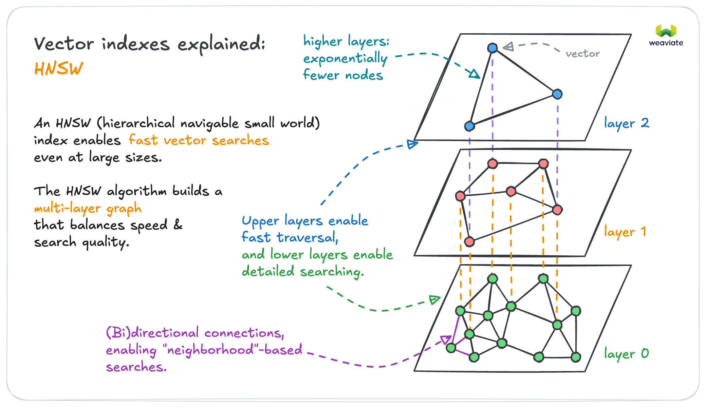
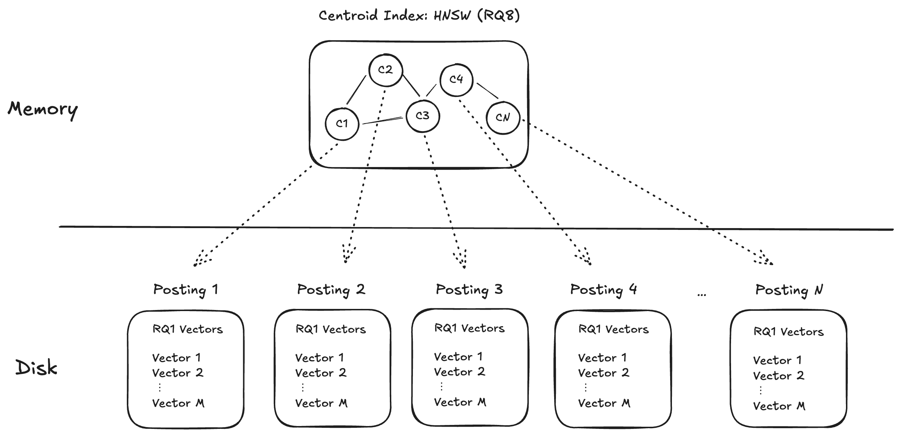
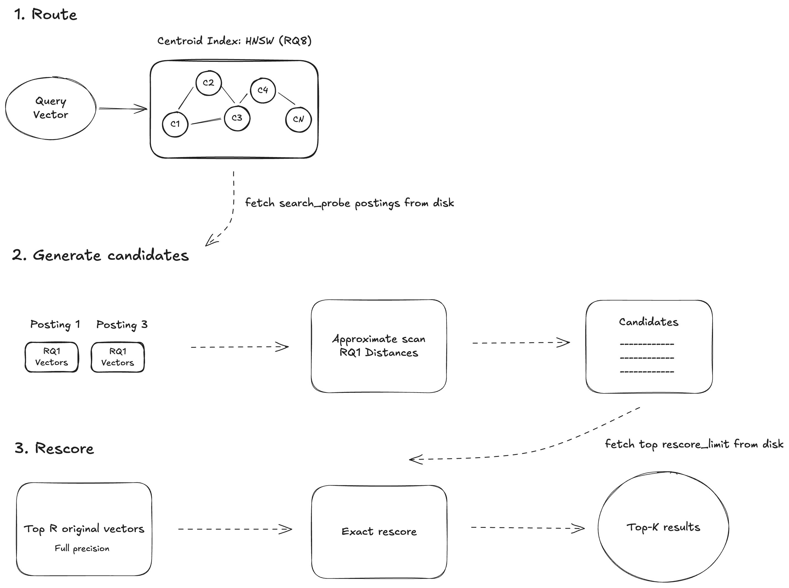
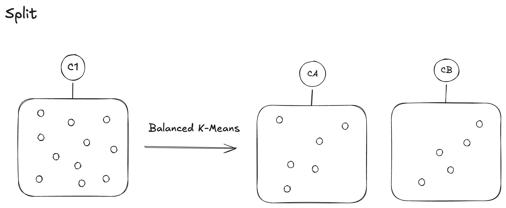
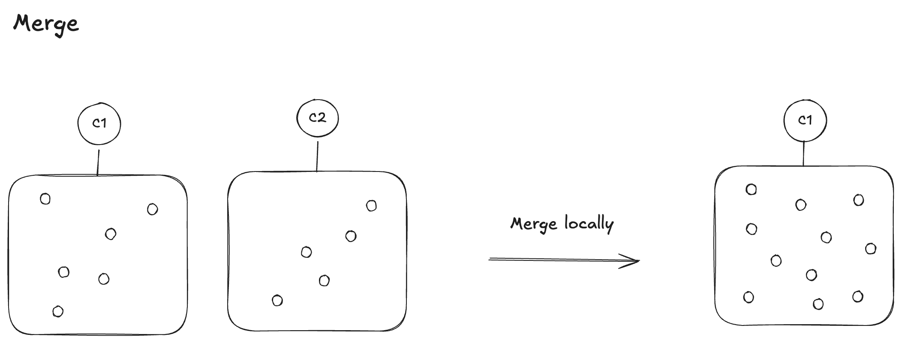
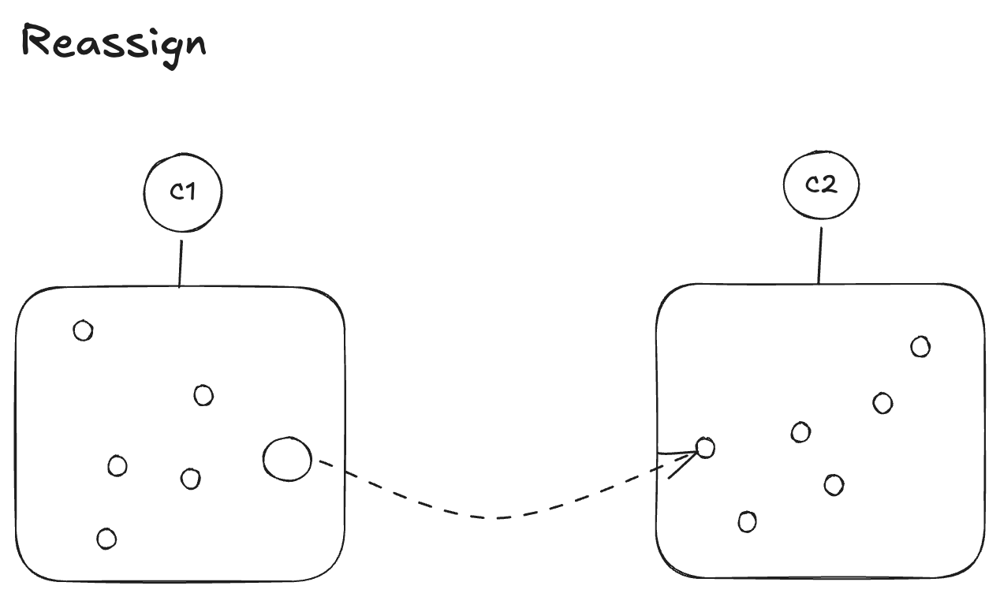
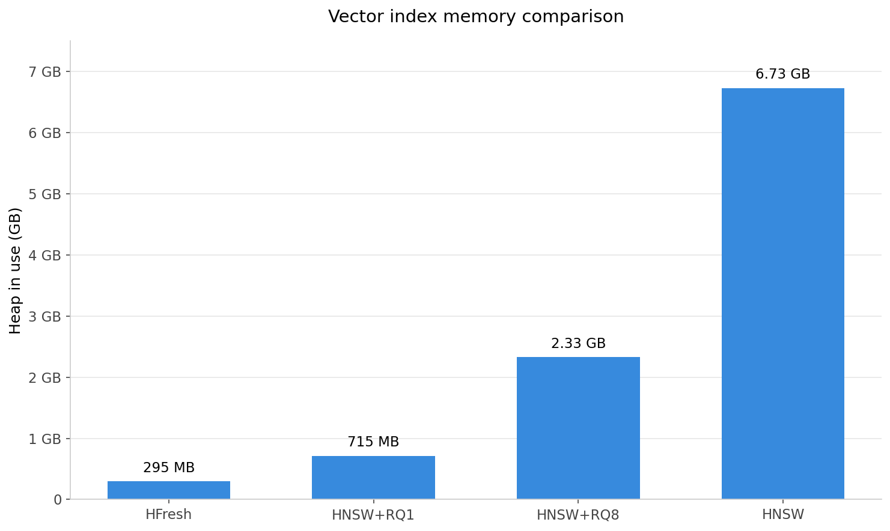
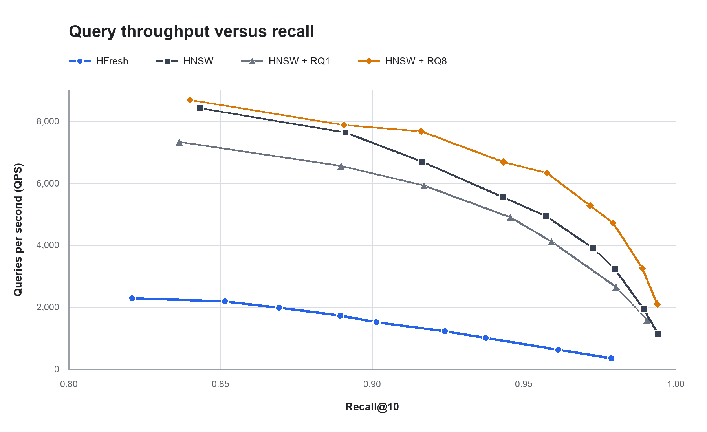

{/* TODO: Replace this temporary hero with the final HFresh artwork. */}


<br />

HFresh is Weaviate's disk-based vector index for large-scale vector search when keeping most index data off the heap matters more than peak throughput.

## Understanding HNSW's memory bottleneck in similarity search

When it comes to finding similar vectors quickly, HNSW (Hierarchical Navigable Small World) has become the gold standard. It's fast and accurate, but as datasets grow from millions to billions of vectors, HNSW reveals a fundamental constraint: its graph and vector cache are kept in memory.

HNSW is a graph-based index that organizes vectors into a hierarchical structure. At the top layer, you have a sparse graph with long-distance connections that help you quickly navigate to the right neighborhood. As you descend through the layers, the graphs become denser with more local connections, eventually guiding you to the most similar vectors at the bottom layer.



The question isn't whether HNSW is good. It absolutely is. If you need the lowest possible latency and highest throughput, HNSW is hard to beat. But many applications prioritize lower memory use and larger scale over peak query performance.

This is where disk-based indexes become interesting. What if you could trade some latency for much lower memory use and the ability to scale to larger datasets?

## Introducing HFresh

HFresh is a modern disk-based vector index designed for high recall and strong update performance, while keeping latency predictable at large scale. It builds on ideas introduced by the [SPFresh](https://arxiv.org/pdf/2410.14452) research paper, adapting the design to use battle-tested components already present in Weaviate.

At a high level, HFresh belongs to the family of partition-based vector indices. Instead of connecting every vector to neighbors in a global graph like HNSW, HFresh divides vectors into many small regions called postings. Each posting contains vectors that are close to each other in vector space and is stored on disk in an LSM store.



To make this layout efficient, HFresh uses a two-stage search strategy.

First, a compact in-memory centroid index identifies which regions of the vector space are relevant to a query. Then, only corresponding postings are fetched from disk and searched in detail. By limiting disk reads to a small subset of the dataset, HFresh is designed to keep I/O bounded and latency predictable, even as the dataset grows into billions.

This structure is designed to support very large datasets while keeping performance predictable.

### Freshness without rebuilds

The key idea behind SPFresh, and inherited by HFresh, is that most updates only affect a small region of the vector space.

In traditional partition-based indexes, updates can accumulate and partitions can drift, eventually requiring a full rebuild to restore recall and latency, a process that can take hours or days at scale.

SPFresh shows that this is often unnecessary. In a well-structured partitioned index, inserting or deleting a vector typically only affects a small neighborhood of the vector space. Instead of rebuilding everything, you can maintain index quality through incremental rebalancing, using a small set of local operations.

- Splitting oversized postings
- Merging undersized ones
- Reassigning vectors when boundaries shift

These operations run mostly asynchronously in the background, continuously repairing small local imbalances before they accumulate into global problems. The result is an index that stays fresh and well-balanced over time, without disruptive rebuild cycles.

### How HFresh builds on SPFresh

HFresh takes the core idea behind SPFresh and adapts it to fit Weaviate's architecture. The goal was not to reproduce the paper component by component, but to keep what makes the design so interesting:

- local maintenance instead of rebuilds
- bounded disk reads
- a clear separation between the in-memory routing layer and disk-based postings

From there, we made a series of pragmatic choices. Instead of introducing entirely new ANN machinery, we reused battle-tested pieces already present in Weaviate and shaped them to serve this new layout. This means keeping the overall SPFresh philosophy, while rethinking some of its components to better match Weaviate's strengths around indexing, filtering, compression, and updates.

## HNSW as the centroid index

A key design choice in HFresh is the use of HNSW as the centroid index, rather than SPTAG.

SPTAG is the ANN index used in Microsoft's original SPANN design and carried over into SPFresh. It combines a partitioning tree with a graph, allowing queries to quickly navigate toward the closest centroids and, from there, the right posting lists. For Weaviate, however, HNSW was the more natural fit: it already plays that role very well.

HNSW is the most widely used vector index in Weaviate and one of the most battle-tested parts of the system. We understand its behavior well in production, across a wide range of workloads and dataset sizes. Reusing it for centroid search lets HFresh build on infrastructure that is already proven, rather than introducing a brand-new mechanism.

HNSW is also a strong fit for what the centroid index actually needs to do. In HFresh, the centroid layer is responsible for routing queries to the right postings quickly and accurately. That means it must remain compact, have low latency, and support frequent updates as postings evolve over time.

Centroids are not static: splits, merges, and reassignments continuously reshape the partitioning of the vector space, so the centroid index must be able to absorb many insertions and deletions without requiring expensive rebuilds.

Another advantage is that the centroid index can itself be quantized. Because the centroid layer is only used to identify promising regions of the vector space, HFresh can compress those vectors aggressively enough to reduce memory usage while maintaining the accuracy needed for strong recall. In fact, HFresh uses HNSW with RQ8, reducing memory usage of centroids by 4x.

Using HNSW here also means that improvements to HNSW automatically benefit HFresh. A good example is ACORN, which improves filtered search by making graph traversal more efficient when only part of the dataset matches a filter. Since HFresh relies on HNSW as the centroid layer, those improvements are not isolated: they strengthen HFresh's query path.

## Quantization

HFresh uses Rotational Quantization in two places, with two different compression levels.

The reason is that the two stages of search have different jobs. The centroid index routes the query to the right postings, so it needs enough precision to avoid sending the query to the wrong part of the vector space. The postings, on the other hand, are used to generate candidates. Their approximate scores are not the final ranking, because HFresh later rescores the best candidates using the original uncompressed vectors.

Rotational Quantization works by rotating vectors into a representation that is easier to compress, then reducing the precision of each dimension. HFresh uses:

- **RQ8 for centroids**, reducing centroid vector memory by **4x**
- **RQ1 for postings**, reducing stored vector data by up to **32x** compared to 32-bit floats

### RQ8 for the centroid index

The first stage of HFresh search uses an HNSW index over centroids. This in-memory index identifies which postings are likely to contain the nearest neighbors for a query.

HFresh uses RQ8 here because routing mistakes are expensive. If the centroid search misses the right region, the later posting scan may never see the true nearest neighbors. RQ8 gives a strong compromise: it cuts centroid vector memory by **4x** while keeping enough precision for accurate routing.

This works especially well because the centroid index is much smaller than the full vector dataset. HFresh can afford a higher-precision compression format for centroids, while still keeping the in-memory layer compact.

### RQ1 for postings

After HFresh has selected the most promising postings, it scans the vectors stored inside them. This stage has a different tradeoff.

Postings live on disk, so their size directly affects storage cost and query I/O. HFresh stores posting vectors with RQ1, where each dimension is represented with a single bit. Compared to 32-bit float vectors, that is up to a **32x reduction** in vector storage.

That aggressive compression makes each posting smaller and cheaper to read. It also makes the first-pass distance computation fast enough to scan many candidates.

HFresh does not rely on RQ1 scores for the final ranking. Instead, RQ1 is used to build a candidate set. HFresh then fetches the original uncompressed vectors for the top candidates and recomputes exact distances during rescoring. This keeps disk reads small without giving up final ranking quality.



## Background operations

The reason HFresh can stay balanced over time without rebuilds is that maintenance is built directly into the index. Instead of letting imbalances accumulate and then fixing everything in one large offline job, HFresh breaks down maintenance into small background tasks that can be processed continuously.

In practice, most foreground writes stay simple: vectors are appended quickly, and follow-up work is pushed to background queues. Those tasks are persisted in dedicated on-disk queues, so they survive restarts and can be drained incrementally by the scheduler.

HFresh organizes this work into three main background task types: split, merge, and reassign.



**Split:** When a posting grows too large, HFresh splits it. The posting is loaded, stale entries are garbage-collected, its vectors are divided into two balanced groups using the Balanced K-Means algorithm, and two new centroids are created to replace the old one. This keeps postings from growing too much, which would make disk reads heavier and routing less precise.



**Merge:** The opposite problem is postings that become too small. That can happen after deletes or simply as the data distribution evolves. In those cases, HFresh looks for a nearby posting that can absorb the smaller one without becoming too large itself. If it finds a good candidate, it merges the two and removes the extra centroid. This prevents the index from fragmenting into too many tiny postings.



**Reassign:** After a split or a merge, some vectors may no longer belong in the posting where they are currently stored. That's where reassignment comes in. The SPFresh paper describes a protocol called LIRE (**L**ightweight **I**ncremental **Re**balancing) which, after a split, checks whether some vectors would now fit better under one of the new centroids, or even under a neighboring posting. After a merge, it checks whether some vectors that were absorbed should really be moved elsewhere instead. These reassignments let HFresh progressively correct mistakes instead of trying to get everything perfect in one step.

Together, these background operations form a continuous balancing loop. Inserts make local changes, and the index quietly tidies itself up afterward. The result is an index that stays fresh over time without disruptive rebuild cycles.

## Filtered search

Filtered vector search adds another constraint: results must be similar to the query vector while also satisfying the filter. In an e-commerce search, for example, that might mean finding similar products from specific brands, within a price range, and currently in stock.

HFresh uses an allow list, represented as a bitmap, to track the document IDs that satisfy the filter. It then chooses between two search strategies based on the number of matching vectors.

For highly selective filters, running the full HFresh pipeline can cost more than searching the matching subset directly. When the allow list contains fewer than 5,000 IDs, HFresh bypasses centroid routing and posting scans, fetches the original vectors for those IDs, and computes exact distances over them. The current 5,000-ID cutoff is a fixed internal heuristic, not a configurable threshold or a general tuning recommendation.

### Posting-aware filtering

For broader filters, HFresh uses its regular two-stage search with a posting-aware form of prefiltering. The filter identifies matching objects, but the centroid HNSW routes queries to postings rather than individual objects. HFresh bridges those two levels using metadata that records which vector IDs belong to each posting.

The process is:

1. Translate the object-level allow list into posting eligibility using the posting metadata.
2. Navigate the centroid HNSW with [ACORN](https://weaviate.io/blog/speed-up-filtered-vector-search), selecting postings that can contribute at least one matching vector.
3. Read the selected postings and reapply the original allow list while scanning their compressed vectors.
4. Rescore the top candidates using their original uncompressed vectors.

Because HFresh can replicate a vector across multiple postings, it also tracks which matching vectors have already contributed to posting selection. This avoids reading multiple postings solely because they contain replicas of the same match. Together, posting-level selection and vector-level checks reduce unnecessary disk reads while ensuring that the final results satisfy the filter.

## How to use HFresh

To use HFresh, configure it as the vector index when creating a collection.

Here is an example using the Python client:

```python
from weaviate.classes.config import Configure, VectorDistances

collection = client.collections.create(
    name="Article",
    vector_config=Configure.Vectors.self_provided(
        name="Title",
        vector_index_config=Configure.VectorIndex.hfresh(
            distance_metric=VectorDistances.COSINE,
        ),
    ),
)
```

:::tip Tuning HFresh
Start with the defaults. If recall is too low, increase:

- `search_probe` to search more postings per query.
- `quantizer.rescore_limit` to rescore more candidates using full-precision vectors.

Both settings can be changed without rebuilding the index.
:::

## Experiments

To compare HFresh with HNSW in practice, we benchmarked four index configurations on the DBpedia OpenAI 1M dataset: uncompressed HNSW, HNSW with RQ1, HNSW with RQ8, and HFresh. The benchmarks ran on a Google Cloud `n2-standard-8` instance with 8 vCPUs and 32 GB of memory, using a 200 GB Balanced Persistent Disk (`pd-balanced`). We used default index parameters, varied the search-time parameters, and measured heap usage at rest and query throughput.

### Heap usage



These measurements report Go heap usage, not total process or system memory. HFresh also relies on OS-managed caching for its on-disk data, which is not captured by the heap figures.

The clearest difference is heap usage at rest. HFresh uses 295 MB of heap, compared with 6.73 GB for uncompressed HNSW.

HFresh also uses less heap than quantized HNSW. HNSW with RQ1 uses 715 MB, 2.4x as much as HFresh, while HNSW with RQ8 uses 2.33 GB, nearly 8x as much.

This difference follows directly from HFresh's architecture. By keeping only the RQ8-compressed centroid index in memory and storing postings on disk, HFresh reduces the heap required for index data as datasets grow.

### Query throughput



The QPS-recall curve shows the query-performance side of HFresh's heap advantage.

At comparable recall, HNSW and its quantized variants deliver substantially higher throughput than HFresh. This is expected: HNSW searches an in-memory graph, while HFresh reads selected postings from disk and fetches original vectors for rescoring.

These results clarify when to choose each index. HNSW remains the better option when the lowest latency and highest throughput matter most. HFresh is designed for workloads where keeping the full index in memory is too expensive and lower throughput is an acceptable tradeoff for a much smaller heap footprint.

### Scaling to one billion vectors

Separately from the DBpedia benchmarks, we tested HFresh index construction with one billion randomly generated 256-dimensional vectors. We used default index-construction settings and imported batches of 1,000 with 12 workers.

| Metric | Result |
| --- | --- |
| Dataset | **1 billion 256-dimensional vectors** |
| Compute | **32 vCPUs, 256 GB RAM** (`n2-highmem-32`) |
| Storage | **4 TB SSD Persistent Disk** (`pd-ssd`) |
| Peak VM memory usage | **204 GB** |
| VM memory usage after restart | **54 GB** |
| Go heap after restart | **47 GB** |
| Peak disk usage | **3.09 TB** |
| Disk usage after import | **2.28 TB** |

The run successfully constructed the billion-vector HFresh index. No recall or QPS measurements were collected for this scale test.

The VM memory measurements come from GCP system metrics, while the heap measurement comes from a Go heap profile.

## Conclusion

HFresh gives Weaviate a disk-based index for large, mutable vector datasets. By keeping only the centroid index in memory and maintaining disk-resident postings incrementally, it reduces the heap required for index data without relying on full index rebuilds. HNSW remains the better choice when the lowest latency and highest throughput matter most; HFresh is designed for workloads where a smaller heap footprint and scale justify lower query throughput.

HFresh was introduced as a technical preview in Weaviate 1.36 and became generally available in Weaviate 1.38. See the [documentation](https://docs.weaviate.io/weaviate/concepts/vector-index#hfresh-index) to get started.

If you are evaluating HFresh for a large-scale workload, we would like to hear about your dataset, performance requirements, and results.

import WhatsNext from '/_includes/what-next.mdx';

<WhatsNext />
