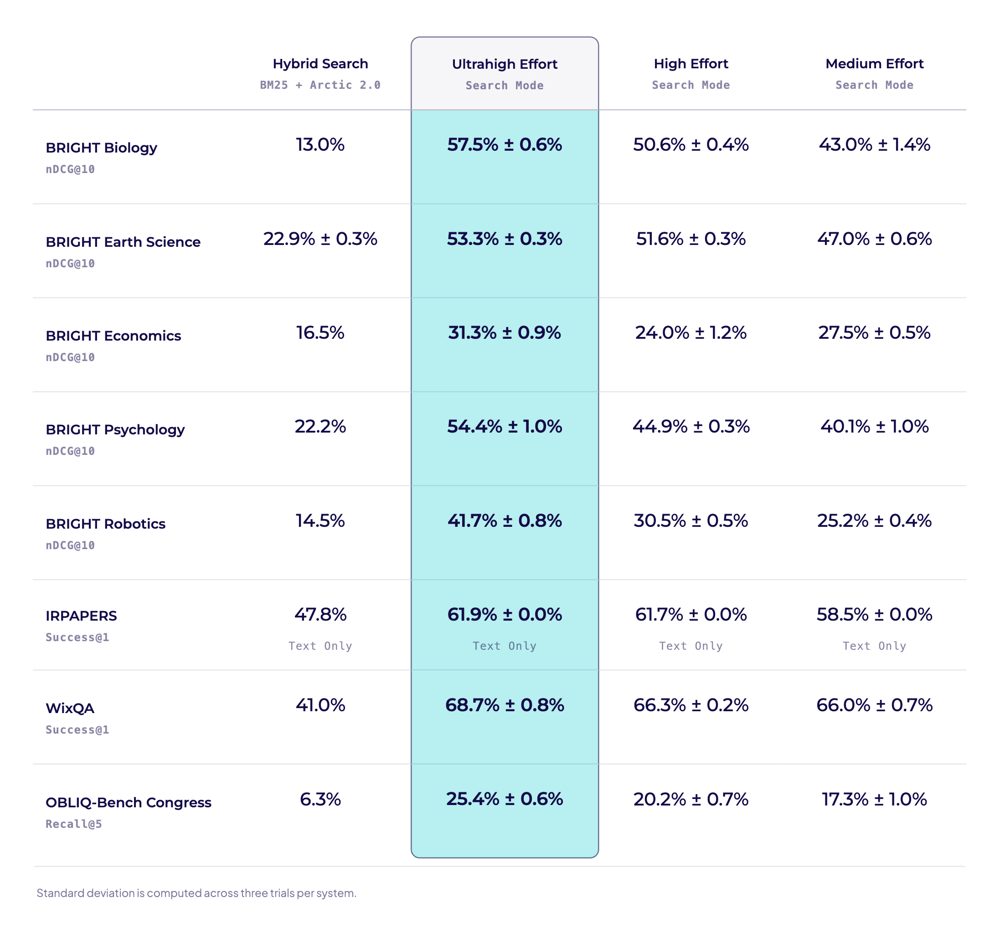
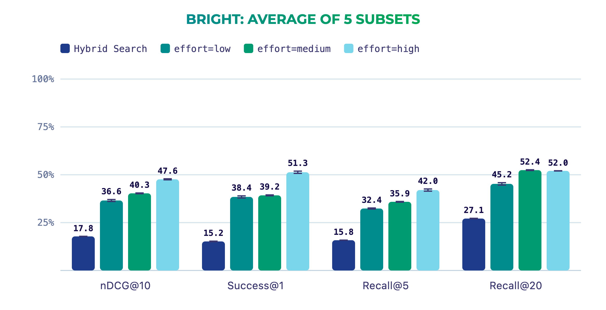
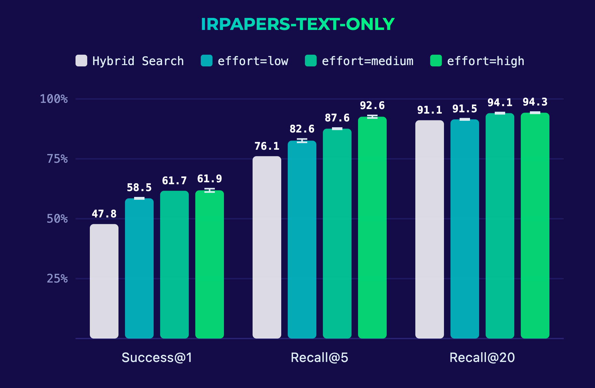
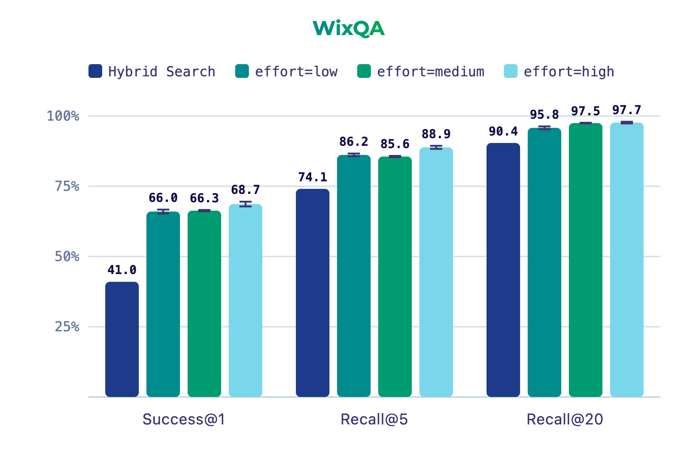
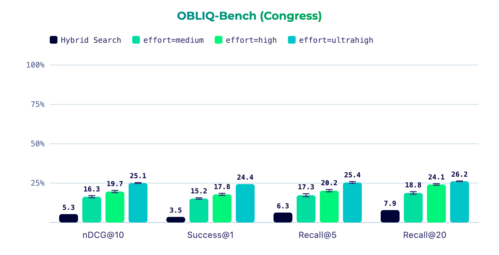

Scaling test-time compute has become one of the clearest successes of the foundation model era. Spend more compute on a problem at inference, get a better result. Retrieval is no exception. The new `effort` parameter in the Query Agent’s [Search Mode](https://docs.weaviate.io/query-agent/guides/search_mode) now lets you control this. On BRIGHT Biology, one of the hardest reasoning-intensive retrieval benchmarks, ultrahigh effort Search Mode lifts nDCG@10 to 57.5 compared to 13.0 with Hybrid Search alone.

Different applications sit at different points on the accuracy / latency tradeoff curve. Available in `weaviate-agents 1.8.0` and `agents-typescript-client 1.7.0`, `effort` lets you choose per request how much work the Query Agent invests in each search.

import Tabs from '@theme/Tabs';
import TabItem from '@theme/TabItem';

<Tabs groupId="languages">
<TabItem value="py" label="Python">

```python
from weaviate.agents.query import QueryAgent

qa = QueryAgent(
  client=client,
  collections=["IRPAPERS"]
)

response = qa.search(
  "What are Listwise Rerankers?",
  effort="ultrahigh"
)
```

</TabItem>
<TabItem value="js" label="JS/TS">

```typescript
import { QueryAgent } from 'weaviate-agents';

const qa = new QueryAgent(
  client,
  {
    collections: ['IRPAPERS'],
  }
);

const response = await qa.search("What are Setwise Rerankers?", {
  effort: "ultrahigh",
});
```

</TabItem>
</Tabs>

Search Mode’s three `effort` tiers: `medium`, `high`, and `ultrahigh` scale computation at the two stages where Search Mode does its work: query writing and reranking. At higher effort, the agent thinks longer about how to decompose queries and reranks results more thoroughly. At lower effort, it trades some of that depth for speed and cost. Turn it up when the answer matters, and turn it down when latency does!

## Benchmarks

The following table compares our `medium`, `high`, and `ultrahigh` effort tiers in Search Mode against Weaviate’s Hybrid Search across 8 benchmarks: 5 subsets from BRIGHT, IRPAPERS, WixQA, and a subset from OBLIQ-Bench. We chose these benchmarks because they illustrate reasoning-intensive and domain-specific retrieval problems.

### Methodology

As in our first Search Mode Benchmarking blog, we compare against Weaviate's Hybrid Search, combining BM25 with vector search over Snowflake Arctic 2.0 embeddings, fused with Reciprocal Rank Fusion (RRF). We then run Search Mode at each of the three effort tiers on the same collections. To account for the stochasticity of the models used in Search Mode, every Search Mode configuration is run for 3 trials, and we report the mean and standard deviation across trials. Hybrid Search is nearly deterministic given a fixed collection, so we report a single run.

#### Metrics Glossary

- **Gold Document**: In IR benchmarks, the "gold document" is the labeled relevant document, or documents, for a given query.
- **Success@K**: Measures whether or not the K retrieved documents are gold documents. We typically report Success when setting K = 1 to account for multiple gold documents per query.
- **Recall@K**: Measures how many of the gold documents are in the top K results.
- **nDCG@K**: Short for normalized Discounted Cumulative Gain, nDCG considers not only whether relevant documents are retrieved, but also how they are ordered. Its strength lies in capturing graded relevance rather than binary relevance, and rewarding systems that place the best results higher in the list.

---

For all metrics, higher values indicate better performance. Each metric emphasizes a different aspect of information retrieval, and together they provide a fuller picture.

---

#### Benchmarks Glossary

- **BRIGHT**: Featured in ICLR 2025, BRIGHT tests reasoning-intensive retrieval with long, descriptive queries sampled from StackExchange posts. The gold documents are web pages cited in accepted or highly upvoted answers. We use 5 subsets: Biology, Earth Science, Economics, Psychology, and Robotics.
- **IRPAPERS**: Our benchmark of Information Retrieval papers, published at the start of 2026 to study domain-specific retrieval and compare text- and image-based systems. We report results on the text transcriptions.
- **WixQA**: Released by the [Wix.com](https://www.wix.com) AI Research team in May 2025, WixQA tests domain-specific technical support retrieval with 200 expert-written customer queries, each paired with gold documents authored by Wix support specialists.
- **OBLIQ-Bench**: Introduced by MIT researchers in May 2026, OBLIQ-Bench targets queries where relevance is latent, or oblique, rather than stated in the document's surface text. We use the Congress Hearings subset with 254 tip-of-the-tongue queries over 213,650 congressional hearing passages.



Across all eight benchmarks, the pattern is consistent: every `effort` tier of Search Mode outperforms Hybrid Search, and higher effort delivers higher accuracy on average. The size of the gap between tiers depends on the problem. On BRIGHT, where queries demand multi-step reasoning, the tiers separate sharply. Ultrahigh effort lifts nDCG@10 from 13.0 to 57.5 on Biology and from 22.2 to 54.4 on Psychology, with each step up in effort buying meaningful additional accuracy. On domain-specific, but less reasoning-intensive benchmarks like IRPAPERS and WixQA, the gap shrinks. Here medium effort already captures most of the gain over Hybrid Search, and higher tiers add smaller increments on top.

Because Search Mode’s inference pipeline is stochastic, adjacent tiers can overlap on individual datasets. For example, on BRIGHT Economics, medium effort edges out high. Averaged across benchmarks and trials, the ordering holds and higher effort consistently delivers higher accuracy. Standard deviations are computed across three trials per system, and the consistency across runs gives us confidence these gains are robust rather than artifacts of a single sample.

### BRIGHT



The BRIGHT subsets reward effort differently. On Biology and Psychology, each step up in effort buys a meaningful gain, with ultrahigh effort roughly quadrupling Hybrid Search's nDCG@10 on Biology. Earth Science tells a different story, where medium effort already triples the Hybrid Search baseline and the higher tiers add smaller refinements on top. Robotics is the most striking case where medium and high effort improve on Hybrid Search only modestly, but ultrahigh effort jumps well past both, lifting Success@1 from 25.7 at medium to 45.9 at high. Robotics also has by far the longest queries of the five subsets, averaging 819 tokens, which suggests the hardest queries are exactly where the extra computation pays off most.

### IRPAPERS



Compared to BRIGHT, the effort tiers sit much closer together on IRPAPERS. Medium effort already captures most of the gain over Hybrid Search, with high and ultrahigh adding only a couple of points on top.

### WixQA



The pattern from IRPAPERS repeats here. Every Search Mode effort tier clears Hybrid Search by a wide margin, while the gaps between effort tiers stay small. In practical terms, even at medium effort, Search Mode returns the document a Wix support specialist would hand you at rank 1 for about two out of three customer questions, compared to two out of five with Hybrid Search. On benchmarks like these, where queries are shorter and demand less multi-step reasoning than BRIGHT, medium effort seems to capture most of the available gain. For latency-sensitive applications or to save cost, it may be worth testing whether the cheapest tier is already enough.

### OBLIQ-Bench



These are the lowest absolute scores in this analysis. Hybrid Search essentially hits the floor, surfacing the gold passage in its top 20 results for fewer than 1 in 12 queries. Search Mode changes the picture substantially. Ultrahigh effort reaches 24.4 Success@1, roughly a 7x improvement over Hybrid Search, and this is the one benchmark where the tiers stay cleanly separated on every metric. Each step up in effort buys a real gain, reinforcing the pattern from BRIGHT that the hardest problems reward the most computation.

## What is Search Mode?

The Query Agent is Weaviate’s agentic interface to your data. Instead of writing search queries, filters, and aggregations by hand, you describe what you want in natural language and the Query Agent figures out how to get it from your Weaviate collections. It comes in three modes: **Ask Mode**, which answers questions with generated responses grounded in your data, **Search Mode**, which returns the documents themselves, and **Suggest Queries Mode**, which proposes queries to help users explore what their collections can answer.

Search Mode is a drop-in upgrade for any pipeline that expects ranked search results and can tolerate additional latency, whether that’s a RAG system, an agentic workflow, or even a search bar.

The benchmarks so far have tested how well Search Mode finds relevant documents, but it can do more. Because the Query Agent understands your collection schemas, it can translate natural language into structured queries. For example, given a query such as, *"Find me some vintage shoes under \$70"*, Search Mode recognizes "under \$70" as a structured filter. It applies a hard constraint on the price property, and searches for vintage shoes among the results that qualify. This lets you combine semantic meaning and structured constraints with one system.

## Conclusion

Our benchmarks show what higher effort in Search Mode buys: consistent accuracy gains that grow with the difficulty of the retrieval problem. Additional effort trades latency and cost for that quality. If your application depends on surfacing the right result, such as agentic workflows, deep research, or high-stakes question answering, we recommend experimenting with the new effort tiers. If you are latency-sensitive, medium effort Search Mode or Weaviate's Hybrid Search remains a great fit.

All results can be found or reproduced with our open-source [query-agent-benchmarking](https://github.com/weaviate/query-agent-benchmarking) tool. This tool supports 22 benchmarks in total, further including benchmarks such as BEIR, LoTTe, EnronQA, and FreshStack if you would like to extend these comparisons. The tool further supports running the effort sweep comparison on your own search evals stored in Weaviate.

Thank you for reading!
