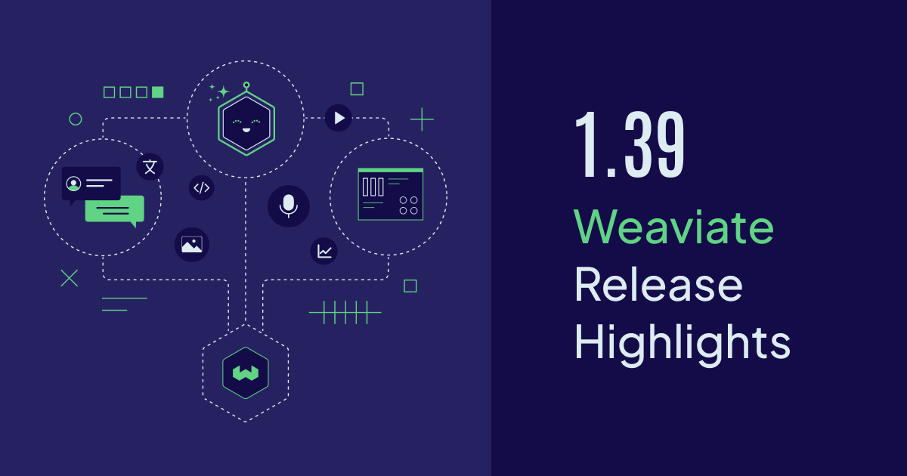

Weaviate `v1.39` is now available open-source and on [Weaviate Cloud](https://console.weaviate.cloud).

Two search features graduate to **general availability** in this release: the **Boost API** for query-time rescoring, and **MMR diversity selection**, which now covers hybrid search as well as vector search. Two new arrivals join them, **4-bit Rotational Quantization** as a preview and an experimental **Search REST API**. This post also covers **gRPC-Web**, which shipped quietly in the 1.38 line, and the **HNSW snapshot** rework, which cuts commit-log disk usage and makes startup faster and more predictable.

Here are the release highlights!



- [Boost API - General Availability](#boost-api---general-availability)
- [MMR Diversity Selection - General Availability](#mmr-diversity-selection---general-availability)
- [4-bit Rotational Quantization (Preview)](#4-bit-rotational-quantization-preview)
- [Search REST API (Experimental)](#search-rest-api-experimental)
- [gRPC-Web](#grpc-web)
- [HNSW Snapshots, Automatic - General Availability](#hnsw-snapshots-automatic---general-availability)
- [Performance Improvements and Fixes](#performance-improvements-and-fixes)
- [Community Contributions](#community-contributions)
- [Summary](#summary)

## Boost API - General Availability

The [Boost API](/blog/weaviate-1-38-release#boost-api-preview), introduced as a preview in `v1.38`, is now **generally available**.

Boost is a query-time rescorer. After the primary search fetches its candidates, Weaviate scores each one against your boost conditions and re-sorts the list. Unlike a filter, it never removes anything: an object that matches nothing is demoted, not dropped. That is the difference between "only show me in-stock products" and "prefer in-stock products, but still show me the perfect match that is out of stock".

#### How it works

A boost carries one to twenty conditions of four kinds:

- **`filter`** promotes results that satisfy a filter
- **`property_value`** ranks by a numeric property's value (`Boost.numeric_property` in the Python client)
- **`time_decay`** favors objects near a point in time
- **`numeric_decay`** favors objects near a target number

Two weights are in play. The outer `weight` (default `0.5`) blends the boost into the original relevance score as `(1 - weight) * primary + weight * boost`. Each condition also takes its own `weight` (default `1.0`), which **may be negative** if you want that condition to demote rather than promote. `depth` (default `100`, capped by `QUERY_MAXIMUM_RESULTS`) is how deep the primary search over-fetches before re-sorting.

Here is what that blending does to an actual result page. The same query runs twice against a small product catalog, once plain and once with a boost that prefers products in stock and recently released:

```python
from datetime import timedelta
from weaviate.classes.query import Boost, Filter

prefer_in_stock_and_recent = Boost.blend(
    [
        Boost.filter(Filter.by_property("in_stock").equal(True), weight=2.0),
        Boost.time_decay("released", scale=timedelta(days=30)),
    ],
    weight=0.3,   # 30% boost, 70% original relevance
    depth=200,    # re-score the top 200 candidates
)

for label, boost in (("plain hybrid", None), ("with boost", prefer_in_stock_and_recent)):
    response = collection.query.hybrid(query="wireless headphones", limit=4, boost=boost)
    print(label)
    for obj in response.objects:
        print("  ", obj.properties["title"], "| in stock:", obj.properties["in_stock"])
```

```text
plain hybrid
   Kestrel Wireless Headphones | in stock: True
   Meridian Wireless Headphones | in stock: False
   Aurora Wireless Headphones | in stock: False
   Nimbus Wireless Headphones | in stock: True
with boost
   Kestrel Wireless Headphones | in stock: True
   Nimbus Wireless Headphones | in stock: True
   Wireless Earbuds Pro | in stock: True
   Meridian Wireless Headphones | in stock: False
```

Nimbus, in stock and twelve days old, climbs from fourth to second, and the earbuds take third on the strength of being in stock and recent despite a weaker text match. The two out-of-stock listings lose ground: Meridian slides to fourth and Aurora falls past the end of the page. Neither was removed from the result set. The best keyword-and-vector match, Kestrel, still holds first place, because a `weight` of `0.3` leaves 70% of the score with the search itself. Raise it toward `1.0` and availability and freshness take over the ordering. Lower it toward `0.0` and you converge on the plain result.

Alongside `Boost.blend`, the client exposes `Boost.filter`, `Boost.time_decay`, `Boost.numeric_decay` and `Boost.numeric_property`, plus `Boost.Curve` for the shape of a decay and `Boost.Modifier` for numeric transforms.

Boost is available on `hybrid`, `bm25`, `near_text`, `near_vector`, `near_object`, `near_media` and `near_image`, in both the `.query.*` and `.generate.*` namespaces. It is not available on `fetch_objects`, which has no relevance score to blend with. Boost is **gRPC-only**, with no GraphQL and no REST equivalent.

:::note Boost runs before a reranker
If you combine `boost=` with `rerank=`, the [reranker](https://docs.weaviate.io/weaviate/search/rerank) runs afterwards and re-sorts the boosted page, so it gets the last word. Use one or the other unless you specifically want that layering.
:::

:::info Related resources

- [How-to: Search - Boost results](https://docs.weaviate.io/weaviate/search/boost)
- [How-to: Search - Blending and weights](https://docs.weaviate.io/weaviate/search/boost#blending-and-weights)

:::

## MMR Diversity Selection - General Availability

[Diversity selection with MMR](/blog/weaviate-1-37-release#diversity-search-with-mmr-preview), a preview since `v1.37`, is now **generally available**, and it now covers hybrid search alongside every `near_*` search.

Maximal Marginal Relevance (MMR) picks results one at a time. At each step it trades off two things: how well a candidate matches the query, and how different it is from what has already been picked. The effect is a first page that covers the topic instead of showing the same passage nine times. That matters most in [hybrid search](/blog/hybrid-search-explained), where the keyword leg and the vector leg tend to agree on the same cluster of near-identical chunks, so their fused top-10 is often the most redundant list in your system.

#### How it works

MMR is a single pass near the end of the query pipeline, after the legs have been fused and before the page is cut. A reranker, if you use one, runs after it:

```mermaid
flowchart LR
  Q["Hybrid query"] --> F["Fuse keyword + vector"]
  F --> A["Autocut"]
  A --> B["Boost"]
  B --> M["MMR"]
  M --> P["Paginate"]
  P --> R["Rerank (optional)"]
  style Q fill:#ffffff,stroke:#130C49,color:#130C49
  style F fill:#ffffff,stroke:#B9C8DF,color:#130C49
  style A fill:#ffffff,stroke:#B9C8DF,color:#130C49
  style B fill:#ffffff,stroke:#B9C8DF,color:#130C49
  style M fill:#ffffff,stroke:#130C49,color:#130C49
  style P fill:#ffffff,stroke:#B9C8DF,color:#130C49
  style R fill:#ffffff,stroke:#B9C8DF,color:#130C49
```



Two values configure it, and both are easy to read backwards.

**`balance`** is the relevance-versus-diversity dial, valid in `[0.0, 1.0]` inclusive. Anything outside that range is rejected with `MMR balance must be between 0 and 1`. At `1.0` you get **pure relevance**, reproducing the un-diversified ordering exactly. At `0.0` you get **pure diversity**. So **lower means more diverse**. The default is `0.0`, not `0.5`, which means an omitted `balance` is the most aggressive setting available. Always pass it explicitly.

**`limit`** on the MMR selection is the **page size**, the number of results you get back. The candidate pool it selects from is the query's own `limit`. It must be at least 1 and no larger than the query limit.

Here is the same query at three settings, over a set of documentation chunks in which four say roughly the same thing about carbon pricing:

```python
from weaviate.classes.query import Diversity

for balance in (1.0, 0.3, 0.0):
    response = collection.query.hybrid(
        query="carbon pricing",
        limit=8,                                                      # candidate pool
        diversity_selection=Diversity.mmr(limit=4, balance=balance),  # 4 returned
    )
    print(f"balance={balance}")
    for obj in response.objects:
        print("  ", obj.properties["title"])
```

```text
balance=1.0
   Carbon tax versus cap and trade
   Carbon pricing basics
   Carbon pricing FAQ
   What is a carbon price?
balance=0.3
   Carbon tax versus cap and trade
   Carbon pricing FAQ
   Carbon pricing basics
   Adaptation funding for coastal cities
balance=0.0
   Carbon tax versus cap and trade
   Methane rules for oil and gas
   Adaptation funding for coastal cities
   Renewable subsidies and grid buildout
```

At `1.0` the page is four ways of saying the same thing, which is exactly what the un-diversified query returns. At `0.3` one of the duplicates gives up its slot to a chunk on adaptation funding. At `0.0` relevance stops counting after the first pick, and a carbon-pricing query comes back with methane rules and grid buildout. That last one is the setting you inherit if you leave `balance` out.

This needs Python client **4.23.0** or newer, which is where `diversity_selection` arrives on `collection.query.hybrid` and `collection.generate.hybrid`. It is not available on `bm25`, which has no vectors to measure distance between, and it is not supported on multi-vector collections.

:::note Tune `balance` against your own data
Do not read `0.5` as a universal midpoint. On hybrid, the relevance term is a fused score normalized into `[0, 1]` while the diversity term is a raw distance in your collection's metric, so the two are not on one scale and the useful range is collection-dependent. Start at `1.0` to confirm you reproduce your current ordering, then walk `balance` down until the page stops repeating itself.
:::

:::info Related resources

- [How-to: Search - Diversity selection (MMR)](https://docs.weaviate.io/weaviate/search/similarity#diversity-selection-mmr)
- [Blog: Hybrid search explained](/blog/hybrid-search-explained)

:::

## 4-bit Rotational Quantization (Preview)

[Rotational quantization (RQ)](https://docs.weaviate.io/weaviate/concepts/vector-quantization#rotational-quantization) shrinks vectors by rotating them into a basis where the values spread evenly, then storing each dimension with a small integer code instead of a 32-bit float. Weaviate already ships 8-bit and 1-bit RQ. `v1.39` adds a **4-bit** width as a preview.

Four bits is a nibble, so two dimensions pack into one byte. At 1536 dimensions that is a 16-byte header plus 768 bytes of codes, **784 bytes per vector**, against 6144 bytes for raw `float32`. That is **7.84x** smaller, and the number is exact rather than a rounded "8x": the header does not disappear.

The general form is `16 + ceil(outputDim / 2)` bytes, where `outputDim = 64 * ceil(inputDim / 64)`, because the rotation rounds the dimensionality up to the next multiple of 64. At 1536 that round-up is free, since 1536 is 24 x 64. At 1000 dimensions it is not: you pay for 1024.

#### How it works

There is no environment variable and no preview flag. It is a plain schema value, `rq.bits = 4`, on a vector index:

```python
from weaviate.classes.config import Configure

client.collections.create(
    "Doc",
    vector_config=Configure.Vectors.text2vec_weaviate(
        name="default",
        source_properties=["title", "body"],
        vector_index_config=Configure.VectorIndex.hnsw(
            quantizer=Configure.VectorIndex.Quantizer.rq(
                bits=4,
                rescore_limit=100,   # set this explicitly, see below
            ),
        ),
    ),
)
```

`bits` is fixed when RQ is first enabled on a vector and cannot be changed afterwards. There is no migration from 8-bit codes to 4-bit codes, so plan the width at creation time.

:::caution Two things to know before you try it
- **4-bit is HNSW-only.** The flat index still rejects it with `RQ bits must be either 1 or 8`, and that applies to the flat leg of a dynamic index too. Use `bits: 4` on an HNSW index.
- **Set `rescoreLimit` explicitly.** Quantized search works by over-fetching candidates on the compressed codes and then re-scoring the top of that list against the uncompressed vectors. The per-width rescore default is keyed only on `bits == 1`, so `bits: 4` silently inherits the 8-bit default of 20 while the recall figures for 4-bit assume a much larger rescore window. Out of the box, 4-bit under-delivers its own recall. Set `rescore_limit` to at least your typical query `limit`.
:::

Like the other RQ widths, 4-bit works with the `cosine`, `dot` and `l2-squared` distance metrics.

:::caution Preview
The 4-bit width is a **preview** feature. Its behavior and defaults may change in future releases.
:::

:::info Related resources

- [Concepts: Vector quantization - Rotational quantization](https://docs.weaviate.io/weaviate/concepts/vector-quantization#rotational-quantization)
- [Concepts: Vector quantization - Rescoring](https://docs.weaviate.io/weaviate/concepts/vector-quantization#rescoring)
- [Config references: Vector index parameters](https://docs.weaviate.io/weaviate/config-refs/indexing/vector-index)

:::

## Search REST API (Experimental)

Weaviate searches over gRPC, which is fast but wants a generated client and HTTP/2, and over GraphQL, where you build a query string by hand and dig metadata out of `_additional`. Neither is pleasant from a shell script, a Lambda, an edge worker, an API gateway, or a language with no Weaviate client.

`v1.39` adds an **experimental Search REST API**: JSON in, JSON out, over plain HTTP/1.1, described by the OpenAPI spec like the rest of the REST surface. It is a good fit for LLM tool-calling, where a model needs to call a documented HTTP endpoint rather than link a client library.

This release ships exactly **one endpoint**: `POST /v1/search/{collection}/near-text`.

#### How it works

The endpoint is **off by default** and enabled per node:

```yaml
services:
  weaviate:
    image: cr.weaviate.io/semitechnologies/weaviate:1.39.0
    environment:
      EXPERIMENTAL_REST_SEARCH_ENABLED: 'true'
```

Accepted truthy values are `on`, `enabled`, `1` and `true`. When the feature is off the route is still mounted and answers `422` with a message telling you which variable to set, rather than a confusing `404`.

The request body is all camelCase. `query` is a **required array of strings**, so a single concept is a one-element array and several entries mean a multi-concept search. Alongside it you can send `certainty` or `distance` (they are mutually exclusive), `targetVector`, `where`, `limit`, `offset`, `autoLimit`, `returnProperties`, `returnMetadata`, `tenant` and `consistencyLevel`.

```bash
curl -s -X POST http://localhost:8080/v1/search/Movie/near-text \
  -H 'Content-Type: application/json' \
  -d '{"query":["spaceship galaxy"],"limit":3,
       "returnProperties":["title","hasAuthor.name"],
       "returnMetadata":["distance"]}'
```

The response is `{results, tookMs}`, and every hit is a flat envelope of `{id, properties, references, metadata}`:

```json
{
  "results": [
    {
      "id": "2aeb3309-33e7-4a8d-a8e2-6413b53890d8",
      "properties": { "title": "spaceship galaxy adventure" },
      "references": { "hasAuthor": [ { "name": "famous writer" } ] },
      "metadata": { "distance": 0.07182336 }
    }
  ],
  "tookMs": 2
}
```

`references` is omitted entirely when nothing selects across a reference, and `metadata` is omitted when you asked for nothing beyond the id. Vectors are never returned.

On errors you get the standard `{"error": [{"message": "..."}]}` body. One status code to plan for: when the embedding provider fails to vectorize your query, the endpoint answers **`502 Bad Gateway`**, not `500`, because the failure came from an upstream service.

:::caution Experimental means the shape can still change
This API is off by default and its request and response shape is not frozen. The most likely thing to move is reference selection: `v1.39` selects a referenced property with a one-hop dot path inside `returnProperties`, such as `"hasAuthor.name"`, and a successor design replaces that with a dedicated recursive selector. Expect to migrate anything you build on the dot-path syntax today.
:::

No official client wraps this endpoint yet. Every Weaviate client speaks gRPC for search, so `curl` or raw HTTP is the way in for now. Boost, MMR, reranking, generative search and group-by are not available over REST.

:::info Related resources

- [References: RESTful API](https://docs.weaviate.io/weaviate/api/rest)
- [How-to: Search - Similarity](https://docs.weaviate.io/weaviate/search/similarity)

:::

## gRPC-Web

Browsers cannot speak plain gRPC, which is why front-end code has never been able to call Weaviate's gRPC API directly. Weaviate serves a **gRPC-Web** interface over ordinary HTTP to close that gap. It arrived in `v1.38.3` and has not been covered in a release post until now.

The interface lives under the `/v1/grpc-web/` path prefix on the **same port as the REST API** (default `8080`). It is not on the gRPC port and not on a listener of its own, so there is no second port to open in a firewall or an ingress rule.

It is **enabled by default**. To turn it off, set the [runtime-configuration](https://docs.weaviate.io/deploy/configuration/env-vars/runtime-config) key `grpc_web_enabled` to `false`. Note the snake_case, and note that this key has no environment-variable equivalent. The change takes effect without a restart. While the interface is disabled, requests to `/v1/grpc-web/` fall through to the REST handler, so the rest of the REST API keeps working.

One caveat before you plan around it: the Weaviate client libraries all connect over plain gRPC today, so none of them uses this interface yet.

:::info Related resources

- [References: gRPC API - gRPC-Web](https://docs.weaviate.io/weaviate/api/grpc#grpc-web)

:::

## HNSW Snapshots, Automatic - General Availability

An HNSW index is rebuilt on startup by replaying its commit log, the append-only write-ahead log that records every change to the graph. A *snapshot* is a compacted image of that graph, so startup can load one file instead of replaying millions of records. Until now the snapshot was an optional cache: you scheduled it with a handful of environment variables, and the log it summarized stayed on disk forever. You paid for the same graph twice.

In `v1.39` snapshots are automatic and **generally available**. A background compactor owns the whole on-disk lifecycle and **deletes every commit log a snapshot covers** once that snapshot is durably written. What you get:

- **Less disk.** What remains is the snapshot plus the writes made since it, instead of the snapshot plus the full history. On vector-heavy clusters that is the bulk of the win.
- **Faster, steadier startup.** Loading a compacted graph is predictable in a way that replaying a log that only ever grows is not.
- **Nothing to tune.** The compactor reads no environment variables at all. Its merge width and snapshot threshold are fixed defaults.

Two qualifications on the disk story. The compactor lives inside a shard's commit logger, so it only runs on **loaded** shards, and cold tenants shrink when they are next activated. And disk usage goes **up** while a snapshot is being written, because the new snapshot is staged before the old inputs are removed. Keep your existing headroom guidance.

Five settings that used to control snapshotting are now accepted-but-ignored **no-ops**, and will be removed in a future version:

```text
PERSISTENCE_HNSW_DISABLE_SNAPSHOTS
PERSISTENCE_HNSW_SNAPSHOT_INTERVAL_SECONDS
PERSISTENCE_HNSW_SNAPSHOT_ON_STARTUP
PERSISTENCE_HNSW_SNAPSHOT_MIN_DELTA_COMMITLOGS_NUMBER
PERSISTENCE_HNSW_SNAPSHOT_MIN_DELTA_COMMITLOGS_SIZE_PERCENTAGE
```

Setting any of them logs a one-line warning at startup rather than failing, so an upgrade will not break on a stale config file. Delete them at your convenience. One HNSW persistence knob survives: [`PERSISTENCE_HNSW_MAX_LOG_SIZE`](https://docs.weaviate.io/deploy/configuration/env-vars#PERSISTENCE_HNSW_MAX_LOG_SIZE) (default `500MiB`) is the write-ahead-log rotation size, not a snapshot control, and it still applies.

:::caution Know this before you upgrade
Making snapshots load-bearing also makes them a single point of failure, and the failure mode changed.

- **An unreadable snapshot is fatal.** Previously a snapshot that failed its checksum was discarded and Weaviate replayed the full commit log instead. In `v1.39` there is no fallback, and the commit logs that snapshot covered are already gone. The blast radius is the whole **shard**, not one vector index, because a single bad named vector aborts the shard's initialization. Under the default lazy shard loading the node stays up and the affected shard returns an error to callers. Under eager loading, startup fails. The remedy is [restoring from a backup](https://docs.weaviate.io/deploy/configuration/backups#restore-backup), which includes the commit-log directory and its snapshot.
- **A legacy V1 or V2 snapshot is a hard upgrade failure.** On first start, `v1.39` migrates an existing snapshot into the new layout. A V3 snapshot is moved byte for byte. Anything older is refused at startup with an error telling you to downgrade and either delete the snapshot so it regenerates, or run a compaction cycle to produce a V3 snapshot before upgrading.

Neither of these is a reason to skip the release. They are reasons to have a current backup before you take it.
:::

:::info Related resources

- [Concepts: Storage - HNSW snapshots](https://docs.weaviate.io/weaviate/concepts/storage#hnsw-snapshots)
- [Environment variables: `PERSISTENCE_HNSW_MAX_LOG_SIZE`](https://docs.weaviate.io/deploy/configuration/env-vars#PERSISTENCE_HNSW_MAX_LOG_SIZE)

:::

## Performance Improvements and Fixes

Beyond the headline features, `v1.39` ships a long list of improvements. A few worth calling out:

- **Faster keyword search:** a sustained round of work on the BM25 and BlockMax WAND hot path, including faster varint decoding, fewer allocations in the scoring loop, deferred tombstone checks and parallel per-property setup, all of which shows up as lower keyword-query latency. The 1.38 line also added an opt-in cross-property `AND` operator, so a multi-term query can require that every term appears somewhere on the object instead of all within one property.
- **Async replication:** background repair is cheaper and more correct. Buffers are reused rather than reallocated per cycle, and a batched hashtree-root pre-filter keeps many-tenant clusters from re-scanning work they have already reconciled. Fixes cover goroutine leaks on tenant shutdown, tombstones coming back during an init scan, and a time-based repair overwriting a newer local write.
- **HFresh optimizations:** lower memory use, fewer disk writes and allocations, a higher `searchProbe` default, plus fixes for a quantizer-initialization race and vector normalization during reassign.
- **Backup reliability:** the number of files deduplicated in incremental backups is now configurable, restores no longer load lazy-loaded shards, Azure listing avoids a full object scan, and several halt-for-transfer races are resolved.
- **Replica-movement hardening:** replica movement now uses hard links so it no longer halts compaction, certain schema mutations are forbidden while a movement is in flight, and `HaltForTransfer` overlap during concurrent copy operations is fixed.
- **Sub-millisecond latency buckets:** the HTTP and gRPC request-duration histograms gained boundaries down to 100µs, so fast queries no longer collapse into a single bucket.
- **Batch delete returns 422:** a batch delete with missing match fields now answers `422 Unprocessable Entity` instead of `500`.

:::info Related resources

- [Weaviate 1.39: GitHub Release Notes](https://github.com/weaviate/weaviate/releases/tag/v1.39.0)

:::

## Community Contributions

Weaviate is open source, and this release includes work from five first-time contributors. Thank you to:

- [@hashkanna](https://github.com/hashkanna): location configuration for the `text2vec-google` module ([#8418](https://github.com/weaviate/weaviate/pull/8418))
- [@vjsai](https://github.com/vjsai): rejecting a negative `desiredCount` in sharding configuration ([#11824](https://github.com/weaviate/weaviate/pull/11824))
- [@Joe-Weaviate](https://github.com/Joe-Weaviate): using `automaxprocs` to set `GOMAXPROCS`, adding cgroup v2 support ([#11918](https://github.com/weaviate/weaviate/pull/11918))
- [@VihaanAgarwal](https://github.com/VihaanAgarwal): a fix to the object write path on collections with named vectors ([#11919](https://github.com/weaviate/weaviate/pull/11919))
- [@apoorva-01](https://github.com/apoorva-01): returning `422` for a batch delete with missing match fields ([#12049](https://github.com/weaviate/weaviate/pull/12049))

If you'd like to contribute, check out the [contributor guide](https://docs.weaviate.io/contributor-guide/) and the [`good-first-issue`](https://github.com/weaviate/weaviate/issues) label on GitHub.

## Summary

Weaviate `v1.39` promotes two search features to general availability, previews a third, and makes HNSW snapshots automatic.

**Key highlights:**

- **Boost API (GA)**: query-time rescoring that promotes or demotes results without dropping any, across hybrid, keyword and vector searches
- **MMR Diversity Selection (GA)**: diversity selection on hybrid and `near_*` searches, so page one covers the topic instead of repeating it
- **4-bit Rotational Quantization (Preview)**: a third RQ width at 784 bytes per 1536-dimension vector, 7.84x smaller than raw `float32`, on HNSW indexes
- **Search REST API (Experimental)**: `POST /v1/search/{collection}/near-text`, JSON in and JSON out over HTTP/1.1, off by default
- **gRPC-Web**: the gRPC API reachable from a browser over ordinary HTTP, on the REST port, enabled by default since `v1.38.3`
- **HNSW Snapshots, Automatic (GA)**: less disk spent on commit logs, faster and steadier startup, five tuning knobs retired and nothing left to schedule

**Ready to get started?**

The release is available open-source on [GitHub](https://github.com/weaviate/weaviate/releases/tag/v1.39.0) and on [Weaviate Cloud](https://console.weaviate.cloud/), where you can spin up a cluster on the free tier.

:::note
Not all features may be available on Weaviate Cloud. Some capabilities, preview and experimental features in particular, and those that require specific environment configuration, may not be enabled on managed clusters, or may become available on a different schedule.
:::

For those upgrading a self-hosted version, please check the [migration guide](https://docs.weaviate.io/deploy/migration#general-upgrade-instructions) for version-specific notes, and read the HNSW snapshot caution above before you upgrade a cluster carrying a pre-existing snapshot.

Thanks for reading, and happy vector searching!
