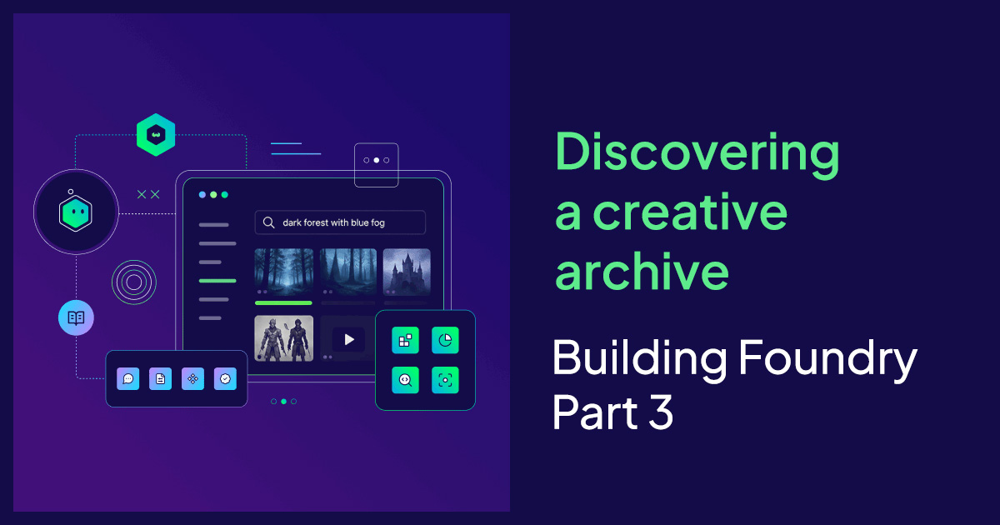
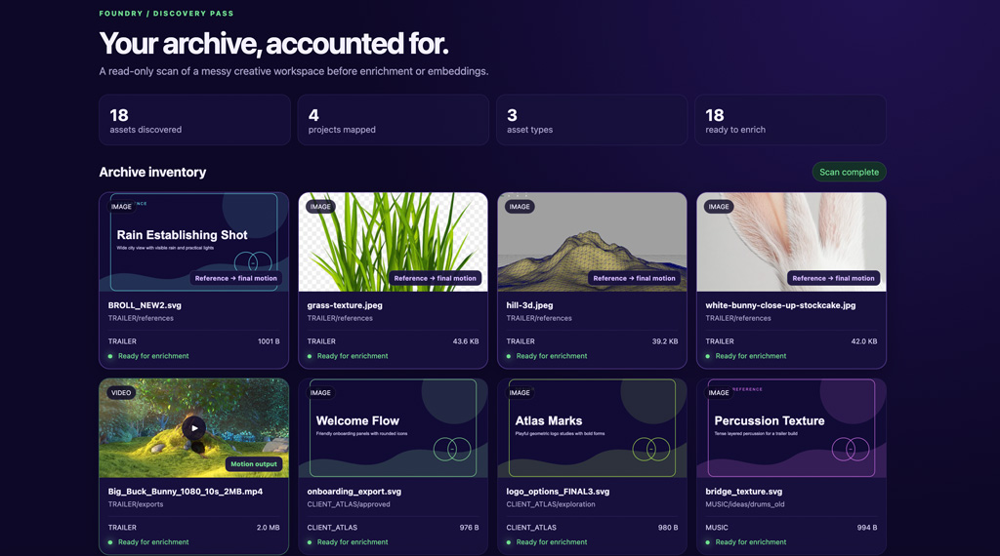

> **Building Foundry**  
> A practical series on creative workflows, semantic search, and Weaviate.
> Episode 3: Discovering the archive

Read the previous post in the series: [Part 2: Where creative workflows break](/blog/building-foundry-where-workflows-break).

Part 1 explored why creative teams lose time searching for work that already exists. Part 2 looked at the mechanics behind that problem: folder structures drift, tags decay, and keyword search depends on people remembering language they may never have used in the first place.

Now we can begin building.

The first version of Foundry does not generate embeddings or run semantic search. It starts with a less glamorous but more important question: **what is actually in the archive?**

That question became our first working prototype: a read-only discovery pass that scans a creative folder, identifies its contents, creates a structured manifest, and presents the result as a visual inventory. It is the foundation on which enrichment and retrieval will be built.

---

## The asset you remember but cannot name

Imagine you are six months into production and need a concept image from an earlier review. You remember its cold palette, the blue atmospheric fog, and a ruined structure near the centre of the frame. You may even remember who presented it. What you cannot remember is whether it was saved under the active project, an old exploration folder, or an export directory with a name such as `final_FINAL_v7`.

Traditional search cannot do much with that memory. Semantic search eventually can, but only after the asset has been discovered and represented in a searchable system. Before Foundry can understand the image, it needs to establish that the image exists, where it lives, what kind of file it is, and whether it has changed since the previous scan.

This is the purpose of the discovery pass.

---

## Meet Foundry



Foundry is a small creative-retrieval prototype that we are developing throughout this series. It is designed to sit above existing storage rather than replace it. A studio should not have to migrate years of work or reorganise every historical project before retrieval becomes useful.

The current prototype points at an existing folder and builds an inventory without renaming, moving, or modifying any source files. Our test archive deliberately resembles the kind of production drive discussed in the previous articles. It contains several fictional projects, inconsistently named concept images, trailer references, design exports, production notes, and video.

Some filenames are descriptive. Others are not:

```text
final_FINAL_v7.svg
ENV_ALTSTYLING_DARK_V4.svg
BROLL_NEW2.svg
scene_14_USE_THIS.svg
review_notes_final.md
```

That inconsistency is intentional. A useful retrieval system must tolerate the archive a team already has, rather than the archive it wishes it had.

---

## Running the first prototype

The complete discovery demo currently runs with one command:

```bash
npm run demo
```

Foundry scans the configured archive, generates a JSON manifest and opens a local visual report. The opening sequence shows the stages of discovery: walking folders, identifying media and production metadata, and assembling the manifest. The completed view then shows each asset with its project, folder, type, size, and ingestion status.

Images appear as visual cards. Videos can be previewed directly. Documents remain visible even when they do not yet have a graphical preview. This matters because a creative archive is rarely composed of a single media type. The concept art may be an image, the rationale may be buried in a document, and the final expression of the idea may be a video export.

<!-- Add screenshot: Foundry discovery loading state. -->

<!-- Add screenshot: Completed archive inventory with reference images and video output. -->

The browser report is not the search product. It is an inspection surface: a way to confirm that Foundry has seen the same archive we expect it to see before any automated interpretation begins.

---

## What the scanner records

The scanner recursively walks the selected directory and creates one record for every supported asset. The initial schema focuses on observable facts:

```text
filename
relative path
source location
file extension
MIME type
asset type
project
folder
file size
modified date
content hash
```

It also creates placeholders for information that will arrive later, including generated descriptions, extracted text, tags, rights information, and enrichment status.

A simplified manifest record looks like this:

```json
{
  "id": "1f020c98de36e792a4f82061",
  "fileName": "final_FINAL_v7.svg",
  "relativePath": "NIGHTFALL/01_CONCEPT/forest/final_FINAL_v7.svg",
  "mimeType": "image/svg+xml",
  "assetType": "image",
  "project": "NIGHTFALL",
  "folderPath": "NIGHTFALL/01_CONCEPT/forest",
  "contentHash": "1f020c98de36e792a4f820616c4fbcf0...",
  "enrichment": {
    "status": "pending",
    "description": null,
    "tags": [],
    "extractedText": null
  },
  "rights": {
    "status": "unknown",
    "expiresAt": null
  }
}
```

The empty fields are useful. They make uncertainty explicit. Foundry does not infer that an asset is licensed merely because it exists, and it does not claim to understand an image before the enrichment stage has run.

---

## Why hashes and stable records matter

A folder scanner can easily produce a list of filenames. A retrieval pipeline needs something more dependable.

Foundry generates a content hash for each file and derives a stable identifier from it. If the same unchanged asset appears in a later scan, it retains the same identity. If the contents change while the filename stays the same, the new hash exposes that change.

This distinction is particularly important in creative production, where filenames are frequently copied between versions or where a supposedly final export is overwritten. A stable inventory gives later pipeline stages a way to avoid unnecessary enrichment calls, update changed records, and identify possible duplicates across different folders.

The scanner remains read-only throughout this process. Source files are not reorganised for the convenience of the demo. Foundry adapts to the production archive, not the other way around.

---

## From isolated files to creative relationships

The current showcase includes the beginning of another useful idea: assets should not always be presented as unrelated objects.

In the sample trailer project, reference images are visually highlighted alongside a motion output. Today that relationship is inferred from the project and folder structure. Later, it could be strengthened using shared metadata, visual similarity, production history, or explicit links created by the team.

This begins to answer a richer question than “Which files are in this folder?” A future version of Foundry should be able to show how a group of references informed an output, which concepts preceded an approved design, or which project notes explain a creative decision.

Discovery therefore establishes two foundations. It identifies individual assets, and it provides the evidence from which relationships between those assets can eventually be built.

---

## Why discovery comes before AI

It is tempting to start a retrieval prototype with an embedding model and a search box. That approach can produce an impressive demonstration quickly, but it hides the operational questions that determine whether the system will remain useful.

Has every source been scanned? Which formats were skipped? Has an asset changed since it was enriched? Does the record point back to a source the user can still access? Is rights information known, missing, or expired? If ingestion fails, can the team identify which records were affected?

The manifest gives us a boundary between the creative archive and the AI pipeline. The scanner is responsible for observable file facts. Enrichment will be responsible for derived descriptions and extracted content. Weaviate will be responsible for storing and retrieving the searchable representation. Keeping those responsibilities visible makes the prototype easier to inspect, test, and improve.

---

## What Foundry does today

At this point in the build, Foundry can:

- scan a nested creative archive without modifying it;
- recognise images, video, audio, documents, design files, and scene files;
- generate stable asset records and content hashes;
- organise the inventory by project and source folder;
- preview supported images and videos in a browser;
- expose enrichment and rights fields that still require attention;
- produce a JSON manifest ready for the next pipeline stage; and
- begin surfacing relationships between creative references and outputs.

It does not yet describe the visual content, extract document meaning, generate embeddings, ingest records into Weaviate, or answer semantic queries. Those limitations are deliberate. This episode records the first completed layer rather than presenting the planned architecture as though it already exists.

---

## The next build: enrichment and ingestion

The completed discovery view ends with a “Prepare to ingest” action. For now, that action marks the boundary of the prototype. The next stage will make it functional.

We will take the records produced by the scanner and enrich them according to media type. Images can receive descriptions and visual tags. Documents can contribute extracted text. Video can be represented through transcripts, sampled keyframes, and scene-level descriptions. Existing project and rights metadata can be preserved as structured fields rather than folded into generated prose.

Those enriched records can then be batch-ingested into Weaviate. Their descriptions and extracted content will support semantic retrieval, filenames will remain available to keyword search, and structured metadata will support filters for project, file type, status, and rights.

The resulting flow will look like this:

```text
Creative archive
      ↓
Read-only discovery scan
      ↓
Reviewable manifest
      ↓
Media-specific enrichment
      ↓
Weaviate ingestion
      ↓
Hybrid search and metadata filters
```

Foundry does not understand the archive yet. It now knows what exists, where it came from, and what still needs to happen before the archive becomes searchable by meaning. That is a modest milestone, but it is also the point at which the idea becomes a working system.

---

import WhatsNext from "/_includes/what-next.mdx";

<WhatsNext />
