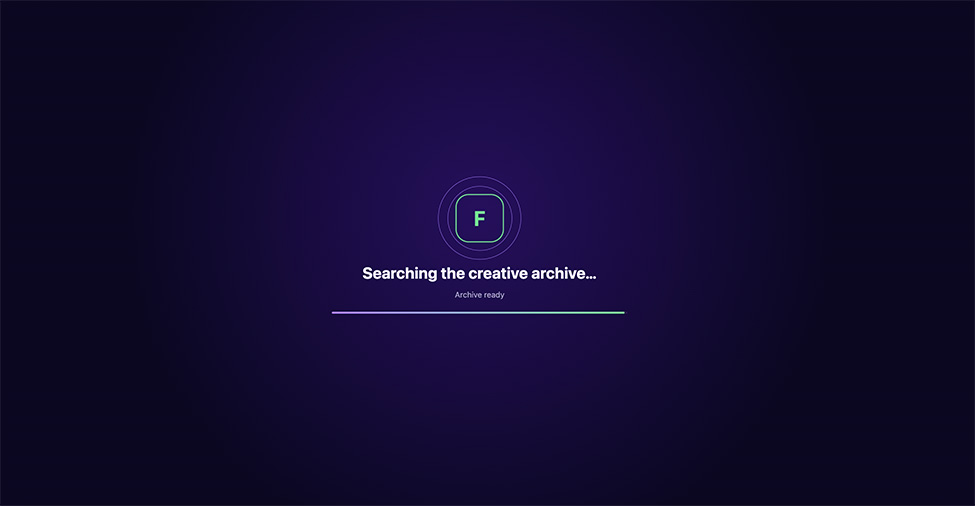
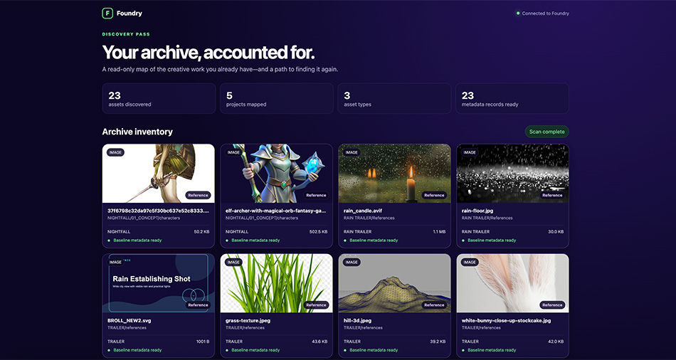
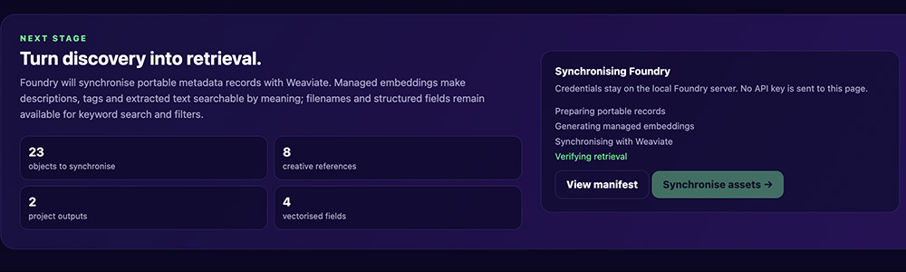
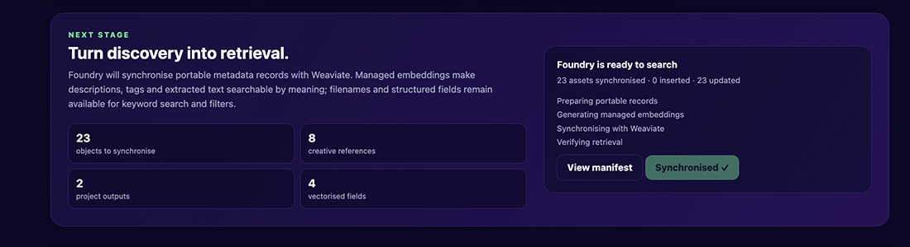
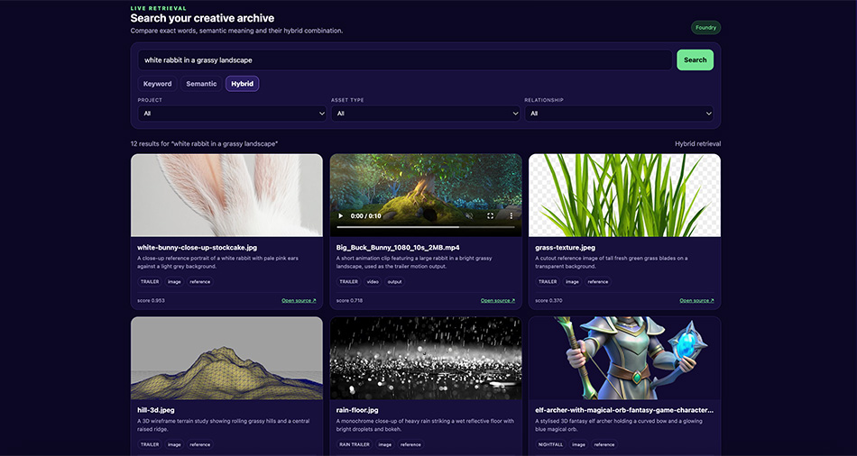
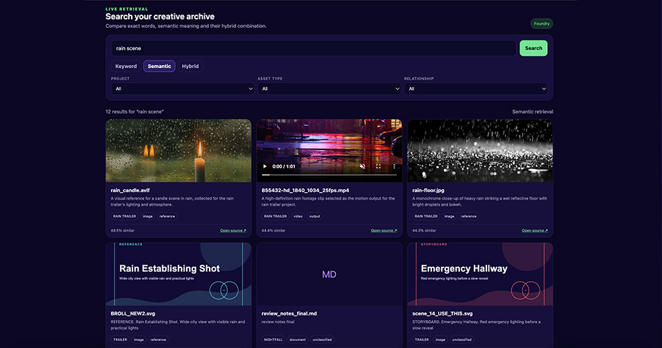
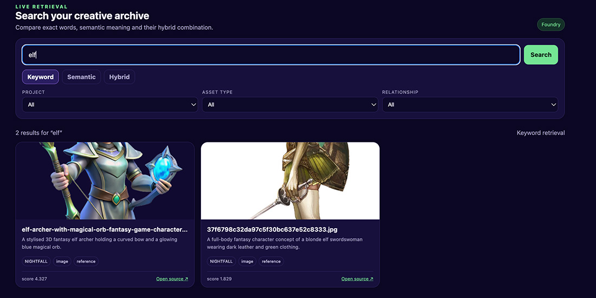

> **Building Foundry**  
> Episode 4: From archive discovery to creative search

Part 1 introduced the problem: creative teams lose time looking for work that already exists. Part 2 examined why folders, tags, and keyword search become unreliable as projects grow. Part 3 built the first layer of Foundry, a read-only scanner that maps a messy archive into a reviewable manifest.

This is where that manifest becomes useful.

In this episode, we take the records produced by Foundry, prepare them for ingestion, synchronise them with a Weaviate Cloud collection, and search the archive using keyword, semantic, and hybrid retrieval. The result is still a prototype, but it is now a complete loop that can be inspected from the source folder to the returned asset.

## The goal is a trustworthy loop

Foundry is deliberately built as a layer above existing storage. The original files remain in their folders. The application does not rename them, move them, or upload the raw archive into Weaviate. Instead, it creates a portable representation of each asset:

```text
source folder
      ↓
read-only scanner
      ↓
manifest.json
      ↓
metadata and descriptions
      ↓
Weaviate collection
      ↓
keyword, semantic, or hybrid search
      ↓
source asset
```

That separation matters. Storage remains the source of truth, while Weaviate becomes the searchable layer on top of it.

## Starting with a messy archive

The test archive includes five fictional projects and several types of creative material: concept art, references, SVG design exports, a production note, and trailer video. Some files have useful names; others have names that only make sense to the person who created them.

```text
TRAILER/exports/Big_Buck_Bunny_1080_10s_2MB.mp4
TRAILER/references/BROLL_NEW2.svg
TRAILER/references/white-bunny-close-up-stockcake.jpg
RAIN TRAILER/References/rain-floor.jpg
NIGHTFALL/01_CONCEPT/forest/final_FINAL_v7.svg
NIGHTFALL/01_CONCEPT/characters/charB_old_USETHIS.svg
CLIENT_ATLAS/exploration/logo_options_FINAL3.svg
MUSIC/ideas/drums_old/bridge_texture.svg
```

The point is not to create a perfect dataset. It is to test whether retrieval can work with the archive a creative team actually has.

## Step 1: discovery becomes a reviewable inventory

Running the local demo starts with the same scanner introduced in Part 3:

```bash
npm install
npm run demo
```

Foundry walks the archive, identifies supported files, calculates stable content hashes, and writes a manifest to `output/manifest.json`. The browser view makes that result inspectable before anything is synchronised.



The current test run discovers 23 assets across five projects. The inventory keeps the source path, project, file type, size, modified date, and relationship role visible. Images are previewable, videos can be played, and documents remain represented even when they do not have a visual thumbnail.

This is a useful checkpoint: if the archive is wrong here, a search interface cannot make it right later.

## Step 2: prepare records for ingestion

The scanner records facts that can be observed directly from the filesystem. The preparation step adds the context required for retrieval: descriptions, tags, extracted text, relationship roles, and a portable source URI.

A prepared object looks like this:

```json
{
  "fileName": "rain-floor.jpg",
  "relativePath": "RAIN TRAILER/References/rain-floor.jpg",
  "project": "RAIN TRAILER",
  "assetType": "image",
  "relationshipRole": "reference",
  "description": "A monochrome close-up of heavy rain striking a reflective floor with bright droplets and bokeh.",
  "tags": ["rain", "wet floor", "reflection", "atmosphere"],
  "sourceUri": "foundry://RAIN TRAILER/References/rain-floor.jpg"
}
```

The `foundry://` URI is intentional. It gives the indexed record a stable pointer without pretending that Weaviate is the file store. In a production system, that pointer could become an S3 URL, DAM link, mounted path, or application route.

The prepared records are written to:

```text
output/weaviate-import.json
```

:::info
The current demo uses a small enrichment manifest so the workflow is repeatable. The next iteration can replace those overrides with image captioning, OCR, transcript extraction, and keyframe descriptions while keeping the same object shape.
:::

## Step 3: synchronise with Weaviate

The local interface keeps the cloud credentials on the server and exposes a single synchronisation action. The review panel shows exactly what is about to be sent:



When synchronisation starts, Foundry prepares the records, generates managed embeddings through the Weaviate vectorizer, writes the objects to the `Foundry` collection, and verifies that retrieval is available.



The current collection stores 23 objects. Each object keeps descriptive text for semantic retrieval alongside structured fields such as project, asset type, relationship role, rights status, and source path. Re-running the sync is safe: unchanged records are replaced deterministically rather than duplicated.

For a command-line run, the same operation is available without the browser:

```bash
npm run scan
npm run ingest:prepare
npm run ingest:cloud
```

The cloud connection is configured through environment variables. Keep `.env` local and commit only the example file:

```text
WEAVIATE_URL=https://your-cluster.weaviate.network
WEAVIATE_API_KEY=replace-with-a-read-write-api-key
WEAVIATE_COLLECTION=Foundry
```

## Step 4: search by intent

Once the objects are synchronised, the browser becomes a live retrieval workspace. The first query asks for something that is easy to describe but not necessarily easy to name:

```text
white rabbit in a grassy landscape
```



The hybrid result set brings together a close-up rabbit reference, the Big Buck Bunny trailer output, and related grass imagery. The video is not treated as an undifferentiated blob in the interface: it remains a video asset with a source link and can be previewed directly.

This is the important shift from the first three episodes. The user does not need to remember `Big_Buck_Bunny_1080_10s_2MB.mp4`. They can describe the creative idea and then inspect the files that support it.

## Comparing retrieval modes

Foundry exposes three modes so the differences remain visible:

```text
keyword  → exact words and phrases
semantic → meaning represented by embeddings
hybrid   → keyword and semantic signals combined
```

For example, a semantic query for `rain scene` retrieves a candle reference, the rain trailer output, and a monochrome rain-floor image even though the wording is not identical across every record.



Keyword search still has an important role. If a user remembers an exact production term, filename fragment, or character name, lexical matching is often the strongest signal.



The purpose of hybrid search is not to declare one mode universally better. It gives the interface enough evidence to handle both kinds of memory: exact recall when the words are known, and meaning-based recall when the user remembers the asset rather than its label.

## Metadata keeps retrieval production-safe

Semantic similarity is useful, but it should not be the only constraint in a real studio. Foundry also supports filters for project, asset type, and relationship role. A future version can extend those filters to approval status, rights, expiry date, engine version, or delivery format.

That distinction gives us a practical retrieval model:

```text
semantic similarity  → find things that mean the same thing
keyword matching     → preserve exact names and identifiers
metadata filters     → enforce production constraints
source URI           → make the result actionable
```

The result is not magic folder search. It is a searchable index with enough context to return a relevant asset and explain where it came from.

## What the prototype proves

The current Foundry build demonstrates the complete path:

- a messy nested archive can be scanned without modifying source files;
- records can be enriched before ingestion rather than relying on filenames alone;
- Weaviate can store the searchable representation and managed embeddings;
- keyword, semantic, and hybrid retrieval can be compared on the same archive;
- images and video can be returned together as creative results; and
- metadata and source pointers keep results useful beyond the search ranking itself.

There is still important work ahead. Automatic multimodal enrichment, incremental rescans, rights-aware filtering, stronger relationship modelling, and relevance feedback all belong in the next build. The difference is that those improvements now have a working surface to attach to.

## Run the prototype yourself

From the Foundry repository:

```bash
cp .env.example .env
# Add your Weaviate Cloud URL and API key to .env

npm install
npm run demo
```

To use the cloud synchronisation button or live search, run Node.js 22 or newer and configure the Weaviate environment variables. The local report can still be used as a discovery-only view without cloud credentials.

The complete project is now available on [GitHub](https://github.com/Shan-Weaviate/foundry), so readers can inspect the scanner, enrichment manifest, Weaviate schema, import flow, and search interface together.

:::tip
Explore the [Foundry repository](https://github.com/Shan-Weaviate/foundry), then follow the README to run the local archive scan or connect the prototype to a Weaviate Cloud collection.
:::

## What comes next

The code is now available for others to inspect, run, and extend.
Foundry has moved from a concept into a working retrieval loop. The next stage is to make the loop more automatic: scan a folder, generate media-specific metadata, ingest only changed records, and let creative teams search the archive without preparing a hand-written enrichment file.

That is the longer-term promise of this project. The goal is not to replace the folders where creative work lives. It is to make the work inside those folders discoverable again.

import WhatsNext from "/_includes/what-next.mdx";

<WhatsNext />
