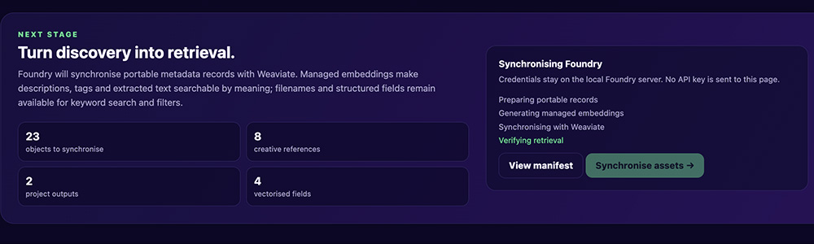

import foundryTestVideo from "./img/Foundry_test.mp4";

<figure>
  <video width="100%" autoPlay loop muted controls>
    <source src={foundryTestVideo} type="video/mp4" />
    Your browser does not support the video tag.
  </video>
  <figcaption>Foundry searching the creative archive</figcaption>
</figure>

> **Building Foundry**  
> A practical series on creative workflows, semantic search, and Weaviate.

Read the previous post in the series: [Part 2: Where creative workflows break](/blog/building-foundry-where-workflows-break).

Part 1 introduced the problem. Creative teams lose time searching for work that already exists. Part 2 showed why folders, tags, and keyword search become less reliable as projects grow.

Now we can build the full retrieval loop.

Foundry scans an existing archive and creates a stable manifest. It prepares each record for search and synchronises the result with Weaviate. The original files stay in place. The searchable layer points back to them.

```text
creative archive
      ↓
read-only scanner
      ↓
manifest and descriptions
      ↓
Weaviate collection
      ↓
keyword, semantic, or hybrid search
      ↓
source asset
```

## Starting with the archive we already have

The test archive contains 23 assets across five fictional projects. It includes concept art, design exports, reference images, production notes, audio references, and video.

The names are deliberately inconsistent:

```text
final_FINAL_v7.svg
BROLL_NEW2.svg
scene_14_USE_THIS.svg
logo_options_FINAL3.svg
bridge_texture.svg
```

This is the point of the test. Foundry should work with an active archive. It should not require a clean-up project before search becomes useful.

## Step 1: scan without changing the source

The first stage is a read-only discovery pass. Foundry walks the selected folder and records facts about every supported file.

```bash
npm install
npm run demo
```

The scanner captures the source path, project, file type, size, modified date, and a content hash. It writes the result to `output/manifest.json`.


The content hash gives each asset a stable identity. Foundry can detect a changed file even when its name stays the same. It can also avoid repeating work for records that have not changed.

The browser view makes the manifest easy to inspect. Images have previews. Videos can be played. Documents remain visible even when they do not have a thumbnail.

This checkpoint matters. Search cannot repair an incomplete inventory.

## Step 2: prepare records for retrieval

The manifest begins with facts from the filesystem. Search needs more context.

The preparation stage adds descriptions, tags, extracted text, relationship roles, and a stable source URI. A prepared image record looks like this:

```json
{
  "fileName": "rain-floor.jpg",
  "relativePath": "RAIN TRAILER/References/rain-floor.jpg",
  "project": "RAIN TRAILER",
  "assetType": "image",
  "relationshipRole": "reference",
  "description": "Heavy rain striking a reflective floor with bright droplets and bokeh.",
  "tags": ["rain", "wet floor", "reflection", "atmosphere"],
  "sourceUri": "foundry://RAIN TRAILER/References/rain-floor.jpg"
}
```

The `foundry://` URI points back to the asset without treating Weaviate as file storage. A production version could use a DAM link, mounted path, S3 URL, or application route.

The current demo uses a small enrichment manifest so each run is repeatable. Later versions can generate this context with image captioning, OCR, transcripts, and video keyframes.

## Step 3: synchronise with Weaviate

Foundry shows the prepared records before synchronisation. This gives the user a chance to review what will be indexed.



The application then creates or updates the `Foundry` collection. Weaviate generates managed embeddings and stores them beside the structured metadata. Each object retains its source path and rights status.


Re-running the process does not create duplicate assets. Records use deterministic identifiers so an unchanged asset replaces the same object.

The same workflow is available from the command line:

```bash
npm run scan
npm run ingest:prepare
npm run ingest:cloud
```

Cloud credentials stay in a local `.env` file:

```text
WEAVIATE_URL=https://your-cluster.weaviate.network
WEAVIATE_API_KEY=replace-with-a-read-write-api-key
WEAVIATE_COLLECTION=Foundry
```

## Step 4: search the archive

Once synchronisation finishes the browser becomes a live search workspace.

The first test query is easy to describe but hard to map to a filename:

```text
white rabbit in a grassy landscape
```


The results include a rabbit reference, the Big Buck Bunny trailer, and related landscape imagery. The user does not need to remember the video filename. They can describe the idea and inspect the assets that support it.

Foundry exposes three retrieval modes:

```text
keyword  → exact words and names
semantic → meaning represented by embeddings
hybrid   → keyword and semantic signals combined
```

Keyword search is useful when someone remembers a filename or production term. Semantic search helps when they remember the content instead. Hybrid search supports both kinds of memory in one result set.

Metadata filters keep those results practical. A user can limit results by project, file type, or relationship role. The same approach can later support approval status, rights, expiry date, or delivery format.

## What the build proves

The current prototype completes the path from source folder to returned asset:

- It scans a nested archive without changing the source files.
- It creates stable records and detects changes with content hashes.
- It enriches records before ingestion instead of relying on filenames alone.
- It stores searchable records and managed embeddings in Weaviate.
- It compares keyword, semantic, and hybrid retrieval on the same archive.
- It returns images and video with links back to their source.

Foundry is still a prototype. Automatic enrichment, incremental rescans, rights-aware filtering, and relevance feedback remain future work. The important change is that these features now have a working retrieval loop to build on.

## Run Foundry

The project is available on [GitHub](https://github.com/Shan-Weaviate/foundry).

```bash
cp .env.example .env
# Add your Weaviate Cloud URL and API key

npm install
npm run demo
```

Use Node.js 22 or newer for cloud synchronisation and live search. The local inventory can run without cloud credentials.

:::tip
Explore the [Foundry repository](https://github.com/Shan-Weaviate/foundry) and follow the README to scan the sample archive or connect your own Weaviate Cloud collection.
:::

## From hidden files to useful history

Foundry began with a common frustration. Someone knows an asset exists but cannot remember its name or location.

The solution does not replace the folders where creative work lives. It adds a searchable layer above them. That layer helps teams rediscover old work and reuse it with more confidence.

import WhatsNext from "/_includes/what-next.mdx";

<WhatsNext />
