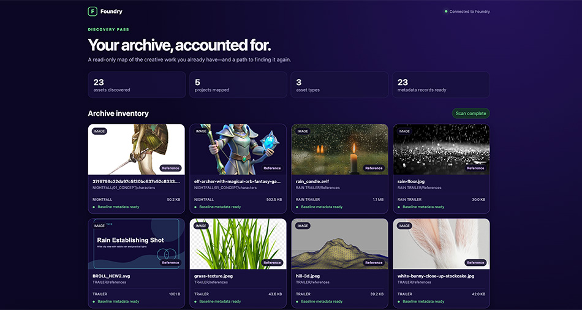

import foundryTestVideo from "./img/Foundry_test.mp4";

<figure>
  <video width="100%" autoPlay loop muted controls>
    <source src={foundryTestVideo} type="video/mp4" />
    Your browser does not support the video tag.
  </video>
  <figcaption>Foundry searching the creative archive</figcaption>
</figure>

> **Building Foundry**  
> A practical series on creative workflows, semantic search, and Weaviate.

Read the previous post in the series: [Part 2: Where creative workflows break](/blog/building-foundry-where-workflows-break).

Part 1 introduced the problem. Part 2 showed why familiar ways of organising work become less reliable as an archive grows. Now we are going to build the solution.

Foundry turns an existing archive into a searchable creative library. It scans the files, records what it finds, prepares each asset for retrieval, and synchronises the result with Weaviate. Nothing is moved or renamed. Every result still leads back to its original source.

```text
creative archive
      ↓
read-only scanner
      ↓
manifest and descriptions
      ↓
Weaviate collection
      ↓
keyword, semantic, or hybrid search
      ↓
source asset
```

## Starting with the archive we already have

Our test archive contains 23 assets from five fictional projects. Inside are concept art, design exports, production notes, audio, video, and reference images.

The names are deliberately inconsistent:

```text
final_FINAL_v7.svg
BROLL_NEW2.svg
scene_14_USE_THIS.svg
logo_options_FINAL3.svg
bridge_texture.svg
```

That mess is intentional. Foundry should be useful with the archive a team has today, not the perfectly organised archive it may never have time to create.

## Step 1: scan without changing the source

Foundry begins with a read-only scan. It walks the selected folder and records facts about every supported file.

```bash
npm install
npm run demo
```

The scanner captures the source path, project, file type, size, modified date, and a content hash. It writes the result to `output/manifest.json`.



The content hash gives each asset a stable identity. It lets Foundry detect changes even when a filename stays the same and skip work when nothing has changed.

The browser turns that inventory into something visual. Images have previews, videos can be played, and documents remain visible without thumbnails.

This first checkpoint matters because search cannot find what the scanner missed.

## Step 2: prepare records for retrieval

The manifest tells us what exists. The next step is to describe what those files contain.

The preparation stage adds descriptions, tags, extracted text, relationship roles, and a source URI. A prepared image record looks like this:

```json
{
  "fileName": "rain-floor.jpg",
  "relativePath": "RAIN TRAILER/References/rain-floor.jpg",
  "project": "RAIN TRAILER",
  "assetType": "image",
  "relationshipRole": "reference",
  "description": "Heavy rain striking a reflective floor with bright droplets and bokeh.",
  "tags": ["rain", "wet floor", "reflection", "atmosphere"],
  "sourceUri": "foundry://RAIN TRAILER/References/rain-floor.jpg"
}
```

The `foundry://` URI points back to the asset without treating Weaviate as file storage. A production version could use a DAM link, mounted path, S3 URL, or application route.

For now, the demo uses a small enrichment manifest so every run produces the same result. Later versions can generate this context from image captions, OCR, transcripts, and video keyframes.

## Step 3: synchronise with Weaviate

Before synchronisation, Foundry shows exactly what will be indexed. The user can review descriptions, metadata, and source paths before anything reaches Weaviate.


The application then creates or updates the `Foundry` collection. Weaviate generates embeddings and stores them beside the metadata. Each object keeps its source path and rights status.


Running the process again does not create duplicates. Deterministic identifiers ensure that each asset updates the same object.

The same workflow is available from the command line:

```bash
npm run scan
npm run ingest:prepare
npm run ingest:cloud
```

Cloud credentials stay in a local `.env` file:

```text
WEAVIATE_URL=https://your-cluster.weaviate.network
WEAVIATE_API_KEY=replace-with-a-read-write-api-key
WEAVIATE_COLLECTION=Foundry
```

## Step 4: search the archive

Once synchronisation finishes, the archive becomes a live search workspace.

The first test query is easy to describe but hard to map to a filename:

```text
white rabbit in a grassy landscape
```


The results include a rabbit reference, the Big Buck Bunny trailer, and related landscape imagery. There is no need to remember a filename or folder. The user describes what they remember and Foundry brings the relevant work back into view.

Foundry exposes three retrieval modes:

```text
keyword  → exact words and names
semantic → meaning represented by embeddings
hybrid   → keyword and semantic signals combined
```

Keyword search works when someone remembers a filename or production term. Semantic search works when they remember the content. Hybrid search brings both kinds of memory into one result set.

Filters make those results practical. Users can narrow the archive by project, file type, or relationship role. The same pattern can support approval status, rights, expiry dates, and delivery formats.

## What the build proves

The prototype now completes the journey from source folder to useful result:

- It scans a nested archive without changing the source files.
- It creates stable records and detects changes with content hashes.
- It enriches records before ingestion instead of relying on filenames alone.
- It stores searchable records and managed embeddings in Weaviate.
- It compares keyword, semantic, and hybrid retrieval on the same archive.
- It returns images and video with links back to their source.

Foundry is still a prototype. Automatic enrichment, incremental rescans, rights-aware filtering, and relevance feedback would be the next update to the project.

## Run Foundry

The project is available on [GitHub](https://github.com/Shan-Weaviate/foundry).

```bash
cp .env.example .env
# Add your Weaviate Cloud URL and API key

npm install
npm run demo
```

Use Node.js 22 or newer for cloud synchronisation and live search. The local inventory can run without cloud credentials.

:::tip
Explore the [Foundry repository](https://github.com/Shan-Weaviate/foundry) and follow the README to scan the sample archive or connect your own Weaviate Cloud collection.
:::

## From hidden files to useful history

Foundry began with a familiar creative frustration: remembering the work but not where it lives.

It does not replace the folders, tools, or habits behind that work. It gives the archive a new way to reveal itself. An asset that once depended on the right filename, folder, or colleague can now be found through the idea behind it.

The archive stops being a place where finished work disappears. It becomes creative material again.

import WhatsNext from "/_includes/what-next.mdx";

<WhatsNext />
